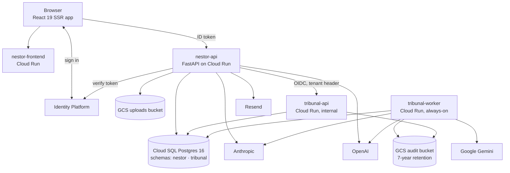

# 01 — Executive overview

| | |
|---|---|
| **Audience** | Stakeholders, new engineers, anyone reading the handbook for the first time |
| **Type** | Explanation |
| **Source of truth** | `.planning/PROJECT.md`, `.planning/MILESTONES.md`, `.planning/CONTINUE-HERE.md`, the module chapters of this handbook |
| **Last verified** | commit `c8b8583`, 2026-09-03 |

## 01.1 In one paragraph

Nestor Pulse is Agenic's platform for turning a client's strategic question into a verified research
report. A client fills a structured intake; an operator applies AI skills to sharpen it and reviews
every suggestion; the client validates the resulting research questions; the system writes a context
pack; a deep-research engine called Tribunal researches the questions across three independent
providers, extracts and cross-examines every factual claim, and produces a cited report plus a
verification report for the operator; the operator crafts the client deliverable from that material
and delivers it. The whole thing runs on one Google Cloud project, behind one login, with every
client's data isolated to its own space and every AI call sealed in a tamper-evident audit chain.

## 01.2 The two halves

```mermaid
flowchart LR
  subgraph intake["Intake platform (pre-research)"]
    A["Client fills intake"] --> B["Operator applies AI skill"]
    B --> C["Operator reviews\n(accept / edit / reject)"]
    C --> D["Client validates questions"]
    D --> E["Context pack generated\nstatus = decomposed"]
  end
  subgraph tribunal["Tribunal engine (research)"]
    F["Question workshop"] --> G["Deep research\n3 providers"]
    G --> H["Fact lists → merge → gates"]
    H --> I["Adversarial verification"]
    I --> J["Report + verification report"]
  end
  subgraph delivery["Delivery"]
    K["Operator crafts client PDF"] --> L["Deliver\nstatus = delivered"]
  end
  E -->|"superadmin triggers a paid run"| F
  J -->|"bundle download"| K
```

**The intake platform** (`backend/`, `frontend/`) is what v1.0 rebuilt from the Supabase original.
It owns clients, users, intakes, answers, the AI skills, storage, mail and languages. Its flow ends
at the status `decomposed`: a validated set of research questions and a context pack.

**The Tribunal engine** (`tribunal/`) is what v1.1 absorbed. It is a hand-written, multi-stage
research pipeline whose design centre is *claim survival*: nothing reaches the report until it has
been extracted as a structured fact, merged with what other providers found, gated for whether it
matters, and, if it matters, attacked by a skeptic with live web access. It records every call it
makes.

**The seam** between them is a single HTTP client in the backend. The engine has no login of its
own; it accepts calls only from the intake backend's service account and re-verifies the tenant on
every request.

## 01.3 Who the actors are

| Actor | What they do | What they see |
|---|---|---|
| **Superadmin** (the operator at Agenic) | Creates spaces and users, runs skills, reviews AI output, triggers research, watches the run, reads the verification report, crafts and delivers the report | Everything, across all spaces |
| **User** (a client-side member) | Fills and submits the intake, validates the questions, downloads the delivered report | Only their own space; nothing research-related until delivery |
| **The engine** | Researches, verifies, writes | Runs as a dedicated service account; sees one tenant per run |
| **Providers** | Anthropic, Google, OpenAI for research and reasoning; OpenAI for embeddings and transcription; Resend for mail; SerpAPI on a degraded path only | Receive prompts with PII scrubbed at the dispatch boundary |

## 01.4 The system in one diagram

Four Cloud Run services, one database instance with two isolated schemas, two buckets, one identity
provider, three AI vendors. Chapter 03 expands every edge.

## 01.5 What makes it different

The comparison with the market is in chapter 18. The short form:

- **Claims are cross-examined, not just collected.** A skeptic tries to refute each material claim
  with evidence it fetches itself, and a deterministic rule decides survival.
- **Three providers, treated as witnesses.** Agreement lowers checking priority; disagreement forces
  the variants into one session; a lost provider degrades the run visibly instead of silently.
- **Every AI call is on the record.** A hash-chained audit log with full bodies retained for seven
  years, verified on every deploy and on every completion, for the EU AI Act Article 12.
- **Cost is counted, never estimated.** Every token class and tool fee from recorded usage at
  published prices; a missing price writes NULL and says so.
- **Humans gate every step that matters.** Operator review of every AI suggestion, a client
  validation round, a confirmed paid trigger, an operator-authored deliverable.
- **Tenant isolation is proven, not assumed.** Six layers, with CI suites that must fail before a
  cross-tenant read could succeed.
- **The system tells the truth about itself.** Four terminal run states, degradation reasons in
  words, a verification report that lists what shipped unverified, and a run feed that shows retries
  as retries.

## 01.6 Where it stands (2026-09-03)

| | |
|---|---|
| **v1.0 GCP re-platform** | Shipped 2026-07-20. 12 phases, 485 commits, 33 days. Parity accepted with 21 deferred UAT items |
| **v1.1 Tribunal integration** | In progress. The spine (trigger, progress, raw output, delivery) is live; the engine redesign is built and deployed in five waves; the run feed and verification page are live. Phases 19 (Q&A chat), 20 (chores and UAT closure) and 24 (re-runs with a steering note) are not started |
| **Live revisions** | `nestor-frontend-00035-zz2`, `nestor-api-00047-ghp`, `tribunal-api-00023-bc6`, `tribunal-worker-00009-fkm`, all digest-proven |
| **Runs executed** | Six live research runs since 2026-07-20; the most recent (`fb9484dd`, 2026-08-31) cost $27.79 |
| ⛔ **Never executed** | The engine models deployed on 2026-09-01 (`claude-sonnet-5`, `gemini-3.7-flash`). Every cost and quality figure for them is arithmetic over replayed prompts. The next run is the first evidence and is a deliberate spend of roughly $29 |

## 01.7 Numbers that describe the codebase

| | |
|---|---|
| Repository | 1,718 commits, one principal author, tag `v1.0` |
| Backend (`backend/`) | Python 3.12 FastAPI, 18 tables in schema `nestor`, 13 Alembic migrations, 59 test files |
| Engine (`tribunal/`) | Python 3.11, 14 tables in schema `tribunal`, 18 Alembic migrations, 94 test files, 13 pipeline stages |
| Frontend (`frontend/`) | React 19 + TanStack Start, 46 shadcn primitives, 3 locales × 4 namespaces × 1,005 keys, 9 test files |
| Infrastructure | Terraform by construction (state never adopted), 10 Cloud Build configs, 4 Cloud Run services, 2 Cloud Run Jobs |
| Planning record | 30 phase directories, 31 quick tasks, a decision log of roughly 200 identified decisions |

## 01.8 How to read the rest

Start with chapter 03 for the architecture and chapter 04 for the three state machines; then the
module chapters 05 to 13 in any order. Chapter 17 is the register of every decision; chapters 19 and
16 are what the next engineer and the operator need first. Chapter 20 defines every term and
identifier family used above.
