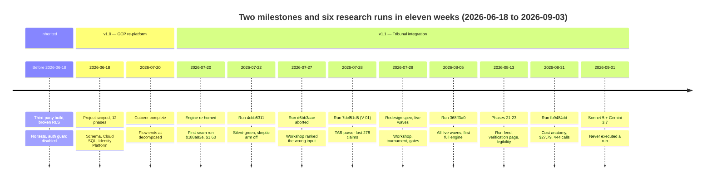

# 02 — History and timeline

| | |
|---|---|
| **Audience** | Everyone. Engineers use it to understand why the code looks the way it does; stakeholders use it to see what was delivered when |
| **Type** | Narrative |
| **Source of truth** | `git log` (1,718 commits at `c8b8583`), `.planning/MILESTONES.md`, `.planning/RETROSPECTIVE.md`, `.planning/ROADMAP.md`, `.planning/milestones/v1.0-ROADMAP.md`, `.planning/STATE.md`, `docs/PROVENANCE.md`, `docs/BACKEND-MAP.md`, `docs/tribunal-run-reports/*`, `infra/DEPLOY-RUNBOOK.md` |
| **Last verified** | commit `c8b8583`, 2026-09-03 |

## 02.1 In one paragraph

The project began on 2026-06-18 as a re-platform of a third-party intake application that had been
built on Supabase with broken tenant isolation. In 33 days (v1.0, shipped 2026-07-20) the whole
pre-research flow was rebuilt on Google Cloud with real per-client isolation, proper login, seven
AI functions, three UI languages and a test safety net. The second milestone (v1.1, from
2026-07-20) absorbed a separately developed deep-research engine, Tribunal, into the same platform,
wired it to the intake, delivered the first real research runs, and then, driven by what those runs
revealed, redesigned the engine's core in five waves. As of 2026-09-03 the system is fully deployed
and the redesigned engine, with its newest models, has yet to execute a live run.

## 02.2 Where the code came from

### The original application

The frontend was a Lovable-generated React 19 + TanStack + shadcn application, copied without git
history from the repository `agenic-nestor/Nestor`. Its backend lived entirely inside a hosted
Supabase project ("Sweep Database Project", eu-west-1): Postgres with row-level security,
PostgREST, 21 Deno edge functions and a storage bucket. There were no migrations and no function
sources in the frontend repository, so on 2026-06-18 the schema, 27 RPCs and all 21 edge-function
sources were pulled read-only through the Supabase Management API and preserved under `docs/`
(`docs/BACKEND-MAP.md`, `docs/db_functions.sql`, `docs/supabase-functions/`).

### Why it had to be rebuilt

The read-only audit found five flaws, verified against the live project (`docs/PROVENANCE.md`):

1. Row-level security on the core tables was `USING (true) WITH CHECK (true)` for any logged-in user.
   Any client's admin could read and write every other client's data.
2. The public browser key held INSERT, UPDATE, DELETE and TRUNCATE grants on 11 tables.
3. Client access was a set of never-expiring, non-revocable 32-character bearer links sent by email.
4. The `findings` and `deliverables` tables were unused, and the "final report" was an artifact
   referenced from the intake row.
5. Everything was Dutch-only.

The first three are security defects of the class the entire project was organised to eliminate.
Chapter 14 shows the mechanism that closes each one.

### The sibling engine

Agenic had separately developed a deep-research engine, Tribunal (`nestor_pulse_sdk`), in the
repository `MOELD/Nestor`, on its own GCP project with its own login, organisations and UI. Its
design centre was adversarial claim verification and a tamper-evident audit chain. It was mid
development round in June 2026 with an unverified end-to-end run. v1.1 re-homed it into this
repository and platform (chapter 17 · M-01).

## 02.3 Milestone v1.0 — the GCP re-platform (2026-06-18 → 2026-07-20)

Twelve phases, 70 plans, 134 tasks, 485 commits, 33 days. The order was chosen so that isolation
was proven before any feature endpoint existed (chapter 17 · P-11).

| Phase | Dates | Delivered | Why in this order |
|---|---|---|---|
| 1 Schema and migrations | 2026-06-19 | Alembic `0001–0004`: 14 tables with `space_id NOT NULL`, RLS enabled and forced on every tenant table, the `app_superadmin` bypass role, a CI guard banning `USING(true)`, in-scope triggers only | The schema is the isolation boundary; a guard makes the inherited bug impossible to reintroduce |
| 2 Backend skeleton and Cloud SQL | 2026-06-19 | FastAPI on Cloud Run gen2, IAM database auth through the Cloud SQL connector, bounded pools, one image for the service and the migration Job, Terraform by construction | A deployable, credential-free path to the database before any data logic |
| 3 Identity Platform auth | 2026-06-19 | Server-side token verification, server-set `role` and `space_id` claims, the `/auth/session` sync, the first superadmin seed; the five bearer-link routes deleted | Every request must be attributable to a verified identity before the data layer exists |
| 4 Tenant isolation proven by tests | 2026-06-19 | `TenantRepository` with scoping that cannot be omitted, GUC set per transaction and reset on check-in, the raw-DB-access guard, the CI-gated cross-tenant denial suite in Cloud Build | The gate every later phase had to pass |
| 5 User and space management | 2026-06-22 → 06-29 | Invite/deactivate/reactivate through the Admin SDK, JIT provisioning, spaces and templates, the root `audit_log` (0006), the superadmin screens | Someone has to be able to create the tenants |
| 6 Intake CRUD parity and the frontend seam | 2026-06-29 → 06-30 | Intake endpoints and transitions, the `lib/api/*` seam replacing every inline Supabase call, section-batched save-as-you-go, vitest with phase-machine characterisation tests, the `run-research` scope guard, migrations 0007/0008 | The 34-file Supabase coupling was the migration's main risk; one seam made the swap tractable |
| 7 AI function ports | 2026-06-30 → 07-13 | The six skills plus semantic search on Cloud Run, migration 0009, DB session released across every LLM call, model ids as configuration, AI keys in Secret Manager | Full parity was a v1.0 requirement |
| 8 SSE skill-run progress | 2026-07-13 | A DB-backed server-sent-events stream (any instance can serve a reconnect), Cloud Run timeout 900 s | Replaces Supabase Realtime without a websocket layer |
| 9 GCS storage | 2026-07-13 | Signed V4 URLs minted through IAM `signBlob` with no service-account key anywhere, ≤15-minute TTL, server-authored keys, space-namespaced objects | Replaces the `nestor-uploads` bucket |
| 10 Notifications | 2026-07-13 → 07-14 | Resend transport, Jinja templates, notification-only mail with no tokens, recipients resolved from space membership, the `/auth/action` set-password flow | Closes flaw #3 |
| 11 Internationalisation | 2026-07-14 | react-i18next with NL/FR/EN, migration 0010 locale columns, per-user and per-space default locale, a CI Dutch-string guard, locale mail variants | Closes flaw #5 |
| 12 Deploy, cutover, Supabase independence | 2026-07-14 → 07-20 | The frontend as a Cloud Run SSR container, the D-11 bundle guard proving no Supabase signature ships, the live cutover on 2026-07-14, four operator UAT rounds fixing eight defects same-day | Big-bang cutover; independence proven by construction |

**How it closed.** On 2026-07-20 the parity gate was closed as *"PARITY ACCEPTED WITH DEFERRALS"*:
21 UAT items and 9 human-needed verifications were deferred to after the Tribunal work and
ledgered verbatim rather than silently dropped. The legacy Supabase project was deliberately left
untouched (chapter 17 · D-08). The milestone was tagged `v1.0` at `f5f3979`.

**What the retrospective recorded.** Isolation-before-features worked (the bug class never
recurred); authoring by construction with Cloud Build worked on a dev box that had no Python or
Docker; same-day UAT loops caught more than checklists. What did not work: phases were executed but
not deployed until later catch-ups (6, 8, 10, 11), tracking tables lagged reality, and the
gitignored `.planning/` directory plus worktree executors produced two traps that each halted a run.
Lesson one became a standing rule: *deployed* is an explicit exit criterion.

## 02.4 Milestone v1.1 — Tribunal integration (2026-07-20 → in progress)

Scoped on 2026-07-20 from fresh research over both codebases (`.planning/research/`). The two
structural traps found in that research shaped everything after: both codebases had Alembic
revisions `0001–0010` with identical ids, and their RLS read different GUC names. The answer was
the two-schema topology with an HTTP-only seam (chapter 17 · M-03).

### The spine (Phases 13, 14, 16, 17, 18) — 2026-07-20 → 2026-07-22

| Phase | Dates | Delivered |
|---|---|---|
| 13 Re-home and infra baseline | 2026-07-20 | The engine copied verbatim into `tribunal/`, an isolated `tribunal` schema with its own Alembic version table, a per-run advisory lock, two Cloud Run services, the 7-year audit bucket, `verify_chain` green after the move, one proof run, ≥2 concurrent runs proven |
| 14 Auth retirement and the seam | 2026-07-20 → 07-21 | The standalone login, orgs and UI deleted; `InternalCallerProvider` verifying a Google OIDC token *and* the caller SA; a dedicated `tribunal-run` service account; the intake client with `ensure_org`/`ensure_project`; run `b188a83e` proven through the seam ($1.60) with three negative proofs |
| 16 Trigger and progress bridge | 2026-07-21 → 07-22 | `research_runs` (0011), the trigger verb with a confirm dialog and a 3-attempt cap, the poll driver mirroring engine metrics into the intake DB, the research SSE bridge, completion and failure mail, the first green live run `4cbb5311` |
| 17 Raw output and the audit-chain guard | 2026-07-22 | The bundle (report + scrubbed research + sources) materialised once to GCS, `verify_chain` as a hard gate on the completion path, complete-but-locked on a broken chain, superadmin-only download (0012) |
| 18 Human report upload and delivery | 2026-07-22 | Staged PDF upload, an explicit Deliver act flipping `in_research → delivered` and mailing the client, replace, a download-only client report page |

### The run that changed the plan — `4cbb5311`, 2026-07-22

The first green run completed in 48 minutes and produced a report. Its forensic reconstruction
from 228 audit records found that the adversarial fact-checking arm had been effectively
non-functional: a serialisation crash silently discarded 24 groups' verdicts, an Anthropic usage
cap hard-400'd 776 skeptic attempts in 55 seconds, and the run still reported green. The cost panel
showed about €5 against $43–45 real, because cache-write tokens (8.7M of them) and the
deep-research calls were not counted. Twenty-eight citation markers were stripped. The operator
held all further runs (2026-07-22) and, two days later, brainstormed the redesign (chapter 17 ·
§17.9): the question workshop, structured fact lists, cross-provider merge, verification gates,
honest terminal states, cost truth, and a live activity feed.

### The engine redesign — Phases 15, 15.1, 15.2, 15.3 (2026-07-24 → 2026-07-28)

| Phase | Dates | Delivered |
|---|---|---|
| 15 Operator surfaces | 2026-07-24 | Cost truth (cache writes, search fees, Gemini usage), the superadmin verification report, the feed foundation, deterministic citation numbering, tribunal alembic 0011 |
| 15.1 Verification gates | 2026-07-25 → 07-26 | Materiality and error-likelihood gates, canonical block-then-cluster grouping, corroboration ordering, fail-loud, the `superseded` verdict (0012), proven by replaying the recorded 1,162-claim fixture |
| 15.2 Engine core | 2026-07-26 → 07-27 | The question workshop with a pairwise tournament, per-provider fact lists with a distiller fallback, a SerpAPI-fuelled own researcher, LLM-based merge, reliability primitives (retry classes, breaker, checkpoints, park), the two deterministic report sections (0013) — four services live at `20260727-085533` |
| 15.3 Run page and run events | 2026-07-27 → 07-28 | The append-only `run_event` table (0015), the never-raising emitter, the bookmarkable `/admin/pulse/runs/:runId` page with the twelve-kind feed renderer |

**The aborted run `d6bb3aae` (2026-07-27)** showed the workshop working mechanically and failing
on substance: it had been fed the whole context pack as "questions" and ranked them against a null
decision statement; only 3 of 11 paid angles were legitimate. Seven gap plans followed the same
day (the workshop takes only the client-validated questions; PII scrub at dispatch; heartbeat
liveness; a Stop button; the OpenAI deep-research model id). A worker deploy on 2026-07-28 booted a
container that claimed the queued run before the operator could cancel it; the runbook's ordering
was corrected the same day (worker deploys last, after the queue is proven empty).

**V-01, run `7dcf51d5` (2026-07-28)**, the first live run of the redesigned engine: 65 minutes,
`completed_degraded`, $53.48, 415 calls. Its two diagnostics reordered the redesign: the missing
Gemini fact block was format drift, not truncation; and the distiller had returned 278 well-formed
coffee claims that the parser dropped because the model wrote the literal string `<TAB>`. Cross-
stream corroboration had never operated (`both: 0`, an exact-string merge key). The spec written
from this (`ENGINE-REDESIGN-SPEC.md`, 2026-07-29) defined five waves.

### The five waves — Phases 15.4 → 15.8 (2026-07-29 → 2026-08-05)

The operator ruled on 2026-07-29 that nothing would be measured until all changes were built: one
deploy, one measuring run.

| Wave | Phase | Dates | Delivered |
|---|---|---|---|
| 1 | 15.4 Extraction repair | 2026-07-29 | Separator-tolerant distiller parsing, loud zero-claim warnings, Gemini fact-list retry, grounding-redirect resolution at ingest (0016); replay proof recovering 278 claims |
| 2 | 15.5 Claim attribution | 2026-07-29 | `sub_question`, `corroboration_key`, `as_of` stamped on claims in Python (0017) |
| 3 | 15.6 Dispatch and discovery bracket | 2026-07-30 | Dispatch by LLM-decided groups (≤5) to all three providers; `own` dropped from the rotation; the discovery bracket ("no source, no slot"); two criticals found in the seams by code review and fixed |
| 4 | 15.7 Creative workshop loop | 2026-07-31 → 08-03 | Generative evolve, judges with reasons, meta-review, grounded admission of invented angles, the rejected register, carried Elo with a catch-up schedule, three-criteria exit with a 10-round cap; the design measured first on an eleven-experiment local harness for about $3 |
| 5 | 15.8 Yield instrumentation and the one deploy | 2026-08-04 → 08-05 | `assignment_yield` and `workshop_round_yield` (0018); the engine gate green for the first time in the project's history (1,812 passed); all five waves live at `20260805-111647`; the measuring run `368ff3a0` |

The measuring run's dispatch analysis (2026-08-06) found that the run language had never been set,
that the claim gate had been judging half-sentences because a 120-character join key bound before
the suspected 1,200-character cap, and that a `brief_conflicts` entry had been dispatched as a paid
sub-question. Three quick fixes shipped the same day (synthesis moved to Claude Opus 5; report
language and size wired through; the gate fed the full question), live at `20260806-175613`.

### Feed, verification page, legibility — Phases 21, 22, 23 (2026-08-10 → 2026-08-13)

| Phase | Dates | Delivered |
|---|---|---|
| 21 Run feed completion | 2026-08-10 | The eight silent stages emit feed rows; a finished agent never renders as a spinner; the verification report reachable from the run page; deployed at `20260810-193000` |
| 22 Verification report as a page, citation hygiene | 2026-08-11 → 08-12 | A dedicated `/verification` route styled as a dashboard; hover-preview citations collapsed by default; duplicate citations collapsed to one number per source without renumbering; the feed removed from the intake page; `20260812-121358` |
| 23 Report legibility | 2026-08-13 | Business-friendly labels and tooltips for all 18 funnel keys; an honest work-phase banner; `20260813-155426` |

An SSR auth-guard fix (a refresh on `/admin` had been redirecting to login) shipped from a fix
branch on 2026-08-13 at `20260813-101148`.

### The operator's intake test — 2026-08-31 and 2026-09-01

A full intake test by the operator on 2026-08-31 produced six quick fixes deployed the same day
(`20260831-124920`): the intake skill emits all three languages; the client can tick the
AI-proposed extra questions; the feed no longer narrates the deep-research long poll; the "angle
done" row drops its fact count; the research-start banner names the real providers and warns of a
paid run; the dead "Research artifacts" block (853 lines that could never render anything) was
removed. On 2026-09-01 the engine's Anthropic stages moved to `claude-sonnet-5` and its five Flash
stages to `gemini-3.7-flash` after a 267-prompt replay measured position bias in the pairwise judge;
both live at `20260901-134253`. The same day a $27.79 run (`fb9484dd`) was itemised from the audit
bucket, establishing that the skeptic stage is 79% of run cost and that prompt caching saves money.

## 02.5 The deploy ledger

| Tag | Date | Services | Carried |
|---|---|---|---|
| `20260721-220957` | 2026-07-21 | tribunal-worker | The worker that ran `4cbb5311` |
| `20260725-233634` | 2026-07-25 | tribunal ×2 | Phase 15.1 gates |
| `20260727-085533` | 2026-07-27 | all four | Phase 15.2 engine core |
| `20260728-094409` + `20260728-132637` | 2026-07-28 | all four (two SHAs) | 15.2 gap plans + 15.3 run page; the worker-boot incident |
| `20260805-111647` | 2026-08-05 | tribunal ×2 | The five redesign waves, migrations 0016 → 0018 |
| `20260806-175613` | 2026-08-06 | three | Opus 5 synthesis, report language/size, gate context |
| `20260810-193000` | 2026-08-10 | tribunal-worker, nestor-frontend | Phase 21 feed completion |
| `20260812-100556` → `20260812-121358` | 2026-08-12 | tribunal-api, nestor-frontend | Phase 22 (the first tag shipped a coercion bug and was superseded within hours) |
| `20260813-101148` | 2026-08-13 | nestor-api, nestor-frontend | SSR auth guard, skill clock |
| `20260813-155426` | 2026-08-13 | nestor-frontend | Phase 23 |
| `20260831-124920` / `20260831-160956` | 2026-08-31 | nestor-api, nestor-frontend | The six intake-test fixes |
| `20260901-134253` | 2026-09-01 | tribunal ×2 | Sonnet 5 + Gemini 3.7 Flash |

Live at `c8b8583`: `nestor-frontend-00035-zz2`, `nestor-api-00047-ghp`, `tribunal-api-00023-bc6`,
`tribunal-worker-00009-fkm`. The audit bucket holds ten run prefixes; the newest write is
`2026-08-31T08:43:24Z`. ⛔ No research run has executed on the deployed engine code since.

## 02.6 The live runs, in order

| Run | Date | Engine state | Outcome | What it taught |
|---|---|---|---|---|
| `b188a83e` | 2026-07-20 | re-homed, pre-seam | completed, $1.60 | The seam works; chain OK |
| `4cbb5311` | 2026-07-22 | original engine via the seam | `completed` in 48 min, ~$43–45 real | The skeptic arm was off; silent-green; cost undercount; 28 stripped markers |
| `d6bb3aae` | 2026-07-27 | 15.2 engine core | aborted | The workshop ranked the context pack, not the questions; PII sent to providers |
| `7dcf51d5` (V-01) | 2026-07-28 | 15.2 + 15.3 | `completed_degraded`, 65 min, $53.48 | The `<TAB>` parser bug (278 claims lost); corroboration never operated |
| `368ff3a0` | 2026-08-05 | all five waves | completed | Language never set; a 120-char join key truncated the gate's context; 19 members dispatched vs 15 winners |
| `fb9484dd` | 2026-08-31 | + 2026-08-06 fixes | completed, $27.79, 444 calls | The cost anatomy: skeptic 79%, ~$0.11 per claim group, caching saves 14–30% |

Six runs; two exceeded the $25 governor that has never been enabled (chapter 17 · D-07).

## 02.7 How the work was done

The project used a phase/plan/wave workflow (GSD) throughout: each phase has a context document
recording the operator's decisions, numbered plans executed by isolated worktree agents, a
verification report, and where relevant a UAT ledger. Commits are named `type(NN-MM): …` for plan
work and `type(quick-YYMMDD-xxx)` for the 31 quick tasks. The rules the project learned about its
own instruments (gates that go vacuous, worktrees on a stale base, `builds submit | tail` reporting
the pipe's status, the `ast`-lift harness manufacturing names) are catalogued in chapter 15.

Statistics at `c8b8583`: 1,718 commits, one principal author, one tag, 30 phase directories, 31
quick tasks, 59 backend test files, 94 engine test files, 9 frontend test files.

## 02.8 What is not yet done

Phase 19 (Q&A chat over the findings), Phase 20 (deferred v1.0 chores and the 21-item UAT ledger)
and Phase 24 (deliberate re-runs with a steering note and version history) are planned and not
started. The full list of open items is in chapter 19.
