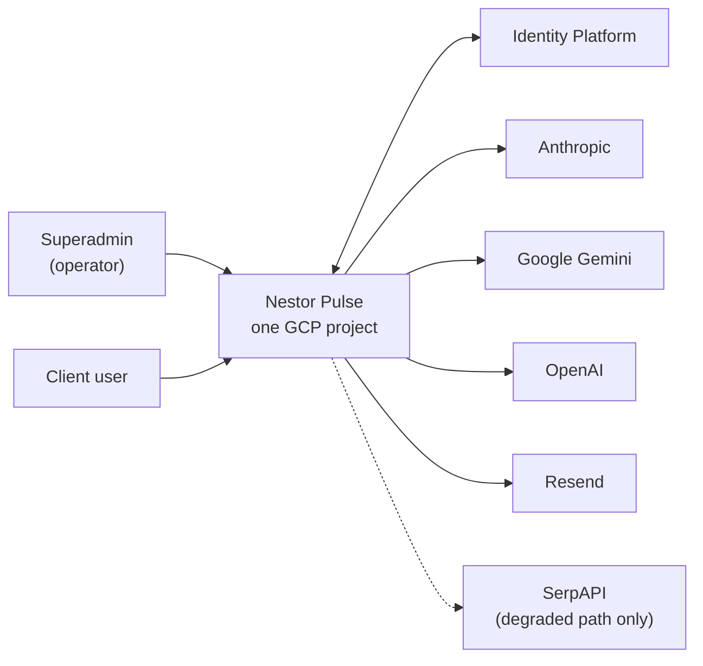
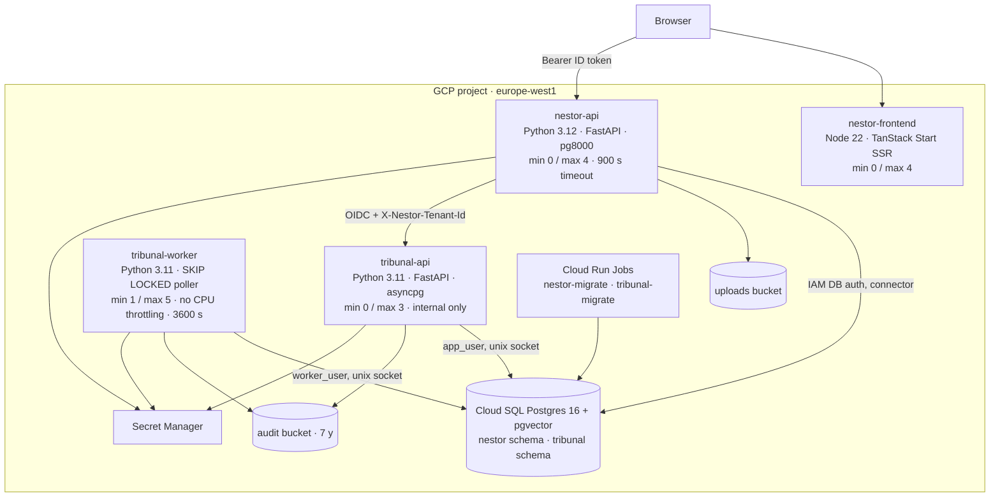

# 03 — Architecture

| | |
|---|---|
| **Audience** | Engineers; anyone who needs to know what talks to what and why the boundaries sit where they do |
| **Type** | Explanation |
| **Source of truth** | `backend/app/main.py`, `backend/app/db/base.py`, `backend/app/research/*`, `tribunal/nestor_pulse_sdk/{server,runs/worker,runs/execute,auth/internal_caller}.py`, `tribunal/nestor_pulse_sdk/audit/*`, `infra/main.tf`, `tribunal/infrastructure/cloud-run/*`, `.planning/research/ARCHITECTURE.md` and `SUMMARY.md` |
| **Last verified** | commit `c8b8583`, 2026-09-03 |

## 03.1 In one paragraph

Four services on Cloud Run in one Google Cloud project: a server-rendered React frontend, the intake
API, the research engine's API, and the engine's always-on worker. One Cloud SQL instance holds two
isolated schemas, one per codebase. The intake API is the only path from a browser to data; the
engine accepts calls only from the intake API's service account. Every asynchronous thing (skill
runs, research runs) is a database row the browser watches through server-sent events, so any
instance can serve any client. Every model call in the engine passes through one audited client
that seals it into a hash chain and stores its bodies in a seven-year bucket.

## 03.2 System context



The operator and the client use the same application with different roles. All AI vendors are
called server-side; the browser never holds a provider key.

## 03.3 Containers



| Container | Image | Runtime | Data access | Who may call it |
|---|---|---|---|---|
| `nestor-frontend` | `frontend/Dockerfile` (node:22-slim, Nitro node-server) | SSR shell plus the SPA; holds no secrets, no DB | none | anyone (`allUsers`) |
| `nestor-api` | `backend/Dockerfile` (python:3.12-slim, uv) | FastAPI, one Uvicorn process, sync pg8000 | Cloud SQL through the Python connector with IAM authentication as `nestor-run`; a second engine as `app_superadmin` for cross-tenant reads | authenticated callers with a valid Identity Platform token; health endpoints anonymous |
| `tribunal-api` | `tribunal/infrastructure/cloud-run/api/Dockerfile` (python:3.11-slim) | FastAPI, asyncpg | Cloud SQL over the unix socket as `app_user` (tenant-scoped) | `nestor-run` only (IAM invoker) and, inside, `InternalCallerProvider` |
| `tribunal-worker` | `…/worker/Dockerfile` | `python -m nestor_pulse_sdk.runs.worker` | Cloud SQL as `worker_user` (cross-tenant claim role) | nobody; it polls |
| `nestor-migrate`, `tribunal-migrate` | the API images | `alembic upgrade head` | the respective schema | operator-executed Jobs |

**Why two Python versions and two drivers.** The engine was lifted verbatim with its pinned
dependency set (Python 3.11.9, asyncpg); the intake backend was greenfield on 3.12 with pg8000
because the Cloud SQL connector's IAM path and the Alembic env share one sync driver. Unifying them
was judged a re-resolution risk for no benefit (chapter 17 · 13 D-01).

## 03.4 Trust boundaries

1. **Browser → `nestor-api`.** A verified Identity Platform ID token on every call; role and space
   come from server-set claims. The frontend's own guards are presentation.
2. **`nestor-api` → Cloud SQL.** IAM database authentication, no password, a bounded pool
   (`pool_size 2, max_overflow 3`), a transaction-local tenant setting, forced row-level security.
3. **`nestor-api` → `tribunal-api`.** A Google OIDC ID token minted for the engine's service URL,
   plus `X-Nestor-Tenant-Id`, `X-Acting-User-Id`, `X-Acting-User-Email`. Cloud Run IAM restricts the
   invoker to `nestor-run`; the engine verifies the token and caller in-app before honouring the
   tenant header (defence in depth, chapter 17 · 14 D-04).
4. **Engine → providers.** Prompts leave only after PII scrubbing at the dispatch choke point; every
   call is recorded in the audit chain; model-authored text that re-enters a prompt is bounded.
5. **Engine → Cloud SQL.** Two roles: `app_user` for the API (tenant-scoped by RLS) and
   `worker_user` for the worker, which must see every tenant's queue and is granted through OR'd
   policies instead of the forbidden `BYPASSRLS`.
6. **The two schemas never share a session.** Their RLS settings have different names
   (`app.current_space_id` vs `app.tenant_id`); the only bridge is HTTP.

## 03.5 The flows

### 03.5.1 From a blank intake to `decomposed`

```mermaid
sequenceDiagram
  participant C as Client user
  participant O as Operator
  participant FE as Frontend
  participant API as nestor-api
  participant DB as nestor schema
  participant A as Anthropic
  O->>API: POST /intakes (space chosen)
  API->>DB: insert intake (draft); trigger seeds client_name answer
  O->>API: POST /intakes/{id}/mail/intake
  C->>FE: fills sections; PATCH /intakes/{id}/answers per section
  C->>API: POST /intakes/{id}/submit → submitted
  O->>API: POST /intakes/{id}/skills/apply (202)
  API->>DB: skill_runs row: running
  API->>A: messages.create (no DB connection held)
  API->>DB: output_parsed, succeeded
  FE->>API: GET /skill-runs/stream (SSE, 2 s ticks)
  O->>API: accept/edit/reject → PATCH answers; POST /review → reviewed
  O->>API: POST /mail/validation
  C->>API: ticks proposals; POST /submit → validated_by_client
  API-->>O: admin_validated mail
  O->>API: POST /skills/context-pack (202)
  API->>A: context pack (Dutch, 11 sections)
  API->>DB: research_artifacts row; intake.context_pack_artifact_id; status = decomposed
```

The status is the contract; the phase machine (chapter 04) turns it into the operator's next
button. Every AI call releases the database connection before the provider call and reopens a
session to persist (chapter 07).

### 03.5.2 From `decomposed` to a delivered report

```mermaid
sequenceDiagram
  participant O as Operator
  participant API as nestor-api
  participant T as tribunal-api
  participant Q as tribunal.run (queue)
  participant W as tribunal-worker
  participant P as Providers
  participant AU as Audit chain + bucket
  participant FE as Run page
  O->>API: POST /intakes/{id}/research (confirmed)
  API->>API: intake → in_research; research_runs row (attempt n)
  API->>T: ensure_org, ensure_project, create_run(brief)
  T->>Q: insert run: queued
  API-->>O: 202
  W->>Q: claim with SKIP LOCKED, advisory lock, heartbeat
  loop 13 stages
    W->>P: audited LLM / deep-research calls
    W->>AU: audit row + blob per call
    W->>Q: stage_detail, run_event rows, cost
  end
  loop every 3 s
    API->>T: GET /api/runs/{id}/metrics
    API->>API: mirror into research_runs
  end
  FE->>API: GET /research/stream (SSE) + GET /events (cursor)
  W->>Q: terminal status
  API->>T: report, research-bundle, verify chain
  API->>API: zip to GCS; chain_status; mail the operator
  O->>API: upload PDF (staged); POST /deliver → delivered; client mail
```

Three properties of this flow are design decisions: the run executes on the always-on worker, never
inside an HTTP request, so no Cloud Run timeout bounds it; the intake API never reads the engine's
tables, it mirrors what it needs through the seam; and a run's completion never delivers anything to
the client, only the operator's Deliver act does.

### 03.5.3 One audited model call

```mermaid
sequenceDiagram
  participant S as Pipeline stage
  participant AC as AuditedLLMClient
  participant P as Provider
  participant G as Audit bucket
  participant DB as tribunal.audit_log
  S->>AC: anthropic_messages(run_id, tenant_id, model, …)
  AC->>AC: acquire semaphore (8 in flight per worker)
  AC->>P: call
  P-->>AC: response + usage (4 token classes, tool counts)
  AC->>AC: cost = compute(provider, model, tokens, fees) or None
  AC->>G: upload {request, response} redacted; 7-year retention
  AC->>AC: per-run lock: prev_hash, next seq
  AC->>AC: hash = sha256(prev_hash || canonical_json(frozen payload))
  AC->>DB: insert row (tenant, run, seq, tokens, cost, gcs_uri, prev_hash, hash)
  AC-->>S: response (+ audit_id, cost for the feed)
```

Chapter 09 covers the audited client, the chain and the price table in full; chapter 14 states what
the chain guarantees and what it does not.

## 03.6 Cross-cutting mechanisms

| Concern | Mechanism | Why this and not the alternative |
|---|---|---|
| Push to the browser | Server-sent events over a DB-backed poll (2 s tick, 15 s heartbeat, 10-minute cap, any instance can serve a reconnect) | Supabase Realtime had to be replaced; websockets would need sticky state; a DB row is already the truth |
| Long AI calls | The DB session is released before the call and reopened to persist (`run_with_session_release`); the GUC is re-issued on the write | A 90–120 s call must never hold a pooled connection (Phase 7 D-05) |
| Long research runs | A queue table claimed with `SKIP LOCKED` by an always-on worker; a per-run advisory lock; a heartbeat with a stale-reclaim window; checkpoints and park/resume | Cloud Run request timeouts cannot bound a 65-minute run; the worker "claims first, sleeps last", which is why it deploys last |
| Files | Server-authored keys, signed V4 URLs minted via IAM `signBlob`, no key file, TTL ≤ 15 min | Keyless by construction (Phase 9) |
| Mail | Resend transport, Jinja templates per locale, recipients from membership, no tokens | Notification-only (P-04) |
| Languages | react-i18next with three locales, per-user and per-space defaults; the context pack in Dutch; the client report language a client-chosen field passed to the engine | Multi-language was a v1.0 requirement; the operators are Dutch speakers |
| Configuration | Model ids and knobs as environment variables with code defaults; secrets read at call time; the engine reads `Nestor_*` Secret Manager names through a bootstrap | D-06 model config; D-07/D-09 no secrets in settings |
| Cost | Recorded usage × the engine's price table per call; NULL and `cost_pending` when unknown | C1: facts only, no estimates |
| Observability | Cloud Logging from stdout; the run-event feed as the operator's view; the audit bucket as a complete read surface without database access | No APM; the audit trail was designed to be the instrument |

## 03.7 Deployment topology

One project (`project-cb01b861-cb4a-438d-b9a`), one region (`europe-west1`), one Artifact Registry
repository (`nestor`) holding four images, one Cloud SQL instance (`nestor-pg`, `db-custom-1-3840`,
IAM authentication on, public IP with no allowlist because the connector tunnels over the Admin API),
two buckets, Secret Manager, Identity Platform. Terraform describes the intended end state but was
never applied; the live wiring is manual and recorded in the runbook (chapter 13).

Two service accounts: `nestor-run` (Cloud SQL client and instance user, Identity Toolkit admin,
secret accessor on its four secrets, object admin on the uploads bucket, token creator on itself,
invoker of `tribunal-api`) and `tribunal-run` (Cloud SQL client only, secret accessor on the six
engine secrets, object admin on the audit bucket). The separation is what makes the invoker binding
meaningful (chapter 17 · 14 D-04b).

## 03.8 Why the boundaries sit where they do

- **One seam, HTTP only.** The research summary of 2026-07-20 found that the two codebases had made
  the same design decisions with different names: Alembic ids `0001–0010` in both, `app.current_space_id`
  versus `app.tenant_id`, a `worker_user` role in both. Sharing a session would silently defeat RLS;
  sharing a migration line would collide. Two schemas on one instance, one HTTP client, and a
  separate `tribunal_alembic_version` table (chapter 17 · M-03).
- **The engine is lifted, not rewritten.** Its hash chain is a legal artefact with a frozen payload;
  a rewrite would fork every chain. The engine was copied byte-identically, then modified in place
  under gates (13 D-01).
- **The intake never reads engine tables.** The mirror table keeps the UI's dependency inside the
  intake database and keeps the engine free to change its own schema (it went from 0010 to 0018).
- **The worker is always on.** Runs must start within seconds and survive long provider polls;
  `min-instances=1` with no CPU throttling costs roughly $5–10 a month idle (13 D-04).
- **Human gates are in the intake, not the engine.** The engine's own interactive pauses never fire
  on seam runs; the validated intake *is* the answered brief (16 D-01). The operator's control points
  are the confirmed trigger, the verification report and the Deliver act.

## 03.9 Where to look

| Path | Responsibility |
|---|---|
| `backend/app/main.py` | app composition, routers, health |
| `backend/app/db/base.py`, `rls.py`, `repository.py`, `session.py` | engines, tenant setting, scoping, per-request dependencies |
| `backend/app/research/tribunal_client.py`, `run_task.py`, `bundle.py` | the seam client, the poll driver, the bundle |
| `tribunal/nestor_pulse_sdk/server.py` | the engine's FastAPI app and routers |
| `tribunal/nestor_pulse_sdk/auth/internal_caller.py` | the OIDC + caller-SA verification |
| `tribunal/nestor_pulse_sdk/runs/worker.py`, `execute.py` | the queue poller, the advisory lock, the dispatch into the pipeline |
| `tribunal/nestor_pulse_sdk/audit/audited_llm_client.py`, `hash_chain.py`, `gcs_blob.py` | the audited call path |
| `infra/main.tf`, `infra/DEPLOY-RUNBOOK.md` | the intended topology and the applied one |
