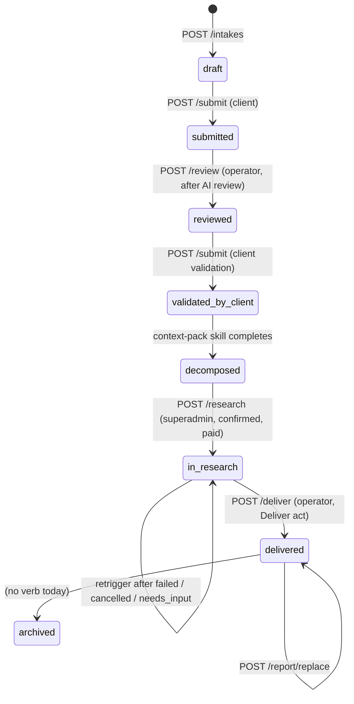
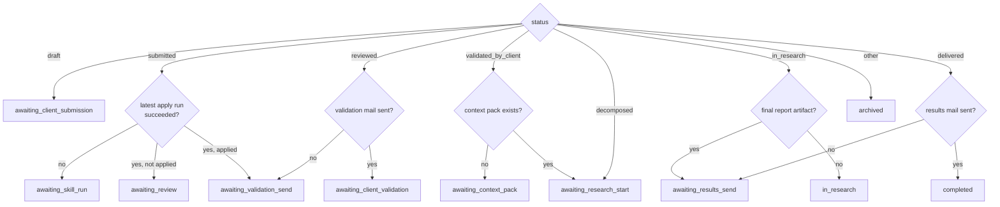
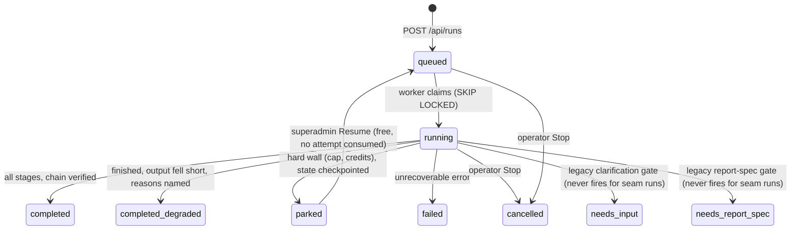

# 04 — Domain model and lifecycles

| | |
|---|---|
| **Audience** | Engineers and operators who need the vocabulary and the three state machines |
| **Type** | Reference and explanation |
| **Source of truth** | `backend/app/db/models/intake.py` (the status enum), `backend/app/api/intake_routes.py` and `research_routes.py` (the transitions), `frontend/src/lib/intake-phase.ts` and `lib/research/workPhase.ts` (the phase machine), `backend/app/research/run_status.py`, `tribunal/nestor_pulse_sdk/runs/schemas.py` and `db/models/run.py` (the run statuses), `docs/BACKEND-MAP.md` (the legacy machine) |
| **Last verified** | commit `c8b8583`, 2026-09-03 |

## 04.1 In one paragraph

Three state machines run the product. The **intake status** is the contract with the client: eight
values from `draft` to `archived`, changed only by backend verbs. The frontend **phase** is a
derived view over status plus the latest skill run and artifacts, which decides what the operator
sees and which button is offered next. The Tribunal **run status** is the engine's own machine,
mirrored into the intake database by a poll driver; its four honest terminal states are a design
decision, not an accident. Around them sit a small set of nouns: space, user, intake, answer,
template, skill run, context pack, research question, run, claim, source, verdict.

## 04.2 Roles and tenancy

| Term | Meaning |
|---|---|
| **Space** | The tenant. One row in `nestor.organizations`; `space_id` is the organisation id and the sole isolation key on every tenant table. There is no separate "client" entity: the client is the organisation's name |
| **Superadmin** | An operator at Agenic. Custom claim `role = superadmin`, `space_id = null`. Reads and writes across all spaces through a dedicated database role (`app_superadmin`) that a per-table policy recognises by name |
| **User** | A member of exactly one space. Custom claim `role = user`, `space_id = <org id>`. Every query is scoped by the repository layer and, underneath, by row-level security keyed on a transaction-local setting |
| **Membership** | `nestor.organization_memberships`: links an Identity Platform user (`provider_user_id`) to a space with a role and a status (`active`, `deactivated`) and an optional locale |
| **Tenant id (engine side)** | The same UUID as `space_id`, carried across the seam in the `X-Nestor-Tenant-Id` header and re-verified by the engine; `tribunal.org.id = space_id` |

Roles were deliberately limited to two (chapter 17 · P-03); a `client-admin` role is a future item.

## 04.3 The intake status machine

The eight values are a Postgres enum `nestor.intake_status`. The legacy system moved between them
with RPCs, triggers and direct PATCHes; the re-platform moved every transition into a backend verb
with an explicit from/to guard, and deliberately did **not** port the post-`decomposed` triggers.

| From | To | Verb | Who | Guard and side effects |
|---|---|---|---|---|
| (insert) | `draft` | `POST /intakes` | any authenticated caller in scope | DB default; a trigger seeds the `client_name` answer from the organisation name |
| `draft` | `submitted` | `POST /intakes/{id}/submit` | client user or operator | `_SUBMIT_TRANSITIONS`; audit `intake.status_changed` |
| `submitted` | `reviewed` | `POST /intakes/{id}/review` | operator, from the AI review panel | `_REVIEW_TRANSITIONS`; the review's decisions were saved as answers first |
| `reviewed` | `validated_by_client` | `POST /intakes/{id}/submit` | client, from the validation view | fires the `admin_validated` notice to `NESTOR_ADMIN_EMAIL` |
| any | `decomposed` | the context-pack background task | operator triggers the skill | **not a verb and not guarded by the current status** (see § 04.7); writes `context_pack_artifact_id` |
| `decomposed` | `in_research` | `POST /intakes/{id}/research` | superadmin in practice (the route has no role gate; the UI only offers it to superadmins) | confirm dialog; 3-attempt cap; 422 if there are no validated questions; inserts a `research_runs` row |
| `in_research` | `in_research` | same verb | same | only when the latest run is `failed`, `cancelled` or `needs_input`; `parked` must use resume |
| `in_research` | `delivered` | `POST /intakes/{id}/deliver` | operator | the **sole** path; a `completed` run never auto-delivers; PDF only; sends the client mail |
| `delivered` | `delivered` | `POST /intakes/{id}/report/replace` | operator | optional re-notify |
| `delivered` | `archived` | none | — | the UI's Archive action is a no-op today (chapter 19) |

Any other combination returns 409. `IntakePatch` carries no status field. Resume and cancel of a
research run do not touch the intake status.

## 04.4 The frontend phase machine

`derivePhase(intake, latestApplySkillRun, hasResearchArtifacts)` in
`frontend/src/lib/intake-phase.ts` turns the status into one of twelve phases. It is a pure
function with a characterisation test suite (17 cases). Why a second machine: the status is the
contract, but what the operator should *do next* also depends on whether the AI skill has run,
whether its output was applied, whether mails were sent and whether a context pack exists. Keeping
that logic in one pure function keeps the twelve UI branches out of the route components.

`hasResearchArtifacts` is passed as a constant `false` by the detail page (no code writes
`research_artifacts` for research any more), which is why `decomposed` always yields
`awaiting_research_start` and `in_research` without a final report yields `in_research`. The only
skill run that counts is the latest `apply-intake-skill` run; enrichment skills (structure, extract,
embeddings, transcribe) were once mistaken for "analysis ready" and are filtered out.

**Phase → what the operator sees.** Each phase maps to a banner body and at most two actions in
`NextStepBanner` (chapter 12 has the full table): send the intake mail, run the skill, open the AI
review, send the validation mail, send a reminder, generate the context pack, start research
(behind a confirm dialog), upload the report, send the results mail, archive.

**The work-phase rule.** While the intake is `in_research` the banner cannot say "research is
running" for the whole phase, because `in_research` spans both *running* and *finished, awaiting
delivery* (the Deliver act owns the transition). `deriveWorkPhasePresentation(runStatus)` maps the
live run status to `running` (`running`, `queued`), `finished` (`completed`, `completed_degraded`),
`stopped` (`failed`, `cancelled`), `paused` (`parked`, `needs_input`) or `unknown`, and the banner
picks its copy from that (Phase 23).

**Visibility helpers.** `phaseShowsContextPack` from `awaiting_research_start` onward;
`phaseShowsFinalReport` and `phaseShowsResearch` from `in_research` onward; `phaseShowsAIReview`
only in `awaiting_review`.

## 04.5 The Tribunal run status machine

The engine's `run.status` is constrained by a CHECK (`ck_run_status`) and mirrored verbatim into
`nestor.research_runs.status` by the poll driver every three seconds.

| Status | Meaning | Terminal for the intake stream? | Operator affordance |
|---|---|---|---|
| `queued` | Row inserted, not yet claimed | no | Stop |
| `running` | A worker holds the per-run advisory lock and is executing stages | no | Stop |
| `completed` | Every stage ran; `verify_chain` passed; the bundle was written | yes | Verification report, download, Deliver |
| `completed_degraded` | Finished, but the output fell short: a lost provider stream, a gutted stage, a fallback to client-validated questions only, or gate errors; every reason is listed in words (chapter 17 · D-12) | yes | Same as `completed` (D-09: never lock the operator out of a paid run's output) |
| `parked` | No honest deliverable was possible; state preserved at the last checkpoint; the triggering superadmin was mailed | yes for the stream, resumable | Resume (superadmin click only, chapter 17 · F-01); bundle and verification are inspectable, the report is not |
| `failed` | Unrecoverable; the error is on the card | yes | Retry (a fresh attempt, counted toward 3) |
| `cancelled` | Stopped by the operator | yes | Retry |
| `needs_input`, `needs_report_spec` | The standalone engine's interactive pauses | treated as terminal by the UI | Obsolete for seam runs (chapter 17 · 16 D-01/D-01b); retained in the vocabulary |

**Why four terminal states.** The first live run completed "green" while its verification arm was
non-functional. R6 (chapter 17 · §17.9) requires that a run end in one of `completed`,
`completed_degraded`, `parked` or `failed`, with silent-green designed out; D-17 draws the line
between degraded and parked at "is any honest deliverable possible".

**Attempts and re-runs.** `research_runs.attempt` starts at 1 and is bumped by each fresh trigger;
after three attempts the trigger returns `needs_investigation`. Resume does not consume an attempt.
Phase 24 (planned) adds a *separate* counter for deliberate re-runs of a completed run so a re-run
can never lock an intake out of failure recovery (chapter 17 · D-RR-1).

## 04.6 The nouns

| Noun | Lives in | Definition |
|---|---|---|
| **Intake** | `nestor.intakes` | One client engagement: a status, a client name, a template reference, pointers to the context pack and the final report artifacts, mail timestamps |
| **Answer** | `nestor.intake_answers` | One value per `(intake, field_key)`: scalar `value` or `value_json`; AI-extracted answers carry `extracted_by`, `confidence`, `source_chunk_id` |
| **Template** | `nestor.intake_templates`, and the canonical in-memory `pulse_intake_v1.json` | The form definition: 14 sections, 29 fields, every label in nl/fr/en. The Pulse form is one shared questionnaire served in memory; the table exists for cloning but has no screen today |
| **Skill run** | `nestor.skill_runs` | One execution of an AI skill: `running → succeeded | failed`, the model id, tokens, a cost estimate, the raw output and the parsed output |
| **Context pack** | a `nestor.research_artifacts` row with `source = context-pack-generator` | The 11-section Dutch briefing (section 12, the questions, is meant to be appended and is not); versioned by inserting a new row and moving the intake's pointer |
| **Research question** | `nestor.research_questions` and the `research_questions` / `extra_questions_proposed` answers | The client-validated questions; the brief takes DB rows if any, else the answers, with priority; only `approved` proposals count |
| **Proposal** | an `extra_questions_proposed` entry | An AI-suggested extra question with `show_to_client` (operator decides whether the client sees it) and `approved` (client decides whether it runs) |
| **Research run** | `nestor.research_runs` (mirror) and `tribunal.run` (engine) | One engine execution: status, current stage, stage detail, cost, chain status, bundle key, event cursor, attempt |
| **Run event** | `tribunal.run_event` | One append-only feed row: `seq`, `stage`, `kind` (twelve values), scrubbed `text`, `meta` |
| **Brief** | assembled in `backend/app/research/brief.py` | The prose the engine receives: opening line, numbered questions, `[DECISION]`, `[REPORT]` (language, length, pages), a Dutch report hint, `[CONTEXT PACK]` verbatim |
| **Client question, sub-question, winner, angle, group, assignment** | engine, `pipeline/tribunal/*` | A client question is one validated question; the workshop generates sub-questions and the tournament picks winners; winners are grouped for dispatch (the default mode is one deterministic group per client question; an LLM "topic" mode grouping into at most 5 groups exists as an option); each group × provider is one paid angle / assignment |
| **Mandate bracket, discovery bracket** | engine | Mandate: the client's questions and their sub-questions (coverage guaranteed). Discovery: evidence-anchored questions the client did not ask ("no source, no slot"), ≤5 slots, per-parent cap 3, parent `__discovery__` for cross-cutting ones |
| **Claim, fact** | `tribunal.claim` | One extracted statement with `facet`, `sub_question`, `corroboration_key`, `as_of`, `certainty`, `found_by`; a *fact* is the provider's structured line before it becomes a claim |
| **Source, claim_source** | `tribunal.source`, `tribunal.claim_source` | A fetched URL with a stored snapshot, `resolved_url` and `resolution_status`; the claim ↔ source link with provider-stated quality |
| **Group (of claims), skeptic session, verdict** | engine and `tribunal.verification_verdict` | Claims clustered as "the same fact said differently" go to one skeptic session; each member gets a verdict: `support`, `refute`, `insufficient`, `superseded` |
| **Funnel** | `run.verification_summary` | The counts per gate bucket (18 keys, chapter 12 § funnel labels), where every distilled claim lands in exactly one bucket |
| **Verification report** | engine `verification/report.py`, page `/admin/pulse/runs/{id}/verification` | Funnel, verdict classes, superseded findings, reconciled contradictions, unverified count, citations, cost |
| **Bundle** | GCS `{space}/{intake}/artifacts/raw-output-{run}.zip` | `report.md`, one scrubbed `research/<name>.md` per provider report, `sources.json` |
| **Deliverable, final report** | a `nestor.research_artifacts` row with `artifact_type = report`, `source = human-report`, pointed to by `intakes.final_report_artifact_id` | The operator-authored PDF; `nestor.deliverables` exists but is not the delivery path |
| **Audit row, audit blob** | `tribunal.audit_log`, the audit bucket | One per LLM call: hash-chained metadata in the table, the full request/response in GCS under 7-year retention |

## 04.7 Why it is built this way

- **Verbs, not triggers.** The legacy machine flipped statuses from triggers (`tg_bump_to_in_research`
  on an artifact insert, `tg_bump_to_delivered` on a token being set). Those are unreachable side
  effects. Every transition is now a named endpoint with a from/to map and an audit row, and the
  legacy trigger names are grep-banned.
- **The context pack is the one exception.** Its background task sets `decomposed` unconditionally
  so that regenerating a pack always yields a coherent state; the consequence (an intake that was
  `in_research` reads as if it regressed) is a recorded stakeholder question (chapter 19 § 19.6).
- **Two machines on the frontend.** Status is the contract; phase is presentation. Splitting them
  keeps the client-facing vocabulary stable while the operator's "next step" logic evolves (Phase 18
  added `in_research` to the final-report visibility; Phase 23 added the work-phase rule; neither
  touched the status).
- **The mirror table.** The intake backend never reads the engine's tables; it mirrors what it needs
  through the seam into `research_runs`, so the SSE stream and the UI depend only on the intake
  database (chapter 17 · M-03).
- **Four terminal states.** See § 04.5.

## 04.8 Known gaps and traps

- `archived` has no verb; the UI's Archive action toasts "status unavailable".
- `needs_input` / `needs_report_spec` remain in the engine's vocabulary and the UI's status card
  although no seam run can reach them; a test allowlists `report_spec` deliberately.
- The route-level trigger has no superadmin gate; it relies on the UI and on scope.
- `deliverables` and `findings` are schema-only; the delivery path uses `research_artifacts`.
- The status enum is a Postgres type; adding a value is a migration, and the frontend's
  `STATUS_RANK`, the stepper's six steps and the work-phase rule each carry their own copy of the
  vocabulary.

## 04.9 Where to look

| Path | Responsibility |
|---|---|
| `backend/app/db/models/intake.py` | the `intake_status` enum and the `intakes` / `intake_answers` models |
| `backend/app/api/intake_routes.py` | `_SUBMIT_TRANSITIONS`, `_REVIEW_TRANSITIONS`, `_DELIVER_TRANSITIONS`, the deliver/replace/report verbs |
| `backend/app/api/research_routes.py` | `_RESEARCH_TRANSITIONS`, `_RETRYABLE_RUN_STATUSES`, `_MAX_ATTEMPTS`, resume, cancel |
| `backend/app/research/run_status.py` | `RESEARCH_SUCCESS`, `RESEARCH_TERMINAL` |
| `frontend/src/lib/intake-phase.ts`, `intake-phase.test.ts` | the phase machine and its characterisation tests |
| `frontend/src/lib/research/workPhase.ts` | the work-phase presentation rule |
| `frontend/src/components/intake/NextStepBanner.tsx` | phase → banner and actions |
| `tribunal/nestor_pulse_sdk/runs/schemas.py`, `db/models/run.py` | the engine status literal and CHECK |
