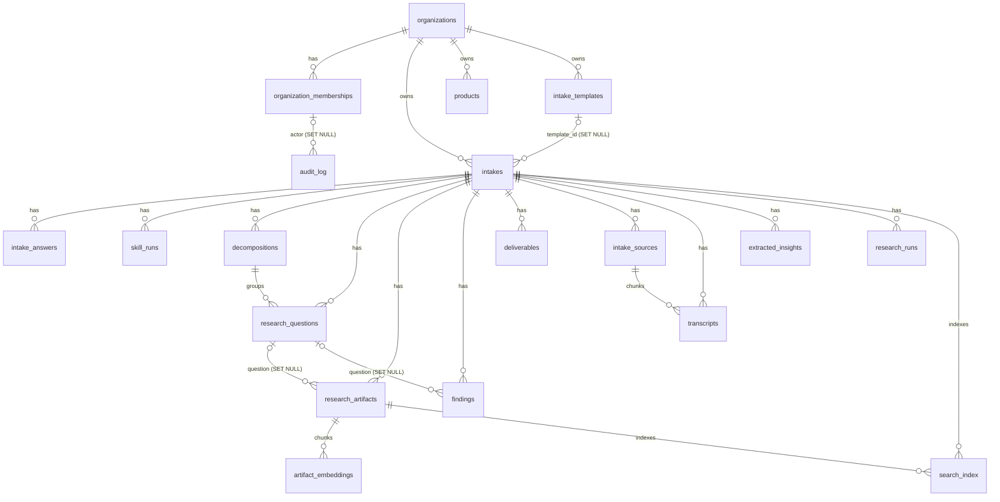
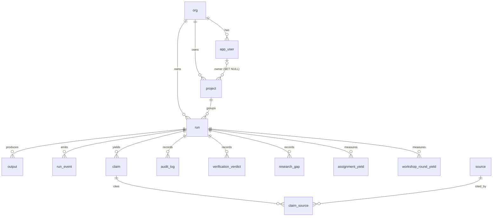

# 05 — Data model

| | |
|---|---|
| **Audience** | Engineers writing queries or migrations; auditors checking isolation at the storage layer |
| **Type** | Reference |
| **Source of truth** | `backend/app/db/models/*`, `backend/app/db/alembic/versions/0001…0013`, `backend/app/db/rls.py`, `tribunal/nestor_pulse_sdk/db/models/*`, `tribunal/nestor_pulse_sdk/db/rls.py`, `tribunal/nestor_pulse_sdk/alembic/env.py` and `versions/0001…0018`, `backend/app/storage/keys.py`, `tribunal/nestor_pulse_sdk/audit/gcs_blob.py` |
| **Last verified** | commit `c8b8583`, 2026-09-03 |

## 05.1 In one paragraph

One Cloud SQL Postgres 16 instance holds two schemas that never meet. The `nestor` schema (18
tables, 13 migrations) is the intake platform's; every tenant-owned table carries `space_id NOT
NULL` and is protected by forced row-level security keyed on a transaction-local setting. The
`tribunal` schema (14 tables, 18 migrations) is the research engine's; it carries `tenant_id` and
its own setting name, its own migration version table, and one table whose row hashes form a legal
audit chain. Two buckets hold what the database does not: client uploads and report bundles in one,
the full request and response body of every model call in the other, under a seven-year retention.

## 05.2 How it works: why two schemas on one instance

When the research engine was absorbed in v1.1, the fresh research over both codebases found that
they had independently made the same decisions with different names. Three collisions would have
been silent and severe:

- **Alembic revision ids.** Both lines shipped revisions `0001` through `0010` with identical
  revision strings. A shared `alembic_version` table would have made each line believe the other's
  migrations were already applied.
- **The row-level security setting.** The intake schema reads `app.current_space_id`; the engine
  reads `app.tenant_id`. A session that set one and queried the other's tables would read either
  nothing or, worse, everything.
- **The frozen hash payload.** The engine's audit chain hashes a fixed field set that includes
  `tenant_id`. Renaming anything in it forks every existing chain, which is a legal artefact.

The answer (chapter 17 · M-03) was two schemas on one instance, each with its own migration line and
its own version table, and an HTTP-only seam between the codebases so that no session ever holds
both settings.

The engine's isolation is implemented in `tribunal/nestor_pulse_sdk/alembic/env.py`:

- `version_table="tribunal_alembic_version"`, `version_table_schema="tribunal"` in both the offline
  and online paths, so the two lines cannot see each other;
- the schema is selected with `SET search_path TO tribunal`, **not** with SQLAlchemy's
  `schema_translate_map`;
- and the online path issues two explicit `connection.commit()` calls, one after `CREATE SCHEMA IF
  NOT EXISTS tribunal` and one after the `SET search_path`. Those commits are not cosmetic: without
  them SQLAlchemy 2.0's autobegin left Alembic's transaction unowned and the whole migration rolled
  back silently. The recorded symptom was "all 10 migrations logged, zero tables persisted".
- an autogenerate filter considers only objects in schema `None` or `tribunal`, so the intake
  schema's tables are never proposed for a DROP.

The canonical command is `cd nestor_pulse_sdk && alembic upgrade head`, because `alembic.ini`
resolves relative to the working directory. Both migration Jobs prove application by the literal
`Running upgrade X -> Y` line, never by an exit code.

## 05.3 The `nestor` schema

18 tables. Conventions: `id UUID` primary key defaulted client-side unless noted; `created_at
timestamptz NOT NULL DEFAULT now()`; every tenant-owned table has `space_id UUID NOT NULL`
referencing `nestor.organizations(id) ON DELETE CASCADE`, an index on `space_id`, and at least one
space-leading composite index.

Three tables are **roots** and carry no `space_id`: `organizations` (it *is* the tenant),
`organization_memberships` and `audit_log`. They are never row-level-security scoped.



### 05.3.1 Enumerated types

Created by migration `0001` and declared in the models with `create_type=False`:

| Type | Values |
|---|---|
| `nestor.intake_status` | `draft`, `submitted`, `reviewed`, `validated_by_client`, `decomposed`, `in_research`, `delivered`, `archived` |
| `nestor.question_type` | `descriptive`, `comparative`, `causal`, `predictive` |
| `nestor.finding_kind` | `fact`, `insight`, `risk`, `opportunity` |

No CHECK constraint is declared in any intake model. `organizations.status` and
`organization_memberships.status` take `active` or `deactivated` by application convention only, and
the locale columns take `nl`, `fr` or `en` enforced in code.

### 05.3.2 Root tables

**`organizations`** — the tenant. The client's identity is its `name`; there is no separate clients
table (chapter 17 · 01-02).

| Column | Type | Null | Notes |
|---|---|---|---|
| `id` | UUID | PK | this is `space_id` everywhere else |
| `name` | String | no | the client name |
| `slug` | String | yes | unique |
| `status` | String | no | default `'active'` |
| `default_locale` | String | no | default `'nl'` (migration 0010) |
| `created_at` | timestamptz | no | |

**`organization_memberships`** — the link from an Identity Platform user to a space.

| Column | Type | Null | Notes |
|---|---|---|---|
| `id` | UUID | PK | the "membership id" used by the admin and mail APIs |
| `organization_id` | UUID | no | FK organizations, CASCADE |
| `user_id` | UUID | yes | legacy |
| `provider_user_id` | String | yes | the Identity Platform uid |
| `email` | String | yes | |
| `role` | String | no | default `'user'` |
| `status` | String | no | default `'active'` (0006) |
| `locale` | String | yes | per-user override (0010) |
| `created_at` | timestamptz | no | |

Unique `(organization_id, user_id)`.

**`audit_log`** — the security event trail. `space_id` is present but nullable and carries **no
foreign key**, so an event can be recorded for a space that is later removed.

| Column | Type | Null | Notes |
|---|---|---|---|
| `id` | UUID | PK | |
| `actor_uid` | String | no | the Identity Platform uid of the actor |
| `actor_membership_id` | UUID | yes | FK memberships, SET NULL |
| `event_type` | String | no | see chapter 06 for the vocabulary |
| `target` | String | yes | |
| `space_id` | UUID | yes | no FK |
| `metadata` (attribute `event_metadata`) | JSONB | no | default `{}` |
| `created_at` | timestamptz | no | |

Indexes on `space_id`, `created_at`, and `(event_type, created_at)`.

### 05.3.3 Tenant-owned tables

**`products`** — `id`, `space_id`, `name` (not null), `slug`, `created_at`. Index
`(space_id, name)`.

**`intake_templates`** — `id`, `space_id`, `name` (not null), `schema` JSONB, `created_at`. Index
`(space_id, name)`. The live Pulse form is not stored here (chapter 06 § canonical template).

**`intakes`** — the central row.

| Column | Type | Null | Notes |
|---|---|---|---|
| `id` | UUID | PK | |
| `space_id` | UUID | no | FK organizations, CASCADE |
| `template_id` | UUID | yes | FK intake_templates, SET NULL |
| `client_name` | String | yes | mirrored from the organisation by a trigger |
| `status` | `intake_status` | no | default `'draft'` |
| `validation_link_sent_at` | timestamptz | yes | drives the phase machine |
| `results_link_sent_at` | timestamptz | yes | also read back as the delivered timestamp |
| `context_pack_artifact_id` | UUID | yes | no FK; points into `research_artifacts` |
| `final_report_artifact_id` | UUID | yes | no FK; the delivered PDF's artifact |
| `created_at`, `updated_at` | timestamptz | no | `updated_at` maintained by the ORM, not a trigger |

Indexes `(space_id, status)` and `(space_id, created_at)`.

**`intake_answers`** — one row per `(intake, field_key)`.

| Column | Type | Null | Notes |
|---|---|---|---|
| `id` | UUID | PK | server default `gen_random_uuid()` since 0007 |
| `space_id`, `intake_id` | UUID | no | CASCADE on the intake |
| `field_key` | String | no | |
| `value` | Text | yes | scalar answers |
| `value_json` | JSONB | yes | lists, objects, localised strings |
| `artifact_id` | UUID | yes | |
| `respondent_id`, `confidence`, `source_chunk_id`, `extracted_by` | UUID / Float / UUID / String | yes | added by 0009 for AI-extracted answers |
| `created_at`, `updated_at` | timestamptz | no | |

Unique `(intake_id, field_key)` — the conflict target every upsert uses.

**`skill_runs`** — one execution of an AI skill.

| Column | Type | Null | Notes |
|---|---|---|---|
| `id` | UUID | PK | |
| `space_id`, `intake_id` | UUID | no | |
| `skill` | String | no | default `'apply-intake-skill'`; the discriminator the phase machine reads |
| `status` | String | no | default `'queued'`; the values written are `running`, `succeeded`, `failed` |
| `llm_model` | String | yes | the resolved model id |
| `output_parsed` | JSONB | yes | the reviewable AI output |
| `error_message` | Text | yes | |
| `input_tokens`, `output_tokens`, `cost_estimate_usd`, `output`, `prompt_system`, `prompt_user`, `skill_version` | Integer / Numeric / Text | yes | added by 0009 |
| `created_at`, `started_at`, `completed_at`, `applied_at` | timestamptz | | `applied_at` is what makes the phase machine leave `awaiting_review` |

Indexes `(space_id, intake_id)` and `(space_id, status)`.

**`decompositions`** — `id`, `space_id`, `intake_id`, `summary` Text, `created_at`. The summary
becomes the brief's opening line when present.

**`research_questions`** — `id`, `space_id`, `intake_id`, `decomposition_id` (FK CASCADE, nullable),
`question_text` Text not null, `question_type` enum default `descriptive`, `priority` Integer
default 1, `rationale`, `status` String default `'open'`, `created_at`. Indexes
`(space_id, intake_id)` and `(space_id, status)`.

**`research_artifacts`** — the generic artifact table. It carries the context pack
(`source = 'context-pack-generator'`, `artifact_type = 'note'`, the markdown in `text_content`, no
GCS object) and the delivered report (`artifact_type = 'report'`, `source = 'human-report'`, a GCS
`storage_path`, `mime_type = 'application/pdf'`).

| Column | Type | Null |
|---|---|---|
| `id`, `space_id`, `intake_id` | UUID | PK / no / no |
| `research_question_id` | UUID | yes (FK SET NULL) |
| `source`, `artifact_type`, `filename`, `storage_bucket`, `storage_path`, `mime_type`, `notes` | String / Text | yes |
| `byte_size` | Integer | yes |
| `text_content` | Text | yes |
| `embed_status` | String | no, default `'pending'` |
| `created_at` | timestamptz | no |

Indexes `(space_id, intake_id)` and `(space_id, embed_status)`.

**`findings`** — created empty as the Tribunal handoff contract (chapter 17 · P-09) and still
unpopulated: `kind` (`finding_kind`), `label`, `summary`, `supporting_text`, `confidence` Float,
`sources` JSONB, `llm_model`, `reviewed_by`, `reviewed_at`, `archived` Boolean default false.

**`deliverables`** — also created empty: `title`, `storage_bucket`, `storage_path`,
`client_view_token`, `delivered_at`. The delivery path uses `research_artifacts` instead, so the
`client_view_token` column is a legacy shape that is never written.

**`artifact_embeddings`** — `id`, `space_id`, `artifact_id` (FK `research_artifacts` CASCADE),
`embedding vector(1536)`, `chunk_text` Text, `created_at`. Indexes `(space_id)` and
`(space_id, artifact_id)`. **No vector index by policy**: the scan is an exact cosine ordering
confined by the space filter, and an approximate index was judged premature on an empty table.

**`search_index`** — `id`, `space_id`, `intake_id`, `artifact_id`, `kind`, `content`, `created_at`.

**`intake_sources`** — uploaded sources, principally audio: `kind`, `storage_bucket`,
`storage_path`, `file_name`, `language`.

**`transcripts`** — Whisper output in chunks: `source_id` (FK `intake_sources` CASCADE, not null),
`chunk_index`, `text`, `start_ms`, `end_ms`, `language`, `token_count`, `speaker`.

**`extracted_insights`** — `kind`, `label`, `summary`, `confidence`, `supporting_text`,
`source_chunk_id`, `source_answer_id` (both plain UUIDs, no FK), `llm_model`.

**`research_runs`** — the intake-side mirror of an engine run (migration 0011, extended by 0012 and
0013). The backend never reads the engine's tables; the poll driver writes this row and the UI reads
only this row.

| Column | Type | Null | Notes |
|---|---|---|---|
| `id` | UUID | PK | server default `gen_random_uuid()`; this is the id in the run page URL |
| `space_id`, `intake_id` | UUID | no | |
| `status` | String | no | default `'queued'`; the engine's literals are carried verbatim and never remapped |
| `tribunal_run_id` | String | yes | the engine's own run id |
| `current_stage` | String | yes | |
| `stage_detail` | JSONB | yes | `{"items": [{"name", "status"}]}` |
| `cost_usd_total` | Numeric | yes | |
| `attempt` | Integer | no | default 1; the failure-recovery counter |
| `error_message` | Text | yes | park reasons are prefixed `[park#seq]` |
| `output_markdown` | Text | yes | the generated report |
| `chain_status`, `chain_broken_at`, `bundle_key` | String / Integer / String | yes | added by 0012 |
| `event_seq` | BigInteger | yes | the feed cursor, added by 0013 |
| `created_at`, `started_at`, `completed_at` | timestamptz | | `started_at` drives the elapsed clock |

Indexes `(space_id, intake_id)` and `(space_id, status)`.

### 05.3.4 Row-level security in `nestor`

Migration `0002` enables and **forces** row-level security on every tenant table and creates one
policy per table. The pattern, quoted from `0002_rls_policies.py`:

```sql
CREATE POLICY intakes_space_isolation ON nestor.intakes
    USING (space_id = NULLIF(current_setting('app.current_space_id', true), '')::uuid)
    WITH CHECK (space_id = NULLIF(current_setting('app.current_space_id', true), '')::uuid)
```

Three details are load-bearing:

- **`, true`** makes `current_setting` return NULL instead of raising when the setting was never
  established.
- **`NULLIF(…, '')`** exists because a `SET LOCAL` on a pooled connection reverts the setting to the
  empty string rather than to unset at COMMIT, and `''::uuid` raises. With the guard, an empty
  context yields NULL, so `USING` matches no rows (a fail-safe read) and `WITH CHECK` rejects every
  write (a fail-loud write).
- **`FORCE ROW LEVEL SECURITY`** is applied because the migration role owns the tables and would
  otherwise bypass the policy entirely. A test asserts `relforcerowsecurity` on every tenant table.

Migration `0003` adds the superadmin path. Cloud SQL does not permit `BYPASSRLS`, so a second,
OR'd policy per table matches on the connecting role:

```sql
CREATE POLICY intakes_superadmin_all ON nestor.intakes
    USING (current_user = 'app_superadmin')
    WITH CHECK (current_user = 'app_superadmin')
```

`app_superadmin` is a `BUILT_IN` login role created out of band (`gcloud sql users create`), granted
schema usage and table DML by the same migration. It is the only stored database credential in the
system, and it lives in Secret Manager.

**Roles.** There is no named `app_user` role in the intake schema: the "app role" is whatever
non-superadmin login connects, in production the runtime service account's IAM database user.
Migrations `0005`, `0006`, `0009` and `0011` grant that user schema usage and table DML, keyed on the
`RUNTIME_DB_USER` environment variable, and `0005` raises rather than skipping when the role is
absent. The runtime user stays fully row-level-security scoped; the grant is privileges, not bypass.

**One caveat recorded in the code.** Inside a `SECURITY DEFINER` trigger, `current_user` becomes the
function owner, so the superadmin bypass does **not** apply to the trigger's own child insert. That
is why `TenantRepository.create_in_space` sets the tenant setting to the target space before
inserting an intake as a superadmin.

### 05.3.5 Triggers and functions in `nestor`

Only pre-`decomposed` behaviour was ported; the legacy status-bump triggers
(`tg_bump_to_in_research`, `tg_bump_to_delivered`, `persist_questions_on_research_start`) exist
neither as objects nor as names, and the scope guard bans their literals.

| Object | Kind | Behaviour |
|---|---|---|
| `nestor.prefill_intake_answers()` + `trg_prefill_intake_answers` | BEFORE INSERT ON `intakes`, `SECURITY DEFINER` | reads the organisation's name and, when `client_name` is null or empty, mirrors it onto the new row |
| `nestor.seed_intake_client_name_answer()` + `trg_seed_intake_client_name_answer` | AFTER INSERT ON `intakes`, `SECURITY DEFINER` | inserts the `client_name` answer with `ON CONFLICT DO NOTHING`. Split out from the BEFORE trigger by `0008` because inserting a child row before the parent existed raised a foreign-key violation |
| `nestor.submit_intake(uuid)` | function, no trigger | the legacy `draft → submitted` / `reviewed → validated_by_client` transition. Superseded by the API verbs and unused |

There is no `updated_at` trigger; the ORM sets it with `onupdate=func.now()`.

### 05.3.6 Migration lineage: `nestor` 0001 → 0013

| Rev | Down | What it does |
|---|---|---|
| `0001` | — | `CREATE SCHEMA nestor`, extensions `pgcrypto` and `vector`, the three enums, the two root tables and twelve tenant tables with `space_id` and indexes; `embedding vector(1536)` with no vector index |
| `0002` | 0001 | ENABLE + FORCE row-level security and one `*_space_isolation` policy on each of the twelve tenant tables |
| `0003` | 0002 | grants to `app_superadmin` plus one `*_superadmin_all` policy per table |
| `0004` | 0003 | the prefill trigger and the `submit_intake` function; the post-`decomposed` triggers deliberately absent |
| `0005` | 0004 | the runtime service account grant, keyed on `RUNTIME_DB_USER`; raises when the role is missing |
| `0006` | 0005 | `status` on organisations and memberships; the root `audit_log` table with three indexes |
| `0007` | 0006 | `intake_answers.id` server default, because the trigger's raw insert supplied none |
| `0008` | 0007 | splits prefill into BEFORE (mirror) and AFTER (seed the answer) |
| `0009` | 0008 | `intake_sources`, `transcripts`, `extracted_insights`; seven columns on `skill_runs`, four on `intake_answers`; policies and grants for the new tables |
| `0010` | 0009 | `organizations.default_locale`, `organization_memberships.locale` |
| `0011` | 0010 | `research_runs` with policies and grants |
| `0012` | 0011 | `research_runs.chain_status`, `chain_broken_at`, `bundle_key` |
| `0013` | 0012 | `research_runs.event_seq` |

Head is `0013`.

## 05.4 The `tribunal` schema

14 tables. Every table except `org` carries `tenant_id UUID NOT NULL` referencing `org(id) ON DELETE
CASCADE`. `org.id` **is** the tenant, and it equals the intake platform's `space_id`.



### 05.4.1 Identity and work

**`org`** — not tenant-scoped: `id` PK, `name` not null, `slug` unique not null, `retention_days`
Integer not null (180), `created_at`.

**`app_user`** — named `app_user` because `user` is reserved: `id`, `tenant_id`, `email` (globally
unique, not per tenant), `provider_user_id`, `role` (default `admin`), `created_at`. Index
`(tenant_id, email)`.

**`project`** — `id`, `tenant_id`, `name`, `client_name`, `status` (default `active`),
`owner_user_id` (FK `app_user` SET NULL), `created_at`, `updated_at`. Indexes `(tenant_id, status)`
and `(tenant_id, client_name)`. One project is provisioned lazily per intake by the seam.

**`run`** — the queue row and the run's whole state.

| Column | Type | Null | Notes |
|---|---|---|---|
| `id` | UUID | PK | the engine run id |
| `tenant_id`, `project_id` | UUID | no | CASCADE |
| `engine` | String | no | CHECK `ck_run_engine` in `('adk','sdk','tribunal')`; the seam pins `tribunal` |
| `brief` | Text | no | the assembled brief |
| `status` | String | no | default `queued`; CHECK `ck_run_status` over the **nine** values `queued`, `running`, `completed`, `completed_degraded`, `parked`, `failed`, `cancelled`, `needs_input`, `needs_report_spec` |
| `idempotency_key` | UUID | no | unique with `tenant_id`; the seam derives it from the mirror-row id |
| `worker_id` | String | yes | who claimed it |
| `started_at` | timestamptz | yes | **the fencing token**; must never move on a timer |
| `heartbeat_at` | timestamptz | yes | the liveness clock (0014) |
| `reclaim_count` | Integer | no | default 0; bounds crash recoveries (0014) |
| `completed_at`, `error_message` | timestamptz / Text | yes | |
| `cost_usd_total` | Numeric(12,4) | yes | |
| `cost_pending` | Boolean | no | default false; set when a call could not be priced (0011) |
| `verification_summary` | JSONB | yes | the gate funnel (0011) |
| `current_stage` | Text | yes | (0006) |
| `stage_detail` | JSONB | yes | (0006) |
| `clarifying_questions` | JSONB | yes | vestigial (0005) |
| `comparison_id` | UUID | yes | the unused A/B arm grouping (0004) |
| `created_at` | timestamptz | no | |

Indexes `(tenant_id, status)`, `(tenant_id, project_id)`, `(tenant_id, created_at)`,
`(tenant_id, comparison_id)`.

**`output`** — `id`, `tenant_id`, `run_id`, `format` (default `markdown`), `body` Text not null,
`gcs_uri`, `created_at`. The report and the rejected-claims ledger are rows here, distinguished by
`format`.

**`run_event`** — the append-only feed (0015).

| Column | Type | Null | Notes |
|---|---|---|---|
| `id` | UUID | PK | |
| `tenant_id`, `run_id` | UUID | no | |
| `seq` | BigInteger | no | monotonic per run and **deliberately not unique** |
| `ts` | timestamptz | no | default now(); the emitter supplies it |
| `stage` | Text | no | one of the pipeline stage keys |
| `kind` | Text | no | clamped by the emitter to a closed twelve-value vocabulary; no CHECK |
| `text` | Text | no | scrubbed, then clamped to 400 characters |
| `meta` | JSONB | yes | whitelisted keys only |

Index `(tenant_id, run_id, seq)`. Nothing writes through the ORM class; the emitter uses a raw
multi-row INSERT. The table grows monotonically with no pruning job, roughly 3,000 rows per run.

### 05.4.2 Claims, sources and verdicts

`claim`, `source` and `claim_source` are the three-table citation model. There is no separate
snapshot table: the snapshot lives on `source`.

**`claim`** — `id`, `tenant_id`, `run_id`, `text` Text not null, `facet` (the parent client
question), `position` (the ordering the citation numbering depends on), plus the metadata added by
later phases: `certainty` (`certain` or `single`, 0013), `found_by` `ARRAY(Text)` (which providers
found it, 0013), `sub_question` (0017), `corroboration_key` (0017, `w01`-style; absent means NULL,
never the empty string), `as_of` Date (0017, the claim's own date so a rollout is not read as a
contradiction). Index `(tenant_id, run_id)`.

**`source`** — `id`, `tenant_id`, `url` Text not null (never rewritten), `title`, `provider`,
`fetched_at` (a **retrieval** date, which is why the UI must never label it "published"),
`snapshot_text` Text (capped at 50,000 characters), `snapshot_gcs_uri` (declared, never written),
`content_hash`, `resolved_url` and `resolution_status` (`NULL` for never attempted, `resolved`, or
`unresolved`; 0016). Indexes `(tenant_id, url)` and a **partial unique** index on
`(tenant_id, content_hash) WHERE content_hash IS NOT NULL`, which is the deduplication key.

**`claim_source`** — composite primary key `(claim_id, source_id)`, both CASCADE, plus a
denormalised `tenant_id` for row-level security, `snippet`, `confidence` (declared, never written)
and `provider_quality` (`official`, `press`, `other`; 0013), which outranks the domain heuristic
when the provider stated it.

**`verification_verdict`** (0011, 0012) — `id`, `tenant_id`, `run_id`, `claim_id` (a plain nullable
UUID with **no foreign key**, so a dropped claim's verdict can still be filed), `verdict` Text
(`support`, `refute`, `insufficient`, `superseded`; documented, no CHECK), `confidence` Text,
`evidence_refs` JSONB, `reconciliation` JSONB, `superseded_note` Text.

**`research_gap`** (0013) — the providers' "could not find" lists: `provider`, `text`, capped at
2,000 characters, at most 200 rows per run.

### 05.4.3 The audit table

**`audit_log`** — one row per model call. `run_id` is nullable so a pre-run call can be recorded.

| Column | Type | Null | In the hash? |
|---|---|---|---|
| `id` | UUID | PK | no (it is the audit id) |
| `tenant_id` | UUID | no | **yes** |
| `run_id` | UUID | yes | **yes** |
| `seq` | Integer | no | **yes** |
| `provider`, `model` | String | no | **yes** |
| `started_at` | timestamptz | no | **yes** (as an ISO string) |
| `duration_ms` | Integer | no | **yes** |
| `prompt_tokens`, `completion_tokens`, `cached_tokens` | Integer | no | **yes** |
| `gcs_uri` | String | no | **yes** |
| `cache_creation_tokens` | Integer | yes | **no** (added by 0011 deliberately outside the payload) |
| `cost_usd` | Numeric(12,6) | yes | **no** (so a price correction never forks a chain) |
| `prev_hash`, `hash` | String | no | the chain itself |
| `created_at` | timestamptz | no | no |

Unique `(tenant_id, run_id, seq)` — the last line of defence against a cross-process sequence
collision. Indexes `(tenant_id, run_id, created_at)` and `(tenant_id, model)`.

The frozen payload is exactly eleven fields: `provider`, `model`, `started_at`, `duration_ms`,
`prompt_tokens`, `completion_tokens`, `cached_tokens`, `gcs_uri`, `seq`, `tenant_id`, `run_id`.
Changing that set breaks every existing chain. Chapter 14 § 14.7 states what the chain guarantees.

### 05.4.4 The yield tables

Added by `0018` for decision D-R8 so that routing can one day be evidence-based. They were given
their own tables rather than reusing `run_event` (whose `meta` allowlist would drop unknown keys
silently) or `audit_log` (the hash-chained legal record), and cross-run queryability was the point.

**`assignment_yield`** — 17 columns in a normative order that a test asserts: `id`, `tenant_id`,
`run_id`, `provider`, `group_id`, `client_question`, `parent_kind`, `stakes`, `fact_list_parsed`,
`retry_used`, `claims_kept`, `claims_surviving_verification`, `resolvable_sources`, `cost_usd`,
`duration_s`, `created_at`, `verified_at`.

`parent_kind` is a real column (`client_question`, `discovery_rider`, `cross_cutting`, or the
sentinel `unknown`) and is **not** inferred from `client_question IS NULL`, because the two encode
different things: a cross-cutting group genuinely has no single parent. There is deliberately no
unique constraint over the natural key `(run_id, provider, group_id, client_question)`, and
`claims_surviving_verification` and `verified_at` are written by a later UPDATE.

**`workshop_round_yield`** — 13 columns: `id`, `tenant_id`, `run_id`, `round_no`, `candidates_in`,
`new_candidates`, `keep_count`, `weak_count`, `kill_count`, `new_entrants_top_n`, `barred_drops`,
`round_cost_usd`, `created_at`. `keep_count` counts critique verdicts, not winners; `new_entrants_top_n`
is the loop's entire justification (chapter 10). Five figures the loop computes have no column here
(`winners`, `weak_winners`, `barred`, `lookups`, `calls`), so per-round WEAK-winner counts are not
cross-run queryable — a recorded gap of decision D-W5-17.

### 05.4.5 Row-level security in `tribunal`

The setting is `app.tenant_id`, established with `SELECT set_config('app.tenant_id', :tid, true)` —
transaction-local, exactly like the intake side, and the caller must already be inside a
transaction. All policy DDL lives in the migrations; the ORM never declares it.

The history matters because each step was a production incident:

| Rev | Change | Why |
|---|---|---|
| `0002`, `0003` | ENABLE + FORCE row-level security and one `*_tenant_isolation` policy per table, in the **bare** form `tenant_id = current_setting('app.tenant_id')::uuid` | fail loud on an unset setting |
| `0008` | grants for `worker_user` plus one `*_worker_all` policy `USING (current_user = 'worker_user')` on the **eight original** tables | the worker must see every tenant's queue; Cloud SQL forbids `BYPASSRLS`, so an OR'd policy is the equivalent. `worker_user` is created out of band as a Cloud SQL built-in user |
| `0009` | the eight policies rewritten with `current_setting('app.tenant_id', true)` | an unset setting raised during the worker's cross-tenant claim |
| `0010` | the eight policies rewritten again with `NULLIF(current_setting('app.tenant_id', true), '')` | after a `SET LOCAL` on a pooled connection the setting reverts to `''`, and `''::uuid` raised, crash-looping a production worker |

⚠ **The forms are inconsistent.** Migration `0013` explains at length that the bare form crash-loops
the worker and uses the `NULLIF` form for `research_gap`. Yet the tables created by `0011`
(`verification_verdict`), `0015` (`run_event`) and `0018` (both yield tables) use the **bare** form,
and none of them has a `worker_all` policy. Their writers bind the setting first, so the crash-loop
path is not reachable today, but the code contradicts `0013`'s stated rule.

### 05.4.6 Migration lineage: `tribunal` 0001 → 0018

| Rev | Down | What it does |
|---|---|---|
| `0001` | — | `pgcrypto`; `org`, `app_user`, `project`, `run`, `output`, `audit_log`. `run` CHECKs: engine in `('adk','sdk')`, status in five values |
| `0002` | 0001 | ENABLE + FORCE row-level security and a tenant-isolation policy on the five tenant tables; `org` excluded because it is the tenant |
| `0003` | 0002 | `source`, `claim`, `claim_source` with their indexes and policies |
| `0004` | 0003 | engine CHECK widened to include `tribunal`; `run.comparison_id` |
| `0005` | 0004 | status CHECK gains `needs_input`; `run.clarifying_questions` |
| `0006` | 0005 | `run.current_stage`, `run.stage_detail` |
| `0007` | 0006 | status CHECK gains `needs_report_spec` |
| `0008` | 0007 | `worker_user` grants and the eight `*_worker_all` policies |
| `0009` | 0008 | the eight isolation policies rewritten with `missing_ok` |
| `0010` | 0009 | the eight isolation policies rewritten with `NULLIF(…, '')` |
| `0011` | 0010 | `audit_log.cache_creation_tokens`; `run.cost_pending`, `run.verification_summary`; the `verification_verdict` table |
| `0012` | 0011 | `verification_verdict.superseded_note`, and nothing else |
| `0013` | 0012 | `claim.certainty`, `claim.found_by`, `claim_source.provider_quality`; the `research_gap` table; status CHECK gains `completed_degraded` and `parked` (nine values) |
| `0014` | 0013 | `run.heartbeat_at`, `run.reclaim_count` |
| `0015` | 0014 | the `run_event` table |
| `0016` | 0015 | `source.resolved_url`, `source.resolution_status` |
| `0017` | 0016 | `claim.sub_question`, `claim.corroboration_key`, `claim.as_of` |
| `0018` | 0017 | `assignment_yield` and `workshop_round_yield` |

Head is `0018`. The status vocabulary grew 5 → 6 → 7 → 9 across `0001`, `0005`, `0007` and `0013`.

⚠ `0016`, `0017` and `0018` each record in their own docstring that, at authoring time, they had
never touched a database; the three were applied together in the deploy of 2026-08-05, proven by
three literal `Running upgrade` lines.

## 05.5 What lives outside the database

### 05.5.1 The uploads bucket

`{project}-nestor-uploads`, uniform access, public access prevention enforced, no versioning and no
lifecycle rule. Keys are authored by the server, never by the browser:

```
{space_id}/{intake_id}/{category}/{uuid4}-{sanitised filename}
```

Categories are exactly `attachments`, `audio`, `artifacts` and `reports`. The raw-output bundle of a
run lands under `artifacts/` as `raw-output-{research_run_id}.zip`; the delivered PDF is staged
under `reports/`, and every read of a key asserts the `{space}/{intake}/` prefix before a signed URL
is minted. Sixteen file extensions are allowed and the size ceiling is 25 MB.

### 05.5.2 The audit bucket

`{project}-nestor-audit`, uniform access, public access prevention enforced, **per-object retention
enabled**. Each model call writes one object:

```
runs/{run_id}/{audit_id}_{provider}_{model}.json
```

with the provider and model sanitised into the name (which is why the file listing alone gives a
per-model call count). The body is `{run_id, audit_id, seq, provider, model, request, response}`
after redaction, and each object is patched with `retention.mode = "Unlocked"` and a
`retain_until_time` of seven years (implemented as 7 × 365 days). Bucket Lock is deliberately not
used, so an object's retention can be lifted by a project administrator if a legal hold ever
requires it. The blob's own `seq` field is always 0; the real sequence lives in the database row.

## 05.6 Why it is built this way

- **`space_id` on every row, not a join through the intake.** Context: the inherited schema relied on
  policies that did not filter at all. Options: derive the tenant by joining to a parent, or
  denormalise it onto every table. Decision: denormalise, and make it `NOT NULL` with a foreign key.
  Consequence: a policy is a single-column comparison that the planner can use an index for, and no
  query can lose the tenant by dropping a join (chapter 17 · P-05, 01-02).
- **Two settings, never one session.** See § 05.2 and chapter 17 · M-03.
- **Enums for the intake status, strings for run statuses.** The intake status is a contract with the
  client and changes rarely, so a Postgres enum makes an invalid value impossible. The engine's run
  status changed four times in three months, so it is a string with a CHECK the migrations widen, and
  the mirror column carries the engine's literal verbatim rather than remapping it (chapter 17 · D-12).
- **Additive columns, never a JSON blob, for fact metadata.** Context: a structured provider fact
  carries certainty, provenance and a source quality with nowhere to go. Options: one JSONB column, or
  real columns. Decision: real columns (chapter 17 · 15.2 D-13), because corroboration and priority
  logic read them, and because the run that has to prove the redesign must be re-examinable afterwards.
- **The yield data in its own tables.** See § 05.4.4 and chapter 17 · D-W5-1.
- **`findings` and `deliverables` created empty.** They preserve the handoff contract the legacy
  system documented, without pretending to be the delivery path (chapter 17 · P-09).

## 05.7 Known gaps and traps

- ⚠ **Two policy forms coexist in `tribunal`** (§ 05.4.5). Not reachable today; still inconsistent.
- **Declared but never written:** `source.snapshot_gcs_uri`, `claim_source.confidence`,
  `deliverables.client_view_token` and the whole `findings` table.
- **Stale docstrings.** The engine's `run` model docstring lists six statuses while its own CHECK has
  nine (the inline comment is correct). The engine README says the migration line stops at `0010`.
  `db/base.py` cites a "single Postgres schema" while the engine sets `search_path=tribunal,public`.
  The intake `env.py` comment says it registers 14 tables; there are 18.
- **`org.retention_days`** is defaulted client-side in the ORM and by `server_default` in the
  migration, so an ORM-versus-DDL comparison would flag an asymmetry on that column. Nothing reads it.
- **`run_event` has no pruning job** and grows monotonically.
- **The `nestor` schema has no vector index by policy**; the semantic-search scan is exact and
  confined by the space filter (chapter 07).
- ⛔ The `assignment_yield` and `workshop_round_yield` tables have **no read surface**: no endpoint,
  no seam verb, no screen. Reading them requires a database path the operator machine does not have.

## 05.8 Where to look

| Path | Responsibility |
|---|---|
| `backend/app/db/models/*` | the 18 intake models |
| `backend/app/db/alembic/versions/0001…0013` | the intake migration line |
| `backend/app/db/rls.py` | `SPACE_GUC_KEY` and `set_space_context` |
| `backend/app/db/base.py` | the two engines, the pool, the check-in RESET |
| `backend/app/storage/keys.py` | the uploads key scheme, categories, extensions |
| `tribunal/nestor_pulse_sdk/db/models/*` | the 14 engine models |
| `tribunal/nestor_pulse_sdk/db/rls.py` | `app.tenant_id` and `set_tenant_context` |
| `tribunal/nestor_pulse_sdk/alembic/env.py` | the version-table and `search_path` isolation |
| `tribunal/nestor_pulse_sdk/alembic/versions/0001…0018` | the engine migration line |
| `tribunal/nestor_pulse_sdk/audit/gcs_blob.py` | the audit object naming, retention and redaction |
