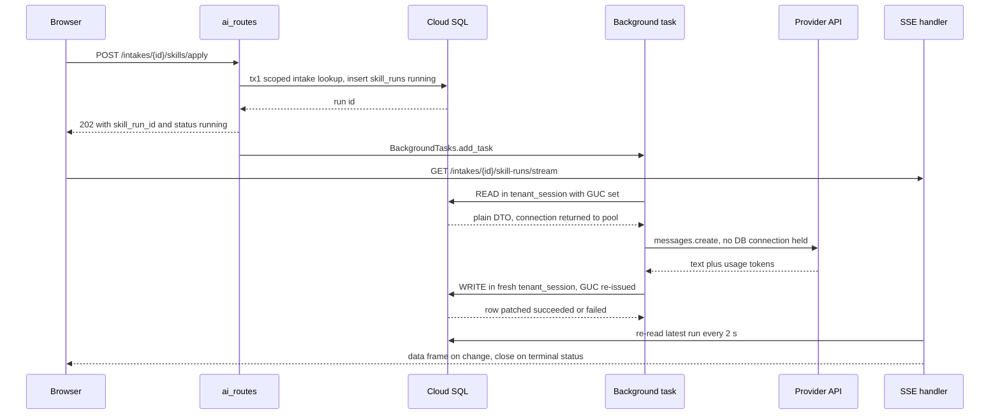
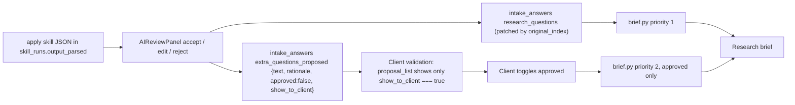

# 07 — AI skills: the pre-research functions

| | |
|---|---|
| **Audience** | Engineers changing a skill, operators reading a skill run, auditors tracing what an LLM was sent and what it wrote back |
| **Type** | Reference + Explanation |
| **Source of truth** | `backend/app/ai/prompts.py`, `backend/app/ai/skills/*.py`, `backend/app/ai/parsing.py`, `backend/app/ai/search.py`, `backend/app/ai/clients.py`, `backend/app/api/ai_routes.py`, `backend/app/db/ai_session.py`, `backend/app/core/config.py:109-128`, `frontend/src/components/intake/AIReviewPanel.tsx`, `frontend/src/components/intake/FieldRenderer.tsx`, `backend/app/research/brief.py`, `.planning/phases/07-ai-function-ports/07-CONTEXT.md`, `.planning/STATE.md` rows `260831-lm4` and `260831-gk7`, `.planning/STAKEHOLDER-NOTES.md` § 2026-07-21 |
| **Last verified** | commit `c8b8583`, 2026-09-03 |

## 07.1 In one paragraph

Before any deep research runs, an operator applies a handful of AI "skills" to a client's intake. One skill sharpens the client's research questions and proposes extra ones. One turns the validated intake into a Dutch briefing document called the context pack. Two more read a transcript of an interview: one fills the form fields from it, one distils strategic insights. Two utilities complete the set: one turns audio into text, one turns documents into vectors so the operator can search them by meaning. Every skill runs as a short background job on the intake API: it records a row, calls the model without holding a database connection, and writes the result back inside the client's own tenant scope. Nothing here is automatic. The operator reviews every suggestion, the client ticks the extra questions they want, and only what humans approve reaches the research engine. This layer ends at intake status `decomposed`; everything after that is [see 08 — The research seam](08-research-seam.md).

## 07.2 How it works

### The request that returns before the work is done

An operator presses a button in the intake detail page. The frontend seam in `frontend/src/lib/api/skills.ts:14-45` sends a bare `POST` with no body to one of the skill routes in `backend/app/api/ai_routes.py`. The tenant is never in the request. It comes from the verified identity token only (`ai_routes.py:14-18`).

The route does exactly one synchronous thing. It calls `create_running_skill_run` (`app/db/ai_session.py:151-192`), which opens one short tenant transaction, checks that the intake is in the caller's scope, inserts a `skill_runs` row with `status="running"` (`:181`), and returns the new id. A cross-tenant or missing intake raises `IntakeNotInScopeError` and the route answers 404 "Intake not found", hiding existence (`ai_routes.py:71-73`). A tenant user whose token carries no `space_id` gets the one 403 on this path (`:74-76`). Then the route schedules a FastAPI background task and answers `202 {"skill_run_id": ..., "status": "running"}` (`:80-96`).

### The background task: read, call, write

Every skill is written as three closures handed to `run_with_session_release` (`app/db/ai_session.py:99-148`):

1. **READ** opens a `tenant_session`, loads everything the model needs into a plain dictionary, and closes the transaction. The pooled connection goes back to the pool (`:132-134`).
2. **CALL** runs the provider request with no database connection held at all (`:136-137`). This is the 90 to 120 second window the design exists for.
3. **WRITE** opens a fresh `tenant_session`. Because the row-level security (RLS) setting `app.current_space_id` is a transaction-local GUC (Postgres grand unified configuration setting), it evaporated at the READ commit. The fresh session re-issues it structurally on every entry (`:79-96`), so forgetting it is impossible by construction. The test `tests/test_ai_session_release.py` proves `set_space_context` is called exactly twice for one user run (`ai_session.py:16-17`).

Any exception in any phase is routed to the skill's `on_error` closure inside yet another fresh session (`:142-148`), which patches the row to `status="failed"` with the exception text. Without this, FastAPI would swallow the exception and the row would sit at `running` forever (`:122-128`).

A superadmin has no space of their own. On that path the task uses the `app_superadmin` engine with no GUC (`:62-76`) and writes through the audited `create_in_space` methods against the intake's own space, which the READ phase captured into the DTO (`apply.py:124-138`, `context_pack.py:115-117`).

### What the browser sees

The frontend does not poll the 202 response. It opens the server-sent events (SSE) stream `GET /intakes/{intake_id}/skill-runs/stream` (`app/api/intake_routes.py:1136-1199`), which re-reads the latest run row every 2 seconds, emits a frame on change, pings every 15 seconds, and closes when the status becomes `succeeded` or `failed` or after 10 minutes. The full output is then fetched with `GET /intakes/{intake_id}/skill-runs/{run_id}` (`:1202-1225`), which returns `output_parsed` and `cost_estimate_usd`. The stream mechanics belong to [see 06 — Backend: the intake API](06-backend-intake-api.md).



### The human loop after the skill

The apply skill never writes research questions itself. It stores the model's JSON verbatim in `skill_runs.output_parsed` and leaves `applied_at` null (`apply.py:16-21`). The operator's accept, edit, and reject decisions in `AIReviewPanel` are what write into `intake_answers`. The client then ticks the proposed extra questions they want during validation. The research brief counts only what was approved. Section 07.7 walks through the exact fields.



## 07.3 The legacy functions and their fates

The legacy Supabase build had 21 edge functions (`docs/BACKEND-MAP.md:15-22`). Phase 7 defined "the seven pre-research AI functions" as the ones below (`.planning/phases/07-ai-function-ports/07-CONTEXT.md:21-31`). Six became `skill_runs` writers; semantic search became a synchronous read.

| Legacy function | Fate | Where it lives now | Cite |
|---|---|---|---|
| `apply-intake-skill` | Ported as skill `apply-intake-skill` | `app/ai/skills/apply.py` | `apply.py:1-31` |
| `generate-context-pack` | Ported as skill `context-pack`, minus the storage object and minus the section 12 appendix | `app/ai/skills/context_pack.py` | `context_pack.py:8-28` |
| `structure-answers` | Ported as skill `structure-answers`; plain INSERT became an upsert | `app/ai/skills/structure_answers.py` | `structure_answers.py:9-16` |
| `extract-insights` | Ported as skill `extract-insights` | `app/ai/skills/extract_insights.py` | `extract_insights.py:1-13` |
| `generate-embeddings` | Ported as skill `generate-embeddings` (OpenAI 1536) | `app/ai/skills/embeddings.py` | `embeddings.py:1-8` |
| `semantic-search` | Ported as the synchronous search endpoint, now RLS-confined | `app/ai/search.py` | `search.py:1-15` |
| `transcribe-audio` | Ported as skill `transcribe-audio` | `app/ai/skills/transcribe.py` | `transcribe.py:116-128` |
| `embed-artifact`, `search-global`, `match-artifacts` | Not ported: the Voyage `voyage-3-large` 1024-dim path was dropped by consolidation | none | `07-CONTEXT.md` D-02 |
| `embed-pending-search`, `upload-pending-artifacts`, `ask-research` | No module under `backend/app/ai/`; `ask-research` is the Phase 19 Q&A chat target on a separate 1024-dim table | none yet | [see 17 · M-05](17-decision-log.md) |
| `generate-battlecard`, `send-sales-mail`, `sales-friday-reminder` | Sales product, explicitly not among the seven | none | `07-CONTEXT.md:47-48` |
| `run-research` | Out of scope by design; replaced by the Tribunal seam and kept unreachable by CI guards | [see 08](08-research-seam.md) | `07-CONTEXT.md:49` |
| `send-pulse-mail` | Rebuilt as notification-only mail | [see 06](06-backend-intake-api.md) | |
| `tally-webhook`, `jotform-webhook`, `save-manual-synthesis` | Outside this layer | [see 02 — History](02-history-and-timeline.md) | |

The legacy functions ran with the service-role key and did no tenant scoping at all. Every port above is therefore net-new isolation work, not just a language change (`07-CONTEXT.md:12-14`).

### The prompt file is a parity asset

`backend/app/ai/prompts.py` carries the four legacy system prompts copied, not paraphrased (`prompts.py:1-13`). One deliberate deviation: the exported `.ts` files are byte-corrupted (every em dash reads as a double mojibake sequence), so the corrupted bytes were restored to the characters the model actually received in production. The genuine legacy typo "dataclatste" in the context-pack prompt is preserved as-is (`prompts.py:15-23`).

## 07.4 Shared mechanics

### The `skill_runs` row lifecycle

| Step | Who | Value | Cite |
|---|---|---|---|
| Insert | the route, synchronously | `{intake_id, skill, status:"running", llm_model, prompt_system, prompt_user}` | `ai_session.py:178-190` |
| Finalize on success | the task's WRITE phase | exactly `"succeeded"` plus output, prompts, tokens, cost, `completed_at` | e.g. `apply.py:191-209` |
| Finalize on failure | the task's WRITE phase or `on_error` | exactly `"failed"` plus `error_message`, `completed_at` | e.g. `apply.py:203-207`, `:212-218` |
| Startup sweep | `app/main.py:87` at process start | `running` rows older than 30 minutes become `failed` with `error_message="orphaned by restart"` | `ai_session.py:195-214` |

The two terminal literals are a cross-component contract (Phase 7 D-09): the frontend `SkillRunProgress` and the phase machine compare against them verbatim (`apply.py:10-14`). No synonym is ever written. `tests/test_ai_status_contract.py` guards it.

The sweep runs on the superadmin engine because it must reach every space. It is the only cross-space write in this layer, and it is the accepted backstop for D-01a: a Cloud Run instance that dies mid-task leaves a row at `running` until the next process start (`ai_session.py:196-202`).

### Provider clients

`app/ai/clients.py` builds a fresh SDK client per call with a 180-second timeout for both Anthropic and OpenAI (`clients.py:34-35`, `:38-62`). API keys are read from `os.environ` at call time and are deliberately not part of typed settings, so they never appear in config dumps or logs (`clients.py:18-22`, `config.py:114-116`). A missing key raises `KeyError` inside CALL, which the release helper routes to `on_error`, so the run row ends `failed` rather than stuck. No module sets `max_retries`; the SDK defaults apply (`clients.py`, no such symbol).

Two facts hold for every Claude call in this layer:

- The call is non-streaming `messages.create(model=, max_tokens=, system=, messages=[...])` (`apply.py:145-150`, `context_pack.py:130-135`, `structure_answers.py:172-177`, `extract_insights.py:410-415`).
- No `temperature` is set anywhere under `backend/app` (grep yields zero hits).

### Parsing

`app/ai/parsing.py` ports the legacy helpers verbatim:

- `extract_json(text)` strips a leading ```` ```json ```` or ```` ``` ```` fence and a trailing fence, slices from the first `{` to the last `}`, and `json.loads` it. No braces raises `ValueError("No JSON object found in Claude output")` (`parsing.py:45-64`).
- `extract_json_array(text)` prefers a fenced ```` ```json ```` block and otherwise takes the first `[` to the last `]` greedily. Neither present raises `ValueError("No JSON array found in Claude output")` (`:67-83`).

A `ValueError` from either is caught in WRITE and turns the row `failed` with the message, while the raw output and tokens are still persisted (`apply.py:201-207`).

### The cost estimate, and why it is a second cost system

`estimate_cost_usd(in_tok, out_tok)` is `round(in_tok / 1_000_000 * 3 + out_tok / 1_000_000 * 15, 4)` (`parsing.py:86-99`). The two rates are module constants `_INPUT_USD_PER_MTOK = 3` and `_OUTPUT_USD_PER_MTOK = 15` (`:28-29`), the legacy Sonnet list price at the time of the port.

This figure lands on `skill_runs.cost_estimate_usd` for the four Claude skills and does not reconcile with the engine's cost table ([see 09 — Tribunal service](09-tribunal-service.md)) for four structural reasons:

1. The rate is fixed regardless of the model id the call actually used. Changing `MODEL_APPLY_INTAKE` changes the spend but not the estimate.
2. Only input and output tokens are counted. Cache-write and cache-read token classes are not requested, not stored, and not priced.
3. The embeddings skill writes no cost at all (`embeddings.py:153-160` patches no `cost_estimate_usd`). The transcribe skill writes none either (`transcribe.py:233-235`).
4. The engine prices per model row and per token class in its own table; this layer has one pair of constants.

Treat `cost_estimate_usd` as an indicative number for the operator's screen, not as a ledger.

## 07.5 Skill by skill

### 07.5.1 `apply-intake-skill`: the Nestor Intake Decomposer

| | |
|---|---|
| Endpoint | `POST /intakes/{intake_id}/skills/apply`, 202 (`ai_routes.py:80-96`) |
| Skill name in row | `apply-intake-skill` (`:93`) |
| Model knob | `model_apply_intake`, env `MODEL_APPLY_INTAKE`, code default `claude-sonnet-4-5` (`config.py:123`) |
| `max_tokens` | `_APPLY_MAX_TOKENS = 20000` (`apply.py:63`) |
| Prompt | `NESTOR_INTAKE_SKILL_PROMPT` (`prompts.py:56-154`) |
| Parse | `extract_json` (`apply.py:202`) |
| Writes | `skill_runs` only: `output_parsed`, `output`, `llm_model`, `prompt_system`, `prompt_user`, `input_tokens`, `output_tokens`, `cost_estimate_usd`, `completed_at`; `applied_at` left null (`apply.py:191-209`, `:20-21`) |

**What the model is asked to be.** The prompt opens "Je bent de Nestor Intake Decomposer" and lists ten Dutch principles (`prompts.py:56-67`). Their gist: sharpness over completeness, "Max 5 kernvragen, liever 3 scherpe"; the count follows the intake, never padded to five; every question gets a `decision` or `exploration` type; options are isolated for decision questions; implicit assumptions are dug up; gaps are flagged; the model counters the client's bias; blind spots are mapped on three axes (Upstream, Downstream, Perspectief); extra questions are "een gift, geen padding"; and the last principle, quoted in full because it sets the tone of the whole skill:

```
- Niet braaf zijn. Slechte vraag? Zeg dat en herformuleer.
```

Every candidate question must fit one of four Nestor domains, `competitor`, `customer`, `trend`, `positioning`, or be rewritten or dropped (`prompts.py:69-75`).

**The three-language contract.** Since quick task `260831-lm4` the prompt carries a LANGUAGE CONTRACT block ahead of the JSON contract (`prompts.py:77-98`). Every string the model authors is a `{"nl": ..., "fr": ..., "en": ...}` object with all three keys present and non-empty, expressing one idea three times. The client's own words are the exception: `current` and `original` are quoted back as plain strings and are never translated or rewritten. Codes stay scalar (`type`, `domain`, `original_index`). The rule in one line, quoted from `prompts.py:98`:

```
So: a field you AUTHOR is a three-key object; a field you QUOTE is a plain string.
```

The operator's rulings behind this are recorded in `.planning/STATE.md` row `260831-lm4`: all three languages in one call, no translation pass (D-1: the tuned Dutch principles stay byte-identical; only the output contract changed); echoed text is never translated (D-2); the token budget was raised from the legacy 8192 to 20000 and must stay under the SDK's non-streaming ceiling (D-3); truncation fails loudly (D-4). The cause was not a missing instruction but a prompt written entirely in Dutch, which the model answered in Dutch even when the client wrote English and asked for French.

**The STRICT JSON output contract** (`prompts.py:100-154`). The response is a single JSON object with no markdown wrapper:

| Field | Shape | Notes |
|---|---|---|
| `decision_or_goal` | `{current: string, suggested: L, rationale: L}` or `null` | `L` = three-key object |
| `audience_description` | same | |
| `company_intro` | same | |
| `research_questions_refined[]` | `{original_index: int, current: string, suggested: L, type: "decision"\|"exploration", domain: one of four, rationale: L}` | `original_index` is 0-based into the client's questions array |
| `additional_questions[]` | `{text: L, rationale: L}` | max 5, "liever minder en scherp" |
| `dropped_questions[]` | `{original: string, reason: L}` | only when applicable |
| `bias_radar` | `L` | markdown per language: detected preference plus an opposition question |
| `blind_spots` | `{upstream: L, downstream: L, perspectief: L}` | markdown bullets |
| `gaps_flagged` | `L` | what the intake lacks: scope, deadline, budget |

Everything is optional. A field that adds nothing is `null`, the whole field, never an object with three empty strings (`prompts.py:150-152`).

**The user message.** An English instruction prefix (`apply.py:74-78`) followed by a markdown render of the intake: `# Intake — {client}`, `**Klantnaam**`, then one `**field_key**: value` line per non-empty answer, with `value_json` JSON-dumped when the scalar value is empty (`apply.py:86-108`). The prefix was Dutch in the legacy and is English now because it is an instruction to the model, not client copy, and a Dutch wrapper reinforced the Dutch-only output this skill was fixed to stop producing (`apply.py:69-73`). There is no per-section template render; the canonical template is shared product config (`:87-91`).

**The truncation guard.** If `stop_reason == "max_tokens"` the CALL phase returns an error instead of text, and the row ends `failed` with a message that names the budget and the streaming requirement (`apply.py:158-167`). Before this guard a truncated reply was recorded `succeeded` (STATE row `260831-lm4`).

**Deleted-intake race.** If the intake vanishes between the 202 and the READ, the DTO carries a `missing` sentinel, no model call is made, and the row ends `failed` "Intake not found" (`apply.py:127-130`, `:141-143`, `:175-183`).

### 07.5.2 `context-pack`: the Nestor Context Pack generator

| | |
|---|---|
| Endpoint | `POST /intakes/{intake_id}/skills/context-pack`, 202 (`ai_routes.py:99-115`) |
| Skill name in row | `context-pack` (`:112`) |
| Model knob | `model_context_pack`, env `MODEL_CONTEXT_PACK`, code default `claude-sonnet-4-5` (`config.py:124`) |
| `max_tokens` | `_CONTEXT_PACK_MAX_TOKENS = 8192`, legacy parity (`context_pack.py:52`) |
| Prompt | `CONTEXT_PACK_SKILL_PROMPT` (`prompts.py:161-228`) |
| Parse | none; raw markdown stored (`context_pack.py:163`) |
| Writes | new `research_artifacts` row; intake `status="decomposed"` + `context_pack_artifact_id`; `skill_runs` `succeeded` with `applied_at` (`context_pack.py:158-188`) |

**What the model is asked to be.** "Je bent de Nestor Context Pack generator." From a validated intake it produces a condensed briefing "dat aan Nestor wordt meegegeven voor research" (`prompts.py:161`). Five principles (`:163-168`): distil, do not copy; honest gaps, writing `*nog in te vullen*` instead of bluffing; separate facts (section 4) from hypotheses (section 7); write sections 1, 2 and 9 so they can be reused on follow-up projects; and write flowing Dutch prose, not per-field bullet lists, except where the structure demands a list. The Dutch instruction is explicit:

```
- Schrijf in vloeiend Nederlands, niet in bulletted lijstjes per veld.
```

**Output contract.** Strict markdown, no JSON, no preamble, starting with `# Context Pack — [klantnaam]` and a block-quote stating it is an internal working document, not for the client (`prompts.py:170-174`). Then eleven authored sections; section 12 is announced as appended automatically and the model is told not to write it (`:228`):

| # | Heading (Dutch, as in the prompt) | Content |
|---|---|---|
| 1 | Klant in een alinea | max 4 sentences, real distinguishing traits |
| 2 | Waarom dit onderzoek nu | the trigger; what happens if the research does not exist |
| 3 | De beslissing die eraan hangt | bullets: what must be decided, by whom, by when, alternatives on the table, cost of changing nothing |
| 4 | Strategische ankers | fixed positioning choices and constraints; facts, explicitly separated from section 7 |
| 5 | Scope & segmentatie | geography, target segments, in scope, out of scope |
| 6 | Concurrenten / benchmarkset | one bullet per competitor with position, relevance, sensitivity; geographic peers when the client compares countries |
| 7 | Wat de klant al gelooft | hypotheses to stress-test, each with why it might be shaky |
| 8 | Bronnen & data die de klant meebrengt | reports, prior studies, sales data, recordings, with recency and access |
| 9 | Stakeholders & gevoeligheden | primary contact, decision maker, NDA status, political and commercial sensitivities |
| 10 | Taalregister & output-eisen | 1 to 2 direct quotes, output size (Compact / Standaard / Uitgebreid / Anders), output form, specific demands |
| 11 | Bekende blinde vlekken | Upstream, Downstream, Perspectief, taken over from the intake skill |
| 12 | Onderzoeksvragen verbatim | **not written by the model; not appended by the backend either** (see 07.11) |

Section 3's decision line is load-bearing downstream: the research brief's `[DECISION]` block reads it first, before falling back to intake answers ([see 08](08-research-seam.md), `brief.py:171-194`).

**The Dutch ruling.** The operator ruled on 2026-08-31 that the context pack stays Dutch because the operators are Dutch speakers ([see 17 · 2026-08-31 rulings](17-decision-log.md)). The pack is an internal working document; the client-facing language handling lives in the apply skill and in the brief's `[REPORT] LANGUAGE:` directive.

**The user message.** The legacy Dutch prefix carried verbatim, which itself tells the model not to write section 12 (`context_pack.py:56-61`), plus the same intake markdown render as the apply skill (`:69-88`).

**The WRITE, in order** (`context_pack.py:142-189`):

1. Insert a `ResearchArtifact` in the intake's own space with `source="context-pack-generator"`, `artifact_type="note"`, `text_content=raw`, `embed_status="pending"`, and a Dutch note; `storage_bucket` and `storage_path` stay NULL, there is no GCS object (`:158-168`, `:11-14`).
2. Patch the intake to `status="decomposed"` and `context_pack_artifact_id=artifact.id` (`:171-173`). This is the only place in the backend that reaches `decomposed`, and it is not a verb with a from-status guard ([see 06](06-backend-intake-api.md) state table).
3. Finalize the run `succeeded` with the common fields plus `applied_at` (`:176-188`).

The legacy uploaded the markdown to a storage bucket and appended a questions appendix before both the upload and the row insert (`docs/supabase-functions/generate-context-pack.ts:187-234`). The port stores `text_content` only; the object-store write was deferred to Phase 9 and never re-added because the pack is fully usable from `text_content` (`context_pack.py:8-14`).

### 07.5.3 `structure-answers`: transcript to form fields

| | |
|---|---|
| Endpoint | `POST /intakes/{intake_id}/skills/structure-answers`, 202 (`ai_routes.py:118-132`) |
| Model knob | `model_structure_answers`, env `MODEL_STRUCTURE_ANSWERS`, code default `claude-sonnet-4-6` (`config.py:125`) |
| `max_tokens` | `_STRUCTURE_MAX_TOKENS = 8192` (`structure_answers.py:55`) |
| Prompt | `STRUCTURE_ANSWERS_SYSTEM_PROMPT` (`prompts.py:235-243`) |
| Parse | `extract_json_array` (`structure_answers.py:211`) |
| Writes | upsert into `intake_answers` with `extracted_by='llm'`; `skill_runs` `succeeded` (`:240-258`) |

**Prompt role and contract.** Dutch, nine lines. For every template field the transcript answers, return `field_key` (from the schema), `value` typed correctly (string for text, an option code for choice, an array for multi, a number for scale), `confidence` 0 to 1, and `source_chunk_id`, the id of the chunk holding the answer. Skip fields without a clear answer: "forceer geen invulling". Output a JSON array wrapped in ```` ```json ```` fences, no prose (`prompts.py:235-243`).

**READ.** Template field keys flattened from `schema.sections[].fields[].key` (`structure_answers.py:95-111`); transcript chunks rendered as `[chunk:{id} (speaker)] text` (`:143-151`); user message = `# Template velden` + JSON keys + `# Transcript` (`:152-160`).

**WRITE.** Entries are filtered to the template keys when a template is attached; with no template the model's keys are accepted as-is (`:225-228`). Scalars go to `value`, lists and dicts to `value_json` (`:79-92`). `source_chunk_id` is coerced to a UUID or dropped to `None` because it is untrusted model output (`:63-76`). Every row goes through `upsert_extracted` / `upsert_extracted_in_space`, an `ON CONFLICT (intake_id, field_key) DO UPDATE` that stamps `extracted_by='llm'`, `confidence` and `source_chunk_id`. The legacy did a plain INSERT that would have raised `23505` against the existing unique constraint; the port updates the colliding manual answer instead of relaxing the constraint (`:9-16`).

### 07.5.4 `extract-insights`: thirteen kinds of strategic signal

| | |
|---|---|
| Endpoint | `POST /intakes/{intake_id}/skills/extract-insights`, 202 (`ai_routes.py:135-149`) |
| Model knob | `model_extract_insights`, env `MODEL_EXTRACT_INSIGHTS`, code default `claude-sonnet-4-6` (`config.py:126`) |
| `max_tokens` | `_EXTRACT_MAX_TOKENS = 4096` (`extract_insights.py:52`) |
| Prompt | `EXTRACT_INSIGHTS_SYSTEM_PROMPT` (`prompts.py:251-262`) |
| Parse | `extract_json_array` (`extract_insights.py:180`) |
| Writes | one `extracted_insights` row per entry; `skill_runs` `succeeded` (`:200-219`) |

**Prompt role and contract.** "Je bent een strategisch consultant voor Agenic, een AI-consultancy." Only what makes a strategic difference: "Geen middelmatige observaties". Per insight: `kind` from the list, a short `label`, a 1 to 2 sentence `summary`, `confidence` 0 to 1, `supporting_text` as a literal quote when available, and `source_chunk_id` or `source_answer_id`. The valid kinds are resolved inline (`prompts.py:258`) from `INSIGHT_KINDS` (`:35-49`):

`pain_point`, `goal`, `stakeholder`, `budget_signal`, `urgency_trigger`, `tool_mention`, `competitor`, `sector_trend`, `blind_spot`, `opportunity`, `risk`, `quote`, `aha_moment`

Output is a JSON array in ```` ```json ```` fences with one worked example (`prompts.py:260-262`).

**READ.** `# Klantcontext` with the client name, `# Antwoorden uit de intake` as `[answer:{id}] key: value` lines, and `# Transcript chunks` when any exist (`extract_insights.py:119-134`).

**WRITE.** `kind` is stored verbatim. The 13-kind list drives the prompt, not a write-time filter; the legacy behaved the same way, and the port keeps it so a kind the model phrases differently is never silently lost (`:9-13`, `:202`). Both source ids are UUID-coerced or dropped (`:60-74`). `space_id` is injected by the repository from the identity or set to the intake's own space on the superadmin path, never read from the model's array (`:213-216`).

### 07.5.5 `generate-embeddings`: artifacts to vectors

| | |
|---|---|
| Endpoint | `POST /intakes/{intake_id}/embeddings`, 202 (`ai_routes.py:152-166`) |
| Provider, model knob | OpenAI; `model_embeddings`, env `MODEL_EMBEDDINGS`, code default `text-embedding-3-small` (`config.py:127`) |
| Dimensions | `_EMBED_DIMENSIONS = 1536`, passed as `dimensions=` on every request (`embeddings.py:46`, `:110-114`) |
| Chunking | `_CHUNK_CHARS = 2000` character windows over the stripped text; a short artifact is one chunk (`:52`, `:60-65`) |
| Writes | one `artifact_embeddings` row per chunk; source `embed_status="done"`; `skill_runs` `succeeded` with a count string, no cost (`:134-160`) |

**READ** selects the intake's `research_artifacts` rows whose `embed_status == "pending"` (`:85-93`). This is the idempotency mechanism: a re-run finds nothing pending and writes no duplicate vectors. The legacy used a content-hash skip set instead (`:17-19`).

**CALL** embeds each chunk one request at a time (`:103-123`). **WRITE** inserts `{artifact_id, chunk_text, embedding}` through `ArtifactEmbeddingRepository`, user path with identity-injected `space_id`, superadmin path with `create_in_space` against the artifact's own space (`:134-145`), then flips each source artifact to `done` (`:147-150`).

The legacy embedded each row's full text as one unit. The 2000-character window is new: it bounds a very long context pack so it never overflows the embedding input (`:48-52`). Windows are cut by character count, not by sentence.

### 07.5.6 `transcribe-audio`: Whisper to transcript chunks

| | |
|---|---|
| Endpoint | `POST /intakes/{intake_id}/sources/{source_id}/transcribe`, 202 (`ai_routes.py:169-187`) |
| Provider, model knob | OpenAI Whisper; `model_transcription`, env `MODEL_TRANSCRIPTION`, code default `whisper-1` (`config.py:128`) |
| Request | `audio.transcriptions.create(model, file=(file_name or "audio.m4a", bytes), response_format="verbose_json", language=source.language or "nl")` (`transcribe.py:163-169`) |
| Chunking | Whisper segments grouped until ~500 words (`_MAX_WORDS_PER_CHUNK = 500`), carrying `start_ms` / `end_ms` (`:52`, `:78-104`) |
| Writes | replace the source's `transcripts` rows; `skill_runs` `succeeded` with `llm_model`, no cost (`:213-235`) |

**READ** loads the `intake_sources` row and treats it as missing when it does not exist or belongs to a different intake than the path names, so a transcript is never mislabelled (`:134-141`). The audio bytes are fetched inside CALL via `download_audio_bytes`, which delegates to `gcs.download_bytes(storage_path)` and holds no DB session (`:60-75`, `:162`). The source row itself is created by the upload route when `category == "audio"` ([see 06](06-backend-intake-api.md)).

**CALL** catches any fetch or Whisper exception and returns it as an error, so the row ends `failed` with the provider message (`:175-176`). When Whisper returns no segments, one synthetic segment from the full text is used (`:107-113`, `:190-193`).

**WRITE** deletes this source's prior transcript rows in the same transaction before inserting the new chunk set, so a double-click or a retry never interleaves duplicates, and a crash mid-replace rolls back to the prior consistent set (`:209-231`). Each row carries `chunk_index`, `text`, `start_ms`, `end_ms`, `language`, `token_count=len(words)`. The intake status is not touched (`:16-18`).

## 07.6 Semantic search

| | |
|---|---|
| Endpoint | `GET /intakes/{intake_id}/search?q=`, synchronous, returns `{"results": [...]}` (`ai_routes.py:190-204`) |
| No skill row | the endpoint creates no `skill_runs` row |
| Query embed | OpenAI `model_embeddings`, `dimensions=1536`, no DB connection held (`search.py:65-73`) |
| Scan | `ORDER BY embedding <=> :vec LIMIT :limit` using pgvector cosine distance (`ai_session.py:253-262`) |
| Defaults | `limit=25`, `max_distance=None` (`search.py:46-47`) |
| Per-intake narrowing | `artifact_id IN (SELECT id FROM research_artifacts WHERE intake_id = ...)` (`ai_session.py:264-273`) |
| Result shape | `{id, artifact_id, chunk_text, distance}` (`search.py:86-93`) |

**How the tenant wall works here.** There is no manual `WHERE space_id` in the query. The scan runs inside one `tenant_session`, so on the user engine the migration 0002 RLS policy plus the transaction-local GUC confine every row to the caller's space (`ai_session.py:239-243`). The space-leading btree index `ix_artifact_embeddings_space_id` supplies the prefilter. There is deliberately no approximate-nearest-neighbour (ANN) vector index: exact cosine distance over a small per-tenant set is correct and cheap, and an index on a near-empty table adds little (`ai_session.py:243-245`; `07-CONTEXT.md` D-03).

This is the fix for the legacy leak. The Supabase `match_intake_content` RPC filtered by `intake_id` only, with no space predicate, so a vector close to another tenant's chunk could surface it (`search.py:8-15`).

**Two tests carry the claim.** `tests/test_ai_search_cross_tenant.py` proves a user's search returns zero rows from another space. `tests/test_ai_search_explain.py:60-105` runs `EXPLAIN SELECT id FROM artifact_embeddings ORDER BY embedding <=> CAST(:q AS vector) LIMIT 25` inside a tenant session and asserts the plan text contains `space_id` or `current_setting`. It does not assert an Index Scan, because a near-empty table may legitimately sequential-scan (`:66-68`).

The legacy similarity cutoff of 0.7 maps to a cosine distance of 0.3 and is available as `max_distance`, but the default keeps every nearest row (`search.py:61-64`).

## 07.7 The admin review loop and the client tick

The apply skill's JSON is a suggestion. What reaches the research brief is decided by two humans in sequence.

### The operator in `AIReviewPanel`

`frontend/src/components/intake/AIReviewPanel.tsx` renders each suggested field with accept, edit and reject controls and persists the operator's decisions as `intake_answers` upserts (`AIReviewPanel.tsx:312-405`):

| Decision target | State `approved` | State `manual` | State `kept` | Written to | Cite |
|---|---|---|---|---|---|
| `decision_or_goal`, `audience_description`, `company_intro` | the skill's `suggested` (raw three-key object) | the operator's text | nothing | the same-named answer | `:330-336` |
| each refined question | `{text: suggested, type, domain}` | `{text: typed, type, domain}` | `{text: current, ...}` | `research_questions_refined` list | `:338-354` |
| each refined question, in addition | patched into the client's own `research_questions` answer at `original_index`, shape preserved | same | untouched | `research_questions` | `:356-384` |
| extra questions | all proposals, every one with `approved: false` and `show_to_client: q.include` | | | `extra_questions_proposed` | `:387-395` |

The `research_questions` patch exists because a UAT on 2026-07-16 found that writing only `research_questions_refined` left question changes invisible to the client's validation diff (`:319-323`). Since `260831-lm4` an approved refinement is persisted as the skill's raw `{nl, fr, en}` object so all three languages survive; a manual edit is a plain string by construction (`:339-342`). The no-op guard compares resolved text in the current UI language, because `===` on two localized objects is reference equality (`:373-377`).

### The client in the validation phase

The `proposal_list` field renderer (`frontend/src/components/intake/FieldRenderer.tsx:190-262`) is the only part of the form that re-opens during client validation (STATE row `260831-gk7`). Two rules carry the safety:

- **Display filter is strict.** On the client surface only entries with `show_to_client === true` are shown; an entry with no explicit operator include is not offered. This fails safe toward an empty list the operator can notice, rather than toward offering questions the operator rejected (`FieldRenderer.tsx:211-213`).
- **Write-back covers the full array.** The toggle maps over `items`, the stored array, flipping `approved` on one index and passing the whole array back (`:228-231`). Mapping over the filtered projection would have written back only the visible subset and silently deleted every operator-excluded proposal on the client's first click. The same spread carries `text` and `rationale` through untouched, so the three-language object is never collapsed to the on-screen language (`:219-227`).

Data model summary: the operator sets `show_to_client`, the client sets `approved`, and nobody else writes either flag.

### What the brief counts

`backend/app/research/brief.py:559-604` derives the validated question list from the answers. The first non-empty client list wins, `research_questions` before the raw form `questions`, each entry priority 1. Then every `extra_questions_proposed` entry whose `approved` is truthy becomes a priority 2 question (`:597-603`). Unapproved proposals contribute nothing. Every localized object is resolved to the client's chosen report language, fallback `nl`, then the first non-empty variant (`:573-577`). The rest of brief assembly is [see 08](08-research-seam.md).

## 07.8 Context-pack versioning and the three open edge cases

Every regenerate inserts a new `research_artifacts` row and repoints `intakes.context_pack_artifact_id` in the same transaction (`context_pack.py:158-173`). Old rows are never deleted. `GET /intakes/{intake_id}/context-pack` returns `{"latest": ..., "history": [...]}` with history newest-first (`intake_routes.py:646-653`; `repository.py` orders by `created_at desc`). It never answers 404: an out-of-scope intake reads as `{"latest": null, "history": []}`, existence hidden (`:639-644`). The research brief always reads the artifact the pointer names, so the newest finished pack is what the engine receives (`.planning/STAKEHOLDER-NOTES.md` § 2026-07-21).

The status write is unconditional. Regeneration sets `status="decomposed"` whatever the current status is (`context_pack.py:171-173`); nothing in this file checks the from-status.

Three edge cases were put to the stakeholder on 2026-07-21 and remain open at `c8b8583` (`.planning/STAKEHOLDER-NOTES.md:8-40`):

1. **Old pack versions stay in semantic search.** Every version is embedded (its row starts `pending`), and superseded versions are never removed, so search can return text the operator deliberately regenerated away. Options put forward: delete the old entries, keep but deprioritize, or leave as-is.
2. **Regenerating resets the status to `decomposed`,** even when research is already running or finished. Data is unaffected and duplicate research triggers stay blocked, but the workflow display jumps backwards. Options: block regeneration after research starts, keep the current status, or accept the quirk.
3. **Race between Regenerate and Start research.** Generation takes about 30 seconds. Starting research before the new pack lands uses the previous version. The only protection is operator discipline; a frontend guard disabling the start button during an in-flight generation was recommended.

## 07.9 Reference tables

### Endpoints of this layer

All under `protected_router`, so every call needs a verified token with a `role` claim. Every POST answers 202 with `{"skill_run_id", "status": "running"}`.

| Method | Path | Skill name | Model knob | Task | Cite |
|---|---|---|---|---|---|
| POST | `/intakes/{intake_id}/skills/apply` | `apply-intake-skill` | `model_apply_intake` | `run_apply_intake_skill` | `ai_routes.py:80-96` |
| POST | `/intakes/{intake_id}/skills/context-pack` | `context-pack` | `model_context_pack` | `run_context_pack` | `:99-115` |
| POST | `/intakes/{intake_id}/skills/structure-answers` | `structure-answers` | `model_structure_answers` | `run_structure_answers` | `:118-132` |
| POST | `/intakes/{intake_id}/skills/extract-insights` | `extract-insights` | `model_extract_insights` | `run_extract_insights` | `:135-149` |
| POST | `/intakes/{intake_id}/embeddings` | `generate-embeddings` | `model_embeddings` | `run_embeddings` | `:152-166` |
| POST | `/intakes/{intake_id}/sources/{source_id}/transcribe` | `transcribe-audio` | `model_transcription` | `run_transcribe` | `:169-187` |
| GET | `/intakes/{intake_id}/search?q=` | none | `model_embeddings` | inline `semantic_search` | `:190-204` |
| GET | `/intakes/{intake_id}/skill-runs` | | | latest + newest-first list | `intake_routes.py:604-618` |
| GET | `/intakes/{intake_id}/skill-runs/stream` | | | SSE, 2 s tick, 15 s ping, 600 s cap | `:1136-1199` |
| GET | `/intakes/{intake_id}/skill-runs/{run_id}` | | | `output_parsed`, `cost_estimate_usd` | `:1202-1225` |
| GET | `/intakes/{intake_id}/context-pack` | | | latest + history | `:627-653` |

Errors on dispatch: 404 "Intake not found" for cross-tenant or missing, 403 `No space — not authorized` for a null-space user (`ai_routes.py:67-77`). No request model carries a tenant field and no route path names the deep-research stage (`ai_routes.py:14-25`).

### Every model id in this layer

| Use | Provider | Code default | Env override | Ceiling in code | Cite |
|---|---|---|---|---|---|
| apply-intake-skill | Anthropic | `claude-sonnet-4-5` | `MODEL_APPLY_INTAKE` | `max_tokens=20000`; named SDK ceiling `21333` | `config.py:123`, `apply.py:63,67` |
| context-pack | Anthropic | `claude-sonnet-4-5` | `MODEL_CONTEXT_PACK` | `max_tokens=8192` | `config.py:124`, `context_pack.py:52` |
| structure-answers | Anthropic | `claude-sonnet-4-6` | `MODEL_STRUCTURE_ANSWERS` | `max_tokens=8192` | `config.py:125`, `structure_answers.py:55` |
| extract-insights | Anthropic | `claude-sonnet-4-6` | `MODEL_EXTRACT_INSIGHTS` | `max_tokens=4096` | `config.py:126`, `extract_insights.py:52` |
| generate-embeddings | OpenAI | `text-embedding-3-small` | `MODEL_EMBEDDINGS` | `dimensions=1536`, 2000-char chunks | `config.py:127`, `embeddings.py:46,52` |
| search query embed | OpenAI | `text-embedding-3-small` | `MODEL_EMBEDDINGS` | `dimensions=1536` | `search.py:39,72` |
| transcribe-audio | OpenAI | `whisper-1` | `MODEL_TRANSCRIPTION` | `verbose_json`, language default `nl` | `config.py:128`, `transcribe.py:163-169` |
| cost estimate | none | `$3` in / `$15` out per million tokens, constants | none | applied to the four Claude skills only | `parsing.py:28-29` |

The defaults are the exact legacy literals (`config.py:117-122`). Whether the live `nestor-api` service overrides any of them through its environment is not determined from the repository. The engine's model moves of 2026-09-01 (`claude-sonnet-5`, `gemini-3.7-flash`) concern the Tribunal service, not this layer ([see 11 — Models and providers](11-models-and-providers.md)).

### Tests that carry this chapter

| File | Proves |
|---|---|
| `tests/test_ai_session_release.py` | READ / CALL / WRITE ordering; `set_space_context` called exactly twice per user run |
| `tests/test_ai_status_contract.py` | terminal statuses are exactly `succeeded` / `failed` |
| `tests/test_ai_apply_skill.py`, `test_ai_context_pack.py`, `test_ai_structure_extract.py`, `test_ai_embeddings.py`, `test_ai_transcribe.py` | per-skill contracts with faked providers |
| `tests/test_ai_cross_tenant.py`, `test_ai_search_cross_tenant.py` | a user never reads or writes another space |
| `tests/test_ai_search_explain.py` | the EXPLAIN plan carries the space prefilter or the RLS qual |
| `tests/test_scope_guard_ai.py` | AI modules reference no research engine or search vendor; no deep-research route is mounted |
| `tests/test_skill_run_full.py` | the full-output read endpoint |

All provider calls in these tests are monkeypatched at `app.ai.clients.anthropic_client` / `openai_client` or at `app.ai.skills.download_audio_bytes` (`apply.py:23-27`, `transcribe.py:68-71`). No test in the repository exercises a live model.

## 07.10 Why it is built this way

**Session release across the call** ([see 17 · 07 D-05](17-decision-log.md)). Context: the API runs on a bounded pool (`pool_size=2, overflow=3`, `ai_session.py:8-11`) and a Claude call takes up to two minutes. Options: hold the request transaction for the whole call, as the legacy did with a service-role client; or split the work into read, call, write. Decision: one shared helper used identically by every skill, with the write in a fresh session that re-issues the GUC. Consequence: forgetting the second-session GUC, the exact cross-tenant-leak class the project exists to kill, cannot happen by omission (`07-CONTEXT.md` D-05).

**Background task with status, not a queue** (`07-CONTEXT.md` D-01, D-01a). Context: a few runs per day. Options: Cloud Tasks or Pub/Sub with a worker; or an in-process background task with a status row and CPU-always-allocated Cloud Run at `min-instances=0`. Decision: the in-process task. Consequence: durability only across the task's own lifetime; the orphan sweep is the accepted backstop, and Cloud Tasks can be adopted if that ever bites.

**Model ids as configuration** ([see 17 · 07 D-06](17-decision-log.md)). Context: the legacy scattered literals. Decision: env-overridable typed settings defaulting to the legacy ids, persisted on `skill_runs.llm_model`. Consequence: a model move needs no code hunt, but the cost estimate does not follow the move (07.4).

**Secrets outside settings** (`07-CONTEXT.md` D-07). Provider keys are read from the environment at call time and never enter the typed config. Consequence: a config dump never shows a key; a missing key fails a run, not a boot.

**One embedding stack** (`07-CONTEXT.md` D-02). Context: the legacy ran two embedding vendors and two tables. Decision: OpenAI `text-embedding-3-small` at 1536 into the existing `Vector(1536)` column; the Voyage path is dropped rather than ported. Consequence: `ask-research` parity waits for Phase 19, which plans a separate 1024-dim table rather than mixing widths ([see 17 · M-05](17-decision-log.md)).

**Exact scan, no ANN index** (`07-CONTEXT.md` D-03, Phase 1 policy). Context: an empty database at cutover. Decision: RLS prefilter plus exact cosine distance; defer HNSW or IVFFlat until data exists. Consequence: correct and cheap now; an index decision is owed when the per-tenant set grows.

**Terminal-status literals** (`07-CONTEXT.md` D-09). The frontend phase machine and the review panel read `succeeded` / `failed` verbatim. Consequence: a synonym anywhere breaks the operator's screen; the contract has its own test.

**Three languages in one call, echoes untranslated** ([see 17 · 2026-08-31 rulings](17-decision-log.md), STATE `260831-lm4`). Context: a client answered in English, asked for French, received Dutch proposals. Options: a translation pass after the skill; or all three languages in one call. Decision: one call; the Dutch principles stay byte-identical; quoted client text is never translated because translating it would put words in the client's mouth and make the diff UI compare a translation to an original. Consequence: roughly a threefold larger output, hence the 20,000 budget and the truncation guard.

**The context pack stays Dutch** ([see 17 · 2026-08-31 rulings](17-decision-log.md)). The operators are Dutch speakers and the pack is an internal working document. The client's report language travels separately in the brief.

**The client ticks only what the operator offered** (STATE `260831-gk7`). Context: the operator's `show_to_client` flag was written and never read, and the proposal checkboxes were inert because the form was read-only at status `reviewed`. Fixing only the read-only bug would have been worse than the bug: it would have let the client commission research the operator rejected. Decision: strict `=== true` display filter, full-array write-back, and only `proposal_list` re-opens during validation.

## 07.11 Known gaps and traps

- ⛔ **The apply budget sits under a hard ceiling.** `_APPLY_MAX_TOKENS = 20000` against the SDK's non-streaming refusal at about 21,333 output tokens (`apply.py:56-67`). A naive raise to 24,576 would break the call outright. Any further growth of the JSON object requires switching to a streaming call. The guard turns a truncation into a `failed` row with an explanatory message, so the operator is sent to the budget, not to a re-run.
- ⛔ **Section 12 is not appended.** The prompt and the user prefix both promise the research questions "wordt automatisch toegevoegd" (`prompts.py:228`, `context_pack.py:56-61`), the legacy appended them (`generate-context-pack.ts:187-191`), and the port stores `raw` unchanged (`context_pack.py:163`). The stored pack and its embeddings therefore lack the questions. The research brief compensates at the seam by enumerating the validated questions separately and passing the full pack text ([see 08](08-research-seam.md)), so the engine is not short-changed, but a reader of the artifact alone is.
- ⚠ **`kind` is unfiltered.** The 13 kinds drive the prompt only; whatever string the model returns is stored (`extract_insights.py:9-13`, `:202`). Any consumer grouping by kind must expect values outside the list. `confidence` is likewise stored as returned, with no range check (`:205`).
- ⚠ **Two skills write no cost.** Embeddings and transcription leave `cost_estimate_usd` null (`embeddings.py:153-160`, `transcribe.py:233-235`). The Claude estimate ignores the model id and the cache token classes (07.4). No figure in this layer reconciles with the engine's cost table or with a provider invoice.
- ⚠ **Live model ids not determined.** The code defaults are `claude-sonnet-4-5` and `claude-sonnet-4-6`; the deployed service's environment may override them and was not inspected for this chapter.
- ⚠ **The unconditional `decomposed` reset** on regenerate (`context_pack.py:171-173`) and the two other stakeholder edge cases (07.8) are open decisions, not bugs with an owner.
- ⚠ **The orphan sweep is startup-only.** A row stranded by an instance death stays `running` until the next process start and only if it is older than 30 minutes (`ai_session.py:195-214`). A stream client sees it as running until then, or until the 10-minute stream cap closes the connection.
- **The intake render is flat.** Both Claude skills feed the model `**field_key**: value` lines in answer order with no section headings or labels (`apply.py:86-108`). This is called "parity-ish" in the code itself (`:87`). The model reads raw field keys such as `report_language`.
- **Chunks cut mid-word.** Embedding windows are 2000 characters by position (`embeddings.py:60-65`); a chunk boundary can split a sentence or a word.
- **Transcription language defaults to Dutch.** A source with no `language` is transcribed with `language="nl"` (`transcribe.py:163`); a French recording uploaded without a language hint is forced through Dutch decoding.
- **No template, no key filter.** `structure-answers` accepts any `field_key` the model invents when the intake has no template (`structure_answers.py:225-228`).
- **The EXPLAIN test proves a predicate, not an index.** The Phase 7 success criterion said "an EXPLAIN shows index use with a tenant prefilter" (`v1.0-ROADMAP.md` Phase 7 criterion 3); the test asserts the prefilter text only and explicitly tolerates a sequential scan (`test_ai_search_explain.py:66-68`).
- **Whether a live Whisper transcription has ever completed on GCP is not determined from the repository.** Phase 7 built it against a faked audio seam; Phase 9 wired the real `gcs.download_bytes` (`transcribe.py:60-75`). The tests still fake it.
- **The stored prompts are large.** Every run row persists the full system prompt and the full user message (`apply.py:191-200`). This is the observability the parity decision wanted; it is also the largest text in the `skill_runs` table.

## 07.12 Where to look

| Path | Responsibility |
|---|---|
| `backend/app/api/ai_routes.py` | the seven endpoints; row creation; 202 dispatch; 404 / 403 mapping |
| `backend/app/db/ai_session.py` | `tenant_session`, `run_with_session_release`, `create_running_skill_run`, `sweep_orphaned_skill_runs`, `search_artifacts` |
| `backend/app/ai/prompts.py` | the four verbatim legacy system prompts and `INSIGHT_KINDS`; encoding note |
| `backend/app/ai/skills/apply.py` | apply-intake-skill; the 20,000 budget and the truncation guard |
| `backend/app/ai/skills/context_pack.py` | context-pack; artifact insert, pointer move, `decomposed` |
| `backend/app/ai/skills/structure_answers.py` | transcript to `intake_answers` upsert with `extracted_by='llm'` |
| `backend/app/ai/skills/extract_insights.py` | transcript and answers to `extracted_insights` |
| `backend/app/ai/skills/embeddings.py` | pending artifacts to 1536-dim chunks; `embed_status` flip |
| `backend/app/ai/skills/transcribe.py` | Whisper `verbose_json` to ~500-word `transcripts` rows; replace-in-place |
| `backend/app/ai/search.py` | query embed plus RLS-confined cosine scan |
| `backend/app/ai/parsing.py` | `extract_json`, `extract_json_array`, `estimate_cost_usd` |
| `backend/app/ai/clients.py` | per-call SDK clients; keys from the environment at call time |
| `backend/app/core/config.py:109-128` | the six model-id knobs and their env names |
| `backend/app/api/intake_routes.py:604-653`, `:1136-1225` | skill-run list, stream, full read, context-pack history |
| `backend/app/research/brief.py:559-604` | which questions count: refined list priority 1, approved extras priority 2 |
| `frontend/src/lib/api/skills.ts` | the frontend dispatch seam for all seven endpoints |
| `frontend/src/components/intake/AIReviewPanel.tsx:312-405` | operator accept / edit / reject persistence; `show_to_client` |
| `frontend/src/components/intake/FieldRenderer.tsx:190-262` | the client's proposal tick; strict display filter; full-array write-back |
| `backend/tests/test_ai_*.py`, `test_skill_run_full.py`, `test_scope_guard_ai.py` | the tests named in 07.9 |
| `docs/supabase-functions/apply-intake-skill.ts`, `generate-context-pack.ts`, `structure-answers.ts`, `extract-insights.ts`, `generate-embeddings.ts`, `transcribe-audio.ts`, `semantic-search.ts` | the legacy sources parity was judged against |
| `.planning/phases/07-ai-function-ports/07-CONTEXT.md` | D-01 to D-09 of Phase 7 |
| `.planning/STATE.md` rows `260831-lm4`, `260831-gk7` | the three-language contract and the client tick |
| `.planning/STAKEHOLDER-NOTES.md` § 2026-07-21 | the three open context-pack edge cases |
