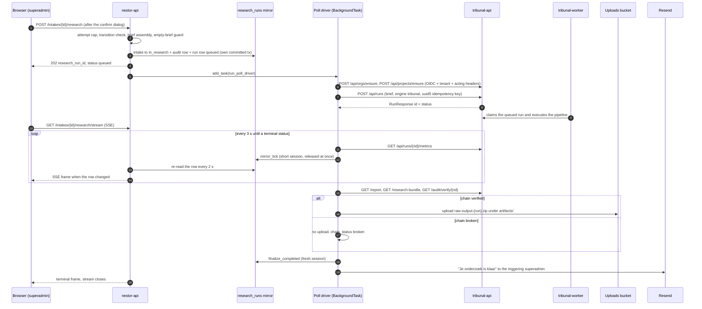
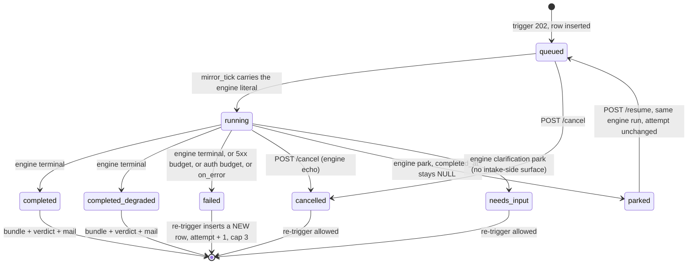
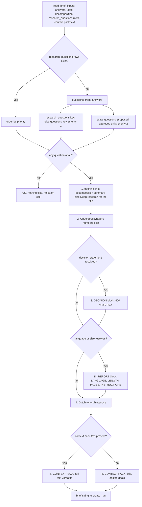

# 08 — The research seam: intake ↔ Tribunal

| | |
|---|---|
| **Audience** | Engineers changing the trigger, the poll driver, the brief or the delivery verbs; operators who want to know what "Start research" actually does; auditors tracing how a run is attributed to a human |
| **Type** | Module reference + explanation |
| **Source of truth** | `backend/app/research/tribunal_client.py`, `backend/app/research/brief.py`, `backend/app/research/run_task.py`, `backend/app/research/bundle.py`, `backend/app/research/run_status.py`, `backend/app/api/research_routes.py`, `backend/app/db/stream_session.py`, `backend/app/db/models/research_runs.py`, `backend/app/api/intake_routes.py` (deliver, replace, report), `backend/scripts/ci_no_run_research.sh` |
| **Last verified** | commit `c8b8583`, 2026-09-03 |

## 08.1 In one paragraph

The intake platform and the Tribunal research engine are two services that share one Cloud SQL
instance but never share a database session. When a superadmin presses "Start research" on a
`decomposed` intake, the intake backend composes a text brief from the validated context pack and
questions, calls the Tribunal API over authenticated HTTP, and then polls that API every three
seconds from a background task, mirroring the engine's progress into its own `research_runs` table.
The browser never talks to Tribunal; it watches the mirror row through a server-sent events (SSE)
stream. When the engine finishes, the intake side verifies the audit hash chain, packages the raw
output into a zip in Google Cloud Storage (GCS), and mails the operator. The client sees nothing
until the operator uploads a hand-made PDF and presses Deliver.

## 08.2 How it works

### 08.2.1 One run, end to end

**The trigger.** The frontend's "Start research" button opens a confirmation dialog first; the
request fires only on the dialog's confirm action (`frontend/src/components/intake/NextStepBanner.tsx:164-166`,
`:305`). The backend handler resolves the intake in scope, counts prior runs, checks the status
transition, reads the brief inputs, composes the brief, and only then writes: the intake status
flip, an audit row and the new `research_runs` row go into one short tenant session that commits
before the background task is scheduled (`backend/app/api/research_routes.py:349-373`). That
ordering is the fix for a live finding of 2026-07-21, when a driver scheduled against the request's
uncommitted transaction found no row to mirror into and the panel froze at "queued"
(`research_routes.py:334-344`).

**The driver.** `run_poll_driver` is structured through the same release contract the AI skills
use: read a plain context dict and release the connection, make every HTTP call with no connection
held, then open a fresh tenant session to write the terminal result
(`backend/app/research/run_task.py:646-681`, `:968-971`). Each poll tick writes its mirror update in
its own short session, so the pool has zero checked-out connections across the whole run
(`run_task.py:278-336`, docstring `:12-17`).

**The bridge.** The SSE handler never calls Tribunal. It re-reads the mirror row every two seconds
and emits a frame only when the dictionary changed (`research_routes.py:1198-1203`). Any Cloud Run
instance can serve a reconnecting browser because the state lives in the database, not in the
process (`backend/app/db/stream_session.py:93-100`).

**Completion.** On a success terminal the driver, still with no connection held, fetches the
report, the scrubbed per-provider research and the chain verdict, builds the zip and uploads it
(`run_task.py:559-643`). The write phase then records the verdict and mails the operator
(`run_task.py:828-856`).

### 08.2.2 What the intake side does with each run status

Every literal on the row is the engine's own value, carried verbatim. The intake side never
remaps a research status into the skill-run `succeeded`/`failed` vocabulary
(`backend/app/research/run_status.py:85-88`, model comment `backend/app/db/models/research_runs.py:79-83`).

## 08.3 Why an HTTP seam and not a shared database

The v1.1 research summary found that the two codebases had made the same design decisions under
different names: the intake backend reads the tenant from the Postgres setting `app.current_space_id`
while Tribunal reads `app.tenant_id`; both Alembic lines had revisions `0001` to `0010` with
identical ids; both declared a `worker_user` role; and Tribunal's audit hash chain is frozen, so no
payload field may be added or renamed (`.planning/research/SUMMARY.md:16`, `:82-84`). A shared
session would have let one side's GUC silently defeat the other side's row-level security (RLS).

The ruling was the two-schema topology: Tribunal keeps its own `tribunal` schema, its own Alembic
version table, its own GUC and RLS, and the intake backend is the sole caller over HTTP with no
shared session, ORM or transaction (`.planning/research/SUMMARY.md:67`; see 17 · M-03). Two
consequences follow for this chapter. First, the tenant crosses the boundary as a header that the
receiving service re-verifies, never as a database setting. Second, the intake side needs a mirror
of run state it can read cheaply, which is why `research_runs` exists at all.

The broader chain of reasoning, in the handbook's usual shape:

- **Context.** Two working systems, one GCP project, one Cloud SQL instance, a legal audit chain
  that must stay intact through the move.
- **Options.** Merge the schemas and share sessions; keep separate services but let the frontend
  call Tribunal directly; or a single audited HTTP seam from the intake backend.
- **Decision.** The single seam, with Cloud Run IAM plus in-app OIDC verification as defence in
  depth (see 17 · D-04, Phase 14) and the acting human forwarded in headers (17 · D-05, Phase 14).
- **Consequence.** Every research read the browser needs is a proxy on `nestor-api`; every write
  is a background task; and the Tribunal engine has no notion of the intake's `Identity` at all
  (`research_routes.py:1064-1068`).

## 08.4 The seam client: `tribunal_client.py`

### 08.4.1 Authentication and headers

The client mints a Google-signed OpenID Connect (OIDC) identity token from the attached service
account's Application Default Credentials, with no key file involved
(`backend/app/research/tribunal_client.py:59-66`). The audience is the Tribunal service URL without
any path suffix, because Cloud Run checks `aud` against the service URL and a path would fail
verification (`tribunal_client.py:14-17`). The URL comes from the non-secret typed setting
`tribunal_service_url`, environment variable `TRIBUNAL_SERVICE_URL` (`backend/app/core/config.py:95-107`).
A fresh token is minted on every call (`tribunal_client.py:69-77`).

Every request carries four headers (`tribunal_client.py:54-56`, `:80-85`):

| Header | Value | Purpose |
|---|---|---|
| `Authorization` | `Bearer <id_token>` | Cloud Run IAM and the in-app `InternalCallerProvider` both verify it |
| `X-Nestor-Tenant-Id` | the intake's `space_id` | The Tribunal org id is the space id (identity mapping); never a request input |
| `X-Acting-User-Id` | the superadmin's uid | Attribution of the run to a human in the audit chain |
| `X-Acting-User-Email` | the superadmin's email | Same, mapped into existing `AuthClaims` fields so the frozen payload gains nothing |

### 08.4.2 Transport rules

- Blocking `httpx`, one call per function, timeout `_TIMEOUT_S = 30.0` seconds (`tribunal_client.py:51`).
- `raise_for_status()` on every response; the client shapes no HTTP answer of its own and the
  calling route decides the mapping (`tribunal_client.py:212-216`, `:542-548`).
- No client-side retries anywhere in the module. The only retry logic in the seam lives in the
  poll driver's metrics loop (see 08.7.3).
- `engine` is pinned to the literal `"tribunal"` and `uploaded_documents` is always an empty list;
  the caller cannot choose either (`tribunal_client.py:175-177`).
- Every function is keyword-only and takes `service_url` explicitly, which keeps it testable
  without settings (`config.py:100-103`).

### 08.4.3 Every method

| Method | HTTP | Path | Body or params | Returns | Cite |
|---|---|---|---|---|---|
| `ensure_org` | POST | `/api/orgs/ensure` | `{}` | nothing; idempotent provisioning | `tribunal_client.py:88-108` |
| `ensure_project` | POST | `/api/projects/ensure` | `{}` | `project_id` string; not persisted | `:111-132` |
| `create_run` | POST | `/api/runs` | `{project_id, brief, engine: "tribunal", idempotency_key, uploaded_documents: []}` | RunResponse `{id, status, ...}` | `:146-182` |
| `resume_run` | POST | `/api/runs/{run_id}/resume` | `{}` | RunResponse; 404 for missing or cross-tenant, 409 unless exactly `parked` | `:185-225` |
| `cancel_run` | POST | `/api/runs/{run_id}/cancel` | `{}` | RunResponse; already-terminal runs come back unchanged, no 409 arm | `:228-280` |
| `get_metrics` | GET | `/api/runs/{run_id}/metrics` | none | `{status, cost_usd_total, elapsed_seconds, stages[], current_stage, stage_detail, started_at, completed_at, event_seq, park}` | `:283-306` |
| `get_report` | GET | `/api/runs/{run_id}/report` | none | `{markdown?, sections?, sources}` | `:309-331` |
| `get_research_bundle` | GET | `/api/runs/{run_id}/research-bundle` | none | `{cleaned_reports: [[name, {report}], ...]}`; rejected claims excluded engine-side | `:346-371` |
| `verify_chain` | GET | `/api/audit/verify/{run_id}` | none | `{ok: bool, broken_at: int or null}` | `:374-402` |
| `get_verification` | GET | `/api/runs/{run_id}/verification` | none | the verification report JSON | `:419-441` |
| `get_source` | GET | `/api/sources/{source_id}` | none | one citation source snapshot | `:444-466` |
| `get_audit_body` | GET | `/api/runs/{run_id}/audit/{audit_id}` | none | the already-redacted audit body, no hashes | `:469-493` |
| `get_run_events` | GET | `/api/runs/{run_id}/events` | query `after_seq` floored at 0, `limit` clamped to 1..1000, default 500 | `{run_id, events[], next_after_seq, has_more}` | `:513-516`, `:519-564` |

The idempotency key handed to `create_run` is `uuid5(UUID(intake_id), str(research_run_id))`, keyed
on the intake-side mirror row, not on the attempt number (`run_task.py:703-709`). An attempt-number
key survived row cleanup and replayed a dead engine run from an earlier cycle; a per-row key is
unique per trigger and stable across HTTP retries within one driver, which is the double-charge
protection the design wants. The metrics response fields listed above are the ones the driver reads
(`run_task.py:291-326`, `:866-874`); the fact that `verify_chain` returns `ok: true` on zero visible
rows is documented as a trap in the client itself (`tribunal_client.py:390-393`).

## 08.5 Brief assembly: `brief.py`

The brief is a plain string. The module that builds it does no HTTP and no database work; it takes
the plain dictionaries `read_brief_inputs` returns and produces text the seam posts verbatim
(`backend/app/research/brief.py:18-21`; inputs `stream_session.py:158-236`).

### 08.5.1 The assembly flow

### 08.5.2 The blocks in order

| # | Block | Content | Emitted when | Cite |
|---|---|---|---|---|
| 1 | Opening line | `decomposition.summary`, else `Deep research for {project_title}.` where the title is `project_title`, then `client_name`, then `dit intake` | always | `brief.py:663-670`, `:746-756` |
| 2 | `Onderzoeksvragen:` | `1. …`, `2. …` in ascending priority; missing priority counts as 1 | always | `:672-682`, `:730-743` |
| 3 | `[DECISION]` … `[END DECISION]` | the client's decision in one whitespace-collapsed line, at most 400 characters | only when a decision resolves; an empty block would parse as a decision made of whitespace | `:80-81`, `:194`, `:684-690` |
| 3b | `[REPORT]` … `[END REPORT]` | `LANGUAGE: Dutch/French/English`, `LENGTH: brief/comprehensive`, `PAGES: 2-5/5-10/10-20`, `INSTRUCTIONS: <one line>` | only when language or size resolves | `:111-119`, `:377-403`, `:692-696` |
| 4 | Report hint prose | Dutch sentences derived from sector and goals, or the fixed fallback | always | `:406-440`, `:698-706` |
| 5 | `[CONTEXT PACK]` | the full context-pack text verbatim, untruncated; else `title — sector — goals` | when either resolves | `:68`, `:708-725` |

The two bracketed blocks are a seam contract: the engine's `brief_input.py::parse_brief` reads
exactly these delimiter strings, so changing either side alone breaks the other
(`brief.py:70-79`, `:96-100`).

### 08.5.3 Where the validated questions come from

`validated_questions` prefers the `research_questions` database rows when any exist and otherwise
derives the list from the intake answers (`brief.py:607-616`). The answer path is the normal one in
the GCP flow, because nothing in the new stack writes the legacy table; reading only that table
once sent the engine an empty brief and parked the run as `needs_input` (`brief.py:52-60`).

Within the answers, the first non-empty key in `("research_questions", "questions")` wins, at
priority 1; `research_questions` is the operator-validated list the AI review panel writes back,
`questions` is the client's original form field (`brief.py:61`, `:582-593`). Entries of
`extra_questions_proposed` count only when `approved` is truthy, at priority 2 (`:62`, `:595-602`).
Answers live in one of two columns, so the reader takes `value_json` when present and `value`
otherwise; reading only `value` once made every list field look empty (`stream_session.py:214-220`).

### 08.5.4 Localised objects

Since 2026-08-31 the intake skill emits every authored string as a `{"nl","fr","en"}` object and
the review panel writes that object straight into the answers. A naive `str()` would dispatch a
Python dictionary repr as a paid research question. `_resolve_localized` therefore resolves in a
fixed order: a plain string passes through; then the client's chosen report-language variant; then
`nl`, the same fallback the frontend uses; then the first non-empty variant present; then the empty
string (`brief.py:237-274`). Question text and the decision answer go through it
(`:539-556`, `:507-522`); the client's own scalar answers (sector, goals) keep the historical
`str()` behaviour (`:277-298`).

### 08.5.5 Language and size

The report language is read from the radio keys `report_language`, `rapporttaal` or `report_lang`
and mapped to an English name the engine can interpolate into a prompt: `nl` to Dutch, `fr` to
French, `en` to English (`brief.py:124`, `:134`, `:331-341`). An unanswered field yields the empty
string; the module refuses to guess from the brief's dominant language, because a Dutch client who
needs an English report for an international board is exactly the case a guess would get wrong
(`:333-338`).

The report size is read from `output_size`, `rapportomvang` or `report_size` and mapped by
`_OUTPUT_SIZE_SPEC` (`:125`, `:159-163`):

| Answer | `LENGTH` | `PAGES` |
|---|---|---|
| `compact` | `brief` | `2-5` |
| `standard` | none, on purpose | `5-10` |
| `extended` | `comprehensive` | `10-20` |
| other, with free text | none | none; the text goes to `INSTRUCTIONS` verbatim, collapsed to one line |

The operator ruled on 2026-08-06 that both the keyword and the page range must be sent, because a
page target is something a writer can visibly miss and an adjective is not (`:149-158`). A test
asserts the page ranges against the template's own option labels in all three locales so the number
the client reads and the number the writer receives cannot drift apart
(`backend/tests/test_research_brief.py:343`). Radio answers that allow free text are stored as
`{"choice", "text"}`, which is why `_radio_answer` exists: without it the dictionary would stringify
into a truthy string that matches no spec key and the answer would silently read as unset
(`brief.py:301-328`).

Why a parsed block and not more prose: `mission_brief["language"]` is a structured value read by the
engine's language directive and its dispatch sentence, and neither can read a sentence. Measured on
run `368ff3a0`, all five dispatch assignments carried the fallback wording because the value was
empty, and the strong "write everything in {lang}" directive had never fired in production
(`brief.py:102-110`; `.planning/STATE.md` row `260806-lvt`).

### 08.5.6 The decision statement

The Tribunal tournament ranks candidate sub-questions by how much they matter to a decision. On run
`d6bb3aae` there was no decision block and the engine fell back to the brief's opening line, so
every tournament prompt judged materiality against the project title "Deep research for moetest."
(`brief.py:70-79`, `:468-474`). `derive_decision_statement` resolves, most specific first
(`:463-536`):

1. The context pack's section 3 line "Wat moet beslist worden:" (regex tolerant of bullets,
   emphasis and the English label, `:171-176`), rejecting the pack's own placeholders
   `concreet`, `nog in te vullen`, `tbd` and empty (`:182`, `:443-460`).
2. The intake's own decision answer under `decision_or_goal`, `decision`, `beslissing`,
   `beslisvraag` or `doel_beslissing`, resolved through the localised reader (`:88-94`, `:514-522`).
3. The decomposition summary, unless it starts with `deep research for `, which is the title
   fallback and would recreate the defect one layer earlier (`:188`, `:524-531`).
4. Nothing. The engine then names the absence as a degradation reason (`:495-497`).

The result is whitespace-collapsed and clamped to 400 characters, the same clamp the engine applies,
so neither side truncates the other mid-sentence (`:190-194`, `:534`).

### 08.5.7 The Dutch report hint

`derive_report_hint` keeps producing prose beside the parsed block because it carries structuring
hints the block does not model (`brief.py:698-704`): a sector, industry, market, markt or branche
answer yields "Structureer het rapport per marktsegment / sector."; a goals answer yields
"Behandel expliciet: {goals} als aparte secties."; when either fired, "Gewenste lengte: uitgebreid."
if more than eight questions, else "standaard." (`:44`, `:47`, `:50`, `:426-437`). A thin intake
gets the fixed fallback "Standaard lengte, kerntabellen, alle onderzoeksvragen behandeld." (`:41`,
`:439-440`).

### 08.5.8 Why the interactive gates never fire

Tribunal has two pause gates. The interactive-report gate opens only when the brief carries the
literal `[INTERACTIVE_REPORT]` or the caller hits `/report-spec`. The composition gate fires on a
vague brief with no concrete questions. Phase 16 ruled both obsolete for seam runs: the validated
context pack is the answered brief, and the report spec is derived from intake answers with a fixed
fallback (see 17 · D-01 and D-01b, Phase 16). The module makes that structural rather than
procedural: `INTERACTIVE_REPORT_MARKER` is a constant that exists only so a test can assert its
absence and is never concatenated into any string (`brief.py:34-37`, `:652-655`; the test at
`backend/tests/test_research_brief.py:59`, `:336`); `/report-spec` has no client method at all; and
the enumerated question list under `Onderzoeksvragen:` keeps the brief non-vague (`brief.py:13-16`).
Since quick task 260721-twy the engine's intake stage is a delegator that never re-judges an
operator-validated brief, which is why the full context pack is folded in untruncated
(`brief.py:64-67`, `:708-713`).

## 08.6 Trigger rules: `research_routes.py`

### 08.6.1 The trigger verb

`POST /intakes/{intake_id}/research` returns 202 (`research_routes.py:248`). The handler checks in
this order:

| Step | Rule | Outcome | Cite |
|---|---|---|---|
| 1 | intake not in scope | 404 "Intake not found" | `:272-274` |
| 2 | prior runs `>= 3` | 202 with `{"research_run_id": null, "status": "needs_investigation", "attempts": n}`; no status flip, no seam call, no driver | `:139`, `:277-291` |
| 3 | intake already `in_research` | allowed only when the latest run's status is in `{failed, cancelled, needs_input}`; else 409 "Research is already running for this intake" | `:135`, `:293-303` |
| 4 | any other status | must be `decomposed`, the only key of the transition map; else 409 "Cannot start research for an intake in status …" | `:121`, `:142-150`, `:305` |
| 5 | brief inputs | read in scope as plain dicts; the brief is composed before any write so a read failure never half-transitions the intake | `:308-312` |
| 6 | zero validated questions | 422 "Intake has no validated research questions" before any flip or seam call | `:314-325` |
| 7 | write | intake patched to `in_research`, audit `intake.status_changed {from,to}`, run row `{intake_id, status: "queued", attempt: n+1}`; superadmin writes via `create_in_space` into the intake's own space | `:349-367` |
| 8 | schedule | `run_poll_driver(identity, intake_id, research_run_id, brief, attempt)` | `:371-373` |

Observed as written: the trigger handler depends on `get_current_identity` and `get_tenant_repo`
only; there is no superadmin gate on this verb. Any authenticated caller whose scope contains the
intake can start a run (`research_routes.py:248-254`). The other research verbs below carry the
gate.

`parked` is deliberately absent from the retryable set. A parked run has its own Resume verb, and
letting a re-trigger supersede it would discard every checkpoint the engine already paid for
(`:132-134`). `needs_input` is retryable because the intake side has no surface for it: a re-trigger
with a repaired brief supersedes the parked engine run, which stays parked and consumes nothing
(`:123-130`). The frontend's fresh-attempt button is enumerated to exactly the same three states
(`frontend/src/components/research/RunActions.tsx:106-109`).

### 08.6.2 The superadmin gate and its ordering trick

`_superadmin_gate` is a dependency that raises 404 "Intake not found" for any non-superadmin, never
403 (`research_routes.py:153-168`). It is declared before `get_tenant_repo` in every signature that
uses it so it resolves first: a user with no space would otherwise hit the repository's null-space
403, which would confirm that the endpoint exists. The denial suite pins exactly 404
(`:156-159`). Each gated handler repeats the role check in its body as defence in depth
(`:418-419`, `:570-571`, `:758-759`).

The `locate` route is declared first in the module because its second path segment is the literal
`research` where every other route has `{intake_id}`; the ordering is asserted by a test rather than
left to inspection (`:171-188`).

### 08.6.3 Resume

`POST /intakes/{intake_id}/research/resume` is superadmin-only and re-queues the same engine run so
its checkpoints are reused (`research_routes.py:383-414`). Arms: 404 for a non-superadmin, missing
intake, no run, or a run with no `tribunal_run_id` (`:418-439`); 409 "Research is not paused for
this intake" unless the latest run is exactly `parked` (`:428-431`); the seam call runs outside any
session and maps 404 to 404, 409 to 409, anything else including transport failure to 502
(`:460-484`). On success the row is patched to `queued` with `error_message` and `completed_at`
cleared, audited as `research.resumed {from: parked, to: queued}`, and a fresh driver is scheduled
with `run.attempt` unchanged; the attempt cap is not consulted because a checkpoint resume re-charges
nothing (`:499-517`). The brief is recomposed only because the driver requires the argument; the
unchanged idempotency key makes `create_run` return the existing run (`:441-446`).

### 08.6.4 Cancel

`POST /intakes/{intake_id}/research/cancel` is the operator's only stop path. Pausing the worker
service is not cancelling: on 2026-07-27 the in-flight process ran sixteen more minutes and the
replacement worker was about to re-claim the run at full cost (`research_routes.py:535-541`;
`tribunal_client.py:244-247`). The verb echoes whatever status the engine reports; an already
terminal run comes back unchanged and the route records no patch and no audit for it
(`:619-654`). When the status did change, the row is patched with `completed_at = func.now()` and
audited as `research.cancelled {from,to}` in one committed session (`:625-643`). There is no 409
arm and no attempt cap: stopping a run is not an attempt (`:555-558`). The intake status is not
touched; because `cancelled` is in the retryable set, resolving the row is what makes the intake
re-triggerable (`:560-565`). No driver is scheduled; `cancelled` is terminal, so any running driver
exits on its next tick and the stream closes on the same frame (`:656-658`).

## 08.7 The poll driver: `run_task.py`

### 08.7.1 Read phase

`load_trigger_context` returns a plain dictionary and nothing that could detach: the intake's own
`space_id` (a superadmin has no space of their own, so the seam headers and the mirror must carry
the intake's), `acting_user_id`, `acting_email`, `project_title` (client name or "dit intake"),
`intake_id`, `service_url` and `app_base_url` (`run_task.py:250-275`). A cross-tenant or missing
intake raises before any seam call (`:261-263`).

### 08.7.2 Call phase: the loop

`ensure_org`, `ensure_project`, then `create_run` with the uuid5 key (`run_task.py:700-715`). Then,
with no database connection held (`:727`):

| Item | Value | Cite |
|---|---|---|
| Cadence | `POLL_SECONDS = 3.0` between `get_metrics` calls | `:89`, `:811` |
| Per tick | `mirror_tick` writes the row in its own short session | `:788` |
| Exit | status in `RESEARCH_TERMINAL = {completed, completed_degraded, failed, cancelled, parked}` | `run_status.py:60`, `run_task.py:789` |
| On a success terminal | `build_completion` runs here, still connection-free | `:807-809` |

### 08.7.3 Retry budgets

| Response from `get_metrics` | Budget | Then | Cite |
|---|---|---|---|
| any 5xx | up to `_MAX_METRICS_5XX_RETRIES = 3` consecutive, 3 s apart | failed with "metrics 5xx after 3 retries" | `:93`, `:735-750` |
| 401 or 403 exactly | up to `_MAX_METRICS_AUTH_RETRIES = 200` consecutive, 3 s apart, 600 s in total | failed with "metrics auth … persisted for 600s (200 retries)" | `:103`, `:123`, `:129`, `:751-783` |
| any other 4xx | none; raised on first sight | `on_error` finalises failed | `:784-786` |

The two budgets are deliberately separate because the failures have different shapes. A 5xx is a
blip. A 401 at Cloud Run's edge is a revision rollout, a slow planned event: on 2026-07-28 the seam
answered 401 at 08:25:08 and 200 at 08:33:14, an outage of at least eight minutes, and the driver of
the day gave up on the first 401 and marked a healthy, still-spending run as failed
(`:105-122`, `.planning/STATE.md` row `260728-ftv`). The set must not be widened: a test asserts a
404 is fatal on the first occurrence (`backend/tests/test_research_run_task.py:1210`).

### 08.7.4 `mirror_tick`

Each tick patches the mirror row with (`run_task.py:278-336`):

| Field | Rule |
|---|---|
| `tribunal_run_id` | always |
| `status` | always, verbatim |
| `current_stage`, `stage_detail`, `cost_usd_total` | only when present in the metrics |
| `started_at`, `completed_at` | only when present and parseable as ISO-8601; a malformed value logs a warning and patches nothing (`:132-173`, `:310-314`) |
| `event_seq` | only when a non-negative integer; a bool, a negative or an unparseable value is ignored so a cursor can never rewind a live feed (`:176-224`, `:227-237`, `:326`) |

A patch that matches zero rows logs an error on every tick, because the visible symptom is a panel
frozen at "queued" (`:330-336`). The cursor moving is by itself a new SSE frame, since the handler
compares whole dictionaries (`:315-323`).

### 08.7.5 Write phase: terminal handling

| Terminal | Writer | Row values | Mail | Cite |
|---|---|---|---|---|
| `completed` or `completed_degraded` | `finalize_completed` | status verbatim, `current_stage`, `cost_usd_total`, `output_markdown = report.markdown`, `chain_status`, `chain_broken_at`, `bundle_key`, `completed_at` from the engine or `func.now()`, `started_at` when present, cursor | `render_research_complete`, subject "Je onderzoek is klaar", sent on both a verified and a broken chain | `:339-396`, `:828-856` |
| `parked` | `finalize_parked` | `status = parked`, `error_message = "[park#<seq>] <reason>"` clamped to 1000 chars, `current_stage`, `cost_usd_total`, `completed_at = NULL` on purpose, cursor | `render_research_parked`, subject "Je onderzoek staat op pauze", only when not already notified for this park sequence | `:456-513`, `:857-931` |
| `failed` or `cancelled` | `finalize_failed` | status verbatim clamped to `{failed, cancelled, parked}` else `failed`, `error_message`, `completed_at`, `started_at` when present, cursor | `render_research_failed`, subject "Je onderzoek is mislukt" | `:399-453`, `:932-946` |
| any exception | `on_error` then `finalize_failed(metrics=None)` | `status = failed`, `error_message = str(exc)` | best-effort failed mail, swallowed on failure | `:948-966` |

Every mail goes to one recipient, the triggering superadmin's `acting_email` (`:821`), with the admin
intake page as the call to action and no token in the link (`:983-986`). The completion mail carries
the duration in whole minutes from `elapsed_seconds` and the cost total (`:845-851`, `:989-997`).
The renderers are called without a locale argument, so their default `nl` applies and the subjects
are hardcoded Dutch: research notification mails are Dutch-only regardless of the recipient's
locale (`:845-856`, `:913-923`, `:936-946`; `backend/app/mail/render.py:172-260`).

The park-mail idempotency marker works as follows. The engine keeps the same `seq` for a re-park with
the same signature and increments it for a genuinely different park. Before overwriting the row,
the writer reads the prior row; if it is already `parked` and its `error_message` starts with the
same `[park#seq]` marker, the operator was already told and the mail is skipped with a visible
warning (`:876-902`, `:924-931`). A failed prior-row read defaults to "not notified", because a
duplicate mail is a nuisance and a dropped one is the operator's only signal (`:888-896`).

The identity that drives the write helpers is stashed in a module-level slot, `_ACTIVE_IDENTITY`,
set at the start of every driver, because the release contract hands the write function only the
session, the context and the result (`:539-549`, `:680-681`). The `parked` terminal is a deliberate
deviation: a driver is a background task and a parked run waits on a human click that may be hours
away, so the driver and the stream stop while the run does not end (`run_status.py:17-32`).

## 08.8 The completion path

`build_completion` runs at the tail of the call phase, with no connection held
(`run_task.py:559-643`):

1. `get_report`, then `get_research_bundle`, then `verify_chain` (`:595-597`).
2. If `ok`: build the zip, upload it with content type `application/zip` under
   `build_object_key(space_id, intake_id, "artifacts", f"raw-output-{research_run_id}.zip")`, and
   return `chain_status = "verified"` plus the key (`:606-632`). The key builder prefixes a uuid4,
   so the object is `{space_id}/{intake_id}/artifacts/{uuid4}-raw-output-{run}.zip`
   (`backend/app/storage/keys.py:90-104`). This is the uploads bucket, not the seven-year audit
   bucket (see 17 · D-05, Phase 17).
3. If not `ok`: build nothing, upload nothing, return `chain_status = "broken"` and `broken_at`,
   and log an error. The run still records as completed, but locked (`:633-641`; see 17 · D-06,
   Phase 17).

The zip layout is fixed by `build_bundle_zip` (`backend/app/research/bundle.py:44-80`):

| Entry | Content |
|---|---|
| `report.md` | `report["markdown"]` or the empty string |
| `research/<sanitize_filename(name)>.md` | one per `cleaned_reports` pair; names are engine-derived and go through the shared sanitiser |
| `sources.json` | `json.dumps(sources, ensure_ascii=False, indent=2)` |

The builder has no rejected-claims argument at all, so the discredited-content ledger is
structurally absent from the zip (`bundle.py:17-20`, `:62-63`; see 17 · D-01, Phase 17).

**Lazy rebuild.** When a verified run carries `bundle_key IS NULL` (a driver that died after the
finalise but before the build, or a pre-Phase-17 row), the download route rebuilds and uploads the
bundle on demand and patches the key in a fresh session (`research_routes.py:679-729`, `:777-780`).
That path falls back to the persisted `output_markdown` when the live report lacks `markdown`
(`:708-712`).

**Download.** `GET /intakes/{intake_id}/research/{run_id}/bundle-url` mints a signed URL with a 300
second time to live, clamped by the storage seam to at most 900, forced attachment disposition
(`research_routes.py:782-789`; `backend/app/storage/gcs.py:42-53`, `:83-122`). It answers 409 "Raw
output is not available" unless the status is a success and `chain_status == "verified"`; a
`completed_degraded` run is downloadable, a broken-chain degraded run is not (`:769-775`).

**Re-verify.** `POST /intakes/{intake_id}/research/{run_id}/verify-chain` re-runs `verify_chain`
outside any session, patches `chain_status` and `chain_broken_at`, audits
`research.chain_reverified`, and returns the new status. It lifts the lock but does not rebuild the
bundle; the next download click does (`research_routes.py:792-856`; see 17 · D-08, Phase 17).

## 08.9 The proxied superadmin read endpoints

The frontend never calls Tribunal. Five read routes on `nestor-api` proxy the engine and return its
JSON verbatim, reshaping nothing so a field the engine adds later reaches the page without a change
here (`research_routes.py:859-873`, `:1070-1074`). All share the same walls: `_superadmin_gate`, an
in-body role re-check, a scoped intake 404, a run-scope 404 when `run.intake_id` differs from the
path, a 404 when the run has no `tribunal_run_id` (the seam URL would read `/api/runs/None/...`),
a seam 404 mapped to 404, and every other seam or transport failure mapped to 502, never an
unhandled 500.

| Route | Proxies | Extra rule | Cite |
|---|---|---|---|
| `GET /intakes/research/runs/{run_id}/locate` | nothing; resolves a run to `{intake_id, research_run_id}` from the mirror | second, space-scoped resolve of the run's own intake is the tenant wall; returns no run state on purpose | `:190-245` |
| `GET /intakes/{id}/research/{run_id}/verification` | `get_verification` | | `:876-928` |
| `GET /intakes/{id}/research/sources/{source_id}` | `get_source` | no run-scope check; the source id is scoped by the tenant header at the engine | `:931-972` |
| `GET /intakes/{id}/research/{run_id}/audit/{audit_id}` | `get_audit_body` | | `:975-1025` |
| `GET /intakes/{id}/research/{run_id}/events?after_seq=0&limit=500` | `get_run_events` | typed query parameters; a non-integer is a 422 before the body runs | `:1028-1120` |

The events proxy is the backfill read: the SSE stream carries only what happens while somebody is
watching, and this is what makes closing and reopening the run page show true history
(`:1039-1045`). The role and null-space arms live here and nowhere else, because the engine has no
`Identity` to check them with (`:1064-1068`).

## 08.10 The research SSE bridge

`GET /intakes/{intake_id}/research/stream` is the one `async def` in the router
(`research_routes.py:1148-1153`). Before the stream opens, a scope check in the threadpool answers
403 "No space — not authorized" for a null-space user and 404 for a cross-tenant or missing intake
(`:1171-1177`). Then:

| Knob | Value | Cite |
|---|---|---|
| tick | `TICK_SECONDS = 2.0`, one indexed select per tick | `:1128`, `:1195` |
| heartbeat | `: ping` comment when no frame for 15 s; any frame resets the clock | `:1129`, `:1204-1211` |
| cap | `MAX_STREAM_SECONDS = 600` | `:1130`, `:1193` |
| headers | `Cache-Control: no-cache`, `Connection: keep-alive`, `X-Accel-Buffering: no` | `:1136-1140` |
| frame | `data: {json}\n\n`, or `data: null` when the intake has no run yet | `:1143-1145`, `:1182-1186` |
| emit rule | snapshot at connect, then only when the dictionary differs from the last sent | `:1201-1203` |
| close | on a status in `RESEARCH_TERMINAL` (which includes `parked`), on client disconnect, or at the cap | `:1188-1194`, `:1207-1208` |

The frame is produced by `read_latest_research_run_dict` and carries: `id`, `status`,
`current_stage`, `stage_detail`, `cost_usd_total` (stringified), `started_at`, `completed_at`,
`error_message`, `chain_status`, `chain_broken_at`, `bundle_key` and `event_seq`
(`backend/app/db/stream_session.py:132-149`). The frame carries the cursor, never the events: a
thousand-row history would otherwise be re-sent in full on every change, and a second copy of the
run's history on the frame would be a second source of truth for whether the run ended
(`stream_session.py:116-122`). The page fetches only the delta past its cursor from the events
proxy.

## 08.11 The intake-side mirror: `research_runs`

Listed here from this chapter's perspective; the schema chapter owns the definitions
([see 05 — Data model](05-data-model.md)). Columns and who writes them
(`backend/app/db/models/research_runs.py:63-141`):

| Column | Written by |
|---|---|
| `id`, `space_id`, `intake_id`, `attempt`, `created_at` | the trigger, in the committed session |
| `status` | trigger (`queued`), every tick, every finaliser, resume, cancel |
| `tribunal_run_id` | first tick after `create_run` |
| `current_stage`, `stage_detail`, `cost_usd_total` | every tick, the completed and parked finalisers |
| `started_at`, `completed_at` | ticks when present; finalisers; cancel stamps `completed_at`; parked leaves it NULL; resume clears it |
| `error_message` | failed and parked finalisers; resume clears it |
| `output_markdown` | the completed finaliser |
| `chain_status`, `chain_broken_at`, `bundle_key` | the completed finaliser, re-verify, the lazy rebuild |
| `event_seq` | every tick and all three finalisers, present-only |

Migrations 0011 (table), 0012 (chain columns) and 0013 (`event_seq`) are additive; the row is
FORCE-RLS space-isolated from day one (`research_runs.py:1-11`, `:28-38`).

## 08.12 Delivery: the human report

Run completion never delivers. The generated report is the operator's working material; the client
receives a hand-crafted PDF (see 17 · M-04 and D-01, Phase 18). The verbs live in
`backend/app/api/intake_routes.py`:

| Verb | Rule | Effect | Cite |
|---|---|---|---|
| upload | `POST /intakes/{id}/storage/uploads` with category `reports` only stages the file; nothing is client-visible and the status stays `in_research` | object under `{space}/{intake}/reports/` | `backend/app/api/storage_routes.py:135-219` |
| `POST /intakes/{id}/deliver` | 409 unless status is exactly `in_research`, the sole `in_research → delivered` transition; 422 "Report must be a PDF" unless the key ends in `.pdf`; 404 "Object not found" unless the key starts with `{space_id}/{intake_id}/reports/` | artifact row `artifact_type="report"`, `source="human-report"`, `mime_type="application/pdf"`; intake patched to `delivered` with `final_report_artifact_id`; audit; results-family mail to the chosen members with the `/intake/{id}/report` call to action, `results_link_sent_at` stamped only after a 2xx | `intake_routes.py:1249`, `:1417-1433`, `:1448-1455`, `:1517-1580` |
| `POST /intakes/{id}/report/replace` | 409 unless status is exactly `delivered`; same PDF and prefix asserts | new artifact row, `final_report_artifact_id` repointed, the old row and object kept; audit `report.replaced`; optional re-send when `recipients` is non-empty | `:1590-1643` |
| `GET /intakes/{id}/report` | 404 "Report not found" unless status equals `delivered` and `final_report_artifact_id` is set and the artifact exists | `{filename, delivered_at, byte_size, mime_type, storage_path}`; `delivered_at` mirrors `results_link_sent_at` | `:1652-1692` |

`delivered` is one-way: there is no un-deliver verb, and a retraction is a manual intervention
(see 17 · D-06, Phase 18). The client's download goes through the signed-URL route whose prefix
assert walls forged keys (`storage_routes.py:256-259`). During `in_research` the client-facing UI
shows exactly what it showed before the run started (see 17 · D-08, Phase 16).

## 08.13 The scope guard

The v1.0 ceiling said the deep-research stage must be unreachable from the intake tier. v1.1
supersedes that on purpose, and the guard was narrowed rather than retired: the intake tier must not
perform research egress itself. `backend/scripts/ci_no_run_research.sh` scans `backend/app` and
`frontend/src` for `invoke(…run-research|run_research|tribunal)`, `/run-research`, `run_research(`,
`.run_research`, the legacy triggers `tg_bump_to_in_research`, `tg_bump_to_delivered` and
`persist_questions_on_research_start`, any Python import whose module name ends in `tribunal`,
`SERPAPI_API_KEY`, `serpapi.com`, `serpapi` imports and `google-search-results`
(`ci_no_run_research.sh:72`). The allowlist admits exactly the import forms of
`app.research.tribunal_client`, anchored to import syntax so it can never whitelist a call site
(`:80`, `:46-55`). `backend/tests/test_scope_guard_run_research.py` runs the script and plants an
offender to prove it fails (`:54-86`).

## 08.14 Why it is built this way

- **Separate services, one seam.** Context: two working codebases with colliding migration ids and
  GUC names. Decision: two schemas, HTTP only, intake backend as sole caller (17 · M-03).
  Consequence: every browser read is a proxy, every run write is a background task, and the engine
  never sees an intake identity.
- **Keyless OIDC with the service URL as audience, plus in-app verification.** Context: Cloud Run
  IAM alone would let a mis-set binding open every tenant. Decision: defence in depth (17 · D-04,
  Phase 14). Consequence: the tenant header is accepted only after the token's audience and caller
  are checked; there is no secret anywhere in the seam (`tribunal_client.py:8-12`).
- **The human in the headers.** Context: the audit chain is legally load-bearing and its payload is
  frozen. Decision: forward the acting superadmin's id and email into existing claim fields
  (17 · D-05, Phase 14). Consequence: each run is attributed to a person without a hash-chain break.
- **A brief, not an API of parameters.** Context: the engine takes a text brief and parses two
  delimited blocks. Decision: express the decision and the report shape as parsed blocks and keep
  the structuring hints as prose (`brief.py:102-110`, `:698-704`). Consequence: the language
  directive can fire, the page target is visible to the writer, and old intakes still produce the
  default report.
- **Gates by composition, not by flag.** Context: two pause gates that would 500 a poll or strand
  a run. Decision: never emit the marker, never call `/report-spec`, always enumerate the questions
  (17 · D-01, D-01b, Phase 16). Consequence: `needs_report_spec` is unreachable from this seam and
  the empty-brief 422 guards the composition gate.
- **Poll and mirror, not push.** Context: a run lasts many minutes and Cloud Run instances are
  stateless. Decision: a background driver polls and mirrors; the browser reads the mirror over SSE
  (builder discretion under 17 · D-07, Phase 16, following the Phase 8 DB-backed SSE pattern).
  Consequence: no connection is held across the run and any instance can serve the stream.
- **Three attempts, then a human.** Context: a runaway re-trigger would re-charge the engine.
  Decision: cap at three full restarts; resume is free and cancel is not an attempt (17 · D-04,
  Phase 16; the F-01/F-02 rulings of plan 15.2-19 in `research_routes.py:410-413`). Consequence: a
  fourth trigger returns `needs_investigation` and makes no seam call.
- **Verified chain or locked.** Context: EU AI Act Article 12 posture. Decision: a broken chain
  keeps the run but blocks the download until a re-verify passes (17 · D-06, D-08, Phase 17).
  Consequence: completed research is never thrown away and nothing leaves on a broken chain.
- **Human delivery.** Context: the generated report is not the client deliverable. Decision:
  staged upload, explicit Deliver, PDF only, one-way (17 · D-01, D-06, D-10, Phase 18).
  Consequence: the transition from `in_research` to `delivered` has one path, and the client read is gated on the exact
  status.

## 08.15 Known gaps and traps

- ⛔ **No deployed engine code has executed a seam run since the 2026-08-05 deploy.** The `[REPORT]`
  block (2026-08-06), the localised-object resolution (2026-08-31) and the model moves of
  2026-09-01 have all been unit-tested and never observed on a live run. Nothing in this chapter
  after the 2026-07-28 incident is a live observation.
- **The trigger verb has no superadmin gate.** Any authenticated caller with the intake in scope
  can start a paid run (`research_routes.py:248-254`). Resume, cancel, download, re-verify and all
  proxies are gated. State as observed; no ruling recorded either way.
- **Research mails are Dutch only.** The three research templates exist in nl, fr and en, but the
  driver never passes a locale and the subjects are hardcoded Dutch (`run_task.py:845-856`,
  `:913-923`, `:936-946`).
- ⚠ **`needs_input` is not in the terminal set.** If the engine ever reports it, the driver loop
  does not break (`run_status.py:60`, `run_task.py:789`) and the stream runs to its ten-minute cap,
  while the frontend treats it as terminal (`RunActions.tsx:103`). Phase 16 D-01 and the empty-brief
  422 are what keep this path unreachable; nothing enforces it at the loop.
- **Two stale docstrings.** `run_task.py:43-45` still says the idempotency key is
  `uuid5(intake_id, "attempt-n")`; the code keys on the mirror row id (`:703-709`).
  `tribunal_client.py:29-32` still scopes the module to `ensure_org`/`ensure_project`; it now has
  thirteen methods. Trust the code.
- ⚠ **`report.md` can be empty on the normal completion path.** The code records that the live
  report endpoint returns `sections`, not `markdown` (`run_task.py:574-576`). `build_completion`'s
  fallback re-reads the same missing key (`:610-612`), so the zip built at completion holds an empty
  `report.md` whenever the seam sends no `markdown`; only the lazy rebuild falls back to the
  persisted `output_markdown` (`research_routes.py:708-712`), and that column is filled from the same
  key (`run_task.py:385`). Not verified against a live response in this chapter.
- **`_ACTIVE_IDENTITY` is a module global** (`run_task.py:542`). Two drivers on one instance
  overwrite each other's slot; the write helpers use whichever identity is current. Both are
  superadmin identities in practice and the row is reached by id under the superadmin bypass
  (`:516-524`), so the patch lands, but the attribution of a finalise write is not guaranteed per
  driver.
- **`verify_chain` returns `ok: true` on zero visible rows.** The verdict is meaningful only with
  the correct tenant header, which `_headers` sends; a bare `ok` is not proof (`tribunal_client.py:390-393`).
- **The scope-guard tests and the research router disagree on paper.** `test_scope_guard_ai.py`
  and `test_no_run_research_route.py` assert that no mounted route path contains `research`, while
  `research_router` mounts eleven such paths. Both tests import-or-skip on `firebase_admin` and
  `app.main`. Whether they fail or skip in Cloud Build was not verified here; see the backend
  chapter's test inventory ([see 06 — Backend intake API](06-backend-intake-api.md)).
- **Budget governor inert.** `NESTOR_TRIBUNAL_UNCAPPED=1` stays on by operator ruling (17 · D-02,
  Phase 16; re-confirmed 2026-09-01). The seam has no cost check of its own; the only spend control
  is the attempt cap and the engine's question caps.
- **Phase 24 is planned, not built.** Re-running a completed run, the separate deliberate re-run
  counter, the typed confirmation with no cost quoted, the steering note injected once in a
  delimited block, and a version-history read path are all rulings only (17 · D-RR-1, D-RR-2,
  D-RR-3, D-RR-3a; `.planning/STAKEHOLDER-NOTES.md:159-220`). Today the fresh-attempt affordance is
  enumerated to `failed`, `cancelled` and `needs_input` (`RunActions.tsx:106-109`) and
  `locateResearchRun` returns one run and no state.
- **The 401/403 budget is sized from one incident.** Ten minutes covers the one observed window
  (at least 8 m 06 s, true length unknown because the driver stopped sampling). ⚠ n=1
  (`run_task.py:112-117`).
- **The confirm dialog quotes no figure.** By standing ruling, the research-start banner warns
  that the run is paid and names the providers, with no dollar amount (17 · rulings 2026-08-13 and
  2026-08-31).

## 08.16 Where to look

| Path | Responsibility |
|---|---|
| `backend/app/research/tribunal_client.py` | OIDC minting, the four headers, the thirteen seam methods, no retries |
| `backend/app/research/brief.py` | Pure brief assembly: question sources, localised resolution, decision statement, `[REPORT]` block, hint prose, context pack |
| `backend/app/research/run_task.py` | The poll driver: read/call/write phases, retry budgets, `mirror_tick`, the three finalisers, mails, `build_completion` |
| `backend/app/research/bundle.py` | The zip layout, no rejected-claims argument |
| `backend/app/research/run_status.py` | `RESEARCH_SUCCESS`, `RESEARCH_TERMINAL`, the three predicates |
| `backend/app/api/research_routes.py` | Trigger, resume, cancel, bundle URL, re-verify, five read proxies, the SSE stream, the superadmin gate |
| `backend/app/db/stream_session.py` | `read_latest_research_run_dict` (the SSE frame), `read_brief_inputs` (the brief's inputs), `check_intake_in_scope` |
| `backend/app/db/models/research_runs.py` | The mirror table and its column semantics |
| `backend/app/api/intake_routes.py` | `deliver`, `report/replace`, `report`, `_assert_report_key`, `_DELIVER_TRANSITIONS` |
| `backend/app/storage/keys.py`, `backend/app/storage/gcs.py` | Key scheme (`artifacts`, `reports`), signed URLs, TTL clamp |
| `backend/app/mail/render.py`, `backend/app/mail/templates/*/research_*.html.j2` | The three research mails |
| `backend/app/core/config.py:95-107` | `tribunal_service_url` |
| `backend/scripts/ci_no_run_research.sh` | The narrowed scope guard and its allowlist |
| `backend/tests/test_tribunal_client.py`, `test_research_brief.py`, `test_research_run_task.py`, `test_research_routes.py`, `test_research_bundle.py`, `test_research_bundle_download.py`, `test_research_events_proxy.py`, `test_research_event_cursor.py`, `test_research_cross_tenant.py`, `test_tribunal_seam_denial.py`, `test_report_delivery.py`, `test_scope_guard_run_research.py` | The seam's test surface |
| `frontend/src/lib/api/research.ts` | The frontend calls: `triggerResearch`, `resumeResearch`, `cancelResearch`, `getBundleUrl`, `getVerification`, `getAuditBody`, `getSource`, `getRunEvents`, `locateResearchRun`, `reVerifyChain`, `openResearchStream` |
| `frontend/src/components/intake/NextStepBanner.tsx:164-166` | The confirm dialog before the trigger |
| `frontend/src/components/research/RunActions.tsx` | Resume, cancel, fresh-attempt and download affordances |
| `.planning/phases/14-*/14-CONTEXT.md`, `16-*/16-CONTEXT.md`, `17-*/17-CONTEXT.md`, `18-*/18-CONTEXT.md` | The decision blocks behind this chapter |
| `.planning/research/SUMMARY.md` | The two-schema and HTTP-seam rationale, Pitfalls 1 and 2 |
| `.planning/STATE.md` rows `260728-ftv`, `260806-lvt` | The 401/403 budget and the language/size wiring |
| `.planning/STAKEHOLDER-NOTES.md` § 2026-08-13 | The Phase 24 re-run rulings |
