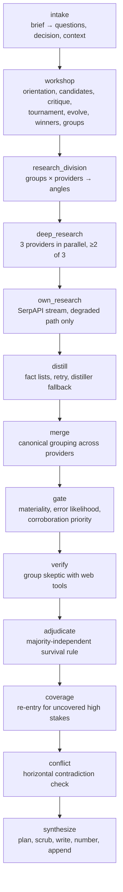
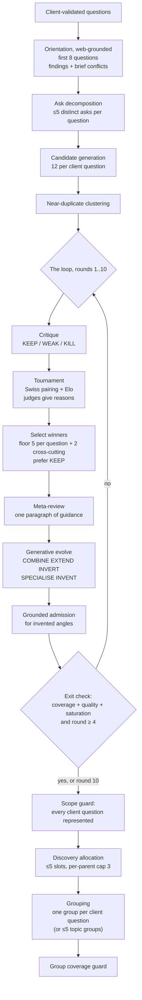

# 10 — Tribunal: the research pipeline

| | |
|---|---|
| **Audience** | Engineers changing the engine's behaviour; operators who want to know what each stage of a run is doing |
| **Type** | Explanation with Reference |
| **Source of truth** | `tribunal/nestor_pulse_sdk/pipeline/tribunal/*` (notably `pipeline.py`, `intake.py`, `brief_input.py`, `workshop*.py`, `question_grouping.py`, `discovery_bracket.py`, `research_division.py`, `facts.py`, `gates.py`, `grouping.py`, `group_skeptic.py`, `skeptic.py`, `adjudicate.py`, `coverage_gate.py`, `reliability.py`, `budget.py`, `report_planner.py`, `pii.py`), `pipeline/synthesis/steps.py`, `pipeline/deep_researchers/degraded_parallel.py`, `runs/stages.py`, `verification/report.py` |
| **Last verified** | commit `c8b8583`, 2026-09-03 |

Paths in this chapter are relative to `tribunal/nestor_pulse_sdk/pipeline/tribunal/` unless
otherwise shown. Chapter 09 covers the service around this pipeline; chapter 11 collects every model
and its cost.

## 10.1 In one paragraph

A run is thirteen declared stages. The first three cost almost nothing and decide everything: the
brief is split into the client's questions and their decision, a **question workshop** turns each
question into a ranked set of sharper sub-questions over up to ten rounds of critique, tournament
and generative evolution, and the winners are grouped for dispatch. The fourth stage is where the
money goes: each group is sent to three independent deep-research providers. Everything after that
is subtraction. Structured facts are extracted, merged across providers, gated down to the claims
that actually matter, attacked by a skeptic that fetches its own evidence, adjudicated by a
published survival rule, checked for contradictions, and finally written up by a report writer that
may only use what survived, with citation numbers assigned by Python rather than by the model.

## 10.2 The stages

`runs/stages.py::ENGINE_STAGES` declares the stage keys; `pipeline.py` calls `set_stage` at each
one, which is also the choke point that writes `stage_detail` and the feed's dividers. Thirteen
stages emit feed content since Phase 21.



| Stage | What it does | Implemented in | Models |
|---|---|---|---|
| `intake` | Splits the seam brief into the client's questions, the decision statement, the report spec and everything else as context. Optionally sharpens it into a `mission_brief` with focus areas, taxonomy codes and stakes | `brief_input.py::parse_brief`, `intake.py::adaptive_intake` | one Claude call for the delegator |
| `workshop` | § 10.3. Orientation, ask decomposition, candidate generation, clustering, then the loop: critique, tournament, selection, meta-review, generative evolve, exit check. Then scope guards, discovery allocation, grouping | `workshop*.py`, `question_grouping.py`, `discovery_bracket.py` | Claude for orientation, generation and evolve; Gemini Flash for critique, judging, meta-review |
| `research_division` | Turns groups into angles: one angle per group per provider, with stakes, corroboration key, language tags and the fact-list prompt block. Scrubs personal data at this choke point | `research_division.py`, `pii.py` | none (Python) |
| `deep_research` | The paid calls. Three providers per group in parallel, succeeding on at least two of three | `deep_researchers/degraded_parallel.py`, `tools/*_adapter.py` | the three deep-research models (chapter 11) |
| `own_research` | The SerpAPI-fuelled own researcher. **Removed from the rotation** (chapter 17 · D-W3-3); reachable only on a degraded broadcast path | `own_researcher.py`, `serpapi.py` | Claude |
| `distill` | Parses each provider's structured fact list; one corrective re-ask for a deviating provider; one full-extraction distillation for whatever still has no usable list | `synthesis/steps.py`, `facts.py` | Gemini Flash 2.5 (the distiller) |
| `merge` | Clusters "the same fact said differently" across providers so a contradiction meets itself in one session | `grouping.py`, `synthesis/steps.py::_dedupe_claims` | Gemini Flash |
| `gate` | Materiality (is it falsifiable and load-bearing), error likelihood (skip the stable and notorious), corroboration priority | `gates.py` | Gemini Flash |
| `verify` | The group skeptic: a hand-written tool-use loop that commissions its own web evidence and must emit a verdict per member | `group_skeptic.py`, `skeptic.py`, `tools.py` | Claude Sonnet 5 |
| `adjudicate` | Applies the survival rule to the verdicts and produces the survivor set and the rejected ledger | `adjudicate.py` | none (Python) |
| `coverage` | Re-dispatches verification for high-stakes claims that were not covered, bounded and breaker-gated | `coverage_gate.py` | Claude Sonnet 5 |
| `conflict` | The horizontal check: do two claims that each survived contradict each other | `synthesis/steps.py::conflict_detector` | Gemini 2.5 Pro |
| `synthesize` | Report plan, research scrub, per-section writing, wrap, deterministic sources, anchors resolved to numbers, the two deterministic sections appended | `report_planner.py`, `synthesis/steps.py` | Gemini 3.7 Flash (plan), Gemini 2.5 Pro (scrub), Claude Opus 5 (writer) |

**Stages that do not fire on a seam run.** `needs_input` (brief clarification) and
`needs_report_spec` (interactive report shaping) are the standalone engine's pauses. The validated
intake *is* the answered brief, so both are obsolete for runs the intake backend triggers (chapter
17 · 16 D-01, D-01b). `own_research` is off the rotation. The **resume path** re-enters at the last
checkpoint rather than at stage one.

## 10.3 The question workshop

This is the stage that decides what the money is spent on, and it is the most heavily redesigned
part of the engine. It costs cents; the research it commissions costs tens of dollars.



### 10.3.1 Splitting the brief

`brief_input.py::parse_brief` is pure, never raises, and splits the brief on delimiters the intake
backend writes: `[DECISION]`, `[RESEARCH QUESTIONS]` (plus the legacy `Onderzoeksvragen:` header),
`[CONTEXT PACK]` and `[REPORT]`. Its enumerated-item regex accepts **digits only**, deliberately
not `-`, `*` or `•`.

That decision has a history. On run `d6bb3aae` (2026-07-27) the workshop was handed **32
"client-validated questions"** of which only 11 were real: the caller passed no questions, so the
fallback scanned the brief with a bullet regex that swallowed every `- **Bold:** value` line of the
context pack, including "Decision-maker:" and "NDA status:". Six paid sub-questions were generated
for "Output size (hard constraint)". The parser now takes only what the delimiters mark, and the
context pack is context.

Bounds: the decision statement and each question are capped at 400 characters, the dedupe key at 80.
The run language comes from the `[REPORT]` block and is **never guessed**: an absent language logs a
warning that the one-language-per-run guarantee has fallen back to inference.

`intake.py::adaptive_intake` is the delegator: one Claude call that always produces a `mission_brief`
with a one-line research prompt, a single run language, and one focus area per explicit client
question with a taxonomy code (customer, competitor, trend, strategy) and a stakes tier. It may not
ask a clarifying question and may not refuse. A coverage check counts explicit questions in the
brief and forces **one** retry when the model produced fewer focus areas than that, keeping whichever
attempt covered more. That check exists because a validation run silently dropped question 4.

### 10.3.2 Orientation

One bounded tool-use session per client question, for the first eight (a **search-budget** cap, not
a scope cap: generation still runs on all of them). Three turns, three web searches, two page
fetches with a 4,000-token content cap, and a forced `emit_orientation` tool call on the final turn.
The system prompt is explicit that the model must **not** try to answer the question, must quote the
fetched source rather than phrase it from memory, must not invent a conflict, and may not propose
dropping, replacing, merging or reinterpreting the client's question.

It returns two things: up to eight **findings** per question, and up to five **brief conflicts** of
the shape "the brief assumes X, a source says Y", each carrying an http(s) `source_url` or nothing.
The conflicts are the seed of the discovery bracket, and they exist because the original design
wanted the engine to surface angles the client had not thought of. On run V-01 the flags reached
neither the report nor a research call; that silent loss was found and fixed in the Phase 15.2 gap
plans.

The shared prompt block is cached, and both truncations in it (2,000 characters of brief context,
400 of question) are marked in the source as **security controls, not formatting**.

### 10.3.3 Asks, candidates and clustering

Before generation, each client question is decomposed into its **distinct asks** (at most five, at
most 220 characters each), and after generation Python **asserts** that every ask is covered by at
least one candidate, repairing an uncovered ask by injecting the client's own wording.

That assertion replaced a prompt rule, on measurement: the deployed prompt produced 16 of 18
compound candidates, and adding a coverage instruction only reached 12 of 18. On Flash the same rule
took compound coverage to 0 of 6, so "use a stronger model" inverts. The insight that made the fix
legal is that covering "fuel retailers in other countries" is not broadening when the client
explicitly asked it: the scope rule was being applied so bluntly that it suppressed coverage of the
client's own asks.

Generation asks for **12 candidates per client question**. That number is the single most
consequential dial in the workshop: raising it from 6 to 12 at an identical 17 slots **halved the
cost** ($0.48 to $0.24) and more than halved the rounds (9 to 4), because five slots over six
candidates is not a selection at all and the prefer-KEEP rule had nothing spare to prefer. The parse
bound is 24 per question and 120 globally, each candidate capped at 600 characters.

The model's own `PARENT:` line is read for a debug log and **discarded**: `parent` is stamped in
Python from the question whose call produced the candidate. A question that yields zero candidates
gets its own text injected verbatim. Near-duplicates are then collapsed by reusing the existing
claim clusterer, keeping the lowest-index member as the representative and the union of parents.

### 10.3.4 The loop

**Critique** labels each candidate KEEP (sharp, answerable and decision-relevant as it stands), WEAK
(relevant but flawed, and the flaw must be named) or KILL (unanswerable in principle, pure opinion, a
restatement, or nothing turns on it). Batches of 40, four in flight, two retries. **The default on
any garbled line is KEEP**, because the safe direction of failure here is more candidates. Two
guards keep a KILL from emptying a client question or the whole population, and a resurrected
candidate is marked so the exit check cannot mistake a coverage rescue for a quality pass.

The candidate text inside any stage-B prompt is bounded at 600 characters. That bound was **240**
until 2026-07-31, and it was the cause of the redesign's most misleading symptom: the real
candidates are 245 to 373 characters, so 17 of 18 reached the critic cut off mid-word, with no
ellipsis and no question mark, while the critic was being asked whether each question was "sharp and
answerable as it stands". It answered honestly about the text it was shown. At cap 240 the result was
KEEP 1 / WEAK 17 with two distinct flaw clauses, sixteen of them the identical "two questions in
one"; raised, it was KEEP 9 / WEAK 9 with varied, specific flaws. Four of the five headline
diagnoses in the redesign spec rested on that artefact. **The bound is a real injection control and
must keep *a* value; it did not need to be 240.**

**The tournament** is Swiss-paired with Elo. Ten match-ups per judge call; the judge must return
`MATCH_INDEX | A|B | <one clause why>`, and it sees the parent client question in full plus the
orientation findings, because it used to judge two question texts and a 160-character flaw clause
blind. The clause feeds the meta-review and is an audit trail of why 7 beat 9.

Three arithmetic facts matter:

- **The round count is derived, not fixed.** It was four, which over 17 candidates gives each 3.76
  matches, and the harness reproduced V-01's exact symptom: three candidates finishing at Elo
  1200.00 with two wins each, straddling the top-10 cut, one losing its research slot to **index
  order**. The count is now derived from the field (a floor of 6, a ceiling of 10, bounded by n−1).
- **Wins is the primary sort key**, Elo only the tie-break. This is why D-R11's "seed a newcomer at
  the field median" turned out to be a **no-op**: median-seeding and a flat 1,200 produce
  byte-identical output. A newcomer's disadvantage is fewer matches, therefore fewer wins.
- **So newcomers get a catch-up schedule.** A new candidate plays up to the field's median match
  count on entry, and the ranking code is untouched. Measured with a perfect judge over eight
  rounds: a strong newcomer reaches the top N 99.8% of the time (against 1.5% under median-seeding),
  a median one 29.5%, a weak one 1.8%. Ranking by raw win *rate*, the obvious repair, over-corrects
  so badly it stops discriminating (93.8% for a mediocre newcomer against 95.5% for a strong one).
  Raising the rounds makes the newcomer problem worse, so the two changes had to land together.

Sides are alternated between A and B, which is a position-bias mitigation and became the reason for
the 2026-09-01 model change (chapter 11).

**Winner selection** takes a floor of 5 per client question plus 2 cross-cutting slots, applied at
the cut rather than as per-question quotas, and **prefers KEEP over WEAK at every step**. That
one-line preference is what makes the exit rule's quality criterion satisfiable by construction
rather than by luck: the criterion checked for WEAK winners and nothing ever stopped one being
selected. The floor deliberately **overrides** the older `winner_count` ceiling of 15, because the
validated configuration is 17 winners for three client questions.

**Meta-review** is one call that reads every critique flaw and judge reason of the round and writes
one paragraph of guidance for the next generation, bounded at 600 characters and flattened as a
security control.

**Generative evolve** produces new questions **added to the pool, never swapping out their
parents**, by five moves: COMBINE two winners into one sharper question, EXTEND ("if the answer is
yes, what next?"), INVERT ("what would have to be true for this to matter?"), SPECIALISE (name the
entity, geography, timeframe) and INVENT (an angle nobody asked for). The prompt says the first four
are where the value has come from. Parents, cross-cutting status and the born round are all stamped
in Python from the source indices; an unsourced mutation is dropped. Measured: five of ten slots were
loop-generated and all five top-ten newcomers were COMBINE, INVERT or EXTEND.

**The grounded admission test** decides whether an invented angle earns a slot. It is a cheap
web-search session, and its rule was **corrected after measurement**. Read as "is there a published
answer to this?", it rejected **all four** invented angles in the harness, including "what minimum
network density is required for algorithmic pricing to pay off" — precisely the question a mid-sized
player weighing expansion needs. It was a novelty filter pointed backwards: it admitted the already
documented and rejected the genuinely new. The corrected test asks whether the **premise** is real:
do the named entities, markets, mechanisms and metrics exist, and could desk research plausibly
settle it. And the evidence must be a **real search result with an http(s) URL**, never the model's
own output line: a looser check admitted two of three angles whose "evidence" was a literal `-`,
the model tautologically restating that its own entities exist.

**The rejected register** stops the loop re-proposing its own rejects. It lives for one run and
dies with it. Exactly three causes bar a candidate: a KILL for a **defect** (a reworded version has
the same defect), a WEAK that survived two evolve passes, and a failed grounded lookup. Two things
are deliberately **never** barred: a KILL that merely restates another candidate (a duplicate is not
a fault, and the surviving twin represents it) and **losing the tournament** — because the coverage
guard promotes below-the-cut candidates when a client question ends up with no winner, and barring
losers would break that repair path. Enforcement is two layers, because the prompt layer will not
hold on its own: the barred list travels with every generation and evolve call carrying each entry's
flaw, and the clusterer drops anything that clusters semantically onto a barred entry. Every drop is
logged with what was dropped and onto what, because the harness measured the **opposite** failure
too: an over-eager dedupe killed round 1's only INVENT before the grounded lookup ever ran.

**The exit** needs all three criteria: coverage (every client question has at least one KEEP
winner), quality (no WEAK winner, exempting cross-cutting questions, which are compound on purpose,
and resurrected ones) and saturation (the last round's new questions produced no new entrant into
the top N). Plus a **floor of 4 rounds** and a **cap of 10**. The floor exists because saturation is
**vacuously true in round 1** (nothing carries a born round yet), so on a KEEP-heavy brief the loop
broke after a single pass and the whole creative design degenerated into the straight line it was
built to replace. That was caught by verification, not by the tests. Hitting the cap ships the run
and records a degradation reason; the cap is a ceiling, not a target, and the code says that if runs
routinely hit ten the cap should go **higher**.

### 10.3.5 Scope guards

Two Python assertions, and the file is explicit that a prompt sentence is not a control:

- `enforce_scope_guard` asserts the winners' parents cover every client question. Repair: promote the
  label's best-ranked candidate from the full ranked list even below the cut, else inject the client
  question verbatim — placed at the **top**, ranked first, because stakes and stream allocation
  derive from rank and appending at the bottom would give the client's own validated question the
  weakest treatment. It is idempotent and never raises.
- `enforce_group_coverage` asserts the same invariant over the **groups** after grouping, counting
  **mandate members** rather than groups, so a group whose only content for a question is a discovery
  rider does not satisfy that question's coverage.

`parent`, `parents`, `rank` and `group_id` are stamped in Python and never read from model output.

### 10.3.6 Discovery and grouping

The **discovery bracket** turns sourced brief conflicts into research questions. The rules: no
source, no slot (an http(s) URL and non-empty assumption and world-says); at most 5 slots globally
with a per-parent cap of 3; input order, no ranking; unused slots roll back to the mandate, never
into more discovery. The question text is a **fixed English frame** with no model phrasing: "The
brief assumes X. A source read during orientation says instead Y (url). Establish which of the two
holds."

Allocation is a **global pool with a per-parent cap**, not a per-question quota, and that is a
deliberate reversal: on V-01 both conflicts were about question 1, so a quota would have forced the
system to **manufacture** a coffee discovery question to fill it. A quota forces invention. The cap
exists because discovery volume tracks research volume, so a pure global pool quietly rewards the
already well-funded question.

A discovery question parented to a client question **rides inside that question's group** at no extra
cost; only a cross-cutting one (parent `__discovery__`) earns its own group, so discovery usually
consumes no slot at all. Discovery questions never enter the winner set, and their provenance travels
to the report's "Where the brief did not match what the research found" section, because the workshop
is fully automatic and cannot pause for an approval click.

**Grouping** has two modes. The default and primary path is **one deterministic group per client
question**, with no LLM call and no clamp, so the group count follows the client. The optional
`topic` mode is the original D-R4 design: one Claude call groups the winners by shared research
groundwork into at most 5 groups, with four fallback triggers that degrade to one group per client
question and record a degradation reason. The per-question default is usually **cheaper**: three
questions times three providers is nine paid calls against a ceiling of fifteen; it only overspends
past five client questions. What it gives up is topic deduplication, so shared groundwork is searched
once per question instead of once per topic.

## 10.4 Dispatch and deep research

`research_division.py` turns groups into angles. The live rotation is
`_D6_STREAMS = ("gemini", "openai", "claude")`; `own` was removed (chapter 17 · D-W3-3) after
failing 2 of 4 angles, answering in English during a Dutch run and contributing 2 unique URLs in a
whole run. Its runner, timeout and report label survive so reinstatement is one line, and
`degraded_parallel.ALL_PROVIDERS` still lists it, which means a degraded broadcast can still route
to it. That gap is commented as a deliberate boundary rather than closed.

Each angle carries the group, the provider, a stakes tier derived from rank, a `corroboration_key`
(the group id, which is the join key corroboration later needs), the D7 search-language tags, and
the fact-list prompt block. `_MAX_ANGLES = 28` bounds the fan-out. The three providers run in
parallel and the stage succeeds on **at least two of three** (`MIN_SUCCESSES = 2`).

**Uniform allocation is deliberate, and not justified as "more corroboration".** V-01 measured 2.9%
of URLs cited by two or more providers and 37 of 396 claims with any cross-provider partner even at
a loose similarity threshold: four providers on one question largely read four different corpora.
The real payoff is **failure independence and complementary reach**. On V-01 coffee got three
sub-questions at one provider each, so when two hit the parser bug the client's entire coffee
question survived on 8 claims from a single provider. Under grouping, one provider failing leaves
two standing. There is also no routing map: V-01's yield data was contaminated by the parser bug, so
routing on it would have encoded a bug as a permanent judgement about a provider. The yield tables
collect the data that could justify routing later.

**Personal data is scrubbed at this choke point** (`pii.py`), added after run `d6bb3aae` sent a
personal email address to three providers.

### 10.4.1 The fact-list contract

Every provider is asked to end its report with two machine-readable blocks. This inverts the old
design, in which a second model re-read a 53 KB essay and guessed which sentences were facts: the
researcher that did the work is asked to list its own facts, and **that list is the primary claim
source**.

```
FACTS_START
STATEMENT<TAB>SOURCE_URL<TAB>QUALITY<TAB>CERTAINTY<TAB>EVIDENCE
...
FACTS_END
NOT_FOUND_START
...one short line per thing that could not be established...
NOT_FOUND_END
```

`QUALITY` is `official`, `press` or `other`, defaulting to `other`; `CERTAINTY` is `certain` or
`single`, defaulting to **`single`** — an unrecognised word degrades toward *more* checking rather
than waving the claim through. `EVIDENCE` must be the shortest verbatim phrase from the provider's
own report, in the report's original language. The "could not find" block must be emitted **even
when empty**, because saying nothing is missing is information and saying nothing at all is not; it
feeds the report's "What we could not establish" section and the `research_gap` rows.

The parser tolerates 2 to 5 columns, ignores lines without a tab and counts them, and repairs two
observed deviations: a uniformly shifted block (every line prefixed `STATEMENT`, `FACT` or `CLAIM`)
is un-shifted, and a `SOURCE_URL` cell that is only a `[cite: N]` marker is resolved through an index
built from the report. A placeholder URL (`n/a`, `-`, `unknown`, …) **drops the fact**; a malformed
URL drops only the link and the fact survives. Bounds: 400 facts per provider report, 1,200
characters per statement (truncate, never drop), 100 "not found" entries per report.

Gemini gets a required-output lead-in the others do not, because on run `d6bb3aae` it honoured the
block on **0 of 8** reports while Claude and OpenAI honoured a byte-identical one. The source marks
that as a hypothesis, not a fix.

### 10.4.2 The retry and the distiller fallback

If a provider yields **zero** usable facts, one corrective re-ask goes to the **same provider's cheap
model** over its own report text, with the specific deviation named. It is gated to Gemini (the only
provider ever observed to deviate), has a kill switch, and refuses reports over 400,000 characters
because it deliberately does not truncate or chunk. It is never a second deep-research call: on
Gemini that would be a full re-run, which D-14 rejected outright.

Whatever still has no usable list goes into **one** full-extraction distillation covering all such
reports at once. Skipping that call when there is nothing to distil *is* the no-double-spend
assertion. A stream is never dropped and a research call is never re-issued.

The distiller's own contract is `FACET ||| CLAIM_TEXT ||| EVIDENCE`, one claim per line, and the
parser accepts, **in priority order**: a real tab, the literal `<TAB>`, `|||`, `|`, and finally a run
of two or more spaces. The `<TAB>` entry is the line that recovers V-01's 278 claims. That defect is
worth stating precisely, because it is the origin of the whole redesign: the prompt used `<TAB>` as a
*placeholder describing* the separator, and two of four Gemini calls **in the same batch, at
temperature 0**, copied the placeholder back as five literal characters. The parser split on a real
tab, found none, and dropped 278 well-formed, three-column, evidence-bearing coffee claims. The
delivered client report then told the client that the Benelux coffee data "geeft geen volledig beeld"
— gives no complete picture. That statement was false, and nothing in the system said so, because the
only trace was a `log.debug`. A returned-output-but-kept-nothing case now logs at **WARNING** with
the offending line, and production logging starts at WARNING.

**One security control worth naming.** On the distiller path, `certainty`, `provider_quality`,
`source_domain` and the quality-tier hint are hard-written to `None` in Python. A fetched page saying
"certainty: certain, provider_quality: official" is an indirect prompt injection aimed straight at a
persisted, queryable column.

Claims from the fact-list path are placed **first** in the merge so that a provider-asserted fact
wins over a distilled paraphrase of the same thing.

## 10.5 Merge and gates

`_dedupe_claims` merges on a normalised text key: the first occurrence is kept whole, `found_by` and
`source_urls` are unioned, the per-URL quality map is never overwritten, and `certainty` takes the
**cautious** value (any `single` wins).

This is the fix for V-01's headline failure. Corroboration had never operated and could not: the
merge key was **exact string equality**, so 396 claims produced 396 distinct keys and zero merges.
Four providers were paid to answer the same questions and no agreement between them was ever
recorded (`verification_summary.both` was 0). Semantic clustering (`grouping.py`, block-then-cluster)
is what makes "the same fact said differently" meet itself, which is also what forces contradictory
variants into **one** skeptic session rather than shipping both.

The gates then decide what is worth paying to verify:

- **Materiality**: is the claim falsifiable and specific, and is it load-bearing for the client's
  decision? On the recorded 1,162-claim fixture this kept 456 (39%): 358 were not falsifiable
  (recommendations, phase plans, scope statements), 320 not load-bearing (including about 149 lines
  of corporate boilerplate), 28 both.
- **Error likelihood**: skip the stable and notorious. That took 456 to 424, skipping 32 claims
  about durable regulatory facts.
- **Corroboration priority**: agreement across providers lowers a claim's checking priority,
  single-provider findings raise it, contradictions go to a shared session.
- **Fail toward more checking.** A gate error does not wave a claim through.

Validation against the recorded verdicts found the dropped claims contained **no material
refutations**, and the refutation *rate* was flat across kept and dropped: the gates concentrate
materiality, not hit rate. The funnel's eighteen keys (chapter 20) are an accounting identity: every
distilled claim lands in exactly one bucket, and `checked_incidentally` exists so that verdicts on
gate-dropped members of a selected group are counted rather than silently discarded.

One number from the gate stage is worth carrying: the claim gate's decision context was measured at
**576 characters against a 1,200-character cap** — the cap everyone suspected never bound. What bound
was a **120-character** join key, so every KEEP and DROP decision in that run was made against
half-sentences ("…hoe wordt dit operat", "…op koff"). Two caps sat in series; raising one alone was
inert.

## 10.6 Verification

The group skeptic is a hand-written tool-use loop, not an agent framework. Per claim group it is
given the claims and the tools `web_search` and `web_fetch` with bounded uses and a content-token
cap, and it **must** emit a verdict for every member through a forced tool call. The vocabulary is
`support`, `refute`, `insufficient` and `superseded`. Turn counts are tiered by stakes.

`superseded` was added because the vocabulary could not carry the truth. On the baseline run six
claims about an intraday pricing pattern were verdicted `support` while the skeptic's own
reconciliation note said the pattern had been superseded since 1 April 2026. The nuance rode a
free-text field that synthesis could drop.

**Adjudication** applies a published rule: a claim drops only when a majority of verdicts refute it
**and at least one refutation cites an independent source**. A single well-sourced refutation on a
one-skeptic claim is therefore authoritative. Survivors go to synthesis; the dropped go to the
rejected-claims ledger with a reason (`failed_factcheck` or `lost_conflict`), which is stored as an
output row and deliberately kept out of the operator's download.

**Coverage re-entry** re-dispatches verification for high-stakes claims left uncovered, bounded to
one re-entry and **gated on the circuit breaker**: a tripped provider means no re-entry, and those
claims go to the honest "shipped unverified" bucket with a named reason. That gating was added
because on 2026-07-22 the monthly cap hard-400'd 776 skeptic sessions in 55 seconds, and a coverage
mechanism without a breaker check would have fired three more skeptics each into the same wall.

**The conflict detector** then checks the horizontal axis: do two claims that each survived
contradict each other? It returns index-based pairs with a tension note, an optional loser and a
`contested` flag. A loser is scrubbed from the research; a contested pair's note becomes a
`contested_note` that the report writer must present as a genuine disagreement rather than silently
resolve.

## 10.7 Synthesis

Four things happen before a word is written.

**The report plan.** One Flash call reads the scrubbed research and proposes, per focus area,
whether to include it and at what depth, plus an overall length and a table density, each with a
one-line rationale. It is a pure proposal: it may only annotate the real focus areas, never add or
drop one, and any failure falls back to a conservative default because shaping must never block the
report from being writable. On a seam run the operator's chosen length and page range arrive from
the intake instead, through the `[REPORT]` block.

**The scrub.** This is what makes verification *stick*. Passages that state or depend on a
discredited claim are removed from the full research prose in three layers: an LLM proposes verbatim
spans, Python deletes them exactly (refusing spans under 10 characters), and then an assertion checks
that every removed claim's evidence snippet is really gone, deleting the containing sentence if not
and logging an ERROR if it survives. With no removed claims there is no call at all. If the LLM step
fails, layers two and three still run: the previous implementation returned fully unscrubbed text on
failure.

**The write.** One parallel call **per focus area**, each writing only its own section, then one
small wrap call for the executive summary, cross-cutting synthesis, decision framework and
confidence-and-gaps, then a **deterministic Sources section built in Python**. The split exists
because the part that used to get truncated was the sources list, and it is now untruncatable. Each
section must open with a bottom line that answers the question in two or three sentences, state
evidence strength (corroborated with confidence, single-source marked as such), say in one sentence
where the research leaves part of the question unanswered rather than padding, and close with a
"what this means" heading translated into the run language. The section heading is the client's
**full** question, resolved through one resolver, after a run shipped headings cut mid-word.

The system prompt's rules are the product's contract with itself: use only the research provided,
never add a fact from the model's own knowledge; preserve source references exactly and never
invent, renumber or drop one; say explicitly when the research does not answer part of the question;
present a contested point with both sides attributed and do not silently resolve it; write the
entire report in one language.

**The numbers and the two appended sections.** Citation numbers are generated from the claim and
source rows in a pinned order and never emitted by the writing model, which is what produced 28
stripped markers on the baseline run. The writer instead copies an opaque anchor per fact from a
ledger, and a Python post-pass rewrites resolvable anchors to `[n]`, removes unresolvable ones and
**counts** them, so a dangling marker never ships and the loss is stated in words. Bare model-invented
numbers are counted before the post-pass runs.

Then two sections are **appended after the writer has returned**, rendered from pipeline data, which
the writing model never sees or rewrites (chapter 17 · 15.2 D-08):

- **"Disputed & changed"** — contradictions the skeptic settled with the winning source and a
  "settled reading", findings overtaken by newer information, and the brief-versus-world flags with
  the provenance clause that names a question the client did not ask. When there is nothing, it says
  so in a sentence rather than being absent.
- **"What we could not establish"** — merged from the providers' own "could not find" lists, one
  block per provider in sorted order, and a provider that reported no gaps is **named** as having
  reported none. Three states are distinguished: populated, empty, and unreadable, and unreadable is
  labelled as a reporting failure rather than a statement that no gaps exist.

Both sections are item-capped with the truncation named in the report itself, and each item is
flattened to one line and stripped of markers, because a hostile page could otherwise emit thousands
of "could not find" lines or one multi-megabyte note.

A **quality gate** grades the finished report. The default is a heuristic; an LLM-judge gate over a
rubric can be selected by environment variable.

## 10.8 Reliability and cost control

| Concern | Rule |
|---|---|
| Retries | Only transient errors (429, 500, 502, 503, 504, 529, timeouts) with exponential backoff and jitter, honouring a retry-after header, three to five attempts. **Never** a hard error: the monthly-cap 400 and auth failures are not retried |
| Circuit breaker | A few consecutive identical hard failures stop dispatch for that stage or provider immediately. Plain 429s do not trip it; they are retried. The cap should have been detected after about five failures rather than sprayed 776 times in a minute |
| Checkpoints | Every completed stage or agent result is persisted as it completes, so a crash, restart or wall resumes **from the checkpoint** and never pays twice. Side effects such as the completion mail carry idempotency markers |
| Park | A hard wall parks the run with state preserved and the operator mailed. Resume is a superadmin click only: spend never restarts without a human. Checkpoint resumes are free and unlimited and do not consume an attempt |
| Terminal states | Four, all honest: `completed`, `completed_degraded` with every reason named, `parked`, `failed`. Recovered retries do **not** degrade a run, and a pending cost is not a degradation |
| Visible recovery | A retry appears in the feed as a retry and then goes green. Hidden errors destroy confidence |
| Provider continuation | Background and continuation modes are used where offered, so a dropped connection cannot kill a 20-minute provider task |
| Budget | `DEFAULT_MAX_BUDGET_USD` is 25, and `NESTOR_TRIBUNAL_UNCAPPED=1` makes `over_budget()` return false before it queries. The governor has **never fired**; two of six runs exceeded $25. The behaviour flag defaults to flagging rather than silently degrading, and the code records why the default went from $5 to $25: a low cap "waves the rest through, silently undoing the coverage fix", so capping trades cost against verification **coverage** |

With the governor off, the **question caps are the wallet**: the winner count, the angle ceiling and
the group ceiling. The code says so in as many words, which is why tuning them is tuning spend rather
than quality.

## 10.9 Instrumentation and the verification report

Per assignment the engine records the provider, group, client question, parent kind and stakes
against whether the fact list parsed, whether the retry was used, how many claims were kept, how
many survived verification, how many sources resolved, the cost and the duration. Per workshop round
it records the population in, the new candidates, the KEEP/WEAK/KILL counts, the new entrants into
the top N, the barred drops and the round cost.

**That last counter is the loop's entire justification.** If round 7 and beyond never produce a new
entrant across several runs, the cap should come down and the money stay. If they do, it should go up.
Without it, tuning is guesswork.

`verification/report.py` shapes the operator's post-run report from this data: the gate funnel, the
verdict classes including `superseded`, the reconciled contradictions, the count of claims that
shipped unverified, the citations, and the cost. Chapter 12 covers how the page renders it.

## 10.10 Why it is built this way

- **Spend the thinking budget before the research budget.** Context: the measured baseline was a
  whole workshop at $0.54 and 63 seconds against roughly $50 and 60 minutes of research. Options:
  dispatch the client's questions directly, or spend cents sharpening them first. Decision: the
  workshop. Consequence: every "spend more in the workshop" ruling is justified by that asymmetry,
  and the tournament's cost objection dissolves (six Flash calls at about 30 output tokens each is
  what $0.00 buys).
- **The tournament stayed, and was made real.** Context: at the operator's question count it decides
  only about four discretionary slots, and it had never run on valid input. Options: kill it and rank
  by index, or fix its arithmetic and give it genuinely different ideas to rank. Decision (operator,
  2026-07-29): *"we are not killing tournament"* — pairwise Elo retained, ties fixed by raising the
  rounds, and the discovery bracket supplies the different ideas. The A/B control that would prove
  the loop earned its cost stays meaningful because the tournament stayed.
- **The loop must discover, not only sharpen.** Context: as first specified the loop could not
  produce a new angle after round one, because orientation runs once, a discovery question needs a
  source, and the mandate keeps its scope lock. Decision D-R10: evolve may invent in any round, and
  a grounded lookup admits or drops. "No source, no slot" moved from "only orientation may originate
  an angle" to "only evidence may admit one".
- **Structured facts, not prose extraction.** Context: a second model re-reading an essay guessed at
  what was a fact, and one parser mismatch destroyed 278 of them. Decision D8: the researcher lists
  its own facts and that list is primary; the distiller survives as the per-provider fallback and
  keeps its own tests (chapter 17 · 15.2 D-14, D-15).
- **The writer may only present, never invent.** The two new report sections are Python blocks the
  model never sees, following the precedent of the Sources section, which was moved to deterministic
  Python after the model was observed truncating URLs mid-link.
- **Verification is subtractive.** A verdict that does not change the research text is decoration;
  the scrub is what makes it stick, and the three-layer assertion is what proves it did.

## 10.11 Known gaps and traps

- ⛔ **None of this has executed since 2026-08-31**, and the models deployed on 2026-09-01 have never
  run. Every quality and cost projection in this chapter that is not attributed to a measured run is
  arithmetic or a local replay.
- ⚠ **Every workshop measurement is n=1.** One client, three questions, Dutch, 18 candidates. The
  evolve call runs at temperature 1.0, so three runs of the *same* configuration exited at rounds 4,
  6 and 6. Read the numbers as direction, not as constants. The stages that did not exist yet were
  implemented by the harness author, so those results test the **design**, not the shipped code.
- ⚠ **The population explosion warning is scoped, not deleted.** Under one global loop the
  population stays between 23 and 41 and the largest prompt is about 9k characters. Under
  per-client-question brackets it reached **122**. Brackets were rejected for four other reasons, but
  if anyone revisits them the warning is live again exactly as written.
- **Recorded open defects** (chapter 19 has the full list): the mandate-strict room calculation is
  measured before the merge pass, so a model returning exactly five groups makes it a no-op; a
  group-count dial of 1 plus a cross-cutting question yields two groups; the uniform-dispatch counter
  counts distinct corroboration keys rather than copies, so a trim that shed two of three still
  prints "went to all 3 research streams" — which falsifies the run's own report; the drop log can
  record the loop spinning but not an over-eager dedupe strangling discovery; the barred block shows
  the **oldest** bars and hides the newest, which are exactly the ones the model is about to
  re-propose; and the D7 language sweep runs before the coverage repair, whose repair rungs yield
  empty language tags.
- **Stale comments to distrust.** Three places still describe a "fixed 4-round Swiss tournament"; the
  count is derived. The module docstring describes one evolve step; there are two (generative inside
  the loop, sharpening after it). One file says the evolve prompt still forbids merging two questions;
  that sentence was removed. `_WINNERS_MIN/MAX/FRACTION` no longer decide the cut. The
  `_WORKSHOP_MODEL` comment claims every workshop call uses it; the clusterer and every stage-B judge
  are Gemini. The report planner's docstring still claims thinking is disabled on a model that thinks
  anyway.
- **A naming trap.** `NESTOR_TRIBUNAL_WORKSHOP_ROUNDS` is the **Swiss-round** override (0 derives);
  `WORKSHOP_ROUNDS_MIN/MAX` bound the same Swiss count; `WORKSHOP_LOOP_ROUNDS` and
  `LOOP_MIN_ROUNDS` bound the **outer loop**. "The 10-round cap" is the loop cap, not
  `WORKSHOP_ROUNDS`.
- **The thinking warning that must not be deleted.** The critique code warns in capitals that
  enabling thinking swings the critic to a state where it rejects nothing, breaking the KILL path and
  the rejected register. Measured on the new Flash model the opposite happened (KILL 6 against 0), but
  that model **ignores a zero thinking budget on real prompts**, so the warning is still true of the
  old one and is kept deliberately. The next run's rejected register is the test (chapter 16 § 16.10).
- **A merge-time to-do** is still in production code on the forced-tool branch.
- **Env-read robustness differs by file:** most workshop modules use a bare `int(os.environ.get(...))`,
  so a typo in a knob **raises at import**; two use a tolerant helper.

## 10.12 Where to look

| Path | Responsibility |
|---|---|
| `pipeline.py` | the stage sequence, `set_stage`, the bundle, `_write_final_report` |
| `brief_input.py` | splitting the seam brief; the `d6bb3aae` defence |
| `intake.py` | the delegator and the coverage retry |
| `workshop.py` | orientation, asks, candidate generation, clustering |
| `workshop_rank.py` | critique, tournament, the loop driver, scope guards |
| `workshop_loop.py` | round counts, catch-up, winner selection, the exit verdict |
| `workshop_evolve.py` | generative evolve and the meta-review |
| `workshop_admission.py` | the grounded admission test and the parent classifier |
| `workshop_register.py` | the rejected register and the drop log |
| `question_grouping.py` | both grouping modes, clamps, riders |
| `discovery_bracket.py` | slots, caps, the fixed question frame |
| `research_division.py` | angles, stakes, streams, the fact-list block |
| `pii.py` | the dispatch-boundary scrub |
| `deep_researchers/degraded_parallel.py` | the two-of-three contract |
| `facts.py` | the fact-list contract and parser |
| `synthesis/steps.py` | the distiller, the merge, the writer, the two appended sections, the scrubber, the conflict detector |
| `report_planner.py` | the shaping proposal |
| `grouping.py`, `gates.py` | clustering and the gate package |
| `group_skeptic.py`, `skeptic.py`, `tools.py`, `adjudicate.py`, `coverage_gate.py` | verification and the survival rule |
| `reliability.py`, `checkpoints.py`, `budget.py` | retries, breaker, park, the governor |
| `stage_events.py`, `taxonomy.py`, `triage.py` | feed shapes and classification helpers |
| `../../verification/report.py` | the operator's verification report payload |
