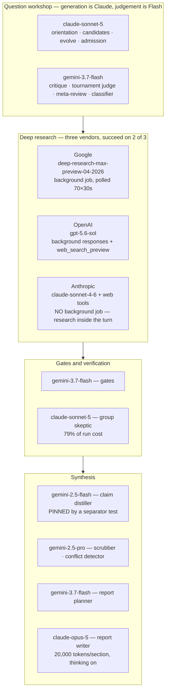

# 11 — Models and providers: what runs where, and why

| | |
|---|---|
| **Audience** | Anyone changing a model, pricing a run, or asking why a particular vendor is used |
| **Type** | Reference with Explanation |
| **Source of truth** | `backend/app/core/config.py`, `backend/app/ai/*`, `tribunal/nestor_pulse_sdk/pipeline/tribunal/*` (the model constants), `pipeline/synthesis/steps.py`, `report_planner.py`, `tools/{claude,gemini,openai}_adapter.py`, `audit/audited_llm_client.py`, `audit/cost_prices.json`, and the quick-task records `260806-dn8`, `260806-lvt`, `260806-o96`, `260901-j6w`, `260901-lf2` |
| **Last verified** | commit `c8b8583`, 2026-09-03 |

## 11.1 In one paragraph

Three vendors do the work. Anthropic writes and, more importantly, verifies: the group skeptic is a
Claude model and it is roughly **79% of a run's cost**. Google is the cheap judge and grouper, and
one of the three deep-research providers. OpenAI provides embeddings, transcription and the third
deep-research stream. Every model id is a named constant, most of them overridable by environment
variable, and every call is priced from recorded usage against a table in the repository. Two
constants are deliberately older than the rest, and the reasons are written into the code so nobody
"finishes the job".

## 11.2 The intake platform

| Use | Provider | Model | Env override | Ceiling |
|---|---|---|---|---|
| `apply-intake-skill` | Anthropic | `claude-sonnet-4-5` | `MODEL_APPLY_INTAKE` | `max_tokens` 20,000 under an SDK bound of 21,333 |
| `generate-context-pack` | Anthropic | `claude-sonnet-4-5` | `MODEL_CONTEXT_PACK` | 8,192 |
| `structure-answers` | Anthropic | `claude-sonnet-4-6` | `MODEL_STRUCTURE_ANSWERS` | 8,192 |
| `extract-insights` | Anthropic | `claude-sonnet-4-6` | `MODEL_EXTRACT_INSIGHTS` | 4,096 |
| Embeddings and search queries | OpenAI | `text-embedding-3-small`, 1,536 dimensions | `MODEL_EMBEDDINGS` | — |
| Transcription | OpenAI | `whisper-1`, `verbose_json` | `MODEL_TRANSCRIPTION` | — |
| Mail | Resend | — | — | — |

These are the values in code; a live service may carry different environment overrides, which was
not determined from the repository. Every Claude call is non-streaming, which is why the 21,333
ceiling matters: the Anthropic SDK refuses a non-streaming request above it, so the obvious "triple
it to 24,576" would have broken the call outright.

**Sampling temperature is set where the API permits it and deliberately omitted where it does not.**
This is worth stating precisely, because the omission looks like an oversight and is not one:

| Call | Temperature | Why |
|---|---|---|
| Tournament judge | `0.0` (`critique/judge.py:176`) | A ranking pass must be reproducible; the same pair must not swap winners between rounds |
| Content comparison | `0.0` (`critique/content_compare.py:98`, `:168`) | Same |
| Claim distiller (Gemini) | `0.0` with `thinking_budget=0` (`pipeline/synthesis/steps.py:1539`, `:1548`) | Extraction, not judgement. Thinking is switched off explicitly rather than left to the default |
| Synthesis (Opus 5) | **none passed** (`pipeline/synthesis/steps.py:161-165`) | On Opus 5 extended thinking is on by default, and with thinking on `temperature`, `top_p` and `top_k` are rejected with an **HTTP 400** |

The synthesis case is a trap the code comments against by name: an earlier `temperature=0.2` was
removed, and the docstring says not to "restore" it as a lost setting, because
`AuditedLLMClient.anthropic_messages` forwards `**kwargs` verbatim to `messages.create`, so an
unrecognised or forbidden key is a hard 400 rather than a warning. The same rule is why that call
passes neither `thinking` nor `budget_tokens`. Nothing in the pipeline sets `top_p` or `top_k`.

**Planned:** Voyage `voyage-3-large` at 1,024 dimensions for the Q&A chat, with Claude Haiku
answering (chapter 17 · M-05). Not built; the dimension must be validated against current vendor
documentation before the column exists, because a vector column's size is immutable once data is in
it.

## 11.3 The research engine

| Stage or use | Provider | Model | Env override | Settings |
|---|---|---|---|---|
| Intake delegator | Anthropic | `claude-sonnet-5` | none (literal) | 2,048 output tokens |
| Orientation, ask decomposition, candidate generation | Anthropic | `claude-sonnet-5` | `NESTOR_TRIBUNAL_WORKSHOP_MODEL` | 4,096; web search and fetch tools on orientation |
| Critique, tournament judge | Google | `gemini-3.7-flash` | `…_WORKSHOP_RANK_MODEL` | temperature 0, thinking budget 0 requested |
| Meta-review | Google | `gemini-3.7-flash` | `…_WORKSHOP_META_MODEL` (defaults to the rank model) | same |
| Generative and sharpening evolve | Anthropic | `claude-sonnet-5` | `…_WORKSHOP_EVOLVE_MODEL` | 4,096 |
| Grounded admission lookup | Anthropic | `claude-sonnet-5` | inherits the workshop model | 1,024; web search only |
| Parent classifier | Google | `gemini-3.7-flash` | inherits the rank model | temperature 0 |
| Topic grouping (optional mode) | Anthropic | `claude-sonnet-5` | `…_WORKSHOP_GROUP_MODEL` | 4,096, forced tool |
| Near-duplicate and canonical clustering | Google | Flash (via the shared clusterer) | — | — |
| Gates | Google | `gemini-3.7-flash` | — | temperature 0 |
| **Deep research: Gemini stream** | Google | `deep-research-max-preview-04-2026` | `NESTOR_GEMINI_DR_AGENT` | background interaction, polled every 30 s up to 70 times (35 minutes) |
| **Deep research: OpenAI stream** | OpenAI | `gpt-5.6-sol` | `NESTOR_OPENAI_DR_MODEL` | background mode with `web_search_preview`, same poll budget, 3,600 s client timeout |
| **Deep research: Claude stream** | Anthropic | `claude-sonnet-4-6` **plus web tools** | none | ⛔ deliberately not moved to Sonnet 5 |
| Own researcher (off the rotation) | Anthropic | `claude-sonnet-5` | — | SerpAPI as its search tool |
| Group skeptic (verification) | Anthropic | `claude-sonnet-5` | — | `web_search` and `web_fetch`, stakes-tiered turns |
| Claim distiller (fallback) | Google | `gemini-2.5-flash` | none, **pinned by a test** | 65,535 output tokens, thinking budget 0 |
| Fact-list corrective re-ask | Google | `gemini-2.5-flash` | none | the distiller's config |
| Report planner | Google | `gemini-3.7-flash` | none | **1,536** output tokens, temperature 0 |
| Research scrubber | Google | `gemini-2.5-pro` | none | 8,192 |
| Conflict detector | Google | `gemini-2.5-pro` | none | no config passed |
| **Report writer** | Anthropic | `claude-opus-5` | none | 20,000 per section and for the wrap; thinking on by default |
| Quality gate (LLM-judge option) | Anthropic | `claude-sonnet-4-6` | selected by `NESTOR_QUALITY_GATE` | 1,024 per rubric dimension |
| Blind critique judge, content comparison (dev tools) | Anthropic | `claude-sonnet-4-6` | none | 4,096 / 6,144 |

Read as a division of labour rather than a list, the allocation has a shape: **Claude reasons and
writes, Gemini Flash ranks and gates, Gemini Pro scrubs, and the three deep-research streams are
bought from three vendors on purpose.**

Two allocations in that diagram are deliberately *older* than the rest and must not be "finished":
the Claude deep-research stream stays on `claude-sonnet-4-6` because its model id is coupled to
research output rather than only to cost, and the claim distiller stays on `gemini-2.5-flash` because
its separator priority order is pinned by a replay test.

## 11.4 How each deep-research provider is driven

The three streams are called through the audited client and differ substantially.

**Google** goes over REST to the interactions endpoint with `background: true`, then polls
`GET /interactions/{id}` every 30 seconds for up to 70 attempts. The report is assembled from the
interaction's model-output steps, with the annotation URLs inlined after each cited span. When the
provider returns usage metadata the engine records it (counting thinking tokens as completion);
when a successful call carries none, the run's `cost_pending` flag is set rather than a number being
invented. A resumed job id is retrieved rather than re-dispatched, and a 404 on a resumed id
degrades unless a redirect switch is set.

**OpenAI** uses the responses API in background mode with the `web_search_preview` tool, an
exponential-backoff retry on transient dispatch errors, and the same poll budget. Four terminal
states are handled: completed, failed or cancelled, incomplete, and timeout.

**Anthropic** is different in kind: there is no background job. The Claude stream is a normal
messages call with the server-side `web_search` and `web_fetch` tools, so the model does its
research inside the turn. This is why the engine's own tool-fee accounting exists (a per-search fee),
and why the Claude stream's model id is coupled to research *output* rather than only to cost.

All three run in parallel per group and the stage succeeds on **at least two of three**.

## 11.5 Why these models: the decisions

### 11.5.1 The engine moved to Sonnet 5 (2026-09-01)

Context: the Anthropic skeptic stage is **79% of run cost** — $19.68 of the $24.78 priced on run
`fb9484dd`. Sonnet 5 is $2 in and $10 out against 4.6's $3 and $15. Per token that is 33% cheaper;
after adjusting for the roughly 30% token increase from the newer tokenizer used by Claude 4.7-era
and later models, about 13%, or **−$2.62 per run**.

Seven sites moved: the skeptic, the intake delegator, the workshop model, the evolve model, the
grouping model, the own researcher, and an except-branch fallback in the admission module that the
brief had missed. That last one matters: left behind, it would have silently billed a rarely hit path
against a differently priced model.

**Adding the price row was mandatory, not housekeeping.** Without `anthropic/claude-sonnet-5` in the
price table, `compute()` returns `None` and every run writes a NULL cost with `cost_pending` set. A
model swap alone silently destroys cost tracking on the most expensive stage.

⛔ **`tools/claude_adapter.py` was deliberately left on `claude-sonnet-4-6`.** That is the Claude
deep-research stream, which drives every low-stakes angle plus the high-stakes redundancy copy.
Moving it changes research **output**, not just cost. Because it is unchanged, the UI label that
reads "Claude claude-sonnet-4-6 +web" is still **true** and was correctly left alone: changing it
would have made the interface assert a model the run never calls. The analysis and critique tooling
also stays on 4.6.

### 11.5.2 The Flash stages moved to Gemini 3.7 (2026-09-01)

⭐ **This change was justified by measured position bias, not by price.** All **267** real Flash
prompts from run `fb9484dd` were replayed through both models with the exact production
configuration (4,096 output tokens, temperature 0, thinking budget 0), with zero errors on either
side. On the pairwise tournament judge, where option A is always listed first:

| Model | Picked the first-listed option |
|---|---|
| `gemini-2.5-flash` | **69.9%** (137 of 196) |
| `gemini-3.7-flash` | **58.4%** (94 of 161) |

The tournament was ranking research questions partly by **list order**, which is a classic
pairwise-judging failure. Twenty-three percent of verdicts flip between the models (77% agreement).

⭐ **The documented regression did not occur.** The critique code warns in capitals that enabling
thinking produces "a critic that rejects nothing", which would break the KILL path and the whole
rejected register. Measured: 2.5 gave KEEP 9 / WEAK 35 / **KILL 0**; 3.7 gave KEEP 17 / WEAK 21 /
**KILL 6** — more decisive at both ends. The warning is still true of enabling thinking on 2.5 and
was not deleted.

⚠ **The accepted cost.** 3.7 honours a zero thinking budget on a trivial prompt but **ignores it on
real ones**, which is how the first test looked clean. Output rises **4.2×**, taking Flash spend from
$0.54 to $2.04, **+$1.50 per run**. The operator accepted it.

Five sites moved explicitly (gates, clustering, the report planner, the tournament rank model, an
admission fallback) plus **a sixth by inheritance**: the meta-review model defaults to the rank
model and moved with no evidence of its own.

⛔ **The claim distiller was deliberately left on `gemini-2.5-flash`**, and a test pins the literal.
Two reasons, both recorded in the source. First, it was **not exercised by the evidence**: it is the
fallback that only fires when a stream returns no usable fact list, every stream complied on
`fb9484dd`, so it contributed **zero** of the 267 replayed prompts. Second, it has a documented
format-fragility incident: this is the parser path where the model emitted the literal string
`<TAB>` and 278 well-formed claims were dropped (chapter 10 § 10.4.2). Checked and dismissed as a
coupling: the distiller's 65,535-token cap is not model-specific, since both models report the same
output limit.

⚠ The **report planner** is the site most exposed by this change: it has the tightest output ceiling
of the five (1,536 tokens) while 3.7 spends output on reasoning. Which of the 267 replayed prompts
were planner prompts was not broken out. A live run is what settles it.

### 11.5.3 Synthesis moved to Opus 5 (2026-08-06)

The three report-writing calls (the single-call fallback, each per-focus-area section, and the wrap)
moved to `claude-opus-5`. Consequences that had to be handled rather than assumed:

- **`temperature=0.2` was dropped.** With thinking on by default, `temperature`, `top_p`, `top_k`
  and `budget_tokens` are an HTTP 400 on this model.
- **The response reader changed.** Thinking blocks come first, so the code joins **every** text
  block rather than taking `content[0]`, and it reads `stop_reason` first because Opus 5's safety
  classifier returns **HTTP 200** with `stop_reason == "refusal"`.
- **The cap is bounded by the SDK, not the model.** The Anthropic SDK raises when
  `3600 × max_tokens / 128,000 > 600`, and all three trigger conditions hold in production, so the
  caps went from 8,192 to **20,000** under a named ceiling of 21,333. A "raise it to 64,000 for
  headroom" edit would have thrown on every synthesis call.
- On Opus 5 the cap covers **thinking and text together**: roughly 15,000 thinking plus 5,000 text,
  about 3,700 words per section.

⚠ One consequence recorded as a contradiction: the blind critique judge's objectivity argument said
"both engines' reports are written by Gemini; the judge is Claude", which no longer holds. The judge
(`claude-sonnet-4-6`) and the writer (`claude-opus-5`) are now the same family.

### 11.5.4 The client's language and report size reach the engine (2026-08-06)

Two defects, both measured from run `368ff3a0`'s audit blobs rather than inferred:

- **The run language was empty on every call.** All five dispatch assignments carried the *fallback*
  sentence, a branch that fires only when the value is empty, and the same value feeds the language
  directive, so **the strong "write everything in one language and only that language" directive had
  never fired in production**. Its only producer had been unwired by an earlier decision.
- **The report size was read by nothing.** Length was proxied from a question count, and the
  zero-touch path hardcoded no report spec, so the shaping block the engine already knew how to emit
  reached zero prompts. That run delivered **356,352 characters** against a form whose largest option
  offers "approximately 10 to 20 pages" and whose help text reads "thicker is not better".

The fix adds a required report-language field and a parsed `[REPORT]` **block** beside `[DECISION]`,
deliberately a block rather than prose, because both consumers interpolate the value into a prompt
and neither can read a sentence. The operator ruled that the size maps to **both** a keyword and a
page range (compact to brief and 2 to 5 pages; standard to a range with no keyword; extended to
comprehensive and 10 to 20). The page target is a **target, not a cap**.

### 11.5.5 The gate saw half a question (2026-08-06)

The suspected 1,200-character cap on the claim gate's decision context **never bound**: it measured
576 characters with 624 to spare. What bound was a **120-character** identity key, so every KEEP and
DROP decision in that run was made against questions cut mid-word. Two caps sat in series, and
raising one alone produced no observable effect and read as "the cap was not the problem". Both moved
together to 4,000, and a test pins the **relationship** rather than the values. The identity key
stayed at 120 and is pinned, because it is an identity key and not a display bound.

## 11.6 The cost anatomy of a real run

Run `fb9484dd`, 2026-08-31, 444 audited calls, **$27.79 recorded**. Itemised from the audit bucket
with no database access (chapter 16 § 16.6):

| Line | Cost | Share |
|---|---|---|
| Anthropic prompt-cache **creation** (3.99M tokens at $3.75/M) | $14.98 | 55% |
| `claude-opus-5`, **4 calls** (report synthesis) | $4.51 | 17% |
| Anthropic web search, 301 calls at $0.01 | $3.01 | 11% |
| Sonnet completion, prompt and cache reads | $4.69 | 17% |
| `gemini-2.5-pro`, 2 calls | $0.36 | 1% |
| `gemini-2.5-flash`, **267 calls** | $0.22 | <1% |
| **The 9 deep-research angles** | **$0.00 recorded** | unpriced |

Four findings from that itemisation, each of which changes how the number should be read:

- **Volume is not cost.** 267 Flash calls, 60% of all calls, cost 22 cents; 4 Opus calls cost $4.51.
- **Verification is the cost, and it is linear.** 142 of 166 Anthropic calls are the group skeptic.
  Anthropic is 97 to 98% of every run. Cost is approximately **$0.11 per claim group**, measured
  across six runs: 73 groups gave $8.49, 80 gave $8.62, 96 gave $12.17, 104 gave $11.39, 162 gave
  $17.40, 178 gave $35.44. Content is already capped (five searches, three fetches with a
  4,000-token content limit); the tokens come from turn count times accumulating context inside each
  call, not from runaway fetching.
- ⛔ **Prompt caching is not waste.** A create-to-read ratio near 1:1 *looks* like a leak. Measured
  across all six runs in the bucket, caching **saved 14 to 30%** against sending the same tokens
  uncached; break-even is about 0.28 reads per created token and the observed ratio was 0.98.
  `fb9484dd`'s 1.02 is the **best** of the six (the others run 1.39 to 1.95). This is recorded as a
  correction: the ratio was read as waste before the alternative was priced.
- **The budget governor has never fired**, and two of six runs exceeded its $25 default (chapter 10
  § 10.8).

## 11.7 Three gaps that make any cost figure incomplete

1. **The nine deep-research angles are unpriced.** They return `{status, report}` with no usage, so
   `compute()` cannot price them and the most expensive calls in the run contribute **$0.00**.
2. **The backend has a second, non-reconciling cost system.** The intake skills write
   `skill_runs.cost_estimate_usd` from a hardcoded `in/1e6 × 3 + out/1e6 × 15` legacy Sonnet rate,
   applied whatever model actually ran. If a skill ever runs on Opus the estimate is roughly 40% low.
   It never touches the engine's price table or the audit log.
3. **Embeddings and Whisper are uncosted entirely.**

Plus a display gap: the UI section titled "True itemized cost" renders a total and a pending flag
and nothing else, while the rows that would itemise it exist at the engine's calls endpoint
(chapter 19).

## 11.8 The price table can go stale silently

Measured 2026-09-01: `google/gemini-2.5-flash` was $0.15 in and $0.60 out in the table against
Google's official **$0.30 and $2.50** — the output rate was understated **fourfold**, so every past
Flash figure was too low. It was corrected, along with a `gemini-2.5-pro` cache-read rate, and
historical rows were not repaired.

Three standing cautions follow:

- ⚠ `gemini-2.5-pro` and `gpt-5.6-sol` are **tiered** above 200k and 272k prompt tokens; the table
  encodes only the lower tier, so a total containing such a call is a floor.
- ⚠ `gemini-3.7-flash`'s rates are **introductory through 2026-12-31 and double on 2027-01-01**.
- **Verify a price row through the real `compute()`, never by reading the JSON**, and always with a
  negative control: an invented model name must return `None` and log the unknown-model warning.
  A row that exists but has a null rate is priced at **zero** with only a warning, which is worse
  than a missing row (chapter 09 § 09.6.4).

## 11.9 Perplexity: assessed and declined

Investigated on 2026-09-01 with a live key for about $1.03 total. The finding that settled it: the
Agent API's presets resolve to **OpenAI** models.

| Preset | Resolves to |
|---|---|
| `fast` | `openai/gpt-5.6-luna` |
| `medium` | `openai/gpt-5.6-luna` |
| **`high`** (the documented deep-research replacement) | **`openai/gpt-5.6-sol`** |

`gpt-5.6-sol` is exactly the model the engine's OpenAI stream already runs. For a design whose
premise is that streams fail **differently**, a router reselling an existing provider is
structurally wrong: it buys correlation, not coverage. Their own documentation says as much, advising
callers to check the returned model if branding or data handling matters. The escape hatch is mostly
closed: only `perplexity/sonar` can be pinned as a real Perplexity model on that API.

A second blocker would have been silent. On a real research question the `high` preset ran 188
seconds, made 14 searches and 6 fetches, touched 185 URLs and cost $0.96 for an 11.5k-character
answer — but it cites as `[web:1][web:31]` **markers with no raw URLs**; the sources live in separate
trace objects. This engine's extractor is a regex over prose, so the claim-to-source pipeline would
have extracted **nothing** while the report still looked perfect. That is the same class as the
corroboration failure: a green pipeline with zero output.

Their business model, measured from the billing payload: on an OpenAI-backed call, half the cost was
the tool call (one web search) and half the model tokens. Their own `sonar` bills search *inside*
the token price. **The index is the product; the model is a resold commodity.** If they are ever
bought from, the index is the thing worth buying.

**The one idea still open.** `perplexity/sonar` on a real question: 39 seconds, 11 cited URLs,
$0.009. The dropped `own` stream returned **2 unique URLs across a whole run**. So Perplexity's index
is a plausible replacement for `own` as a cheap breadth stream, but not as a corroboration peer: it
cannot match a deep-research angle's claim density, and the two-of-three contract would need thought
first.

## 11.10 What is measured and what is not

| Claim | Basis |
|---|---|
| Skeptic is 79% of cost; ~$0.11 per claim group; caching saves 14 to 30% | **Measured** across six runs' audit blobs |
| The position bias figures (69.9% against 58.4%), the 23% verdict flip, KILL 6 against 0 | **Measured** by a 267-prompt replay, on audit-blob prompts **truncated to 2,000 characters** — a fair A/B, not the live call |
| The workshop's cost and round counts ($0.24, exit in round 4, 17 winners) | **Measured** on a local harness, n=1, with the unbuilt stages implemented by the harness author |
| The language and report-size defects, the 120-character gate key, 356,352 characters delivered | **Measured** from a real run's audit blobs |
| −$2.62 from Sonnet 5, +$1.50 from Gemini 3.7, a projected total near $29 | ⛔ **Arithmetic.** Neither model has ever executed a run |
| That the new Flash model does not empty the rejected register in production | ⛔ **Unknown.** It ignores a zero thinking budget on real prompts; the next run's register is the test (chapter 16 § 16.10) |
| That the report planner does not truncate under 3.7 | ⛔ **Unknown.** Tightest ceiling of the five sites |

## 11.11 Where to look

| To find | Open |
|---|---|
| A backend model id | `backend/app/core/config.py`; the inventory is [21](21-configuration-reference.md) § 21.3 |
| An engine model id | the `NESTOR_*_MODEL` tables in [21](21-configuration-reference.md) § 21.7 |
| How a deep-research provider is driven | `tribunal/nestor_pulse_sdk/audit/audited_llm_client.py` |
| The price table | `tribunal/nestor_pulse_sdk/` cost module; override with `COST_PRICES_PATH` |
| Why a model was chosen | § 11.5 above, and [17 — Decision log](17-decision-log.md) |
| What a run actually cost | [16 — Operations runbook](16-operations-runbook.md) § 16.6 |
