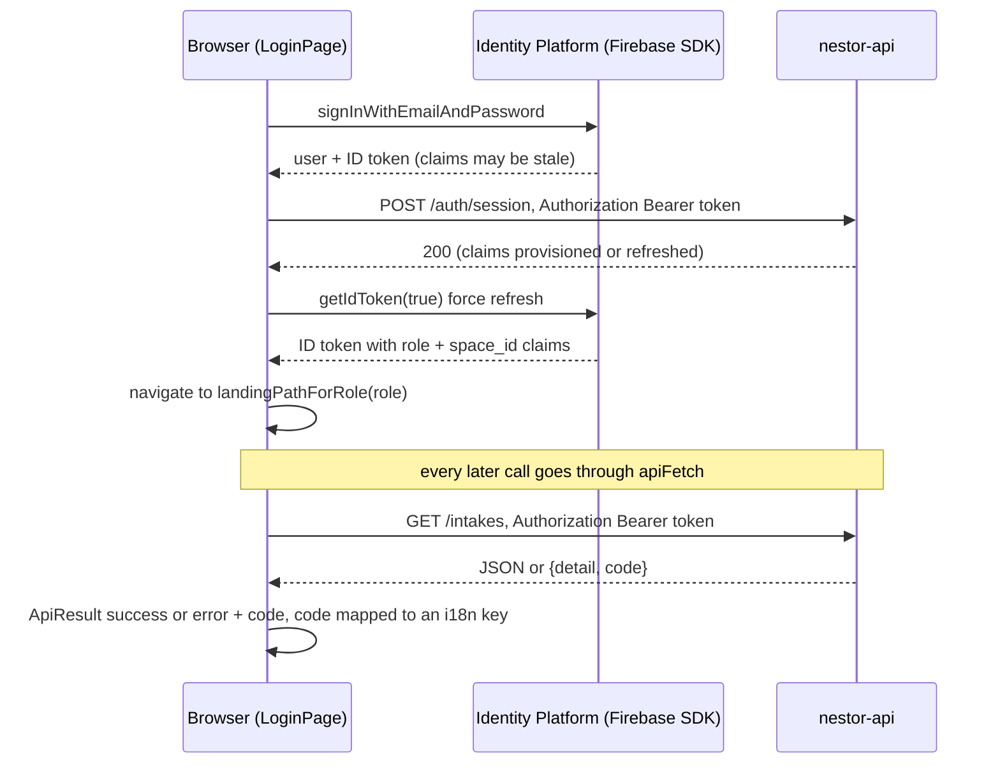
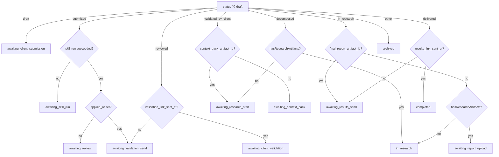

# 12 — Frontend (`nestor-frontend`)

| | |
|---|---|
| **Audience** | Engineers changing the UI; operators who want to know what a screen actually does; reviewers checking the frontend↔backend contract |
| **Type** | Reference (route map, API seam, phase machine, component inventory) with Explanation (how the pieces fit, why they are built this way) |
| **Source of truth** | `frontend/src/routes/*`, `frontend/src/lib/api/*`, `frontend/src/lib/intake-phase.ts`, `frontend/src/lib/auth-guard.tsx`, `frontend/src/lib/auth-context.tsx`, `frontend/src/components/{intake,research,admin}/*`, `frontend/src/lib/research/*`, `frontend/src/lib/i18n/*`, `frontend/Dockerfile`, `frontend/cloudbuild.yaml`, `frontend/scripts/*.sh`, `frontend/scripts/i18n-audit.mjs`, `frontend/vitest.config.ts` |
| **Last verified** | commit `c8b8583`, 2026-09-03 |

## 12.1 In one paragraph

The frontend is a single React application that serves two audiences from one build: a superadmin (the Agenic operator) who works under `/admin`, and a client member who works under `/intake`. It is rendered on the server by TanStack Start and shipped as a Node container on Cloud Run under the service name `nestor-frontend`. It never touches a database or a bucket directly. Every piece of data it shows comes from the intake API (`nestor-api`) through one thin transport module that attaches the signed-in user's Identity Platform token to each request. The screens are driven by two small pure functions: a phase machine that turns an intake's status into one of twelve "what happens next" phases, and a work-phase rule that turns a research run's live status into honest banner copy. The whole UI exists in Dutch, French and English. Live at `c8b8583` is revision `nestor-frontend-00035-zz2` (`.planning/CONTINUE-HERE.md:24`).

## 12.2 How it works

### The shell and the two audiences

The application is a set of file routes. TanStack Router reads the filenames under `frontend/src/routes/` and generates the route tree into `frontend/src/routeTree.gen.ts`. The root route (`frontend/src/routes/__root.tsx`) draws the HTML shell, loads the IBM Plex fonts, and wraps every page in four providers: TanStack Query, i18next, the auth context and a redirector, plus the sonner toaster (`frontend/src/routes/__root.tsx:115-121`). The redirector has one job: when a session exists and the browser sits on a login page, it waits for the user's role to resolve and sends them to the right landing page (`frontend/src/routes/__root.tsx:92-107`).

Two subtrees hang off the root. `/admin` is the operator's world: a layout route that denies non-superadmins in place, a product home, and the Pulse product shell with intakes, clients, search and the research run pages. `/intake` is the client's world: a bare list, a form, a results view and a report download, with no product shell and no space switcher. The route tree below shows the nesting as the router sees it. Dashed nodes are legacy aliases that only redirect.

```mermaid
flowchart TD
  ROOT["__root (providers, shell)"]
  IDX["/ (redirect to /admin)"]
  LOGIN["/auth/login"]
  ACTION["/auth/action"]
  ADMIN["/admin (layout, superadmin wall)"]
  AHOME["/admin/ (product home)"]
  PULSE["/admin/pulse (ProductShell pulse)"]
  PIDX["/admin/pulse/ (redirect)"]
  ILIST["/admin/pulse/intakes/"]
  INEW["/admin/pulse/intakes/new"]
  IDET["/admin/pulse/intakes/:id"]
  CL["/admin/pulse/clients"]
  CLD["/admin/pulse/clients/:id"]
  SRCH["/admin/pulse/search"]
  RUN["/admin/pulse/runs/:runId/"]
  VER["/admin/pulse/runs/:runId/verification"]
  USERS["/admin/users (own ProductShell)"]
  SPACES["/admin/spaces (own ProductShell)"]
  SALES["/admin/sales (ProductShell sales, unlinked)"]
  SP["/admin/sales/projects/*"]
  CS["/admin/(echo, edge, flux)/coming-soon"]
  LEG["legacy aliases: /admin/login, /admin/organizations, /admin/search, /admin/clients, /admin/intakes/*"]
  INTAKE["/intake/ (client list)"]
  IFORM["/intake/:id (form shell)"]
  IRES["/intake/:id/results"]
  IREP["/intake/:id/report"]

  ROOT --> IDX
  ROOT --> LOGIN
  ROOT --> ACTION
  ROOT --> ADMIN
  ROOT --> INTAKE
  ROOT --> IFORM
  IFORM --> IRES
  IFORM --> IREP
  ADMIN --> AHOME
  ADMIN --> PULSE
  ADMIN --> USERS
  ADMIN --> SPACES
  ADMIN --> SALES
  ADMIN --> CS
  ADMIN -.-> LEG
  PULSE --> PIDX
  PULSE --> ILIST
  PULSE --> INEW
  PULSE --> IDET
  PULSE --> CL
  PULSE --> CLD
  PULSE --> SRCH
  PULSE --> RUN
  PULSE --> VER
  SALES --> SP
```

Two shape decisions in that tree matter for anyone adding a route. First, the run page and the verification page are flat siblings under `/admin/pulse`, not children of the intake detail route; a file named `admin.pulse.runs.$runId.tsx` deliberately does not exist, because a parent route needs an `<Outlet/>` and forgetting one cost a cycle in Phase 18 (`frontend/src/routes/admin.pulse.runs.$runId.index.tsx:19-24`, see 17 · 15.3 D-08). Second, `/intake/:id` is a parent of two children and renders its `<Outlet/>` only when a child matched (`frontend/src/routes/intake.$id.tsx:39-44`), which is the Phase 18 fix itself.

### Signing in and talking to the API

Sign-in is Identity Platform email plus password through the Firebase client SDK. The subtle part is what happens after the password is accepted. The browser holds an ID token, but the `role` and `space_id` custom claims that the backend sets on first login may not be on that token yet. So the login page calls `POST /auth/session` with the fresh token, which lets the backend provision or refresh the claims, then forces a token refresh with `getIdToken(true)` so the browser reads the claims back, and only then routes by role (`frontend/src/routes/auth.login.tsx:75-96`). A failed session sync shows an "unauthorized" error and does not navigate (`frontend/src/routes/auth.login.tsx:81-83`).

From then on every backend call goes through one function, `apiFetch` in `frontend/src/lib/api/client.ts`. It reads the current ID token, refuses to send a request with no token (it returns a `NOT_LOGGED_IN` result instead of "Bearer null"), attaches the `Authorization` header, tolerates empty bodies, turns non-2xx responses into `{success:false, error, code}` and never throws (`frontend/src/lib/api/client.ts:56-133`). When the backend answers 401 with exactly "Account disabled" or "Session revoked", the transport signs the user out and sends them to the login page (`frontend/src/lib/api/client.ts:110-124`). The machine-readable `code` is looked up in a five-entry table so toasts can be translated (`frontend/src/lib/i18n/error-codes.ts:11-17`).

The important security stance is stated in the code itself: the role and space read from the token in the browser are "UX gating only" (`frontend/src/lib/auth-context.tsx:37-38`, `frontend/src/lib/api/client.ts:14-16`). The backend re-verifies the token and derives the tenant on every request. The frontend hides buttons; it does not enforce anything. See [14 — Security and compliance](14-security-and-compliance.md).

### The guard and server-side rendering

Because the page is rendered on the server first, the auth guard has two halves. The `beforeLoad` half returns immediately during SSR, since Firebase persistence lives in the browser's IndexedDB and the server cannot know who is signed in (`frontend/src/lib/auth-guard.tsx:57`). In the browser it waits for the first auth tick and redirects to `/auth/login` when there is no user (`frontend/src/lib/auth-guard.tsx:54-62`). The component half, `useRequireAuth` and `RequireAuth`, renders children only once a session is known, so data effects never fire without a token (`frontend/src/lib/auth-guard.tsx:80-104`). The file documents the bug this replaced: five routes each had their own guard that also ran during SSR and answered every refresh with a 307 to the login page (`frontend/src/lib/auth-guard.tsx:9-19`). Role denial is rendered in place, never redirected, to avoid a loop with the login page's auto-navigate (`frontend/src/lib/auth-guard.tsx:76-78`).

### The phase machine

An intake has eight statuses in the database, but an operator needs to know what to do next, which depends on more than status: whether the AI skill has run, whether its output was reviewed, whether the validation mail went out, whether a context pack exists. `derivePhase` in `frontend/src/lib/intake-phase.ts` folds status, the latest `apply-intake-skill` run and two timestamps into one of twelve phases. `NextStepBanner` then maps each phase to at most one primary and one secondary call to action. The flowchart below is the derivation as coded (`frontend/src/lib/intake-phase.ts:31-88`).

Two inputs deserve a warning. `hasResearchArtifacts` is a constant `false` on the detail page (`frontend/src/routes/admin.pulse.intakes.$id.tsx:305`), so the artifact branches never fire; status alone drives the `in_research` family, and the code says so (`frontend/src/lib/intake-phase.ts:65-77`). And the run passed in is only the latest run if it is an `apply-intake-skill` run; otherwise the page falls back to the newest apply run in the full list so an enrichment skill cannot fake "analysis ready" (`frontend/src/routes/admin.pulse.intakes.$id.tsx:328-377`).

The `in_research` phase spans two materially different situations, a run still going and a run finished but not yet delivered, because the status survives until the explicit Deliver act. Phase 23 added a second pure rule, `deriveWorkPhasePresentation`, that reads the live research run's status and picks one of five banner bodies: running, finished, stopped, paused, unknown (`frontend/src/lib/research/workPhase.ts:64-87`). It is what stops the banner from claiming research is running after it has ended (see 17 · 23).

### The research run page

Once a run is triggered, the operator watches it on a dedicated page, `/admin/pulse/runs/:runId`. The page opens cold from a bookmark: it does not accept an intake id, it resolves one through `GET /intakes/research/runs/{runId}/locate` and shows one existence-hiding "not found" on failure (`frontend/src/routes/admin.pulse.runs.$runId.index.tsx:57-77`). It holds exactly one SSE (server-sent events) connection for the run's status, and a separate event reader, `useRunEvents`, that backfills the feed in pages of 500 and then fetches deltas whenever the SSE frame's `event_seq` cursor moves past what it has (`frontend/src/lib/research/useRunEvents.ts:33-150`). The feed renderer groups consecutive events by stage, auto-collapses finished groups to a two-row preview, blinks one cursor on the newest row, and decides "is this agent still running" by position rather than by any correlation key, because the engine emits none (`frontend/src/lib/research/feedRows.ts:34-40`). The verification report is a sibling page reached from the run page whenever a report can exist, which includes failed and cancelled runs (`frontend/src/lib/research/verificationGate.ts:50-58`). The client never sees any of it: no file under `frontend/src/routes/intake.*` imports anything from `components/research`.

## 12.3 Stack and build

| Concern | What is used | Evidence |
|---|---|---|
| UI library | React 19.2 | `frontend/package.json:65` |
| Routing | TanStack Router 1.168, file routes, tree generated into `src/routeTree.gen.ts` | `frontend/package.json:51`, `frontend/src/router.tsx:57-67` |
| SSR | TanStack Start 1.167 on Nitro, preset `node-server` | `frontend/package.json:52`, `frontend/vite.config.ts:5` |
| Bundler | Vite 7.3 through the Lovable preset `@lovable.dev/vite-tanstack-config` 2.3.1 | `frontend/package.json:85,100`, `frontend/vite.config.ts` |
| Dev proxy | `/api` → `http://localhost:3001` with the prefix stripped; pairs with `VITE_API_BASE_URL=/api` and the mock backend | `frontend/vite.config.ts:12-23` |
| Styling | Tailwind CSS 4.2 (`@import "tailwindcss" source(none)` + `@source "../src"`), design tokens `paper #EDECE5`, `ink #000`, `fluoYellow #DFF940`, `fluoGreen #BFEC40`, `fluoPink #FF2D87`, `fluoRed #FF2D3A`, all radii 0, IBM Plex fonts | `frontend/package.json:77`, `frontend/src/styles.css:25-45` |
| Component primitives | shadcn/ui, 46 files under `src/components/ui/`, not modified | fact sheet count; `frontend/components.json` |
| i18n | i18next 26 + react-i18next 17, four namespaces bundled statically | `frontend/package.json:60,69`, `frontend/src/lib/i18n/index.ts:18-45` |
| Auth client | Firebase 12 (Identity Platform) | `frontend/package.json:59`, `frontend/src/lib/firebase.ts` |
| Server state | TanStack Query (used for the space switcher and a few loads; most admin loads are `useEffect` + seam calls) | `frontend/src/components/admin/SpaceSwitcher.tsx:40-47` |
| PDF | jsPDF 4 (the live context-pack export); `@react-pdf/renderer` 4 installed but its components are unmounted | `frontend/src/components/intake/ContextPackBlock.tsx:73-214` |
| Markdown | react-markdown 10 + remark-gfm; `rehype-raw` installed with no import in `src` | `frontend/package.json`; `frontend/src/components/intake/CitationPanel.tsx:82` |
| Tests | vitest 3.2, node environment, `src/**/*.test.ts` only | `frontend/vitest.config.ts` |
| Lint | ESLint 9 flat config: js recommended, typescript-eslint, react-hooks, react-refresh (warn), prettier; `no-unused-vars` off | `frontend/eslint.config.js` |
| TypeScript | strict, ES2022, `moduleResolution: Bundler`, alias `@/* → ./src/*`, `noUncheckedSideEffectImports`; **`noUnusedLocals: false`, `noUnusedParameters: false`** | `frontend/tsconfig.json:20-21` |

### Container image and Cloud Build

The image is a two-stage `node:22-slim` build (`frontend/Dockerfile`). The build stage receives four public build arguments and promotes them to environment variables so Vite can inline them: `VITE_API_BASE_URL`, `VITE_FIREBASE_API_KEY`, `VITE_FIREBASE_AUTH_DOMAIN`, `VITE_FIREBASE_PROJECT_ID` (`frontend/Dockerfile:33-40`). There is no Supabase build argument at all (`frontend/Dockerfile:16-21`). Dependencies are installed with `npm ci` from the committed `package-lock.json` (`frontend/Dockerfile:44-45`). After `npm run build` the Dockerfile runs the D-11 bundle guard, `bash scripts/ci_no_supabase_in_bundle.sh .output`, and the image build fails on any leaked Supabase signature (`frontend/Dockerfile:53-57`). The runtime stage copies only `.output` and starts `node .output/server/index.mjs` on `PORT=8080` (`frontend/Dockerfile:62-77`). `.dockerignore` excludes `.output` (a stale Cloudflare build would otherwise be copied in), `node_modules`, `.env*` and `.git`.

`frontend/cloudbuild.yaml` is a single `docker build` step that forwards the substitutions `_API_BASE_URL`, `_FB_API_KEY`, `_FB_AUTH_DOMAIN`, `_FB_PROJECT_ID` as `--build-arg` values and tags `${_IMAGE}` (`frontend/cloudbuild.yaml:24-34`), with a 1200 s timeout. The deploy to Cloud Run is a separate `gcloud run deploy` step, documented in [13 — Infrastructure and deploy](13-infrastructure-and-deploy.md).

### The D-11 bundle guard

`frontend/scripts/ci_no_supabase_in_bundle.sh` greps the built output for the pattern `[a-z0-9]{20}\.supabase\.co|"role":"anon"|eyJhbGciOi|sb_publishable_|sb_secret_` (`:53`). The grep exit code is the gate, exit 2 means the scan directory is missing, and `--self-test` plants an offender to prove the guard bites. It is scoped to leaked configuration, not to the presence of `supabase-js` itself (`:39-45`), so the retained sales code may ship as long as no URL or key does. See 17 · D-11 (Phase 12).

### Residue from the Cloudflare era

`frontend/wrangler.jsonc` (`name: "nestor"`, `main: .output/server/index.mjs`, `nodejs_compat`) and the `@cloudflare/vite-plugin` dependency (`frontend/package.json:16`) are residue from the original Lovable deployment on Cloudflare Workers. The Docker and Cloud Run path does not use them. `frontend/bunfig.toml` (`saveTextLockfile = false`) is residue too; the project installs with npm and the lockfile is committed.

## 12.4 Route map

Every route file, its URL, who sees it, its layout parent and what it does. "Superadmin" means the `/admin` layout's in-place denial wall applies. Every admin surface repeats that the role in the token is UX gating only and that the backend's `get_current_identity` dependency is the authority (`frontend/src/routes/admin.tsx:9-11`).

| File (`frontend/src/routes/`) | URL | Guard | Layout | Purpose and notes |
|---|---|---|---|---|
| `index.tsx` | `/` | none | root | `beforeLoad` redirects to `/admin` (`:4-6`); the static `Index` card is effectively never rendered (`:11-13`) |
| `auth.login.tsx` | `/auth/login` | public | root | Email + password sign-in and claim sync (§ 12.5) |
| `auth.action.tsx` | `/auth/action` | public | root | Firebase `oobCode` handler for set-password / reset-password (§ 12.5) |
| `admin.tsx` | `/admin` (layout) | `beforeLoad: requireAuthBeforeLoad` (`:18`); renders "access denied" + logout in place when not superadmin (`:39-67`); `null` while loading (`:37`) | root → admin | The operator wall |
| `admin.index.tsx` | `/admin/` | superadmin | admin | Product home. `PRODUCTS` (`:24-64`): pulse enabled; **sales disabled** with the comment "Do NOT delete the sales code" (`:33-36`, D-09); echo/edge/flux disabled, linking to coming-soon pages. Disabled cards render at 40 % opacity with a badge (`:117-126`). Footer: email + Firebase `signOut` (`:73-76`) |
| `admin.pulse.tsx` | `/admin/pulse` (layout) | superadmin | admin → pulse | `<ProductShell product="pulse">` with nav: new intake, intakes, clients, search (`:12-17`) |
| `admin.pulse.index.tsx` | `/admin/pulse/` | – | pulse | Redirect to `/admin/pulse/intakes` (`:5`) |
| `admin.pulse.intakes.index.tsx` | `/admin/pulse/intakes/` | superadmin | pulse | Intake list (§ 12.14) |
| `admin.pulse.intakes.new.tsx` | `/admin/pulse/intakes/new` | superadmin | pulse | Create intake. `validateSearch` accepts `client_id` (`:14-15`) but never reads it; the space comes from the active-space switcher (`:23-25`) |
| `admin.pulse.intakes.$id.tsx` | `/admin/pulse/intakes/:id` | superadmin | pulse | Intake detail, 1877 lines (§ 12.9) |
| `admin.pulse.clients.tsx` | `/admin/pulse/clients` | superadmin | pulse | Clients = spaces with at least one intake (§ 12.14) |
| `admin.pulse.clients.$id.tsx` | `/admin/pulse/clients/:id` | superadmin | pulse | Read-only space detail (§ 12.14) |
| `admin.pulse.search.tsx` | `/admin/pulse/search` | superadmin | pulse | Global semantic search (§ 12.14) |
| `admin.pulse.runs.$runId.index.tsx` | `/admin/pulse/runs/:runId/` | superadmin | pulse, flat leaf (15.3 D-08, `:19-24`) | Research run page (§ 12.12) |
| `admin.pulse.runs.$runId.verification.tsx` | `/admin/pulse/runs/:runId/verification` | superadmin | pulse, sibling leaf; `admin.pulse.runs.$runId.tsx` deliberately absent (`:15-25`) | Verification report page (§ 12.12) |
| `admin.users.tsx` | `/admin/users` | superadmin | admin; mounts its own `<ProductShell product={t("shell.productManage")} items={ADMIN_NAV}>` (`:165`) | User management (§ 12.14) |
| `admin.spaces.tsx` | `/admin/spaces` | superadmin | admin; own ProductShell (`:116`) | Space management (§ 12.14) |
| `admin.sales.tsx` | `/admin/sales` (layout) | superadmin | admin → sales | `<ProductShell product="sales">` (`:12-15`). **Legacy**: unlinked from home, still routable by URL |
| `admin.sales.index.tsx` | `/admin/sales/` | – | sales | Redirect to `/admin/sales/projects` |
| `admin.sales.projects.index.tsx` | `/admin/sales/projects/` | superadmin | sales | **Supabase-backed** (`:6`); the client is `null` in production so the page degrades. Legacy |
| `admin.sales.projects.new.tsx` | `/admin/sales/projects/new` | superadmin | sales | Legacy Supabase |
| `admin.sales.projects.$id.tsx` | `/admin/sales/projects/:id` | superadmin | sales | Legacy Supabase, 1377 lines, calls `supabase.schema("sales").rpc(...)` (`:400`) |
| `admin.echo.coming-soon.tsx`, `admin.edge.coming-soon.tsx`, `admin.flux.coming-soon.tsx` | `/admin/{echo,edge,flux}/coming-soon` | superadmin | admin | `<ComingSoonPage>` with hardcoded Dutch copy, exempt from the Dutch guard (`frontend/src/components/admin/ComingSoonPage.tsx:10-14,20`) |
| `admin.login.tsx` | `/admin/login` | – | admin | Redirect to `/auth/login`. Legacy alias |
| `admin.organizations.tsx` | `/admin/organizations` | – | admin | Redirect to `/admin`. There is no organizations screen; organization = space |
| `admin.search.tsx` | `/admin/search` | – | admin | Redirect to `/admin/pulse/search`. Legacy alias |
| `admin.clients.tsx` | `/admin/clients` | – | admin | Redirect to `/admin/pulse/clients`, forwarding `?client=`. Legacy alias |
| `admin.clients.$id.tsx` | `/admin/clients/:id` | – | admin | Redirect to `/admin/pulse/clients/:id`. Legacy alias |
| `admin.intakes.index.tsx` | `/admin/intakes/` | – | admin | Redirect to `/admin/pulse/intakes`. Legacy alias |
| `admin.intakes.new.tsx` | `/admin/intakes/new` | – | admin | Redirect to `/admin/pulse/intakes/new`, forwarding `?client_id=`. Legacy alias |
| `admin.intakes.$id.tsx` | `/admin/intakes/:id` | – | admin | Redirect to `/admin/pulse/intakes/:id`. Legacy alias |
| `intake.index.tsx` | `/intake/` | any signed-in user (`beforeLoad` + `<RequireAuth>`, `:42-47`) | root, no ProductShell, no space switcher (`:25-31`) | Client intake list (§ 12.13) |
| `intake.$id.tsx` | `/intake/:id` | any signed-in user | root; parent of two children, `<Outlet/>` only when a child matched (`:39-44`) | Fill or validate the form (§ 12.13) |
| `intake.$id.results.tsx` | `/intake/:id/results` | any signed-in user | child of `/intake/:id` | Read-only validated answers (§ 12.13) |
| `intake.$id.report.tsx` | `/intake/:id/report` | any signed-in user | child of `/intake/:id` | Delivered report download (§ 12.13) |

**The `admin.intakes.*` versus `admin.pulse.intakes.*` situation.** The canonical intake screens are the `admin.pulse.intakes.*` files; that was Phase 6's D-01a ruling on which screens to port (`.planning/phases/06-intake-crud-parity-frontend-api-seam/06-CONTEXT.md:87`). The three `admin.intakes.*` files are pure redirects that keep old bookmarks and mails working; they hold no data logic. The same applies to `admin.clients.*` and `admin.search.tsx`.

## 12.5 Auth flow in detail

| Step | Mechanism | Evidence |
|---|---|---|
| Firebase app | `initializeApp({apiKey, authDomain, projectId})` from `VITE_FIREBASE_API_KEY`, `VITE_FIREBASE_AUTH_DOMAIN`, `VITE_FIREBASE_PROJECT_ID`; `auth = getAuth(app)` | `frontend/src/lib/firebase.ts:15-21` |
| Emulator | `VITE_FIREBASE_EMULATOR === "1"` connects to `http://localhost:9099` | `frontend/src/lib/firebase.ts:26-28` |
| Base URL | `apiUrl(path)` prefixes `VITE_API_BASE_URL` with trailing slashes stripped; empty means relative path (local proxy) | `frontend/src/lib/firebase.ts:39-42` |
| Mock auth | `MOCK_AUTH = VITE_MOCK_AUTH === "1"`; hardcoded user `mock-user-001 / admin@example.com`, role `superadmin`, token `"mock-token-for-local-development"` | `frontend/src/lib/firebase.ts:13`, `frontend/src/lib/auth-context.tsx:84-96, 246-262` |
| Roles | `Role = "superadmin" \| "user" \| null`; `landingPathForRole`: superadmin → `/admin`, anything else → `/intake` | `frontend/src/lib/auth-context.tsx:39, 48-50` |
| Context value | `{ session, loading, getToken(forceRefresh?), role, isSuperadmin }` | `frontend/src/lib/auth-context.tsx:52-65` |
| Claim observation | `onIdTokenChanged` (a superset of `onAuthStateChanged`) so refreshed claims are observed; `loading` flips false only after `getIdTokenResult(user).claims.role` resolves or fails, to avoid a denial-wall flash on `/admin` refresh | `frontend/src/lib/auth-context.tsx:138, 154-166, 110-126` |
| Pre-login language | If no stored `nestor.preferredLocale`, `i18n.changeLanguage(detectLocale())`; `<LanguageSwitcher persist={false}/>` | `frontend/src/routes/auth.login.tsx:34-48, 123` |
| Sign-in | `signInWithEmailAndPassword` (D-01: no magic link, no SSO) | `frontend/src/routes/auth.login.tsx:60-61` |
| Claim sync | `POST {apiUrl}/auth/session` with Bearer; non-OK shows `login.errors.unauthorized` and does not navigate | `frontend/src/routes/auth.login.tsx:75-83` |
| Force refresh | `getToken(true)` then read `role` from `getIdTokenResult`, then `navigate(landingPathForRole)` | `frontend/src/routes/auth.login.tsx:86-96` |
| Already signed in | LoginPage navigates to the landing path once the role resolves | `frontend/src/routes/auth.login.tsx:52-53` |
| No self-service | Copy `login.noAccount`; no signup, no forgot-password link on the page | `frontend/src/routes/auth.login.tsx:160` |
| Boot-locale reconciliation | Once per uid: pending localStorage choice ?? `/me.locale` ?? `/me.space_default_locale` ?? `detectLocale()` ?? `nl`; a pending choice is `patchLocale`d and cleared only if the server echoes it back (a membership-less superadmin persists nothing server-side, WR-02) | `frontend/src/lib/auth-context.tsx:193-234, 14-15` |
| Action page | Reads `?mode=resetPassword&oobCode=`; any other mode is `unsupported`; `verifyPasswordResetCode` proves the email, `confirmPasswordReset` sets the password, toast, navigate to `/auth/login`; `MIN_PASSWORD_LENGTH = 6`; Firebase error mapping for expired/invalid code, weak password, disabled or unknown user | `frontend/src/routes/auth.action.tsx:70-126, 31, 34-48` |
| Same page for invite and reset | Copy is a neutral "choose your password"; the backend pins the continue URL to `/auth/action` (`generate_set_password_link`) | `frontend/src/routes/auth.action.tsx:10-16, 11-12` |
| Transport rules | No token → `NOT_LOGGED_IN` result; `Content-Type: application/json` unless the caller set one or the body is `FormData`; message = `body.detail` ?? `body.error` ?? `HTTP <status>`; top-level `code` extracted; 401 "Account disabled" / "Session revoked" signs out and redirects; network error → `err.message` or the Dutch literal `"Onbekende fout"` | `frontend/src/lib/api/client.ts:64-131` |
| `CodedError` mapping | `INTAKE_NOT_FOUND`, `INVALID_LOCALE`, `MAIL_SEND_FAILED`, `RECIPIENT_INVALID`, `NOT_LOGGED_IN` → `common:errors.*`; `resolveErrorKey` returns `undefined` when unmapped so callers fall back to the raw error | `frontend/src/lib/i18n/error-codes.ts:11-28` |
| Consumer pattern | `toast.error(key ? t(key) : rawError)` | `frontend/src/routes/admin.pulse.intakes.$id.tsx:422-423` and seven more sites; `frontend/src/components/research/RunActions.tsx:112-115` |
| Role-gated nav | `SpaceSwitcher` only when `isSuperadmin`; the manage nav (`/admin/users`, `/admin/spaces`) only when `isSuperadmin && items !== ADMIN_NAV` (reference-equality guard) | `frontend/src/components/admin/ProductShell.tsx:62-66, 94-116`, `frontend/src/components/admin/adminNav.ts:10-13` |
| Invite | `InviteUserDialog`: `POST /admin/users` with the role server-fixed to `user`; success shows the one-time `action_link` with Copy and a "send invitation mail" button; the membership id is resolved from the reloaded user list by email + space because the invite response only carries a `uid`; duplicate detection by regex on the error string; body-level `{success:false}` on HTTP 200 is checked (WR-04 / D-16) | `frontend/src/components/admin/InviteUserDialog.tsx:161-188, 123-145, 94, 139-142`; `frontend/src/routes/admin.users.tsx:142-147` |

## 12.6 The `lib/api/*` seam: the complete frontend↔backend contract

Every call uses `apiFetch` except the two SSE readers, which use raw `fetch` with a `ReadableStream` and the same token source. Base URL is `VITE_API_BASE_URL`. Bodies are JSON unless noted. This is the contract [06 — Backend intake API](06-backend-intake-api.md) must keep.

| Module (`frontend/src/lib/api/`) | Function | Method and path | Request body / query | Response shape | Notes |
|---|---|---|---|---|---|
| `client.ts` | `currentIdToken(forceRefresh)` | none | | ID token or `null` | Mock token in mock mode (`:36-41`) |
| `client.ts` | `apiFetch<T>(path, init)` | any | | `ApiResult<T>` | The transport (`:56-133`) |
| `me.ts` | `getMe()` | `GET /me` | | `Me {locale, space_default_locale}` | Locale boot only (`:22-24`) |
| `me.ts` | `patchLocale(locale)` | `PATCH /me/locale` | `{locale}` | | (`:27-32`) |
| `admin.ts` | `inviteUser({email, spaceId})` | `POST /admin/users` | `{email, space_id}` | `{uid, space_id, action_link}` | (`:58-63`) |
| `admin.ts` | `listUsers()` | `GET /admin/users` | | `AdminUser[] {id, email, space_id, role, status}` | `id` is the membership id (`:65-67`) |
| `admin.ts` | `deactivateUser(id)` | `POST /admin/users/{id}/deactivate` | | | (`:69-71`) |
| `admin.ts` | `reactivateUser(id)` | `POST /admin/users/{id}/reactivate` | | | (`:73-75`) |
| `admin.ts` | `sendInviteMail(id)` | `POST /admin/users/{id}/invite-mail` | | `{success}` | (`:86-88`) |
| `admin.ts` | `listSpaces()` | `GET /admin/spaces` | | `Space[] {id, name, slug, status, default_locale}` | (`:94-96`) |
| `admin.ts` | `createSpace({name, slug?, default_locale?})` | `POST /admin/spaces` | omits `default_locale` when not chosen | | (`:98-113`) |
| `admin.ts` | `updateSpace(id, {...})` | `PATCH /admin/spaces/{id}` | `{name?, slug?, default_locale?}` | | (`:115-123`) |
| `admin.ts` | `deactivateSpace(id)` / `reactivateSpace(id)` | `POST /admin/spaces/{id}/deactivate` / `.../reactivate` | | | No delete (`:91, 125-131`) |
| `admin.ts` | `listTemplates(spaceId)` | `GET /admin/spaces/{spaceId}/templates` | | | **No caller** (`:137-139`) |
| `admin.ts` | `cloneTemplate(spaceId, {...})` | `POST /admin/spaces/{spaceId}/templates` | `{name, source_template_id, schema}` | | **No caller** (`:146-158`) |
| `admin.ts` | `updateTemplate(spaceId, templateId, schema)` | `PATCH /admin/spaces/{spaceId}/templates/{templateId}` | `{schema}` | | **No caller** (`:160-169`) |
| `admin.ts` | `listInvitations(spaceId)` | `GET /admin/spaces/{spaceId}/invitations` | | | Callers degrade gracefully (`:175-189`) |
| `intakes.ts` | `listIntakes()` | `GET /intakes` (+ `?space_id=` via `withActiveSpace`) | | `Intake[] {id, space_id, status, client_name, validation_link_sent_at, results_link_sent_at, context_pack_artifact_id, final_report_artifact_id}` | (`:15-33`) |
| `intakes.ts` | `getIntake(id)` | `GET /intakes/{id}` | | `Intake` | (`:35-37`) |
| `intakes.ts` | `createIntake({client_name?})` | `POST /intakes` (+ `?space_id=` for superadmin targeting) | | | (`:43-53`) |
| `intakes.ts` | `patchIntake(id, {client_name})` | `PATCH /intakes/{id}` | | | **No caller** (`:56-64`) |
| `intakes.ts` | `submitIntake(id)` | `POST /intakes/{id}/submit` | | | `draft→submitted` or `reviewed→validated_by_client` (`:70-73`) |
| `intakes.ts` | `reviewIntake(id)` | `POST /intakes/{id}/review` | | | `submitted→reviewed` (`:75-78`) |
| `intakes.ts` | `deliverReport(id, {storagePath, recipients})` | `POST /intakes/{id}/deliver` | `{storage_path, recipients}` | | The sole `in_research→delivered` transition (`:113-124`) |
| `intakes.ts` | `replaceReport(id, {storagePath, recipients})` | `POST /intakes/{id}/report/replace` | `{storage_path, recipients}` | | `recipients=[]` is silent (`:132-143`) |
| `intakes.ts` | `getReport(id)` | `GET /intakes/{id}/report` | | `ReportView {filename, delivered_at, byte_size, mime_type, storage_path}` | 404 unless status is exactly `delivered` (`:149-151`) |
| `intakes.ts` | `listSpaceMembers(intakeId)` | `GET /intakes/{id}/members` | | `SpaceMember[] {id, email, name?}` | `id` is the membership id (`:188-190`) |
| `intakes.ts` | `sendIntakeMail(intakeId, type, recipients)` | `POST /intakes/{id}/mail/{type}` | `{recipients: membershipIds}`; `type ∈ intake\|validation\|reminder\|results` | `{success}` | (`:197-206`) |
| `answers.ts` | `listAnswers(intakeId)` | `GET /intakes/{id}/answers` | | `Answer[] {field_key, value, value_json}` | (`:25-27`) |
| `answers.ts` | `saveAnswers(intakeId, answers[])` | `PATCH /intakes/{id}/answers` | `{answers:[{field_key, value, value_json}]}` | | Upsert on `(intake_id, field_key)` (`:33-41`) |
| `templates.ts` | `getTemplates()` | `GET /intakes/templates` | | `Template[] {id, space_id, name, schema}` | Every consumer takes `data[0]` (`:15-17`) |
| `skills.ts` | `applyIntakeSkill(intakeId)` | `POST /intakes/{id}/skills/apply` | | 202 `{skill_run_id, status:"running"}` | (`:14-16`) |
| `skills.ts` | `generateContextPack(intakeId)` | `POST /intakes/{id}/skills/context-pack` | | 202 | (`:18-20`) |
| `skills.ts` | `structureAnswers(intakeId)` | `POST /intakes/{id}/skills/structure-answers` | | 202 | (`:22-26`) |
| `skills.ts` | `extractInsights(intakeId)` | `POST /intakes/{id}/skills/extract-insights` | | 202 | (`:28-32`) |
| `skills.ts` | `generateEmbeddings(intakeId)` | `POST /intakes/{id}/embeddings` | | 202 | (`:34-36`) |
| `skills.ts` | `transcribeSource(intakeId, sourceId)` | `POST /intakes/{id}/sources/{sourceId}/transcribe` | | 202 | (`:38-45`) |
| `skills.ts` | `searchIntakeArtifacts(intakeId, query)` | `GET /intakes/{id}/search?q=` | | `{results:[{id, artifact_id, chunk_text, distance}]}` | (`:54-61`) |
| `skillRuns.ts` | `listSkillRuns(intakeId)` | `GET /intakes/{id}/skill-runs` | | `{latest, runs[]}`; `SkillRun {id, status, skill, created_at?, applied_at, completed_at}` | (`:17-47`) |
| `skillRuns.ts` | `getSkillRunFull(intakeId, runId)` | `GET /intakes/{id}/skill-runs/{runId}` | | `{id, output_parsed, cost_estimate_usd}` | (`:67-74`) |
| `skillRuns.ts` | `latestPhaseInput(intakeId)` | wraps `listSkillRuns` | | `{status, applied_at}` | **No caller outside the file** (`:82-92`) |
| `skillRunStream.ts` | `openSkillRunStream(intakeId, onEvent, onTerminal, onFallback)` | `GET /intakes/{id}/skill-runs/stream`, `Accept: text/event-stream` | | SSE frames | Terminal `{succeeded, failed}`; 401/404 → fallback, no retry; other failures retry 1 s / 2 s / 4 s, max 3, then fallback (`:28, 61-80, 137-150`) |
| `contextPack.ts` | `getContextPack(intakeId)` | `GET /intakes/{id}/context-pack` | | `{latest: {id, text_content, created_at, notes} \| null, history[]}` | (`:13-31`) |
| `sources.ts` | `getIntakeSources(intakeId)` | `GET /intakes/{id}/sources` | | `{sources:[{id, kind, file_name, language, created_at}]}` | (`:28-34`) |
| `storage.ts` | `uploadFile({intakeId, file, filename, category, contentType?})` | `POST /intakes/{id}/storage/uploads` multipart | `file`, `category`, `content_type?` | `{path, filename, size, uploaded_at, mime_type?}` | The browser never authors keys (`:8-11, 40-55`) |
| `storage.ts` | `removeFile({intakeId, paths[]})` | `DELETE /intakes/{id}/storage/objects` | `{paths}` | `{removed}` | (`:62-73`) |
| `storage.ts` | `signedDownloadUrl({intakeId, path, expiresIn=300})` | `GET /intakes/{id}/storage/signed-url?path=&expires_in=` | | `{url, expires_in}` | (`:80-93`) |
| `search.ts` | `search(query)` | `GET /search?q=` | | `SearchHit[] {id, score, content}` | (`:18-23`) |
| `search.ts` | `refreshSearch()` | `POST /search/refresh` | | | (`:26-28`) |
| `research.ts` | `triggerResearch(intakeId)` | `POST /intakes/{id}/research` | | `{research_run_id}` | (`:338-343`) |
| `research.ts` | `resumeResearch(intakeId)` | `POST /intakes/{id}/research/resume` | | | Parked only, 409 otherwise, does not consume an attempt (`:357-361`) |
| `research.ts` | `cancelResearch(intakeId)` | `POST /intakes/{id}/research/cancel` | | `{research_run_id, status}` | (`:382-389`) |
| `research.ts` | `getBundleUrl(intakeId, runId)` | `GET /intakes/{id}/research/{runId}/bundle-url` | | `{url, expires_in}` | 409 if the chain is not verified (`:398-406`) |
| `research.ts` | `getVerification(intakeId, runId)` | `GET /intakes/{id}/research/{runId}/verification` | | `VerificationReport` | (`:416-424`) |
| `research.ts` | `getAuditBody(intakeId, runId, auditId)` | `GET /intakes/{id}/research/{runId}/audit/{auditId}` | | `{audit_id, provider, model, request, response}` | (`:434-443`) |
| `research.ts` | `getSource(intakeId, sourceId)` | `GET /intakes/{id}/research/sources/{sourceId}` | | `CitationSource {id, url, title, provider, fetched_at, snapshot_text}` | (`:455-463`) |
| `research.ts` | `getRunEvents(intakeId, runId, afterSeq=0, limit=500)` | `GET /intakes/{id}/research/{runId}/events?after_seq=&limit=` | | `RunEventPage {run_id, events[], next_after_seq, has_more}` | (`:483-494`) |
| `research.ts` | `locateResearchRun(runId)` | `GET /intakes/research/runs/{runId}/locate` | | `{intake_id, research_run_id}` | "The ONLY way the run page learns its intake id" (`:501, 513-520`) |
| `research.ts` | `reVerifyChain(intakeId, runId)` | `POST /intakes/{id}/research/{runId}/verify-chain` | | `{chain_status}` | (`:529-537`) |
| `research.ts` | `openResearchStream(intakeId, onEvent, onTerminal, onFallback)` | `GET /intakes/{id}/research/stream` SSE | | `ResearchRun` snapshots | Clone of the skill-run reader; terminal set `{completed, completed_degraded, failed, cancelled, parked}`; `needs_input` deliberately excluded (`:319-329, 551-670`) |

Key types on the research seam (`frontend/src/lib/api/research.ts`): `ResearchRun {id, status, current_stage, stage_detail, cost_usd_total, started_at, completed_at, error_message, chain_status, chain_broken_at, bundle_key, event_seq}` (`:272-296`); `RunEventKind` with 12 literals `thinking, tool, search, plan, streams, dispatch, agent_run, agent_done, agent_retry, agent_fail, summary, divider` (`:217-229`); `RunEvent {seq, ts, stage, kind: string, text, meta?}` where `kind` is a plain string on purpose so an unknown engine kind still renders (`:235-254`); `VerificationReport` (`:105-139`); `Citation {n, source_id, title, publication_date, quality_tier 1|2|3, single_source, temporal_note?, first_claim_id?, url?, also_claim_ids?}` (`:178-206`).

The mock backend at the repo root (`mock-backend/`, Express on `:3001`) implements the seam for local work but lacks seven research verbs the UI calls: `resume`, `cancel`, `events`, `locate`, `verification`, `audit`, `sources/{id}`. The run page therefore cannot be exercised in mock mode.

## 12.7 Phase machine and `NextStepBanner`

The twelve `Phase` values (`frontend/src/lib/intake-phase.ts:4-16`): `awaiting_client_submission`, `awaiting_skill_run`, `awaiting_review`, `awaiting_validation_send`, `awaiting_client_validation`, `awaiting_context_pack`, `awaiting_research_start`, `in_research`, `awaiting_report_upload`, `awaiting_results_send`, `completed`, `archived`. The derivation is the flowchart in § 12.2. See [04 — Domain model and lifecycles](04-domain-model-and-lifecycles.md) for why two machines exist.

Visibility helpers (`frontend/src/lib/intake-phase.ts:91-129`):

| Helper | True for |
|---|---|
| `phaseShowsIntakeSections` | every phase except `awaiting_client_submission` |
| `phaseShowsAIReview` | `awaiting_review` only |
| `phaseShowsContextPack` | `awaiting_research_start`, `in_research`, `awaiting_report_upload`, `awaiting_results_send`, `completed`, `archived` |
| `phaseShowsResearch` | `in_research`, `awaiting_report_upload`, `awaiting_results_send`, `completed`, `archived` |
| `phaseShowsFinalReport` | the same five as research (Phase 18 added `in_research`) |
| `phaseShowsSemanticSearch` | same as `phaseShowsResearch` |

`NextStepBanner` (`frontend/src/components/intake/NextStepBanner.tsx:183-414`) picks an accent (archived grey `#9CA3AF`, waiting phases yellow `#DFF940`, everything else pink `#FF2D87`, `:180-182`) and renders:

| Phase | Body | Primary action | Secondary action |
|---|---|---|---|
| `awaiting_client_submission` | `nextStep.awaitingSubmissionBody` | send intake mail (`onSendIntakeMail`) | copy intake link |
| `awaiting_skill_run` | running: `analyzingBody` + `RunningClock` counting from `activeRun.created_at ?? triggered_at`; else `runSkillBody` | run skill (`onRunSkill`) | |
| `awaiting_review` | running: same clock; else `reviewBody` | open AI review (scrolls to `[data-ai-review-block]`) | rerun skill (`/skills/apply` has no status gate, `:229-230`) |
| `awaiting_validation_send` | `validationSendBody` | send validation mail | copy validation link |
| `awaiting_client_validation` | title `waitingClientTitle`, body with the `validationLinkSentAt` date | | send reminder |
| `awaiting_context_pack` | running: `contextPackRunningBody` + clock; else body + tooltip | generate context pack | |
| `awaiting_research_start` | `researchStartTitle` + `researchStartBody` (a `<Trans>` with a `<strong>` slot, `:296-300`) | start auto research, which opens an `AlertDialog`; `onStartAutoResearch` fires only from `AlertDialogAction` (`:305, 439-453`) | |
| `in_research` | title `workPhaseTitle`; body from `deriveWorkPhasePresentation(researchRunStatus)`: `inResearchRunningBody` / `FinishedBody` / `StoppedBody` / `PausedBody` / `UnknownBody` (`:332-361`) | none (the `FinalReportBlock` on the same page carries the upload, `:330-331`) | |
| `awaiting_report_upload` | `reportUploadBody` | upload report (scrolls to `[data-final-report-block]`) | |
| `awaiting_results_send` | `resultsSendBody` | send results mail | copy results link |
| `completed` | title `completedTitle`, body with `resultsLinkSentAt` | | archive project |
| `archived` | title `archivedTitle`, body with a `deliveredAt` suffix | | |

`BusyKey` names the nine in-flight states a CTA can be in: `runSkill`, `sendIntake`, `sendValidation`, `sendReminder`, `generateContextPack`, `startResearch`, `uploadReport`, `sendResults`, `archive` (`:48-57`).

The research-start copy names Gemini, OpenAI and Claude, states tens of minutes with the 35-minute silence called out, and puts "paid run, tens of dollars, not refunded on cancel" in the confirm dialog, deliberately with no dollar figure (quick task `260831-lpm`, `.planning/STATE.md:562`; see 17 · 17.18 ruling of 2026-08-31 and D-RR-2).

**Work-phase presentation** (`frontend/src/lib/research/workPhase.ts:64-87`) maps the live run status to one of five presentations:

| Run status | Presentation |
|---|---|
| `running`, `queued` | `running` |
| `completed`, `completed_degraded` | `finished` |
| `failed`, `cancelled` | `stopped` |
| `parked`, `needs_input` | `paused` |
| anything else, including `null` and `undefined` | `unknown` |

The eight status literals are enumerated independently and deliberately not imported from `RESEARCH_TERMINAL` (`:17-24`), so a change to the terminal set cannot silently turn "unknown" into "finished".

## 12.8 The intake form

### Schema and field types

The template schema is stored as JSON on the backend and is multi-locale at rest: every label is `LocalizedString = string | {nl, fr?, en?}` (`frontend/src/lib/intake-types.ts:16`). `localizeSchema(schema, lang)` flattens it to scalars at load (`frontend/src/lib/i18n/localizeSchema.ts:136-154`); `pick(value, lang)` resolves an object by the two-letter language, falls back to `nl`, then to any non-empty locale, and is restricted to the three locale keys on purpose (`:38-62`). `pick` is exported because AI-authored answer values are also `{nl, fr, en}` since quick task `260831-lm4`.

Thirteen field types (`frontend/src/lib/intake-types.ts:26-39`): `text`, `longtext`, `email`, `tel`, `date`, `select`, `radio`, `list`, `file`, `files`, `download`, `proposal_list`, `boolean`. **`boolean` has no renderer**; `FieldRenderer` falls to the "unsupported" message (`frontend/src/components/intake/FieldRenderer.tsx:172-173`).

`IntakeField` extras (`frontend/src/lib/intake-types.ts:53-79`): `soft_required` with a message, `validation {min_length, max_length, min, max, pattern}`, `rows`, `min_length`, `options[{value, label, description?, allow_text?, text_placeholder?}]`, `examples {good, bad}`, list `min_items / max_items / item` (an item may be `{type:"object", fields}`), file `storage_bucket / storage_path_prefix / storage_path / display_filename / max_files / max_size_mb / accept[]`. `IntakeSection {id, title, description?, soft_gate?, optional?, admin_only?, fields, phase?: "intake"|"validation"}` (`:81-90`). `IntakeSchema {schema_version, title, subtitle?, estimated_minutes?, save_as_you_go?, sections, submit{label, confirmation_title, confirmation_message}}` (`:92-104`). `IntakePayload` (`:173-187`) is assembled client-side in `frontend/src/routes/intake.$id.tsx:88-114` with `product_slug:"pulse"`, `version:1`, `editable: status==="draft"`, and `phase: "validation"` when status is `reviewed` or `validated_by_client`, else `"intake"`.

### `IntakeForm` behaviour (`frontend/src/components/intake/IntakeForm.tsx`)

- **Locale.** The schema is re-resolved with `useMemo` on `i18n.language` (`:95-102`); a `<LanguageSwitcher persist/>` sits in the header (`:367`).
- **Sections shown.** `admin_only` sections are dropped; a section is kept when it has no `phase` or its `phase` equals the payload's phase (`:161-168`).
- **Draft cache.** `localStorage["intake-<token>"]` is merged over the payload's answers, written on every change and cleared on submit (`:106-115, 182-188, 233-239, 317-319`).
- **Batched save-as-you-go (Phase 6 D-03).** Edits only mark `dirtyFields` (`:194-202`). `saveCurrentSection()` PATCHes only the current section's dirty keys via `saveAnswers` and returns `false` on failure (`:209-230`); `goToSection` refuses to navigate on failure (`:241-250`); `doSubmit` saves the last section first, then calls `submitIntake` (`:301-320`).
- **Validation (`:33-59`).** A required field left empty yields `validation.required`; email regex; `longtext` minimum length from `field.validation?.min_length ?? field.min_length` (WR-07); `list` `min_items`. Soft-required fields produce a warning panel (`:471-480`); on submit, `soft_gate` sections with missing soft fields open a confirm dialog (`:291-297, 559-576`).
- **Validation phase.** When `payload.phase === "validation"`, proposals are loaded from the latest **succeeded `apply-intake-skill`** run's `output_parsed` (`:137-159`; a context-pack run must not drive proposals); `ValidationDiffForField` renders under each field (`:504-516`); confirmations are lifted to `confirmedDiffKeys` so they survive section navigation (`:127-131`); the submit label is `validationPhase.approveSubmit` (`:541-543`) and the call is `submitIntake`, which is `reviewed→validated_by_client`.
- **The proposal tick (quick task `260831-gk7`).** `disabled={!editable && !(isValidationPhase && f.type === "proposal_list")}` (`:501`): only `proposal_list` is editable in the validation phase, and `clientSurface={isValidationPhase}` (`:502`). The data model is unchanged: the operator sets `show_to_client`, the client sets `approved`, and the brief builder counts only `approved` (`.planning/STATE.md:558`).

### `FieldRenderer` (`frontend/src/components/intake/FieldRenderer.tsx`)

- `radio` uses `RadioControl`; `allow_text` yields a `{choice, text}` object (`:301-330`).
- `list` uses `ListControl` with nested `FieldRenderer` for object items (`:332-427`).
- `proposal_list` uses `ProposalListControl` (`:177-266`): items are `{text?, rationale?, approved?, show_to_client?}`; on a client surface only entries with `show_to_client === true` are shown, strictly (`:207-213`); `toggle` maps over the **full** array, never the filtered projection, and carries `text` and `rationale` through untouched (`:219-231`). The strictness and the full-array write-back are the two halves of the `260831-gk7` fix: filtering the array itself would have deleted every operator-excluded proposal on the client's first click.
- `file` / `files` use `FileControl` (`:429-726`): the category is `"audio"` when every `accept` entry starts with `audio/` or is one of `.m4a .mp3 .wav .webm .ogg`, else `"attachments"` (`:462-470`); PDF-only check, `max_size_mb`, `max_files`; slot UI when multi and `0 < max_files ≤ 5` (`:477`); uploads through `storage.uploadFile`; removal is immediate (`storage.removeFile`) on the client form or deferred via `onDeferRemove` in the admin edit draft, with strikethrough and "restore" (`:483-492, 560-616`).
- `download` uses `DownloadControl` (`:728-767`): a `storage_path` starting with `templates/` opens `"/" + path` from the static root with no signed URL (the NDA PDF expected at `public/templates/NDA/Agenic-Nestor-Overeenkomst.pdf` is not committed, `frontend/public/templates/README.md`); anything else goes through `signedDownloadUrl` and `window.open`.

### `FieldDisplay` (`frontend/src/components/intake/FieldDisplay.tsx`)

`download` renders nothing; an empty optional field renders nothing; an empty required field renders "missing" in `#FF2D87` (`:70-83`). `ValueRenderer` (`:129-286`) handles text-like types, `longtext` as pre-wrap, `date` as `dd MMM yyyy` localized, `select`/`radio` by label lookup with `choice === "other"` shown as `display.other`, `list` (object items on the `research_questions` path render `V{n}.` + `pick(text)` + kind + rationale, `:159-213`; scalars as a list), `file`/`files` as `FileRow` with a signed-URL open, and `proposal_list` as a checkbox glyph with an included / not-included label (`:238-282`). Two date formatters are hardcoded to a locale: `formatEditedAt` to `nl-BE` (`:43-59`) and `IntakeWorkflowStepper.fmtShort` to `nl-NL` (`frontend/src/components/intake/IntakeWorkflowStepper.tsx:32`).

### Upload paths

| Upload | Endpoint and category |
|---|---|
| Client form attachments and audio | `POST /intakes/{id}/storage/uploads`, category `attachments` or `audio` (`FieldRenderer.tsx:503-509`) |
| Final report staging | same endpoint, category `reports` (`FinalReportBlock.tsx:107-113`) |
| Every download | `GET /intakes/{id}/storage/signed-url`, `expiresIn: 300` |

## 12.9 The admin intake detail page

`frontend/src/routes/admin.pulse.intakes.$id.tsx` is 1877 lines and the operator's main working screen.

**Load.** `load()` calls `getIntake`, then `getTemplates()[0]`, then `listAnswers` (`:418-483`). The page's local `Intake` type keeps legacy fields the seam does not project (tokens, `conducted_at`, `delivered_at`, `product`); they are set to null or placeholders and `created_at`/`updated_at` are set to now (`:85-107, 437-461`). `client_name` becomes a pseudo `Client` (`:463-465`).

**Live state.** `useActiveSkillRun(intake.id, skillLoading)` (`:263`); an optimistic `bannerActiveRun` after dispatch (`:265-280`); a `contextPackReloadSignal` on a terminal context-pack run (`:288-292`); `useActiveResearchRun` is opened **only** when status is in `RESEARCH_SURFACE_STATUSES = {in_research, delivered, archived}` (`:178, 323-326`). That is the page's single research SSE, feeding both the banner and the open-run link (Phase 23 plan 03).

**Render order** (`:1048-1722`):

1. **Sticky header** (`:1051-1157`): back link; title `client — project_name` (`:1028-1035`); "last edited" from the placeholder `updated_at`; Info modal (`:1085-1091`); History sheet (`:1092-1102`); a status `<select>` over all eight statuses (`:1104-1115`) whose handler supports only `reviewed` (calls `reviewIntake`) and `submitted` / `validated_by_client` (calls `submitIntake`) and toasts `statusUnavailable` for anything else (`:564-589`); Edit / Cancel / Save (`:1118-1151`); a status hint for `reviewed` and `validated_by_client` (`:1154-1156`).
2. **AI review banners** when `phaseShowsAIReview && reviewMode && reviewData` (`:1160-1174`): `AIReviewTopBanner` (cost shown in EUR as USD × 0.92, `:884-885`; submit disabled until `decidedCount > 0`) and `AIReviewInfoBanners` (dropped questions, gaps). `ReviewSuccessModal` on success shows the URL `/intake/{id}` (`:410, 1176-1184`).
3. **Workflow card** (`:1187-1220`): `IntakeWorkflowStepper` with six steps from submitted to delivered (`frontend/src/components/intake/IntakeWorkflowStepper.tsx:12-19`); the status banner when not editing or reviewing (`:1196-1200`); `IntakeOpenRunLink` when status is in `RESEARCH_SURFACE_STATUSES` (`:1215-1219`). The embedded activity feed was removed under D-22-5 (`:1202-1214`).
4. **Right sticky rail** (`:1225-1299`): `NextStepBanner`, `AISkillsPanel`, and semantic search only when `phaseShowsSemanticSearch && hasArtifacts`, which is **never**, since `hasArtifacts` is a constant `false` (`:305, 1044`).
5. **Left main** (`:1301-1482`): edit-mode banner; section nav driven by an IntersectionObserver (`:534-550`); `ContextPackBlock` when `phaseShowsContextPack` (`:1343-1353`, anchor `data-context-pack-block`); `FinalReportBlock` when `phaseShowsFinalReport` (`:1355-1377`, anchor `data-final-report-block`; its `onChange` re-reads `getIntake` and patches status, artifact id and sent-at); a tombstone comment where the dead "Research artifacts" block stood until 2026-08-31 (`:1380-1389`, quick task `260831-mgg`); then each schema section, hidden when all fields are empty and the page is neither editing nor reviewing (`:1394-1397`). In review mode a `proposal_list` section renders `ExtraQuestionsSection inline` (`:1413-1416`); edit mode renders `FieldRenderer` with deferred removals (`:1417-1452`); otherwise `FieldDisplay` plus, in review mode, an `InlineFieldSuggestion` per field and `InlineResearchQuestionsSuggestions` on `research_questions` (`:1454-1477`).
6. **Modals**: `RecipientPicker` for the active mail type (`:1490-1501`); a hand-rolled archive confirm (`:1504-1538`) whose action calls `handleStatusChange("archived")`, which the handler rejects with a `statusUnavailable` toast, so **archive is a no-op today** (`:574-578, 860-865`); the Info modal (`:1542-1644`) with client, product, status, created, last edited, a `DeliveredAtEditor` for delivered/archived that is local-only ("no seam write… this milestone", `:1753-1758`), and intake / validation / results links all built from `/intake/{id}`; the History `Sheet` (`:1648-1720`) listing skill runs and context packs newest first, loaded lazily on open (`:600-661`).

**Handlers.** `runSkill` calls `applyIntakeSkill` with an optimistic clock (`:667-686`); mail CTAs open `RecipientPicker` then `sendIntakeMail` and check the body-level `success` (`:709-737`); `onGenerateContextPack` calls `generateContextPack` (`:791-810`); `onStartAutoResearch` calls `triggerResearch(id)` then `load()` (`:818-832`); `handleSemanticSearch` maps `1 - distance` to a score (`:916-940`); `handleSave` batches changed keys, then flushes deferred file deletes (`:954-992`). Review-mode entry: when the phase is `awaiting_review`, `useSkillRunFull` fetches `output_parsed` once (`:380-385, 869-890`); a terminal SSE event triggers `load()` and `loadSkillRuns()` once per run (`:900-908`).

## 12.10 AI review panel semantics

`frontend/src/components/intake/AIReviewPanel.tsx` is the operator's accept / edit / reject surface over the intake skill's output. The skill's contract is in [07 — AI skills](07-ai-skills.md).

- **Parsed output** (`:220-234`): `decision_or_goal`, `audience_description`, `company_intro` as `{current, suggested, rationale}`; `research_questions_refined[] {original_index, current, suggested, type, domain, rationale}`; `additional_questions[] {text, rationale}`; `dropped_questions[] {original, reason}`; `bias_radar`; `blind_spots {upstream, downstream, perspectief}`; `gaps_flagged`. Skill-authored strings are `LocalizedText = string | {nl?, fr?, en?}` (`:27`) under the rule "resolve for DISPLAY, persist the RAW value" (`:21-25`).
- **Decision model** (`:236-240`): `pending | approved | kept | manual{value}`. `useAIReview` builds decisions for the three simple keys, each `rq_{i}`, and the `REPLACEMENT_KEYS` `bias_radar`, `gaps_flagged`, `blind_spots_*` (`:115-116, 265-306`); `decidedCount` is the number of non-pending decisions.
- **Card states** (`InlineSuggestionCard`, `:600-683`): pending shows the proposal plus Apply / Keep / Manual adjust; approved collapses into an `ApprovedRow`; kept says "kept original"; manual shows the typed value. Apply is disabled when the suggestion equals the current value (`:743`).
- **Persistence per decision**: `persistApprovedField` immediately `saveAnswers` the raw suggested value (approved) or the typed value (manual) (`:98-112, 142-157`); research questions persist the whole `research_questions_refined` array on each decision (`:788-813`).
- **Submit** (`submitReview`, `:308-427`): batches the simple fields, `research_questions_refined`, a patch of `research_questions` by `original_index` comparing resolved text (`:359-385`), `extra_questions_proposed = [{text, rationale, approved:false, show_to_client: include}]` (`:387-396`) and the replacement keys into one `saveAnswers`, then `reviewIntake` (`submitted→reviewed`, `:423-425`).
- `SIMPLE_LABELS` is a hardcoded Dutch map that is exported with no consumer (`:247-251`).

The client-side counterpart, `ValidationDiff.tsx`, compares original and applied text for `SIMPLE_DIFF_KEYS = decision_or_goal, audience_description, company_intro, output_size, output_form` (`:23-29`), drives the "changed" badge in the form sidebar, and offers Revert (writes `p.current` back, preserving a radio's `text`) and Keep. Research-question cards compare `items[original_index].text` with `rq.current` and show the applied text (`:229-234`). Its types treat `suggested` as `string` (`:10, 17`) while `AIReviewPanel` treats the same data as `LocalizedText`; the equality checks at `:69` and `:216` are strict comparisons on possibly-object values.

## 12.11 Context pack, final report, skill-run progress and helpers

**`ContextPackBlock.tsx`.** Visible for status in `{validated_by_client, decomposed, in_research, delivered}` (`:47-52`). Reads `getContextPack` on status change and on `reloadSignal` (`:289-312`). Buttons: view latest (modal with ReactMarkdown), download PDF via jsPDF (`downloadContextPackPDF`, `:73-214`: Helvetica, A4, hand-parsed headings, quotes and bullets), and regenerate (`skills.generateContextPack`, `:314-328`). An inline plain-text preview shows the first `## ` section (`:219-252`). `questions` is always `[]` (`:311`) so its questions list never renders. `ContextPackPDF.tsx` and `NestorBriefingPDF.tsx` (react-pdf, with `pdfFonts.ts`) are not imported by anything; the shipped export is jsPDF. The pack itself is Dutch by operator ruling (see 17 · 17.18, 2026-08-31).

**`FinalReportBlock.tsx`.** Gates itself through its own `derivePhase` call with only status and the artifact id, then `phaseShowsFinalReport` (`:235-246`). Loads `getReport` when `finalReportArtifactId` is set (`:70-98`). Upload is staging only: `storage.uploadFile` with category `reports` (`:100-126`, Phase 18 D-01). Before delivery, **Deliver** opens `RecipientPicker type="results"` and calls `deliverReport` (`:136-157`). After delivery (`status === "delivered"`), **Re-notify** opens the picker and calls `replaceReport` with recipients, and **Silent replace** calls `replaceReport` with `[]` (`:159-196, 358-383`). Remove staged is local only. Download goes through a signed URL and a blob anchor (`:198-224`). The accent is red `#FF2D3A` when nothing is delivered or staged (`:250-252`). A `hasResultsToken` prop is accepted and voided (`:64-66`). Delivered is one-way (see 17 · Phase 18 D-04…D-06).

**`SkillRunProgress.tsx`.** `useActiveSkillRun(intakeId, _forcePoll)` (`:88-205`) starts a 5-second poll on mount that stops itself when the status leaves running/queued or after `MAX_POLL_MS` of 10 minutes (`:115`), opens `openSkillRunStream` unless `_forcePoll` was true at mount, restarts the poll on `onFallback`, reads `_forcePoll` through a ref so toggling never re-creates the stream (WR-06), and re-arms the poll in a separate effect (`:200-202`). `toActiveSkillRun` keeps a synthetic `triggered_at = applied_at ?? completed_at ?? now` for the optimistic release guard, with a do-not-fix note (`:22-36`). `useSkillRunFull(intakeId, runId, enabled)` (`:218-256`) fetches the parsed output. The `SkillRunProgress` visual component (`:258-297`) has no JSX consumer. The SSE reader design (fetch-based so the Bearer header survives, hand-rolled, reconnect then poll) is Phase 8's D-01, D-02 and D-07a (`.planning/phases/08-sse-skill-run-progress/08-CONTEXT.md:44-83`; see 17 · 17.2 Phase 8).

**`AISkillsPanel.tsx`.** Visible for status in `{submitted, reviewed, validated_by_client, decomposed}` (`:22`). A popover with Structure answers, Extract insights, Generate embeddings, and one Transcribe item per `kind === "audio"` source from `getIntakeSources` (a disabled placeholder when none) (`:104-166`). Each is a fire-and-forget 202 with a toast (`:49-66`).

**`RecipientPicker.tsx`.** Loads `listSpaceMembers` on open and preselects all (`:68-91`); no free-text address (`:22-23`); confirm returns membership ids; copy is keyed by mail type (`:44-61`). This is the frontend half of the "notification-only mail, recipients resolved from membership" rule (see 17 · 17.2 Phase 10).

## 12.12 Research surfaces

All of these live under `/admin/pulse` and are superadmin-only by placement and by API authorisation (15.3 D-08 context). The engine side is in [09 — Tribunal service](09-tribunal-service.md) and [10 — Tribunal pipeline](10-tribunal-pipeline.md).

### Run page (`frontend/src/routes/admin.pulse.runs.$runId.index.tsx`)

- Cold open through `locateResearchRun(runId)`; failure is one existence-hidden "not found" (`:57-77, 166-179`). The client name is fetched via `getIntake` for display only (`:80-91`).
- One SSE via `useActiveResearchRun(intakeId, reopenKey)` (`:99-102`); `reopenKey` is bumped only by a completed operator action (`:95-100`).
- `isTerminal = RESEARCH_TERMINAL.has(status) || status === "needs_input"` (`:107`).
- Clock: `useElapsed(run.started_at, !isTerminal)`; once finished with a `completed_at`, `fmtDuration(started_at, completed_at)` (`:119-123`). The clock derives from the run's own `started_at`, never from mount (15.3 D-09).
- Feed: `useRunEvents(intakeId, runId, run.event_seq)` (`:126-130`).
- Layout: a fixed-height column `h-[calc(100vh-7.75rem)]` (`:206`); a header with breadcrumb, elapsed, cost and a plain-text status line (`:208-277`); one scrolling region with `RunStatusCard` (actions slot = `RunActions`), then a `Link` to the verification report when `canHaveVerificationReport(status)` (`:326-337`), a truncation notice (`:341-345`), `EmptyFeed` with queued / active / terminal readings (`:420-430`) or `RunFeed` with drill-down wiring (`:355-369`); a footer ticker while live showing the latest divider text or `current_stage` plus "scroll to latest" (`:375-391`).
- `statusLabel` covers the eight statuses plus unknown (`:437-457`). `renderAuditPanel` mounts `AuditBodyPanel` under the row whose `meta.audit_id` is open (`:186-198`).

### `RunFeed.tsx` (`frontend/src/components/research/RunFeed.tsx`)

- **Grouping**: consecutive events sharing a `stage` form one group keyed `${stage}:${firstSeq}` (`:116-124`); there is no stage list anywhere in the frontend (`:38-42`).
- **Cursor**: one blink timer for the whole feed, `CURSOR_BLINK_MS = 530` (`:79, 128-137`); the cursor sits only on the latest seq of the last group.
- **Auto-follow**: an IntersectionObserver on an end sentinel; the feed scrolls only when the reader is already at the bottom (`:142-160`).
- **`FeedGroup`** (memo, `:199-306`): `isComplete = !isLast` auto-collapses (`:221-226`); the divider is the first `kind === "divider"`, the summary the first `"summary"`, `body` the rest; collapsed shows `body.slice(-2)`; the toggle renders only when `isComplete && hasHiddenRows(body.length)` (21 D-09, `:257-268`); `settled = settledSeqs(events)`; each row's `live` comes from `isRowLive`.
- **`FeedRow`** (memo, `:317-434`) renders the 12 kinds as in the table below (`:454-486`). `INDENTED_KINDS = agent_run, agent_done, agent_retry, agent_fail` (`:309`). Each row can carry a LIVE badge, a `meta.sub` sub-line, and a "view audit" button when `canDrill && meta.audit_id`. Text colour is per kind (`:489-500`); meta readers are defensive (`:504-519`); no `dangerouslySetInnerHTML`, no markdown (`:49-52`).

| Kind | Rendering |
|---|---|
| `divider` | uppercase label + hairline |
| `summary` | "worked for / actions / items / cost" parts from meta |
| `dispatch` | bold + Zap icon |
| `agent_run` | spinner if live, else `CircleDot` |
| `agent_done` | check |
| `agent_retry` | amber rotate |
| `agent_fail` | red X |
| `thinking` | Brain |
| `tool` | Wrench |
| `search` | Search |
| `plan` | GitBranch |
| `streams` | Layers |
| anything else | no icon, plain line |

### The settle rule (`frontend/src/lib/research/feedRows.ts`)

`COLLAPSED_PREVIEW_ROWS = 2` (`:20`); `AGENT_TERMINAL_KINDS = {agent_done, agent_fail}` with `agent_retry` excluded (`:29`). `settledSeqs(events)` (`:55-69`) pairs `agent_run` seqs with terminal rows FIFO by position, because no correlation key exists in the engine (`:34-40`, 21 D-07); surplus terminals are ignored; fewer terminals leave the newest rows unsettled. `isRowLive` (`:83-96`) is `kind === "agent_run" && feedActive && isLastGroup && !settled.has(seq)`: a spinner is a claim about now, and only the last group can be about now (21 D-08). `hasHiddenRows(bodyLength, previewRows = 2)` is `bodyLength > previewRows` (`:107-112`).

### `useRunEvents.ts` (`frontend/src/lib/research/useRunEvents.ts`)

`PAGE_LIMIT = 500`, `MAX_PAGES = 10`, so 5000 events before the `truncated` flag (`:33-43`). Backfill runs once per `(intakeId, runId)`, resetting events, the seen set and the cursor (`:110-133`); `drain` pages from `afterSeqRef` while `has_more`, dedupes by `seq`, never rewinds (`Math.max` on `next_after_seq`, `:93-96`); `inFlightRef` prevents overlapping drains; failures keep the current state silently (`:81`). Delta fetches happen only when the SSE cursor exceeds `afterSeqRef.current` (`:136-150`); a `null` cursor makes no request. The file says the delta behaviour is inspected, not tested (`:19-25`).

### `runClock.ts`

`fmtDate(d, fallback)` as `d MMM yyyy HH:mm` localized (`:26-35`); `fmtCost(cost, fallback)` as `$n.toFixed(2)` (`:37-42`); `useElapsed(startedAt, active)` as mm:ss from the run's own `started_at` with a `Date.now()` fallback when unset (`:45-58`); `fmtDuration(startedAt, completedAt)` as mm:ss or `—` (`:61-69`).

### `RunStatusCard.tsx`

Eight statuses plus a default (`:52-60, 154-309`): `queued` (Clock, grey); `running` (spinner, pink); `completed` and `completed_degraded` share the success branch, differing only in accent, icon, title and sentence, and show `completed_at`; `failed` (red, `error_message` as `EngineText`); `cancelled` (its own grey card with the error text); `parked` (amber, "reason"); `needs_input` (blue, reason); unknown names the raw status. `aria-live="polite"` on the shell (`:92-93`) is the page's only live region. The card never renders the feed (`:35-39`) and does not render `elapsed` (`:133-136`). The degraded-shares-success and parked-has-its-own-card rules are 15.3 D-11.

### `RunActions.tsx`

- `isTerminal = RESEARCH_TERMINAL ∪ needs_input`; `isSuccess = completed|completed_degraded`; `showResume = parked`; `showFreshAttempt = failed|cancelled|needs_input`, enumerated (`:103-109`).
- **Resume** calls `resumeResearch` then `onReload` (`:148-161`). **Retry** is a fresh attempt via `triggerResearch`, navigating to the new run id when it differs (`:176-196`); the three-attempt cap is enforced server-side (`:179-180`, Phase 16 D-04). **Stop** appears only while `!isTerminal` and opens an `AlertDialog`; `cancelResearch` fires only from `AlertDialogAction` (`:220-237, 299-312`). It is a plain confirm, not a typed confirmation.
- **Chain block** (success only): `chain_status === "broken"` shows a locked panel with "re-verify" (`reVerifyChain`, local override `localChain`) and **no download affordance** (`:241-264`); `"verified"` shows "Download raw output" (`getBundleUrl` then `window.location.href = url`, `:117-129, 266-273`); `null` shows a "never checked" panel with verify (`:275-295`). See 17 · Phase 17 D-07…D-09 and 15.3 D-10.

### `verificationGate.ts`

`canHaveVerificationReport(status)` is true for exactly `completed, completed_degraded, failed, cancelled, parked` (`:50-58`) and false for `queued`, `running`, `needs_input` and unknown. This is what lets failed and cancelled runs keep their verdicts (21 D-10/D-11).

### Verification page (`frontend/src/routes/admin.pulse.runs.$runId.verification.tsx`)

Same cold open (`:70-89`), no status re-derivation (`:38-47`), natural document scroll (`:49-55`), a header with a breadcrumb back to the run and a pink left rule (`:136`), and `<VerificationReport intakeId runId/>` (`:192`). Its own page because the operator ruled the report too long for a dropdown (D-22-1).

### `VerificationReport.tsx` (`frontend/src/components/intake/VerificationReport.tsx`)

Fetches `getVerification` through `loadReport` with request sequencing (`:498-517`) and shows skeleton, error and retry states. Sections come in a fixed order that D-22-2 forbids dropping or reordering (`:47-52`):

| Section | What it renders | Evidence |
|---|---|---|
| B. Stat strip | six tiles: `unverified.total_claims`, `unverified.claims_with_verdict`, refuted count (red when > 0), `unverified.count`, sources cited (= `citations.length`), cost (`true_cost.cost_usd_total` or `—`, a `costPending` chip when `cost_pending`). `statFigure` renders absent as `—` and 0 as grey `0`; no derived rates | `:566-595, 54-57` |
| C. Funnel | one bar per numeric `funnel` entry; non-numeric entries such as `verification_degraded` (bool) and `degradation_reasons` (list) are dropped, not coerced (CR-01); width = count / max(…, 1); label = `t("verification.funnelLabel.<stage>", {defaultValue: humanizeFunnelStage})` when known, else humanized; ⓘ tooltip from `funnelTip.<stage>` or `funnelUnknownTip`; the label truncates inside an inner span so the ⓘ never clips (CR-02) | `:620-684, 393-408, 653-668` |
| D. Nav rail | entries only for sections that render; sticky on `lg`; IntersectionObserver active section | `:693-724, 434-459, 463-489` |
| E. Document | empty-report notice when every verdict list is empty; then `refuted` (red rule, `showEffect`), `support`, `insufficient`, `superseded-verdicts` (`verdicts.superseded`, the G-06 verdict class), `superseded` (top-level reconciliation findings, distinct, never merged), `reconciled`; each `VerdictSection` renders nothing when empty; `VerdictItemRow` shows `verdict`, `confidence`, `[n]` markers via `citationsByClaim.get(claim_id)`, `evidence_refs` as markdown (`refToText`), `reconciliation.canonical` as "effect" when `showEffect`, and an amber caveat from `reconciliation.note || superseded_note` | `:737-778, 253, 91-106, 142-144` |
| Unverified | count only, `unverifiedSummary` with `withVerdict/total` | `:810-826` |
| Citations | a `Collapsible` **closed by default** (D-22-3); the heading shows `citationsCount`; rows show the `[n]` marker, a `CitationTierGlyph`, "retrieved <date>" and the title; numbers are sparse by design | `:852-897, 838-841` |
| "True itemized cost" | `report.true_cost.{cost_usd_total, cost_pending}` only; `costTotalWithPending` + chip when pending, else `costTotal`. **No per-item breakdown is rendered**; the seam's `VerificationReport` type carries only `true_cost` and an index signature | `:900-919`; `frontend/src/lib/api/research.ts:130-131, 138` |

The citation panel host is a page-level right-side `Sheet` rendering `CitationPanel` for the clicked marker, deliberately outside the collapsed list (`:925-964`).

### `funnelLabels.ts` (`frontend/src/lib/research/funnelLabels.ts`)

`KNOWN_FUNNEL_STAGES` holds 18 keys (`:48-72`). Gate stage: `distilled`, `kept`, `dropped`, `not_falsifiable`, `not_load_bearing`, `both`, `selected_verify`, `skipped_stable`, `gate_errors`. Pipeline stage: `checked`, `should_have_been_checked`, `verify_sessions`, `checked_incidentally`, `checked_incidentally_not_falsifiable`, `checked_incidentally_not_load_bearing`, `checked_incidentally_both`, `checked_incidentally_stable`, `unresolved_anchors`. `isKnownFunnelStage` is case-sensitive (`:85-87`). `humanizeFunnelStage` (`:122-138`) strips `\p{C}` to spaces, turns underscores into spaces before collapsing and trimming, upper-cases the first character only, caps at `MAX_LABEL_CHARS = 80` with `…`, and returns `"Unnamed figure"` for empty input. No display copy lives in TypeScript (`:29-33`); the locale files carry `verification.funnelLabel.*` and `verification.funnelTip.*` for exactly these 18 keys in en, nl and fr. The plan asked for the clearest wording on `should_have_been_checked`, the engine's own most important number (`.planning/phases/23-report-legibility-business-friendly-funnel-labels-and-an-hon/23-01-PLAN.md`). The funnel vocabulary itself is explained in [10 — Tribunal pipeline](10-tribunal-pipeline.md).

### `CitationPanel.tsx` and `citationIndex.ts`

- `CitationMarker` (`:88-153`): a controlled `HoverCard` (`openDelay 120`, `closeDelay 80`) with exactly four lines (number + title, retrieved date, tier glyph, click hint) from the in-memory `Citation`, **no network** (`:77-78`); click closes the hover then calls `onOpen(citation)`. The title is a plain text child (T-22-06, `:80-82`).
- `CitationTierGlyph`: tier 1 = three filled marks, tier 2 = two, tier 3 = one, always with a text label (`:52-71`).
- `CitationPanel` (`:172-283`): fetches `getSource(intakeId, citation.source_id)`; shows title, "retrieved" date (never "published", `:234-240`), tier, a `single_source` badge, `temporal_note`, and the stored `snapshot_text` in a `<pre>`; it never re-fetches `url` (`:20-23`).
- `buildCitationIndex(citations)` (`frontend/src/lib/research/citationIndex.ts:47-75`) builds `Map<claim_id, Citation[]>` keyed on `first_claim_id` and every `also_claim_ids` entry (the D-22-4 dedupe survivors); no URL handling, no renumbering (`:22-33`). Collapse-by-URL happens in the engine.

### `AuditBodyPanel.tsx`

Fetches `getAuditBody(intakeId, runId, auditId)` and renders provider, model and the pretty-printed `request` and `response` blobs read-only (`:22-40, 117-136`). This is the EU AI Act Article 12 record surfaced to the operator (15.3 D-10). Its comment at `:45-46` still says it is "imported only from ResearchRunProgress"; the actual importer is the run page.

### `ResearchRunProgress.tsx` (953 lines) and the results panels

`ResearchRunProgress.tsx` still exports `useActiveResearchRun(intakeId, reopenKey?)` (`:157-206`; single SSE, no poll fallback, `onFallback` is a no-op that keeps the last snapshot, `:185-189`) and `IntakeOpenRunLink` (`:258-261`, rendering `OpenRunLink` to `/admin/pulse/runs/$runId` when a run id exists). The large `ResearchRunProgress` component (`:621+`, with stage rows, `AgentFeed`, `RawOutputControls` and its own cancel dialog) has had no JSX consumer since D-22-5 and keeps a private copy of `RESEARCH_TERMINAL` (`:62-68`). It was kept as a file because the run page imports the hook from it (`22-CONTEXT.md:177-180`). `AdminResearchResultsPanel.tsx` is imported nowhere, hardcodes empty questions and artifacts (`:24-32`) and renders the legacy `ResearchResultsPanel.tsx` (858 lines, hardcoded Dutch "Resultaten laden…" at `:42`, `KlantToegangBlock`, `AISearchPanel`). Both are dead code.

## 12.13 Client surfaces and what is never client-visible

Common chrome: none of `ProductShell` or `SpaceSwitcher`; a minimal header with email and logout; `TopBar` (language switcher and a disabled bell) only on the list page (`frontend/src/routes/intake.index.tsx:125`).

| Route | Behaviour | Evidence |
|---|---|---|
| `/intake` | `listIntakes()` with no space parameter; the backend pins the space from the token. Table: title (`row.title ?? client_name`), `StatusPill`, "last edited" if projected, a CTA by status: `draft` → "fill" (`/intake/$id`); `submitted` or `reviewed` → "view"; `delivered` → "report" (`/intake/$id/report`); everything else (`validated_by_client`, `decomposed`, `in_research`, `archived`) → "result" (`/intake/$id/results`) | `frontend/src/routes/intake.index.tsx:27-28, 62-68` |
| `/intake/:id` | Loads intake, answers and `getTemplates()[0]`; `editable` only for `draft` (`:106`); `phase: "validation"` for `reviewed` and `validated_by_client` (`:110-113`), so the same `IntakeForm` shows `ValidationDiff` cards and the approve button (`reviewed→validated_by_client`). For `validated_by_client` the form is still in validation phase with `editable=false`, and the approve button is enabled (`IntakeForm.tsx:536`) so it would call `submitIntake` again | `frontend/src/routes/intake.$id.tsx` |
| `/intake/:id/results` | Redirects to `/intake/$id` unless the status rank is at least `validated_by_client` (`STATUS_RANK`, `:41-54, 84-87`); renders `FieldDisplay` for every non-`admin_only` section (`:163`) of the validated answers. Never renders the context pack, research results or run data (scope ceiling T-06-26, `:20-23`) | `frontend/src/routes/intake.$id.results.tsx` |
| `/intake/:id/report` | Redirects to `/intake` unless the status is exactly `delivered` (`:70-73`); a `getReport` 404 is a load error (`:75-83`); shows filename, "delivered on", size and a download-only button (signed URL, blob, anchor, `:106-135`, Phase 18 D-08: no viewer); a static "chat coming soon" placeholder (`:255-261`, Phase 18 D-07) | `frontend/src/routes/intake.$id.report.tsx` |

**Never client-visible**: the AI review, skill runs, the context pack, the research run, feed, verification report, citations and audit bodies, run actions, final-report staging, the space switcher, and user or space management. No file under `frontend/src/routes/intake.*` imports from `components/research`, `VerificationReport`, `CitationPanel`, `AuditBodyPanel` or `ResearchRunProgress`. The client sees the `research_questions` list and the `proposal_list` through `FieldDisplay` on `/results` only as validated answers. The human-in-the-loop rule behind this is 17 · M-04.

## 12.14 Admin management screens

| Screen | What it does | Evidence |
|---|---|---|
| Users `/admin/users` | `listUsers` + `listSpaces`; table of email, space name, status; Resend invite (`sendInviteMail`, body-level success checked), Deactivate (AlertDialog then `deactivateUser`), Reactivate; the own row and the last active superadmin are rendered disabled (the backend 409 is the real guard); no delete | `frontend/src/routes/admin.users.tsx:99-106, 130-136, 31-35` |
| Spaces `/admin/spaces` | `listSpaces`; table of name, slug, status; Edit + Deactivate (confirm) / Reactivate; no delete. `SpaceFormModal`: zod `name` required, `slug` optional, `default_locale` select nl/fr/en defaulting to `nl`; create vs update; no status control | `frontend/src/routes/admin.spaces.tsx:27-29`; `frontend/src/components/admin/SpaceFormModal.tsx:25-34, 52` |
| Organizations | `/admin/organizations` redirects to `/admin`; there is no organizations screen because organization = space | `frontend/src/routes/admin.pulse.clients.$id.tsx:14-16` |
| Clients `/admin/pulse/clients` | Derived: spaces having at least one intake, with status counts, an expandable project list and a "new intake for …" link; refetches on `activeSpaceId` | `frontend/src/routes/admin.pulse.clients.tsx:84-101, 111` |
| Client detail `/admin/pulse/clients/:id` | Read-only space info (name, slug, status, intake count); "products used" rows via `ProductBadge` (sales "active" when `member_count > 0`); member and invite counts from `listUsers` filtered by space plus `listInvitations`, falling back to the member count when the invitations call fails; the intake list | `frontend/src/routes/admin.pulse.clients.$id.tsx:152, 98` |
| Templates | No screen; the three template functions in `lib/api/admin.ts` are uncalled and the `admin.templates.*` locale group is orphaned | fact sheet § 3 |
| Intakes list `/admin/pulse/intakes` | Status filter chips over the eight statuses plus `all`; text search on client or space name; the subtitle reflects `activeSpaceId`; rows navigate to detail | `frontend/src/routes/admin.pulse.intakes.index.tsx:33-43, 121-125` |
| New intake `/admin/pulse/intakes/new` | One required `client_name` → `createIntake`, the space from the switcher via `withActiveSpace`; success card with "open intake" | `frontend/src/lib/api/intakes.ts:46-49` |
| Search `/admin/pulse/search` | `search(q)` + `refreshSearch` behind a native `confirm()` (`:66`); hardcoded Dutch `SUGGESTIONS` (`:12-18`); clears legacy localStorage keys on mount (`:37-44`) | `frontend/src/routes/admin.pulse.search.tsx` |
| `SpaceSwitcher` | TanStack Query `["admin","spaces"]` → `listSpaces`; a Popover + Command list with "all clients" and each space; selecting calls `setActiveSpace(id)` and `queryClient.invalidateQueries()`, never navigates | `frontend/src/components/admin/SpaceSwitcher.tsx:40-61` |
| `active-space.tsx` | localStorage key `nestor.activeSpaceId` (`:21`); a module-level `_activeSpaceId` synced synchronously before the state update (`:96-102`); `withActiveSpace(path)` appends `?space_id=` (`:44-46`). The provider is mounted inside `ProductShell` (`ProductShell.tsx:38`), so `/intake/*` pages have no provider and the module variable is `null` unless a shell mounted earlier in the session | `frontend/src/lib/active-space.tsx` |
| `ProductShell` | Sidebar from `md:` up (`:40`): back to overview, logo + "nestor {product}", `SpaceSwitcher` (superadmin), product nav, manage nav (superadmin, not on manage pages), email + logout; `<TopBar/>` above `main` (`:131-132`) | `frontend/src/components/admin/ProductShell.tsx` |
| `adminNav.ts` / `ProductBadge` | `ADMIN_NAV = [/admin/users, /admin/spaces]`; products `pulse` live, `sales` disabled with code retained, `echo|edge|flux` disabled with coming-soon pages; `ProductBadge` also knows `consumer` | `frontend/src/components/admin/adminNav.ts:10-13`; `ProductBadge.tsx:3` |
| `TopBar` | A compact `LanguageSwitcher` and a disabled notification bell ("backend not implemented yet") | `frontend/src/components/TopBar.tsx:9-13, 27-44` |

The TopBar, compact switcher, `AISkillsPanel` redesign, History sheet and the flag-guarded mock-auth scaffolding with the mock backend arrived together in the Replit UI merge (quick task `260723-ior`, `.planning/STATE.md:541`).

## 12.15 Internationalisation

- **Instance** (`frontend/src/lib/i18n/index.ts:18-45`): one i18next instance, synchronous init with all 12 catalogs bundled statically; `lng: "nl"`, `fallbackLng: "nl"`, namespaces `common`, `intake`, `admin`, `auth`, `defaultNS: "common"`, `interpolation.escapeValue: false`, `returnNull: false`. No http backend, no browser language-detector plugin (`:6-9`). The SSR shell always renders nl (`frontend/src/routes/__root.tsx:84-87`) while the `<html>` tag says `lang="en"` (`:66`).
- **Detection order** after login (`frontend/src/lib/auth-context.tsx:214-215`): the stored `nestor.preferredLocale`, then `/me.locale`, then `/me.space_default_locale`, then `detectLocale()`, then `nl`. Before login (`frontend/src/routes/auth.login.tsx:34-48`): the stored choice, else `detectLocale()`. `detect.ts` (`:16-20`) returns `nl` under SSR and, in the browser, `navigator.language.slice(0,2)` when it is `fr` or `en`, else `nl`.
- **`LanguageSwitcher`** (`frontend/src/components/LanguageSwitcher.tsx`): `LOCALE_STORAGE_KEY = "nestor.preferredLocale"` (`:22`); always writes localStorage (`:63-68`); `persist=true` also fires `patchLocale` (`:69-72`); a `compact` variant for the TopBar.
- **Dates**: `getDateLocale(lang)` returns date-fns `fr`, `enUS` or `nl` (`frontend/src/lib/i18n/date-locale.ts:12-16`). Two formatters bypass it (§ 12.8).
- **Error codes**: five (§ 12.5).
- **Key counts** (leaf strings, identical across nl, fr and en): `admin.json` 365, `auth.json` 27, `common.json` 33, `intake.json` 580, total 1005 per locale. Top-level groups: intake = validation, save, form, validationPhase, confirm, field, display, route, list, results, resultsRoute, reportPage, aiReview, aiSkills, skillRunProgress, nextStep, recipients, finalReport, contextPack, pdf, validationDiff, research, audit, verification, citation; admin = shell, nav, home, intakeDetail, clientDrawer, spaces, spaceForm, invite, users, clientModal, spaceSwitcher, templates, intakesNew, clientDetail, clients, search, intakesList; common = language, status, errors, actions, workflow, accessDenied, comingSoon, notifications; auth = login, action. The `clientDrawer`, `clientModal`, `templates`, `pdf` and `results` groups have no obvious live consumer; no `t("pdf.` call exists because the react-pdf components are unmounted. The `artifacts` namespace (54 keys × 3) was deleted with the dead block in `260831-mgg`.
- **Audit script** `frontend/scripts/i18n-audit.mjs` (run from `frontend/` as `node scripts/i18n-audit.mjs`, introduced in quick task `260723-kjj`): CHECK A three-way key parity per namespace (hard); CHECK B every literal single-argument `t("key")` resolves in all locales (hard); CHECK C zero two-argument `t("key","fallback")` (hard); CHECK D hardcoded-string heuristics (advisory). It excludes `ui/`, `mock-backend/`, `locales/` and `routeTree.gen.ts` (`:25-26`). **Blind spot**: `RE_SINGLE = /[^.A-Za-z]t\(\s*"([^"]+)"\s*\)/` (`:126`) matches only calls that close right after the key, so every interpolated call `t("key", {…})` is invisible to CHECK B, and 102 such calls exist; template-literal keys are listed as informational only (`:130, 293-306`). CHECK A still covers those keys if they exist in at least one locale file.
- **Dutch guard** `frontend/scripts/ci_no_hardcoded_dutch.sh`: a stopword grep over `frontend/src` (`:39`) with exemptions for `/locales/`, `.gen.ts`, `/ui/`, `admin.sales.`, `/components/sales/`, `salesLabels.`, `generateBattlecardPdf.`, coming-soon and `.test.` (`:55`); `--self-test` mode; the exit code is the gate. See 17 · 17.2 Phase 11.

## 12.16 Tests and lint

`frontend/vitest.config.ts` runs `environment: "node"`, includes `src/**/*.test.ts` only, and loads `vite-tsconfig-paths`. There is no jsdom and no testing-library, so no component ever renders under test (`frontend/src/components/research/RunFeed.tsx:59-70`). Nine test files, all over pure modules:

| File | `it()` cases | What it pins |
|---|---|---|
| `src/lib/intake-phase.test.ts` | 17 | `derivePhase` characterisation (Phase 6 plan 02, QA-03) |
| `src/lib/i18n/date-locale.test.ts` | 7 | date-fns locale selection |
| `src/lib/i18n/error-codes.test.ts` | 7 | the five code → key mappings and the undefined fallback |
| `src/lib/i18n/localizeSchema.test.ts` | 10 | `pick` fallbacks and schema flattening |
| `src/lib/research/citationIndex.test.ts` | 16 | claim → citation index over `first_claim_id` and `also_claim_ids` |
| `src/lib/research/feedRows.test.ts` | 15 | settle pairing, `isRowLive`, `hasHiddenRows` |
| `src/lib/research/funnelLabels.test.ts` | 38 | every known key, the humanizer, the unknown-key fallback |
| `src/lib/research/verificationGate.test.ts` | 10 | `canHaveVerificationReport` per status |
| `src/lib/research/workPhase.test.ts` | 16 | one case per run status plus null / undefined / unknown |

That is 136 `it()` declarations in source. The STATE.md ledger records vitest reporting 140 passing on 2026-08-31 (`.planning/STATE.md:561-562`); the difference between the two counts was not determined from the code. What no test covers: the auth guard, the SSE readers, the `useRunEvents` delta path (its own comment says "inspected, not tested"), `ProposalListControl`'s write-back, `NextStepBanner`, `VerificationReport`, the detail page. See [15 — Quality and testing](15-quality-and-testing.md).

Lint is `eslint .` with `@typescript-eslint/no-unused-vars` off and `tsconfig.json` set to `noUnusedLocals: false` and `noUnusedParameters: false`, so neither tool reports dead locals; the `260831-mgg` removal established unused-ness by grep, not by the compiler (`.planning/STATE.md:561`).

## 12.17 Residue and dead code

| Item | State | Evidence |
|---|---|---|
| `src/lib/supabase.ts` | Creates a client only when both `VITE_SUPABASE_URL` and `VITE_SUPABASE_ANON_KEY` are set, else `null` (schema `nestor`, storageKey `sb-nestor-auth`); imported only by the three sales project routes; every use null-guarded. It ships because the Dockerfile never sets the vars and the bundle guard allows the accessor name, only banning real URLs and keys | `:6-18`; `frontend/scripts/ci_no_supabase_in_bundle.sh:43-45` |
| `src/lib/salesMail.ts` | Raw `fetch` to `${VITE_SUPABASE_URL}/functions/v1/send-sales-mail` with the anon key as Bearer; imported by the sales detail route; inert when the env is unset | `:6-15` |
| `src/lib/salesLabels.ts`, `src/components/sales/*` (`BattlecardBlocks`, `BattlecardMarkdown`, `SalesContextFields`) | Used only by sales routes; reachable by URL for a superadmin, unlinked from home; exempt from the Dutch guard and from Phase 11 i18n (Phase 6 D-01, Phase 12 D-09) | fact sheet § 12 |
| `frontend/scripts/c.ts`, `c2.ts`, `check.ts`, `cleanup.ts`, `q.ts`, `seedDemo.ts` | Ad-hoc Supabase scripts embedding a real project URL `https://inmsssedwdmgtnhaydmg.supabase.co` and an `sb_publishable_` key; outside `src`, not bundled, so the D-11 guard does not see them; `cleanup.ts` deletes rows in the legacy project | fact sheet § 12 |
| `mock-backend/` (repo root) | Express on `:3001`, accepts any Bearer, implements the seam minus seven research verbs; used with `VITE_MOCK_AUTH=1` and `VITE_API_BASE_URL=/api` | fact sheet § 12 |
| Unmounted components | `AdminResearchResultsPanel.tsx`, `ResearchResultsPanel.tsx`, the `ResearchRunProgress` component body, the `SkillRunProgress` visual, `ContextPackPDF.tsx`, `NestorBriefingPDF.tsx`, `pdfFonts.ts` | fact sheet § 12 |
| Uncalled seam functions | `admin.ts` template functions and `listInvitations`' only consumer degrades; `intakes.ts:patchIntake`; `skillRuns.ts:latestPhaseInput`; `AIReviewPanel.SIMPLE_LABELS` | § 12.6 |
| Stale comments | `AuditBodyPanel.tsx:45-46` and `CitationPanel.tsx:169-170` describe old mount points | fact sheet § 12 |
| Legacy redirect routes | `/admin/login`, `/admin/organizations`, `/admin/search`, `/admin/clients(/:id)`, `/admin/intakes(/, new, /:id)` | § 12.4 |
| `wrangler.jsonc`, `@cloudflare/vite-plugin`, `bunfig.toml` | Cloudflare and Bun residue, unused by the Cloud Run path | § 12.3 |
| `src/hooks/use-mobile.tsx` | Used only by `ui/sidebar.tsx` | fact sheet header |

The sales code is retained on purpose: the operator ruled "hide nav, keep code" in Phase 12 (D-09) and the Supabase project is never touched (D-08). See 17 · 17.2 Phase 12.

## 12.18 Why it is built this way

**Keep the Lovable app, swap the data and auth layers.** Context: the original app was a React 19 + TanStack + shadcn build generated on Lovable with 34 files calling Supabase directly, a disabled admin guard and token links as the access model (`.planning/codebase/ARCHITECTURE.md`). Options: rewrite the UI, or keep it and re-point it. Decision: keep the UI and centralise every data access behind `lib/api/*` (Phase 6, see 17 · 17.2 Phase 6). Consequence: the seam table in § 12.6 is the whole contract, and the route files no longer know how data is fetched; the cost is a set of legacy fields and redirects that still shadow the old shapes (§ 12.9, § 12.4).

**SSR on Cloud Run rather than Cloudflare Workers.** Context: the app already used TanStack Start with Nitro. Options: keep the Cloudflare target, or run the same Nitro output as a Node container next to the API. Decision: `node-server` preset in a two-stage Docker image, auto-generated run.app URL, scale to zero, manual runbook deploys (Phase 12 D-01, D-02, D-03). Consequence: one deploy discipline for all four services (see [13 — Infrastructure and deploy](13-infrastructure-and-deploy.md)); the Wrangler files became residue.

**Retirement proven by construction.** Context: the operator ruled that the legacy Supabase project is never paused or deleted (Phase 12 D-08). Options: assert independence, or prove it at build time. Decision: the D-11 bundle guard fails the image on any leaked signature. Consequence: `supabase-js` and the sales routes may stay in the tree (D-09) while the deployed bundle provably carries no URL or key. See 17 · D-08 / D-11 (Phase 12).

**Password sign-in, server-set claims, a session handshake.** Context: the legacy model was magic links plus never-expiring bearer tokens in URLs. Decision: Identity Platform email + password, no magic link, no SSO (`auth.login.tsx:60-61`), with `role` and `space_id` set only server-side (17 · 17.2 Phase 3) and read back after `POST /auth/session` and a forced refresh. Consequence: the browser reads claims for navigation only and every admin surface says so; the guard had to become SSR-aware once the app rendered on the server (§ 12.2).

**Two pure machines instead of status-driven UI.** Context: an operator needs "what next", and Phase 6 D-05 ruled to re-point `derivePhase` rather than rewrite it. Consequence: `derivePhase` is characterised by 17 tests and has survived every later phase; the `in_research` conflation it cannot resolve was answered with a second pure rule in Phase 23 rather than by widening it (17 · 23).

**SSE, hand-rolled, with a poll fallback.** Context: Supabase Realtime had to go. Options: native `EventSource` (cannot send a Bearer header), a library, or a small fetch-based reader. Decision: a fetch-based reader with reconnect then poll (Phase 8 D-01, D-02, D-07a; 17 · 17.2 Phase 8). Consequence: the same reader shape was cloned for research runs, and the run page combines one SSE for status with a paged event reader for the feed (15.3 D-05).

**A flat, bookmarkable run page with four non-negotiable affordances.** See 17 · 15.3 D-08 to D-12: flat route, clock from `started_at`, audit drill-down + chain lock + resume + stop confirmation, all eight statuses, Tailwind and `t()` everywhere.

**Settle by position, not by key.** Context: the engine emits no correlation between an agent's start and finish rows. Options: add `meta.agent_key` at about 22 emit sites, or decide liveness by position. Decision: the frontend fix (21 D-07, D-08). Consequence: a finished agent never spins, at the cost of a wrong reading only in the seconds between one agent ending and the next starting.

**The verification report is a page, a dashboard, with collapsed citations and one number per source.** See 17 · D-22-1 to D-22-4; the read-time dedupe is display only and cost metrics still count duplicate rows until the write-side fix lands (`22-CONTEXT.md:145-146`).

**The feed leaves the intake page.** D-22-5 reversed Phase 21's decision to keep the embedded card, with the reversal stated to the operator; the planner's amendment kept the `IntakeOpenRunLink` because it was the app's only way into the run page (`22-CONTEXT.md:161-175`).

**Business labels, an honest banner, no dollar figure in copy.** Phase 23 and quick task `260831-lpm`: labels for all 18 funnel keys with tooltips, a banner that never says research is running once it is terminal, and no cost number in UI copy because a number is exactly what rots into the next stale claim (17 · 23, D-RR-2, 17.18 ruling 2026-08-31).

**One human-crafted deliverable for the client.** M-04: raw engine output is superadmin-only; the client gets a hand-made PDF, download-only, at exactly `delivered`, with delivery one-way and replace optional (17 · Phase 18 D-04 to D-11).

## 12.19 Known gaps and traps

- ⛔ **No `.tsx` test exists.** `vitest.config.ts` includes only `src/**/*.test.ts` with a node environment. The proposal tick, the client-visible filter, the settle rule's rendering, the banner and the verification page are verified by typecheck and inspection only. The write-back preservation in `ProposalListControl` most deserves a click-through because its failure mode is silent data loss (`.planning/STATE.md:558`).
- ⛔ **Unobserved UI fixes since 2026-08-31.** The three-language skill output and the proposal tick shipped with the 2026-08-31 frontend build, and the live revision is now `nestor-frontend-00035-zz2` (`.planning/CONTINUE-HERE.md:24`). The banner copy (`260831-lpm`), the dead-block removal (`260831-mgg`), the funnel labels and the work-phase banner (Phase 23) have all been built and deployed but none has been observed in a browser against a live run. The deployed engine models have never executed a run, so the run page and the verification page have not rendered the engine as it is now deployed.
- ⚠ **`noUnusedLocals: false` and `no-unused-vars: off`.** Neither the compiler nor the linter reports dead code; the residue list in § 12.17 was established by grep.
- ⚠ **The "True itemized cost" section renders only a total.** The seam type carries `true_cost.{cost_usd_total, cost_pending}` and an index signature; no per-item breakdown reaches the page (`VerificationReport.tsx:900-919`, `research.ts:130-138`). The itemisation the operator can read today comes from the audit bucket, not the UI (see [16 — Operations runbook](16-operations-runbook.md)).
- ⚠ **The i18n audit's CHECK B cannot see 102 interpolated `t()` calls** (`i18n-audit.mjs:126`). Parity (CHECK A) is the only check that reaches them, and parity proves keys exist, not that copy is true: Phase 23's review found a label asserting the opposite of its own figure in all three languages while every gate passed (`.planning/phases/23-*/23-REVIEW.md`).
- **Archive is a no-op.** The archive confirm calls `handleStatusChange("archived")`, which toasts `statusUnavailable` (`admin.pulse.intakes.$id.tsx:574-578, 860-865`).
- **Semantic search on the detail page never renders** because `hasArtifacts` is a constant `false` (`:305, 1044`).
- **`boolean` is a declared field type with no renderer** (`FieldRenderer.tsx:172-173`).
- **`<html lang="en">` while the deterministic SSR language is `nl`** (`__root.tsx:66, 84-87`).
- **`ValidationDiff` types `suggested` as `string`** while `AIReviewPanel` treats the same data as `LocalizedText`; its equality checks are strict on possibly-object values (`ValidationDiff.tsx:10, 17, 69, 216`).
- **`/intake/:id` at `validated_by_client`** still shows the validation-phase approve button over read-only fields and would POST `/submit` again (`IntakeForm.tsx:536`).
- **`active-space` depends on a module variable outside `ProductShell`**; `/intake/*` pages have no provider (`active-space.tsx:96-102`; `ProductShell.tsx:38`).
- **The mock backend lacks seven research verbs**, so the run page cannot be exercised in mock mode (§ 12.6).
- **Real Supabase credentials sit in `frontend/scripts/*.ts`**, outside the bundle guard's scope (§ 12.17). A key-rotation debt is tracked in [14 — Security and compliance](14-security-and-compliance.md).
- **Two hardcoded date locales** (`FieldDisplay.formatEditedAt` nl-BE, `IntakeWorkflowStepper.fmtShort` nl-NL) bypass `getDateLocale`.
- **Templates exist in the seam with no screen**; the `admin.templates.*` copy is orphaned.
- **A `<Trans>` slot is load-bearing** in `nextStep.researchStartBody` (`NextStepBanner.tsx:296-300`); a locale edit that drops the `<0>` tag breaks the render, while `researchConfirmBody` is a plain `t()` where any markup renders literally (`.planning/STATE.md:562`).
- **The delivered-at editor is local-only** ("no seam write… this milestone", `admin.pulse.intakes.$id.tsx:1753-1758`).
- **Stop is a plain confirm, not a typed confirmation** (`RunActions.tsx:299-312`); the typed confirmation is ruled for Phase 24's deliberate re-runs (D-RR-2), not built.
- SUPERSEDED: the embedded `ResearchRunProgress` card on the intake page (kept by Phase 21, removed by D-22-5); the "Research artifacts" block (removed 2026-08-31); the SerpAPI + SearchAPI + Apify banner copy (replaced 2026-08-31); the Phase 21 `thinking`-prose density pass (the waiting lines were removed outright on 2026-08-31, quick task `260831-jx2`).

## 12.20 Where to look

| Path (under `frontend/`) | Responsibility |
|---|---|
| `src/routes/__root.tsx` | HTML shell, providers, `AuthRedirector`, 404 |
| `src/router.tsx` | Router creation, scroll restoration, dev-only error component |
| `src/routes/admin.tsx` | Superadmin wall |
| `src/routes/admin.index.tsx` | Product home, `PRODUCTS` list |
| `src/routes/admin.pulse.tsx` | Pulse `ProductShell` and nav |
| `src/routes/admin.pulse.intakes.$id.tsx` | Intake detail: load, phase input, blocks, handlers, modals |
| `src/routes/admin.pulse.intakes.index.tsx`, `admin.pulse.intakes.new.tsx` | Intake list and create |
| `src/routes/admin.pulse.clients.tsx`, `admin.pulse.clients.$id.tsx` | Clients derived from spaces; read-only space detail |
| `src/routes/admin.pulse.search.tsx` | Global semantic search |
| `src/routes/admin.pulse.runs.$runId.index.tsx` | Research run page |
| `src/routes/admin.pulse.runs.$runId.verification.tsx` | Verification report page |
| `src/routes/admin.users.tsx`, `admin.spaces.tsx` | User and space management |
| `src/routes/admin.sales.*` | Legacy Supabase sales product, unlinked |
| `src/routes/admin.{echo,edge,flux}.coming-soon.tsx` | Coming-soon placeholders |
| `src/routes/admin.{login,organizations,search,clients,intakes}*.tsx` | Legacy redirect aliases |
| `src/routes/auth.login.tsx`, `auth.action.tsx` | Sign-in with claim sync; set/reset password |
| `src/routes/intake.index.tsx`, `intake.$id.tsx`, `intake.$id.results.tsx`, `intake.$id.report.tsx` | Client surfaces |
| `src/lib/firebase.ts` | Firebase app, emulator, `apiUrl`, `MOCK_AUTH` |
| `src/lib/auth-context.tsx` | Session, role, token, locale reconciliation, mock provider |
| `src/lib/auth-guard.tsx` | SSR-aware guard, `RequireAuth` |
| `src/lib/api/client.ts` | `apiFetch`, `ApiResult`, sign-out on revoked session |
| `src/lib/api/{me,admin,intakes,answers,templates,skills,skillRuns,skillRunStream,contextPack,sources,storage,search,research}.ts` | The seam (§ 12.6) |
| `src/lib/intake-phase.ts` | `derivePhase` and the `phaseShows*` helpers |
| `src/lib/intake-types.ts` | Schema, field, section and payload types |
| `src/lib/i18n/{index,detect,date-locale,error-codes,localizeSchema}.ts` | i18n instance, detection, date locale, error codes, schema localisation |
| `src/lib/research/{feedRows,useRunEvents,runClock,verificationGate,funnelLabels,citationIndex,workPhase}.ts` | Pure research-surface logic |
| `src/lib/active-space.tsx` | Active space provider and `withActiveSpace` |
| `src/lib/research-question.ts` | Research question display helpers |
| `src/lib/supabase.ts`, `salesMail.ts`, `salesLabels.ts` | Supabase and sales residue |
| `src/lib/utils.ts` | `cn()` |
| `src/components/intake/IntakeForm.tsx`, `FieldRenderer.tsx`, `FieldDisplay.tsx`, `ValidationDiff.tsx` | The form, its controls, read-only display, client-side diff |
| `src/components/intake/NextStepBanner.tsx`, `IntakeWorkflowStepper.tsx` | Phase CTAs and the stepper |
| `src/components/intake/AIReviewPanel.tsx` | Operator review over skill output |
| `src/components/intake/ContextPackBlock.tsx`, `FinalReportBlock.tsx`, `AISkillsPanel.tsx`, `RecipientPicker.tsx`, `SkillRunProgress.tsx` | Detail-page blocks and hooks |
| `src/components/intake/VerificationReport.tsx`, `CitationPanel.tsx`, `AuditBodyPanel.tsx` | Verification report, citations, audit drill-down |
| `src/components/intake/ResearchRunProgress.tsx` | `useActiveResearchRun`, `IntakeOpenRunLink`, dead component body |
| `src/components/intake/{AdminResearchResultsPanel,ResearchResultsPanel,ContextPackPDF,NestorBriefingPDF}.tsx`, `pdfFonts.ts` | Dead code |
| `src/components/research/{RunFeed,RunStatusCard,RunActions}.tsx` | Run page components |
| `src/components/admin/{ProductShell,SpaceSwitcher,SpaceFormModal,InviteUserDialog,ComingSoonPage,ProductBadge,VerticalIcon}.tsx`, `adminNav.ts` | Admin chrome and dialogs |
| `src/components/{LanguageSwitcher,TopBar}.tsx` | Language switcher, top bar |
| `src/components/sales/*` | Sales residue |
| `src/components/ui/*` | 46 shadcn primitives, not modified |
| `src/locales/{nl,fr,en}/{common,intake,admin,auth}.json` | The 12 catalogs |
| `src/styles.css` | Tailwind 4 entry and design tokens |
| `scripts/i18n-audit.mjs`, `scripts/ci_no_hardcoded_dutch.sh`, `scripts/ci_no_supabase_in_bundle.sh` | The three frontend gates |
| `scripts/{c,c2,check,cleanup,q,seedDemo}.ts` | Ad-hoc legacy Supabase scripts with embedded credentials |
| `Dockerfile`, `cloudbuild.yaml`, `.dockerignore` | Image and build |
| `vite.config.ts`, `vitest.config.ts`, `tsconfig.json`, `eslint.config.js`, `components.json`, `package.json` | Tooling |
| `wrangler.jsonc`, `bunfig.toml` | Residue |
| `public/templates/README.md` | Where the uncommitted NDA PDF is expected |
| `../mock-backend/` | Local Express seam for `VITE_MOCK_AUTH=1` |
