# 15 — Quality, testing and verification discipline

| | |
|---|---|
| **Audience** | Engineers changing the system; reviewers judging whether a change is proven |
| **Type** | Explanation and reference |
| **Source of truth** | `backend/tests/`, `backend/scripts/*.sh`, `cloudbuild.test.yaml`, `tribunal/cloudbuild.*.yaml`, `tribunal/nestor_pulse_sdk/tests/`, `frontend/src/**/*.test.ts`, `frontend/scripts/*`, `.planning/RETROSPECTIVE.md`, `.planning/STATE.md` (the gate history and trap catalogue) |
| **Last verified** | commit `c8b8583`, 2026-09-03 |

## 15.1 In one paragraph

The original application had zero automated tests. The re-platform treated tests as phase-zero
work: the cross-tenant denial suite gated every feature phase, and every later surface joined it on
the day it was created. Today there are three suites (59 backend files, 94 engine files, 9 frontend
files), four grep guards that fail a build on a forbidden pattern, an audit-chain verifier that gates
every deploy, and a Cloud Build configuration per gate. Just as important is the discipline the
project learned about its own instruments: a green gate says nothing about what it does not
measure, and the record of gates that lied is kept so the same shape is recognised next time.

## 15.2 How verification works here

```mermaid
flowchart LR
  change["Code change"] --> red["RED proof:\nnew test fails on old code"]
  red --> fix["Fix"]
  fix --> green["Suite green"]
  green --> mut["Mutation proof:\nbreak the code, test goes red"]
  mut --> gate["Cloud Build gate\nexpected file count asserted"]
  gate --> build["Image built"]
  build --> digest["Deploy by digest,\nprove status.imageDigest"]
  digest --> chain["verify_chain green\non deployed data"]
  chain --> observe["Observed on a live run\n(often still owed)"]
```

Each step exists because skipping it once produced a false result:

- **RED proof first.** A test written after the fix can pass for the wrong reason. The project's
  quick-task records name the exact failing assertion each fix reproduced (for example
  `AssertionError: 576`, the measured live value of a truncated gate context).
- **Mutation proof.** A test that still passes when the code it guards is broken is decoration.
  Phase 15.8 paid a batch of mutation debt with two deliberately failing builds (9 and 8 failures)
  to show that every new test "bites".
- **Expected file count.** The engine gate asserts `collecting: N of N expected files`; an
  unregistered test file never runs in CI, silently. The count moved 27 → 45 across the redesign,
  each step recorded.
- **Deploy by digest.** A revision name proves nothing; `status.imageDigest` on the serving revision
  is compared to the built image.
- **Observation is separate from all of the above.** Many changes are marked ⛔ unobserved: the
  gates prove the code, not the behaviour on a real run.

## 15.3 The suites

### Backend (`backend/tests/`, 59 files)

| Theme | Files | What they prove |
|---|---|---|
| Platform, health, config | `test_health`, `test_config_cors`, `test_engine_factory`, `test_error_codes`, `test_migration_env`, `test_grant_migration` | Health endpoints, CORS parsing, engine mode switch, the runtime-SA GRANT migration |
| Auth | `test_auth_dependency`, `test_auth_session`, `test_admin_users`, `test_no_bearer_routes` | Token exception order, claim sync, Admin SDK wrapper, the absence of every bearer-link route |
| Schema, RLS, repository | `test_schema_shape`, `test_schema_shape_locale`, `test_rls_isolation`, `test_tenant_repository`, `test_seed_and_triggers`, `test_audit`, `test_research_runs_migration` | Every tenant table has `space_id` and forced RLS; the GUC confines reads; the repository cannot be un-scoped |
| CI guards | `test_ci_guard`, `test_ci_guard_raw_db`, `test_scope_guard_run_research`, `test_scope_guard_ai`, `test_no_run_research_route` | Each guard passes on the tree and fails on a planted offender |
| Routes | `test_admin_routes`, `test_me_routes`, `test_intake_routes`, `test_intake_cross_tenant`, `test_intake_validate_mail`, `test_skill_run_full`, `test_sse_stream` | Endpoint contracts and cross-tenant denial (403/404, never 200-with-data) |
| AI | `test_ai_apply_skill`, `test_ai_context_pack`, `test_ai_cross_tenant`, `test_ai_embeddings`, `test_ai_search_cross_tenant`, `test_ai_search_explain`, `test_ai_session_release`, `test_ai_status_contract`, `test_ai_structure_extract`, `test_ai_transcribe` | Faked providers; the session is released exactly around the call; search never crosses a space; `EXPLAIN` shows the tenant filter |
| Storage | `test_storage_cross_tenant`, `test_storage_delete`, `test_storage_signed_url`, `test_storage_upload` | Key prefix assertions, TTL clamp, limits |
| Mail | `test_mail_denial`, `test_mail_endpoints`, `test_mail_locale`, `test_mail_render`, `test_report_delivery` | No token in any mail; locale resolution; the deliver flow |
| Research seam | `test_research_brief`, `test_research_brief_input`, `test_research_bundle`, `test_research_bundle_download`, `test_research_cross_tenant` (35 tests), `test_research_event_cursor`, `test_research_events_proxy`, `test_research_routes`, `test_research_run_task`, `test_tribunal_client`, `test_tribunal_seam_denial` | Brief assembly, the poll driver, the bundle, every superadmin-only proxy denied to users |

The harness (`conftest.py`) runs against a real pgvector Postgres: a testcontainers instance
locally, or the `DATABASE_URL` provided by Cloud Build. Migrations are applied as a **non-superuser
owner** so that `FORCE ROW LEVEL SECURITY` binds the owner too; a superuser would void every RLS
test. The `integration` marker selects the QA-01 denial gate.

### Engine (`tribunal/nestor_pulse_sdk/tests/`, 94 files)

| Gate | Files | Database | Assertion | Last recorded |
|---|---|---|---|---|
| `cloudbuild.test-engine.yaml` | 45 pure files, `-m "not live"` | none | `EXPECTED_FILES=45` | 1,945 passed, 14 skipped |
| `cloudbuild.test-gates.yaml` | 13 verification-gate files | none | `EXPECTED_FILES=13` | 187 passed, 2 deselected |
| `cloudbuild.test-critical.yaml` | schema isolation, advisory lock, hash-chain replay, verification endpoint | Postgres 15 as superuser | — | 22/22 (2026-07-20) |
| `cloudbuild.test-rls.yaml` | `test_rls_isolation.py` as `app_user` | Postgres 15, non-superuser | grep `6 passed`, any skip is red | — |
| `cloudbuild.seam-gate.yaml` | seam denial + seam RLS denial | same | grep `8 passed` | — |
| `cloudbuild.test.yaml` (historical) | the whole suite | testcontainers under host networking | 42 real skips; treated as not proven | superseded |

The engine gate was **first fully green on 2026-08-03** — the suite had never executed anywhere
before then. Its run history (29 → 18 → 22 → 4 → 0 failures) is recorded because each number was a
real discovery.

### Frontend (`frontend/src/**/*.test.ts`, 9 files, 136 cases)

All pure modules: the phase machine (17 cases), date locale, error codes, schema localisation, the
citation index, feed rows (the settle rule), the 18 funnel labels (38 cases), the verification gate
and the work-phase rule. `vitest.config.ts` includes only `src/**/*.test.ts` with a node
environment: ⛔ **no component or route is rendered by any test.** Every UI fix since 2026-08-13 is
verified by typecheck and inspection, and the Phase 23 review caught a label asserting the opposite
of its own figure in all three languages past tsc, vitest, key parity and the i18n audit.

## 15.4 The guards

| Guard | Fails the build when | Closes |
|---|---|---|
| `backend/scripts/ci_no_permissive_rls.sh` | a migration contains `USING (true)` or `WITH CHECK (true)` | Flaw #1 (QA-02) |
| `backend/scripts/ci_no_raw_db_access.sh` | any module outside `app/db/` builds an engine or session | Tenant scoping bypass (D-03) |
| `backend/scripts/ci_no_run_research.sh` | backend or frontend source invokes `run-research`, a legacy trigger, SerpAPI, or imports the engine other than through `app.research.tribunal_client` | The scope ceiling (INTAKE-05) |
| `backend/scripts/ci_no_sa_json_key.sh` | a service-account JSON key is referenced anywhere under `app/` | Keyless signing and IdP (T-09-01) |
| `frontend/scripts/ci_no_supabase_in_bundle.sh` | the built bundle contains a Supabase URL, anon marker, JWT prefix or publishable key | Independence (D-11) |
| `frontend/scripts/ci_no_hardcoded_dutch.sh` | a Dutch stopword literal appears in `.ts/.tsx` outside the exemptions | I18N-01 |
| `frontend/scripts/i18n-audit.mjs` | key parity across nl/fr/en breaks, a literal `t("key")` does not resolve, or a two-argument fallback exists | Locale drift |
| `verify_chain` | any audit row's hash does not link to its predecessor on the deployed data | EU AI Act Art. 12; run on every deploy and on every run completion |

Each shell guard has a negative self-test that plants an offender and expects a non-zero exit.

## 15.5 Replay fixtures: proving behaviour without spending

- **The 1,162-claim fixture** (`docs/tribunal-run-reports/run-20260722-4cbb5311/selection-experiment/`)
  replays through the verification gates in CI and must reproduce the recorded keep/drop counts
  (`RECORDED_FUNNEL_COUNTS`, the single source of the numbers).
- **The four distiller audit blobs** from V-01 are a committed, redaction-checked regression fixture:
  the two coffee blobs must yield 278 claims through the parser; the two that always worked must
  still yield 43 and 143.
- **The hash-chain replay** re-verifies a recorded chain so the frozen payload cannot drift.
- **The 267-prompt model replay** (2026-09-01, scratchpad only) ran every real Flash prompt of run
  `fb9484dd` through the old and new model with the exact production configuration. It measured
  position bias, not quality: the judge picked the first-listed option 69.9% versus 58.4%.
- **The eleven-experiment workshop harness** (2026-07-31, about $3, scratchpad only) ran the
  creative-loop design end to end on V-01's real data before any code was written, disproving four
  of five headline diagnoses in the spec.

## 15.6 The catalogue of ways a gate lied

Kept because every entry recurred at least once after it was first written down.

| Trap | What happened | The rule that came out of it |
|---|---|---|
| **Substring** | `canHaveVerificationReport` contains `VerificationReport`; `"research"` contains `"search"`; a grep-based criterion read green or red for the wrong reason | Settle counts by AST or by symbol, never by substring |
| **Prose about the thing** | A verify gate demanded zero occurrences of a string that the mandated explanatory comment had to quote | Scope grep gates to code, or use `hasattr` / AST |
| **Vacuous criterion** | The loop's saturation exit was vacuously true in round 1 (nothing carried `born_round` yet) and the loop broke after one pass; a criterion already green at HEAD is decoration | Every criterion must be shown red before the change |
| **Stale worktree base** | 30 of 30 worktree executors started from the same stale commit, up to 882 behind; `rev-list --count == 0` read green | Assert `merge-base == BASE` and positive presence sentinels before any spend |
| **The instrument manufactured a name** | The `ast`-lift test harness injected module globals and manufactured `DISCOVERY_PARENT`, a name the module never imported; the whole workshop collapsed to verbatim client questions at runtime while nine plans read green | Use the lift for behaviour only, never name resolution; run the static undefined-global check |
| **Silent skip** | `builds submit \| tail` returns the pipe's exit status, so a FAILED build reports 0; an EXPIRED build looks like QUEUED; a mistyped test path is a silent skip | Read build status from `gcloud builds describe`; assert expected file counts |
| **Isolated executors cannot see each other's assertions** | A test pinned an exact four-module allowlist over a file a sibling plan also edited; three green verifications missed it and only executing the merged tree found it | Never pin an exact set over a file another plan edits; execute the merged tree |
| **Whole-file gate on a section-scoped task** | A gate grepped an entire UAT file for `TBD` when the file deliberately seeded `TBD` as owed markers | Scope gates to the section a task owns |
| **Duplicate test helpers** | Three helpers defined twice in one test file; Python keeps the last, and the shadowed versions silently degraded fixtures on tests that still passed | Lint for duplicate definitions |
| **Green suite, defect in the seams** | Wave 3 shipped 42/42 must-haves and 1,283 green tests with two criticals living between plans (an unbounded URL on a paid prompt; a normalisation mismatch that silently dropped a client question) | Code review per wave, not batched; review the seams |
| **Orphaned tree** | A repo-root grep matched `.claude/worktrees/agent-…/`, a stale copy of the whole repo, and read a correct deletion as incomplete | Scope every grep to an explicit path with `-I --exclude-dir=__pycache__` |
| **The local interpreter** | The backend needs Python ≥ 3.12 and the box has 3.11.9; a claimed local run is impossible for that package (the engine, at ≥ 3.11, does run) | Read the `pyproject` of the package you are testing before claiming a run |

## 15.7 Known contradictions and gaps

- ⚠ **The structural scope-ceiling guard cannot pass, and is therefore inert.** Two backend tests
  share the name `test_app_exposes_no_deep_research_route`
  (`tests/test_scope_guard_ai.py:141`, `tests/test_no_run_research_route.py:61`). Both import the
  production app and scan `main.app.routes` for a forbidden token set that includes the bare word
  `research`. `research_router` is included **unconditionally** at `app/main.py:152`, and eleven of
  its path literals contain exactly that token (`app/api/research_routes.py:190,248,383,527,732,792,876,931,975,1028,1148`).

  This resolves without running anything: **if the `importorskip` calls succeed the assertion cannot
  hold, so the test fails; if the test passes, it skipped.** There is no third outcome. Since the
  2026-08-31 backend run reported four failures and neither of these was among them, they skipped in
  that environment — which means the guard that is supposed to prove the scope ceiling was not
  proving it. `firebase-admin` is a declared dependency (`backend/pyproject.toml:20`), so in a
  correctly provisioned CI environment the import succeeds and both tests fail instead.

  The *preventive* twin is unaffected and correct: `scripts/ci_no_run_research.sh` deliberately
  anchors on real invocation syntax and documents that it must never match the bare token, the
  `in_research` enum value, or component names, so it passes on this tree for the right reason. The
  broken guard is the structural one. Fixing it means narrowing the token set to the verbs the
  ceiling actually forbids (`run-research`, `run_research`, `tribunal`) rather than the topic word
  the seam legitimately uses.
- Four other backend tests were failing and proven pre-existing on 2026-08-31
  (`test_ci_guard_raw_db`, `test_mail_render`, two in `test_research_runs_migration`).
- `cloudbuild.test.yaml` runs only `-m integration`; the backend's non-integration unit tests are not
  run by any Cloud Build configuration. No Cloud Build trigger is wired; every gate is run by hand.
- The engine's historical full-suite configuration has 42 real skips under host networking and is
  treated as not proven; the targeted gates replaced it.
- ⛔ No `.tsx` test exists; no frontend fix since 2026-08-13 has been verified by rendering.
- ⛔ The deployed engine models have never been observed on a live run; the redesign's five waves
  have executed once (`368ff3a0`) before three further fixes shipped.
- The audit-blob redaction matches key names only, and the response half of a blob is not redacted
  at all; a positive scan of the bucket would require rotating the SerpAPI key.

## 15.8 Where to look

| To run or read | Open |
|---|---|
| The backend suite | `backend/tests/`, `backend/pyproject.toml` for markers |
| The engine suite and replay fixtures | `tribunal/nestor_pulse_sdk/tests/` |
| The frontend suite | the nine `*.test.ts` files under `frontend/src/lib/` |
| The CI guard scripts | `backend/scripts/`, and [13](13-infrastructure-and-deploy.md) § 13.9 |
| Which gates a build runs | `cloudbuild.test.yaml`, `tribunal/cloudbuild.*.yaml` |
| How a change is gated before it lands | [22 — Development workflow](22-development-workflow.md) |
