# 19 — Known gaps, open items and roadmap

| | |
|---|---|
| **Audience** | Whoever plans or executes the next piece of work; stakeholders asking "what is left" |
| **Type** | Reference |
| **Source of truth** | `.planning/CONTINUE-HERE.md`, `.planning/STATE.md` (Deferred Items, Blockers, Quick Tasks), `.planning/ROADMAP.md` (Phases 19, 20, 24), `.planning/STAKEHOLDER-NOTES.md`, the phase `deferred-items.md` files, the fact sheets behind chapters 05–13 |
| **Last verified** | commit `c8b8583`, 2026-09-03 |

Everything here is a fact about the tree at `c8b8583` or a ruling recorded in the planning files.
Items are grouped by what unblocks them. The single most important line in the chapter is the first.

Almost everything open is blocked on the same thing, which is why the chapter is ordered the way it
is:

```mermaid
flowchart TD
  RUN["⛔ ONE RESEARCH RUN<br/>~$29 · never executed on the<br/>2026-09-01 engine models"]

  RUN --> E1["Is the rejected register empty?<br/>(revert the Flash change if so)"]
  RUN --> E2["Are report plans truncated?"]
  RUN --> E3["Is cost near the $29 projection?"]
  RUN --> E4["Did deep research write audit blobs?"]

  RUN --> P19["Phase 19 — Q&A chat<br/>over the findings"]
  RUN --> P24["Phase 24 — deliberate re-runs<br/>+ steering note"]
  RUN --> UAT["The staged, unrun UAT ledgers"]

  IND["Independent of the run"] --> F1["Frontend dead code + legacy<br/>credential residue — deletable now"]
  IND --> F2["The scope-ceiling guard that<br/>cannot pass (15.7)"]
  IND --> F3["Cost itemisation: proxy the<br/>engine's /calls endpoint to the UI"]
  IND --> F4["Mock backend's seven missing<br/>research verbs"]
  IND --> F5["Phase 20 chores + key rotations"]

  style RUN stroke-width:3px
```

The four review-finding clusters in § 19.3 that touch `workshop_rank.py`, `question_grouping.py` and
`pipeline.py` sit in between: they are code fixes that need no run to *make*, but only a run can show
whether they mattered.

## 19.1 What has never run

⛔ **Everything on disk is deployed, and the deployed engine has not executed a run since
2026-08-31.** Six changes shipped across 2026-08-31 and 2026-09-01; the last put two new models into
the engine. Every cost and quality figure for them is arithmetic or replay. The next run is the first
evidence and costs about $29. The four things it must check are in chapter 16 § 16.10: the
rejected register, report-planner truncation, cost, and audit-blob writes.

More broadly: the five redesign waves have executed **once** on a live run (`368ff3a0`,
2026-08-05), before the three fixes of 2026-08-06 (Opus 5 synthesis, report language and size, the
full-question gate context) which have never executed at all. Phase 21's completed feed and Phase 22's
verification page have been exercised only on recorded runs.

## 19.2 Cost: the three coverage gaps

Any "run cost" figure shown today is a floor, for three mechanically distinct reasons:

1. **The deep-research angles are unpriced.** All nine (three per provider) return `{status,
   report}` with no usage metadata, so `compute()` cannot price them and they contribute $0.00. These
   are the most expensive calls in the run. The 2026-07-24 brainstorm (C1) required Gemini's
   `usageMetadata` to be recorded; the Gemini adapter change landed in Phase 15, but the audit blobs of
   run `fb9484dd` still show the three deep-research providers at $0.00.
2. **The backend has a second, non-reconciling cost system.** The intake skills write
   `skill_runs.cost_estimate_usd` from a hardcoded `in/1e6 × 3 + out/1e6 × 15` rate
   (`backend/app/ai/parsing.py`), whatever model actually ran. It never touches the engine's price
   table or audit log.
3. **Embeddings and Whisper are uncosted entirely.**

Plus: the UI section titled **"True itemized cost"** renders `{cost_usd_total, cost_pending}` and
nothing else; the rows that would itemise it (one per call: provider, model, tokens, cost) exist at
the engine's `GET /api/audit/runs/{run_id}/calls` and are not proxied to the page.

**The budget governor has never fired.** `NESTOR_TRIBUNAL_UNCAPPED=1` makes `over_budget()` return
`False` before it queries; two of six runs exceeded the $25 default. Operator ruling 2026-09-01:
leave it uncapped, surface cost instead. The question caps are therefore the wallet:
`_D6_MAX_WINNERS = 32` (`pipeline/tribunal/research_division.py:260`), `_MAX_ANGLES = 28`
(`:309`), and groups ≤ 5.

⚠ **Two different winner caps exist and are easy to conflate.** `_D6_MAX_WINNERS` (32) bounds the
winners the research division will dispatch; `_WINNERS_MAX` (15,
`pipeline/tribunal/workshop_rank.py:1012`) bounds what the workshop tournament promotes per round.
The workshop cap is the one that binds first in practice, but the dispatch cap is the one that
bounds spend, and it is more than twice the workshop figure. An earlier draft of this chapter
recorded the wallet cap as 15; that was the workshop constant, and the correction matters because it
understated the ceiling by 2×.

## 19.3 Open defects and review findings

| Where | Item | Status |
|---|---|---|
| Engine, `workshop_rank.py` | The CR-01 normalisation hazard exists twice more (`_restamp_groups`, `_stamp_discovery_ranks`); a miss leaves a stale `rank`, and rank drives stakes | Deferred from 15.6 review to 15.8; D-W5-3 says close before the run — verify in `15.8-VERIFICATION.md` whether each was paid |
| Engine, `question_grouping.py` | WR-01 `room = ceiling − len(work)` measured before the merge pass makes mandate-strict a no-op when the model returns exactly 5 groups; WR-05 `max_groups=0` arithmetic yields 2 groups at a dial of 1; WR-04 raises on a non-list | Same |
| Engine, `pipeline.py` | WR-06 `_uniform_dispatch` counts distinct corroboration keys, not copies, so a trim that shed 2 of 3 still prints "went to all 3 research streams" | Same; falsifies the run's own report |
| Engine, `workshop_register.py` | `DROP_CLUSTERED_ONTO_LIVE` has no production writer, so only half of D-W4-1's drop signal can be recorded; `barred_block` shows the oldest bars and hides the newest past 24 entries | Open from 15.7 verification |
| Engine, D7 `langs` | The `_normalise_langs` sweep runs before `enforce_group_coverage`, whose repair rungs yield empty `langs`; reachable in `topic` grouping mode | Open |
| Engine, degraded path | `degraded_parallel.ALL_PROVIDERS` still lists `own`, so a degraded broadcast can route research to the stream removed from the rotation (D-W3-3, accepted and commented) | Accepted gap |
| Engine, audit redaction | `_redact_dict` matches key names only and `upload_audit_body` leaves the response half unredacted; blobs sit under 7-year retention. A positive bucket scan requires rotating the SerpAPI key | Open |
| Engine, cost table | `gemini-2.5-pro` is tiered ($1.25/$10 ≤200k tokens, $2.50/$15 above); the table encodes the lower tier only. `gemini-3.7-flash`'s price is introductory and doubles on 2027-01-01 | Recorded 2026-09-01 |
| Engine, distiller | `_DISTILLER_MODEL` deliberately stays on `gemini-2.5-flash`; the separator replay through 3.7 (`test_distiller_separators.py`'s four recorded responses) is owed before it can move | Owed |
| Backend, scope tests | Two tests assert no mounted route path contains `research` while the research router mounts eleven unconditionally. ⚠ The guard **cannot pass while importing successfully** — it fails or it skipped, so the scope ceiling is currently unproven by test. The preventive shell guard is correct and unaffected (15.7) | Open, fix by narrowing the token set |
| Backend, tests | Four failures proven pre-existing on 2026-08-31: `test_ci_guard_raw_db`, `test_mail_render`, two in `test_research_runs_migration` | Open |
| Backend, mail | Research completion/failure/parked mails render nl-only regardless of recipient locale | Open |
| Backend, context pack | Section 12 (questions verbatim) is described in the prompt as appended automatically and is appended nowhere | Open |
| Backend, `CodedError` | `INTAKE_NOT_FOUND`, `RECIPIENT_INVALID`, `MAIL_SEND_FAILED` are defined and never raised | Cosmetic |
| Frontend | Archive on the intake detail page is a no-op (the status handler rejects `archived`); semantic search on the page can never render (`hasArtifacts` is constant false); `boolean` is a declared field type with no renderer; `<html lang="en">` while the SSR default is nl; `ValidationDiff` types `suggested` as a string while the same data is localised | Open, cosmetic to minor |
| Frontend, dead code | `AdminResearchResultsPanel`, `ResearchResultsPanel`, the `ResearchRunProgress` component body, `SkillRunProgress`'s visual component, the react-pdf exporters, template seam functions, `listInvitations` | Removable |
| Frontend, residue | `frontend/scripts/{c,c2,check,cleanup,q,seedDemo}.ts` embed the legacy Supabase project URL and a publishable key (outside the bundle guard's scope) | Should be deleted |
| Frontend, i18n audit | CHECK B cannot see the 102 interpolated `t("key", {…})` calls | Known blind spot |
| Tests | ⛔ No `.tsx` render test exists anywhere | Structural |
| Infra | Terraform state never adopted; the live wiring since Phase 2 is manual and `main.tf` is the intended end state, not the applied one; no Cloud Build trigger exists | Structural |
| Secrets | `Nestor_Claude_Temp` transited a chat and is live on the engine services (rotation deferred to go-live by ruling); the Resend key rotation is a Phase 20 chore; a Perplexity key was pasted in a chat on 2026-09-01 and must be rotated | Open |
| Mock backend | Lacks seven research verbs the UI calls (`resume`, `cancel`, `events`, `locate`, `verification`, `audit`, `sources`); the run page cannot be exercised in mock mode | Known |

## 19.4 Deferred at v1.0 close (Phase 20's scope)

| Item | Status |
|---|---|
| The 21-item deferred parity UAT ledger (`12-UAT.md`) | Scoped to Phase 20 (CLOSE-01) |
| Nine per-phase `VERIFICATION.md` files with status `human_needed` | Same |
| Rotate the Resend API key | CLOSE-02 |
| Re-run the full backend suite in Cloud Build | CLOSE-02 |
| Drop the NDA PDF into the frontend image and rebuild (download 404s) | CLOSE-02 |
| Remove legacy `VITE_SUPABASE_*` from `frontend/.env` | CLOSE-02 |
| Three product decisions: Templates page visibility (the page was removed 2026-07-23), Intake-info link-row trimming, "Verzonden mails" history block | CLOSE-03 |

## 19.5 Planned phases

| Phase | Goal | State | Pre-conditions |
|---|---|---|---|
| **19 Q&A chat** | Findings chunked and embedded with Voyage `voyage-3-large` (1024-dim, its own pgvector table) on run completion; client and superadmin ask questions post-delivery and get Claude Haiku answers grounded only in the indexed findings (Belgian-Dutch, honest when insufficient); space-scoped with a `WHERE space_id` prefilter; superadmin additionally sees the source fragments | Not started | Validate the 1024 dimension against current Voyage docs before the migration (immutable once data exists); provision `VOYAGE_API_KEY`; add chat retrieval to the denial suite on day one |
| **20 Deferred chores and UAT closure** | § 19.4 | Not started | The extended flow stable |
| **24 Deep-research re-runs** | Re-run a *completed* run deliberately with its own counter (D-RR-1), a typed confirmation with no cost figure (D-RR-2), a steering note that changes the run and is injected once in a delimited block (D-RR-3/3a), version history with a read path, real per-citation excerpts (UAT-22-F2) and citations grouped by link without renumbering (UAT-22-F3) | Planned, 0 plans | Resolve the alembic `0019` collision with DEF-22-06 (the write-side source-identity fix that must add `normalized_url` and drop `idx_source_tenant_content_hash` in the same migration); one paid run validates the whole phase |

## 19.6 Open stakeholder decisions

| Raised | Decision asked |
|---|---|
| 2026-07-21 | Old context-pack versions remain in semantic search: delete, flag, or keep |
| 2026-07-21 | Regenerating a pack resets the intake to `decomposed` even after research: block, keep status, or accept |
| 2026-07-21 | Starting research while a regenerate is in flight uses the previous pack: disable the button (recommended) or rely on discipline |
| 2026-09-01 | The RAG proposal for research questions from the last stakeholder meeting; the natural agenda for the demo and workshop once the stakeholder lead is back |

## 19.7 Ideas recorded and not adopted

- **Perplexity as a fourth research stream** — ruled out 2026-09-01 (its presets resolve to the
  OpenAI model already in use; `[web:N]` citations carry no URLs). `perplexity/sonar` as a cheap
  replacement for the dropped `own` breadth stream remains an open idea (39 s, 11 cited URLs, $0.009
  on a real question, against `own`'s 2 URLs per run).
- **Two-wave research** (hold discovery slots until mandate research returns) — deferred: roughly
  doubles wall-clock.
- **Provider routing by measured competence** — deferred until the yield tables hold trustworthy
  data; routing on V-01's numbers would have encoded the `<TAB>` bug as a judgement about Gemini.
- **Deleting rejected claims from the research text** — never; annotate instead (only 19 of 30 were
  verbatim-locatable).
- **A draft tournament between competing reports** — dropped (S-03); first candidate to revisit if
  report quality disappoints.
- **Hypothesis-evolution loops, diversity clustering, self-play** — declined in the frontier
  comparison; a bounded evolution loop was later adopted at question level only.

## 19.8 The order the last handoff recommended

1. Trigger a run and check the four things in chapter 16 § 16.10. Everything else is blocked on evidence.
2. Replay the distiller's four recorded responses through `gemini-3.7-flash` to earn the evidence for the last model gap.
3. Build the real cost breakdown into the app from the existing per-call rows, so the "itemized" label stops lying.
4. Price the deep-research calls, then point the backend's skill cost at the engine's price table.
5. The RAG proposal, which is blocked on the stakeholders.
