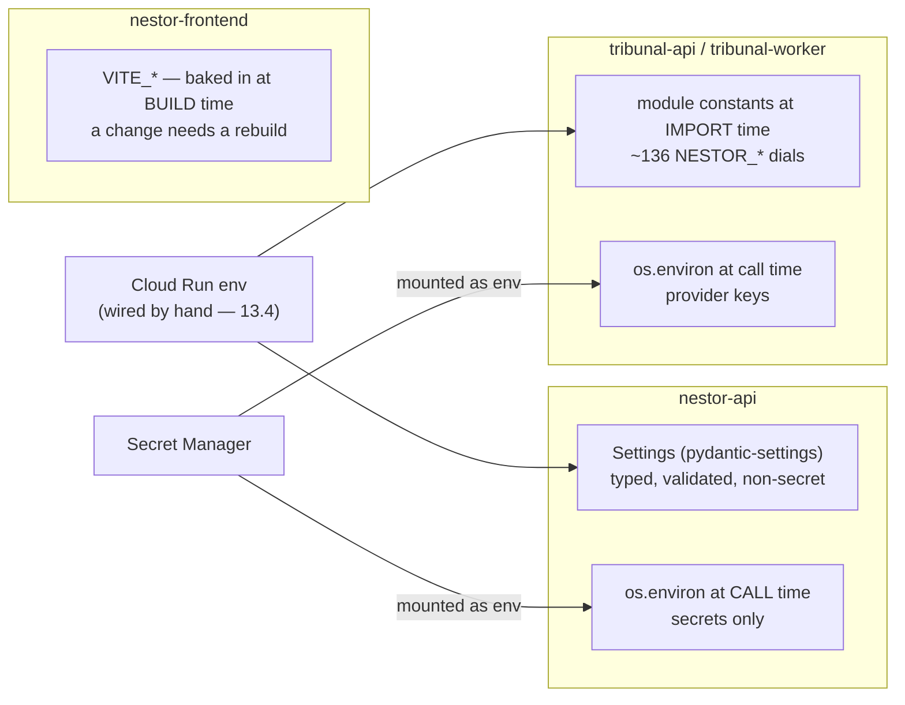

# 21 — Configuration reference

| | |
|---|---|
| **Audience** | Anyone changing a tuning dial, provisioning a service, or asking "where does this number come from" |
| **Type** | Reference |
| **Source of truth** | `backend/app/core/config.py`, `backend/app/db/base.py`, `backend/app/ai/clients.py`, `backend/app/mail/resend.py`, the `frontend/src/lib/` client seams, and the module-level constants throughout `tribunal/nestor_pulse_sdk/` |
| **Last verified** | commit `c8b8583`, 2026-09-03 |

## 21.1 In one paragraph

The system is configured almost entirely by environment variable, and the four services do it three
different ways. The backend has a typed, validated `Settings` object for everything non-secret and
reads every secret from `os.environ` at call time, so a secret never lands in typed config or a log.
The frontend takes a handful of `VITE_*` values baked in at build time. The engine has no settings
object at all: roughly 136 `NESTOR_*` names are read as **module-level constants at import time**,
which makes them cheap to add and means a change needs a new revision, not a new request. This
chapter is the single index of all of them, because until now the only way to find a dial was to grep
the engine.

## 21.2 The configuration model

Three rules hold across all four services, and each was a decision rather than a habit.

**Secrets never enter typed configuration.** `Settings` carries no database password and no provider
API key by design (`backend/app/core/config.py`, 17 · D-07 and D-09). Cloud SQL access is IAM-only
through the connector, which needs only the non-secret `INSTANCE_CONNECTION_NAME`, `DB_USER` and
`DB_NAME`. Provider keys are read inside the function that calls the provider, so a settings dump or
a validation error cannot print one. See [14 — Security and compliance](14-security-and-compliance.md)
§ 14.5.

**Model ids are configuration, not literals** (17 · D-06). Every model the backend uses is an
env-overridable field, so a renamed or upgraded model is a variable change rather than a code change,
and the id that actually ran is persisted on `skill_runs.llm_model` for observability. The engine
follows the same rule with its `NESTOR_*_MODEL` names. See
[11 — Models and providers](11-models-and-providers.md).

**Engine dials are read once, at import.** Constants like
`_D6_MAX_WINNERS = int(os.environ.get("NESTOR_TRIBUNAL_D6_MAX_WINNERS", "32"))`
(`pipeline/tribunal/research_division.py:260`) evaluate when the module loads. Two consequences
matter operationally: a dial cannot be changed for a run already in flight, and a value that fails to
parse fails at startup rather than mid-run.

## 21.3 Backend: the typed settings

Every field below is non-secret and optional. Names are matched case-insensitively against the
upper-cased env name, no `.env` file is read, and unknown names are ignored
(`model_config`, `config.py`).

| Env name | Default | What it is |
|---|---|---|
| `INSTANCE_CONNECTION_NAME` | `None` | Cloud SQL connector target, `project:region:instance` |
| `DB_USER` | `None` | IAM service-account login name. No password field exists (D-09) |
| `DB_NAME` | `None` | The application database |
| `DATABASE_URL` | `None` | `postgresql+pg8000://` DSN for local and testcontainer runs. Never set on Cloud Run |
| `PORT` | `8080` | Injected by Cloud Run |
| `FIREBASE_PROJECT_ID` | `None` | Explicit Admin SDK project override. Normally `None`, because ADC supplies the project through `GOOGLE_CLOUD_PROJECT`; it exists to pin the project locally so a verified token's `aud` matches |
| `STORAGE_BUCKET` | `None` | GCS bucket **name**. Non-secret: V4 signing is keyless through the IAM `signBlob` API, so Phase 9 added zero Secret Manager resources |
| `NESTOR_ADMIN_EMAIL` | `None` | The single ops address the `admin_validated` mail targets (D-08) |
| `APP_BASE_URL` | `None` | Origin for every mail CTA and the mail logo. CTAs are intake-id app routes, never bearer tokens |
| `TRIBUNAL_SERVICE_URL` | `None` | The `tribunal-api` Cloud Run URL. Used **verbatim** as the OIDC audience, so it must carry no path suffix |
| `MODEL_APPLY_INTAKE` | `claude-sonnet-4-5` | See [11](11-models-and-providers.md) |
| `MODEL_CONTEXT_PACK` | `claude-sonnet-4-5` | |
| `MODEL_STRUCTURE_ANSWERS` | `claude-sonnet-4-6` | |
| `MODEL_EXTRACT_INSIGHTS` | `claude-sonnet-4-6` | |
| `MODEL_EMBEDDINGS` | `text-embedding-3-small` | 1,536 dimensions (D-02). A vector column's width is immutable once populated |
| `MODEL_TRANSCRIPTION` | `whisper-1` | |
| `CORS_ALLOWED_ORIGINS` | `[]` (empty) | Exact-origin allowlist, as a comma-separated list **or** a JSON array. Empty means no `CORSMiddleware` is installed at all, never a permissive `*` |

⚠ **`CORS_ALLOWED_ORIGINS` carries a fixed bug worth knowing about.** Without the `NoDecode`
annotation, pydantic-settings JSON-decodes a `list[str]` env value *before* the `mode="before"`
validator runs, so a comma-separated value crashed startup. That is what broke Phase 12 revision
`00021` (17 · F-02). `NoDecode` hands the raw string to `_split_cors_origins`, which accepts either
form, strips items and drops empties. Credentials are allowed only against the pinned list; `*` plus
credentials is forbidden both by the browser and by this design.

## 21.4 Backend: names read outside `Settings`

These are read directly from `os.environ`, either because they are secrets or because
`app.db.base` must not import `app.core` — that would be an import cycle (D-06).

| Env name | Read at | Why it is not a typed field |
|---|---|---|
| `ANTHROPIC_API_KEY` | call time, `app/ai/clients.py` | Secret (D-07) |
| `OPENAI_API_KEY` | call time, `app/ai/clients.py` | Secret |
| `RESEND_API_KEY` | call time, `app/mail/resend.py` | Secret; the only mail secret |
| `SUPERADMIN_DB_PASSWORD_SECRET` | migration and bootstrap path | Secret; the privilege bootstrap the IaC does not cover |
| `INSTANCE_CONNECTION_NAME`, `DB_USER`, `DB_NAME`, `DATABASE_URL` | `app/db/base.py` | Also typed fields. Read directly to avoid the cycle, so the names **must** stay in sync between the two files |
| `CLOUD_SQL_IP_TYPE` | `app/db/base.py` | Connector IP selection; never surfaced as a typed field |

## 21.5 Frontend

`VITE_*` values are substituted at **build** time, so changing one requires a rebuild and redeploy
rather than an env edit on the service. Anything placed here is public by construction: it ships
inside the bundle.

| Env name | What it is |
|---|---|
| `VITE_API_BASE_URL` | Origin of `nestor-api` |
| `VITE_FIREBASE_API_KEY` | Identity Platform web API key (public by design) |
| `VITE_FIREBASE_AUTH_DOMAIN` | Identity Platform auth domain |
| `VITE_FIREBASE_PROJECT_ID` | Identity Platform project |
| `VITE_FIREBASE_EMULATOR` | Points auth at a local emulator |
| `VITE_MOCK_AUTH` | Bypasses real auth for local work against `mock-backend/` |

⛔ **`VITE_SUPABASE_URL` and `VITE_SUPABASE_ANON_KEY` are still read.** They are residue of the
retired stack. The bundle guard covers `frontend/src`, but `frontend/scripts/*.ts` sits outside its
scope and embeds a real legacy project URL and publishable key; `cleanup.ts` deletes rows in that
legacy project. See [12](12-frontend.md) § 12.17 and [19](19-known-gaps-and-roadmap.md).

## 21.6 Engine: infrastructure and credentials

| Env name | What it is |
|---|---|
| `DATABASE_URL` | DSN for the `tribunal` schema |
| `ANTHROPIC_API_KEY` | Claude, for the workshop, judge, skeptic and synthesis |
| `OPENAI_API_KEY` | The OpenAI deep-research adapter |
| `GEMINI_API_KEY` / `GOOGLE_API_KEY` | The Gemini adapter; either name is accepted |
| `SERPAPI_API_KEY` | Search. ⚠ A positive scan of the audit bucket for leaked secrets requires rotating this key first (19.3) |
| `AUDIT_GCS_BUCKET` | Where audit bodies are written, under 7×365-day Unlocked retention |
| `UPLOADS_GCS_BUCKET` | Uploaded source documents |
| `COST_PRICES_PATH` | Override for the price table. ⚠ The table can go stale silently — [11](11-models-and-providers.md) § 11.8 |
| `TRIBUNAL_SERVICE_URL` | Self-reference, used for OIDC audience checks |
| `INTAKE_RUNTIME_SA_EMAIL` | The one caller identity the internal-caller gate accepts ([09](09-tribunal-service.md) § 09.4) |
| `PDF_EXTRACTOR_URL` | Document text-extraction seam |
| `PORT`, `K_SERVICE` | Injected by Cloud Run. `K_SERVICE` is how the code detects that it is on Cloud Run |
| `LOCAL_DEV_AUTH`, `DEMO_MODE` | Local-only escapes. ⛔ Must never be set on a deployed revision |
| `NESTOR_AUDIT_LOCAL_DIR` | Writes audit bodies to a local directory instead of GCS (`audit/gcs_blob.py:296`). Local development only |
| `NESTOR_BASE_URL` | Origin used in generated links |

## 21.7 Engine: the tuning dials

All defaults below are the literals in the code at `c8b8583`. Names are grouped by the subsystem they
steer, and each group names the chapter that explains the mechanism.

### Workshop: candidate generation and orientation

Mechanism: [10](10-tribunal-pipeline.md) § 10.3.

| Name | Default |
|---|---|
| `NESTOR_TRIBUNAL_WORKSHOP_MODEL` | `claude-sonnet-5` |
| `NESTOR_TRIBUNAL_WORKSHOP_MAX_TOKENS` | `4096` |
| `NESTOR_TRIBUNAL_WORKSHOP_CONCURRENCY` | `4` |
| `NESTOR_TRIBUNAL_WORKSHOP_ORIENT_QUESTIONS` | `8` |
| `NESTOR_TRIBUNAL_WORKSHOP_ORIENT_SEARCHES` | `3` |
| `NESTOR_TRIBUNAL_WORKSHOP_ORIENT_FETCHES` | `2` |
| `NESTOR_TRIBUNAL_WORKSHOP_ORIENT_TURNS` | `3` |
| `NESTOR_TRIBUNAL_WORKSHOP_CANDIDATES_PER_Q` | `12` |
| `NESTOR_TRIBUNAL_WORKSHOP_CANDIDATES_PER_Q_MAX` | `24` |
| `NESTOR_TRIBUNAL_WORKSHOP_MAX_CANDIDATES` | `120` |
| `NESTOR_TRIBUNAL_WORKSHOP_ASPECTS_PER_Q_MAX` | `5` |
| `NESTOR_TRIBUNAL_WORKSHOP_DEFAULT_LANGS` | `en` |
| `NESTOR_TRIBUNAL_WORKSHOP_LANGS_MAX` | `3` |
| `NESTOR_TRIBUNAL_WORKSHOP_CLUSTER` | `true` |

### Workshop: the loop, the tournament and evolution

| Name | Default | Note |
|---|---|---|
| `NESTOR_TRIBUNAL_WORKSHOP_LOOP_ROUNDS` | `10` | Hard cap on loop rounds |
| `NESTOR_TRIBUNAL_WORKSHOP_LOOP_MIN_ROUNDS` | `4` | Floor. The exit test cannot fire earlier |
| `NESTOR_TRIBUNAL_WORKSHOP_ROUNDS_MIN` | `6` | Swiss rounds, minimum |
| `NESTOR_TRIBUNAL_WORKSHOP_ROUNDS_MAX` | `10` | Swiss rounds, maximum |
| `NESTOR_TRIBUNAL_WORKSHOP_ROUNDS` | `0` | `0` means derive from the field size |
| `NESTOR_TRIBUNAL_WORKSHOP_TOURNAMENT` | `true` | |
| `NESTOR_TRIBUNAL_WORKSHOP_CRITIQUE` | `true` | |
| `NESTOR_TRIBUNAL_WORKSHOP_CRITIQUE_BATCH` | `40` | |
| `NESTOR_TRIBUNAL_WORKSHOP_EVOLVE` | `true` | |
| `NESTOR_TRIBUNAL_WORKSHOP_EVOLVE_NEW` | `6` | |
| `NESTOR_TRIBUNAL_WORKSHOP_EVOLVE_MODEL` | `claude-sonnet-5` | |
| `NESTOR_TRIBUNAL_WORKSHOP_EVOLVE_MAX_TOKENS` | `4096` | |
| `NESTOR_TRIBUNAL_WORKSHOP_META_REVIEW` | `true` | |
| `NESTOR_TRIBUNAL_WORKSHOP_META_MODEL` | falls back to the rank model | `workshop_evolve.py:219` |
| `NESTOR_TRIBUNAL_WORKSHOP_META_ENTRIES` | `40` | |
| `NESTOR_TRIBUNAL_WORKSHOP_RANK_MODEL` | `gemini-3.7-flash` | Moved 2026-09-01 on measured position bias |
| `NESTOR_TRIBUNAL_WORKSHOP_RANK_CONCURRENCY` | `4` | |
| `NESTOR_TRIBUNAL_WORKSHOP_RANK_RETRIES` | `2` | |
| `NESTOR_TRIBUNAL_WORKSHOP_RANK_BACKOFF_S` | `2.0` | |
| `NESTOR_TRIBUNAL_WORKSHOP_MATCHES_PER_CALL` | `10` | |
| `NESTOR_TRIBUNAL_WORKSHOP_ALTERNATE_AB` | `true` | The position-bias mitigation: swap which option is listed first |
| `NESTOR_TRIBUNAL_WORKSHOP_ELO_K` | `32` | |
| `NESTOR_TRIBUNAL_WORKSHOP_ELO_START` | `1200` | |
| `NESTOR_TRIBUNAL_WORKSHOP_WINNERS_MIN` | `10` | |
| `NESTOR_TRIBUNAL_WORKSHOP_WINNERS_MAX` | `15` | ⚠ Not the dispatch cap — see 21.8 |
| `NESTOR_TRIBUNAL_WORKSHOP_WINNERS_FRACTION` | `0.35` | |
| `NESTOR_TRIBUNAL_WORKSHOP_FLOOR_PER_Q` | `5` | Winners guaranteed per client question |
| `NESTOR_TRIBUNAL_WORKSHOP_CROSS_SLOTS` | `2` | Cross-cutting slots |
| `NESTOR_TRIBUNAL_WORKSHOP_CATCH_UP_MAX` | `120` | |
| `NESTOR_TRIBUNAL_WORKSHOP_MAX_FINDINGS` | `8` | |
| `NESTOR_TRIBUNAL_WORKSHOP_MAX_CONFLICTS` | `5` | |

Prompt and text budgets in the same subsystem, all in characters:
`WORKSHOP_QUESTION_CHARS` `400`, `WORKSHOP_CANDIDATE_CHARS` `600`,
`WORKSHOP_PROMPT_CANDIDATE_CHARS` `600`, `WORKSHOP_WINNER_CHARS` `600`,
`WORKSHOP_CONTEXT_CHARS` `2000`, `WORKSHOP_GUIDANCE_CHARS` `600`,
`WORKSHOP_ASPECT_CHARS` `220`, `WORKSHOP_FLAW_CHARS` `160`.

⚠ **Character caps sit in series, so raising one alone can be inert.** The gate's decision context
measured 576 of its 1,200-character allowance while a 120-character join key was the real
constraint, which meant a ranking test was judging half-sentences (17 · G-5). Check both ends before
concluding that a cap is the problem.

### Grouping and the research division

Mechanism: [10](10-tribunal-pipeline.md) § 10.4.

| Name | Default | Note |
|---|---|---|
| `NESTOR_TRIBUNAL_D6_GROUPING_MODE` | resolved, not a literal | `question_grouping.py:311`. Deterministic one-group-per-question is the primary path; `topic` is the LLM option (17 · D-W4-4a supersedes D-R4) |
| `NESTOR_TRIBUNAL_D6_MAX_GROUPS` | `5` | Floored at 1 |
| `NESTOR_TRIBUNAL_D6_MAX_GROUP_SIZE` | `7` | Floored at 3 |
| `NESTOR_TRIBUNAL_D6_MAX_RIDERS_PER_GROUP` | `3` | |
| `NESTOR_TRIBUNAL_D6_MAX_WINNERS` | `32` | **The dispatch cap. This is the wallet — 21.8** |
| `NESTOR_TRIBUNAL_D6_MIN_CORROBORATION` | `2` | |
| `NESTOR_TRIBUNAL_D7_MAX_LANGS` | `3` | |
| `NESTOR_TRIBUNAL_MAX_ANGLES` | `28` | High-stakes redundancy copies are dropped first when this binds |
| `NESTOR_TRIBUNAL_ANGLE_CONCURRENCY` | `4` | |
| `NESTOR_TRIBUNAL_GROUP_VERIFY` | `true` | |
| `NESTOR_TRIBUNAL_GROUP_BATCH` | `40` | |
| `NESTOR_TRIBUNAL_GROUP_CONCURRENCY` | `4` | |
| `NESTOR_TRIBUNAL_DISCOVERY_SLOTS` | `5` | |
| `NESTOR_TRIBUNAL_DISCOVERY_PER_PARENT` | `3` | |
| `NESTOR_TRIBUNAL_SUBQ_CHARS` | `600` | |
| `NESTOR_TRIBUNAL_ANCHORS` | `true` | |
| `NESTOR_TRIBUNAL_ANCHOR_LEDGER_MAX` | `120` | |
| `NESTOR_TRIBUNAL_ANCHOR_LEDGER_CHARS` | `160` | |

### Deep research, the own researcher and search

| Name | Default | Note |
|---|---|---|
| `NESTOR_GEMINI_DR_AGENT` | `deep-research-max-preview-04-2026` | `audit/audited_llm_client.py:171` |
| `NESTOR_OPENAI_DR_MODEL` | `gpt-5.6-sol` | `:197`. The same model the Perplexity `high` preset resells (11.9) |
| `NESTOR_GEMINI_INTERACTIONS_BASE`, `_REVISION` | — | Gemini interactions endpoint pinning |
| `NESTOR_DR_TIMEOUT_S` | computed | |
| `NESTOR_TRIBUNAL_OWN_MODEL` | `claude-sonnet-5` | |
| `NESTOR_TRIBUNAL_OWN_MAX_TOKENS` | `8192` | |
| `NESTOR_TRIBUNAL_OWN_MAX_TURNS` | `8` | |
| `NESTOR_TRIBUNAL_OWN_MAX_SEARCHES` | `6` | |
| `NESTOR_TRIBUNAL_OWN_MAX_FETCH` | `6` | |
| `NESTOR_TRIBUNAL_OWN_MAX_PAUSES` | `3` | |
| `NESTOR_TRIBUNAL_OWN_TIMEOUT_S` | computed | |
| `NESTOR_TRIBUNAL_MAX_PAUSE_CONTINUATIONS` | `3` | |
| `NESTOR_TRIBUNAL_SERPAPI_MAX_RESULTS` | `10` | |
| `NESTOR_TRIBUNAL_SERPAPI_CONCURRENCY` | `4` | |
| `NESTOR_TRIBUNAL_SERPAPI_TIMEOUT_S` | `30` | |
| `NESTOR_TRIBUNAL_SERPAPI_UNIT_USD` | `""` | Empty means search contributes no priced cost |
| `NESTOR_TRIBUNAL_RESUME_REDISPATCH` | `false` | |

⛔ The `own` / SerpAPI stream was cut from the live rotation in Phase 15.6 (17 · D-W3-3) and survives
only on a degraded broadcast path, where `degraded_parallel.ALL_PROVIDERS` still lists it. The live
rotation is `("gemini", "openai", "claude")`.

### Claims, facts, gates and the skeptic

Mechanism: [10](10-tribunal-pipeline.md) § 10.5.

| Name | Default |
|---|---|
| `NESTOR_TRIBUNAL_MAX_CLAIMS` | `0` (unbounded) |
| `NESTOR_TRIBUNAL_D8_FACT_LIST` | `true` |
| `NESTOR_TRIBUNAL_FACTS_MAX_PER_PROVIDER` | `400` |
| `NESTOR_TRIBUNAL_FACT_MAX_CHARS` | `1200` |
| `NESTOR_TRIBUNAL_FACTLIST_RETRY` | `1` |
| `NESTOR_TRIBUNAL_FACTLIST_RETRY_MAX_CHARS` | `400000` |
| `NESTOR_TRIBUNAL_GATE_BATCH` | `40` |
| `NESTOR_TRIBUNAL_GATE_CONCURRENCY` | `4` |
| `NESTOR_TRIBUNAL_GATE_RETRIES` | `2` |
| `NESTOR_TRIBUNAL_GATE_BACKOFF_S` | `2.0` |
| `NESTOR_TRIBUNAL_GATE_CONTEXT_CHARS` | `4000` |
| `NESTOR_TRIBUNAL_GATE_BRIEF_CHARS` | `4000` |
| `NESTOR_TRIBUNAL_CLUSTER` | `true` |
| `NESTOR_TRIBUNAL_CLUSTER_BATCH` | `40` |
| `NESTOR_TRIBUNAL_CLUSTER_CONCURRENCY` | `4` |
| `NESTOR_TRIBUNAL_CLUSTER_MAX_BLOCK` | `60` |
| `NESTOR_TRIBUNAL_SKEPTIC_CONCURRENCY` | `8` |
| `NESTOR_SKEPTIC_TIMEOUT_S` | `300` |
| `NESTOR_TRIBUNAL_SURVIVAL_RULE` | `majority-independent` |
| `NESTOR_QUALITY_GATE` | `existing` |

The skeptic is 79% of run cost and scales linearly at roughly $0.11 per claim group, so
`SKEPTIC_CONCURRENCY` changes wall-clock while `MAX_CLAIMS` changes the bill. See
[11](11-models-and-providers.md) § 11.6.

### Synthesis, distillation and report shape

Mechanism: [10](10-tribunal-pipeline.md) § 10.7.

| Name | Default |
|---|---|
| `NESTOR_DISTILLER_CHUNK_CHARS` | `60000` |
| `NESTOR_DISTILLER_CONCURRENCY` | `4` |
| `NESTOR_TRIBUNAL_SECTION_MAX_ITEMS` | `200` |
| `NESTOR_TRIBUNAL_SECTION_ITEM_CHARS` | `400` |
| `NESTOR_YIELD_QUESTION_MAX` | `600` |
| `NESTOR_TRIBUNAL_NOT_FOUND_MAX` | `100` |
| `NESTOR_TRIBUNAL_NOT_FOUND_TOTAL_MAX` | `300` |

⛔ The claim distiller stays deliberately on `gemini-2.5-flash`. Moving it is owed a separate replay
of the four recorded separator responses in `test_distiller_separators.py`, because the separator
priority order `("\t", "<TAB>", "|||", "|")` **is** the contract. This is a decision, not unfinished
work (19.3).

### Reliability, budget and the circuit breaker

Mechanism: [10](10-tribunal-pipeline.md) § 10.8.

| Name | Default | Note |
|---|---|---|
| `NESTOR_TRIBUNAL_MAX_BUDGET_USD` | `25.00` | |
| `NESTOR_TRIBUNAL_UNCAPPED` | `""` | ⛔ Set to `1` on the live services, which makes `over_budget()` return `False` **before it queries**. Operator ruling 2026-09-01: leave it uncapped and surface cost instead |
| `NESTOR_TRIBUNAL_BUDGET_BEHAVIOUR` | `flag-budget-capped` | `pipeline/tribunal/budget.py:70` |
| `NESTOR_TRIBUNAL_RETRY_ATTEMPTS` | `4` | |
| `NESTOR_TRIBUNAL_RETRY_BASE_S` | `2.0` | |
| `NESTOR_TRIBUNAL_RETRY_JITTER` | `true` | |
| `NESTOR_TRIBUNAL_RETRY_AFTER_MAX_S` | `300` | |
| `NESTOR_TRIBUNAL_BREAKER_OPEN_S` | `60` | |
| `NESTOR_TRIBUNAL_BREAKER_OPEN_MAX_S` | `600` | |
| `NESTOR_TRIBUNAL_BREAKER_HARD_THRESHOLD` | `5` | |
| `NESTOR_TRIBUNAL_BREAKER_OVERLOAD_THRESHOLD` | `10` | |
| `NESTOR_TRIBUNAL_BREAKER_SIGNATURE_CHARS` | `80` | |
| `NESTOR_TRIBUNAL_CHECKPOINTS` | `true` | |
| `NESTOR_TRIBUNAL_CKPT_MAX_BYTES` | `16000000` | |

### The worker and the run feed

Mechanism: [09](09-tribunal-service.md) § 09.5.

| Name | Default | Note |
|---|---|---|
| `NESTOR_WORKER_POLL_INTERVAL` | `2.0` | ⚠ The loop **claims first and sleeps last**, so `min-instances=0` does not stop a booting worker from claiming a run. An empty queue is the only protection |
| `NESTOR_WORKER_HEARTBEAT_S` | `30` | |
| `NESTOR_WORKER_STALE_MINUTES` | `60` | |
| `NESTOR_WORKER_MAX_RECLAIMS` | `2` | |
| `NESTOR_RUN_EVENT_BATCH` | `200` | |
| `NESTOR_RUN_EVENT_FLUSH_S` | `1.0` | |
| `NESTOR_RUN_EVENT_QUEUE_MAX` | `5000` | |
| `NESTOR_RUN_EVENT_TEXT_MAX` | `400` | |
| `NESTOR_TRIBUNAL_FEED_DEBOUNCE_S` | `0.75` | |
| `NESTOR_TRIBUNAL_FEED_MAX_ITEMS` | `200` | |
| `NESTOR_TRIBUNAL_FEED_ROWS_PER_STAGE` | `25` | |
| `NESTOR_TRIBUNAL_FEED_PROMPT_MAX` | `400` | |

### Citations and redirect resolution

Mechanism: [09](09-tribunal-service.md) § 09.7. `NESTOR_REDIRECT_RESOLVE_ENABLED`, `_CONCURRENCY`,
`_TIMEOUT_S` and `_DEADLINE_S` all resolve through `_env_flag` / `_env_int` / `_env_float` against
module defaults (`citations/redirect_resolver.py:272`, `:300-302`) rather than inline literals, so
the default is in the module constant, not at the read site.

### Local development and test escapes

`NESTOR_E2E`, `NESTOR_CLARIFY_E2E`, `NESTOR_CLARIFY_ENGINE` (`both`), `NESTOR_SDK_ORCHESTRATOR`,
`NESTOR_SMOKE_PROJECT_ID`, `NESTOR_SMOKE_TOKEN`, and the admission dials
`NESTOR_TRIBUNAL_ADMISSION_MAX_TOKENS` `1024`, `_ADMISSION_SEARCHES` `2`, `_ADMISSION_TURNS` `2`.
⛔ None of the E2E or smoke names belongs on a deployed revision.

## 21.8 The dials that bound spend

The budget governor has never fired, so these are the wallet. Ranked by how directly each moves the
bill:

1. `NESTOR_TRIBUNAL_D6_MAX_WINNERS` — **32**. Bounds dispatched winners, and dispatch is what buys
   deep research.
2. `NESTOR_TRIBUNAL_MAX_ANGLES` — **28**. Bounds total angles across providers.
3. `NESTOR_TRIBUNAL_D6_MAX_GROUPS` — **5**, with `_MAX_GROUP_SIZE` **7**.
4. `NESTOR_TRIBUNAL_MAX_CLAIMS` — **0**, unbounded, feeding the skeptic that is 79% of cost.
5. `NESTOR_TRIBUNAL_WORKSHOP_LOOP_ROUNDS` — **10**, with a floor of 4 rounds that cannot be skipped.

⚠ **`_D6_MAX_WINNERS` (32) and `_WINNERS_MAX` (15) are different caps and are easy to confuse.** The
workshop cap bounds what the tournament promotes per round; the dispatch cap bounds what gets bought.
The dispatch cap is more than twice the workshop figure, and it is the one that bounds spend.

## 21.9 Names that are dead or test-only

Recorded because grepping the engine finds these names and implies a dial that is not there.

| Name | Reality |
|---|---|
| `NESTOR_RUN_EVENT_POLL_STRIDE` | ⛔ Referenced only in a **comment** (`audit/audited_llm_client.py:110`). The long-poll heartbeat it strided was removed on operator request; the constant went with it |
| `NESTOR_USE_WORKSHOP` | Appears outside production code only. The workshop is not behind a flag |
| `NESTOR_GATE_CALIBRATION`, `_CLUSTER`, `_SAMPLE` | Test-only |
| `NESTOR_TRIBUNAL_DISCOVERY_URL` | Test-only |
| `NESTOR_TRIBUNAL_D6_HIGH_RANKS` | Test-only |
| `NESTOR_TRIBUNAL_`, `NESTOR_TRIBUNAL_WORKSHOP_` | Not variables at all. Prefix fragments from constructed names, which a naive grep reports as dials |

## 21.10 Traps

- **A dial is read at import.** Editing a Cloud Run env var takes effect on the next revision's cold
  start, never on a run already claimed. Do not expect a mid-run change.
- **`Settings` and `app/db/base.py` read the same names independently.** They are kept in sync by a
  comment and by hand, not by a type. Changing an env name means changing both.
- **Terraform declares no memory or concurrency**, and the live wiring has been manual since Phase 2,
  so the values on the running services are not derivable from this repository. Read them with
  `gcloud run services describe`. See [13](13-infrastructure-and-deploy.md) § 13.4.
- **Which Anthropic secret the engine actually uses is contested by the sources.** The deploy mounts
  `Nestor_Claude2` while the in-process bootstrap re-exports `Nestor_Claude`. Both facts are
  recorded; the live answer needs a `describe`.
- **`VITE_*` is build-time.** Setting one on the running service does nothing at all.

## 21.11 Where to look

| To change | Open |
|---|---|
| A backend non-secret setting | `backend/app/core/config.py` |
| A backend secret's read site | `backend/app/ai/clients.py`, `backend/app/mail/resend.py` |
| The database connector branch | `backend/app/db/base.py` |
| A frontend build value | the frontend env files, then rebuild |
| A workshop dial | `tribunal/nestor_pulse_sdk/pipeline/tribunal/workshop*.py` |
| A grouping or dispatch cap | `tribunal/nestor_pulse_sdk/pipeline/tribunal/question_grouping.py`, `research_division.py` |
| A gate or skeptic dial | `tribunal/nestor_pulse_sdk/pipeline/tribunal/`, `tribunal/nestor_pulse_sdk/critique/` |
| Budget and breaker | `tribunal/nestor_pulse_sdk/pipeline/tribunal/budget.py` |
| Citations and redirects | `tribunal/nestor_pulse_sdk/citations/redirect_resolver.py` |
