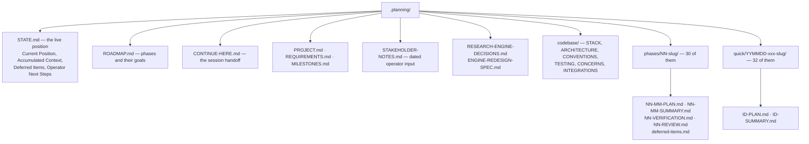
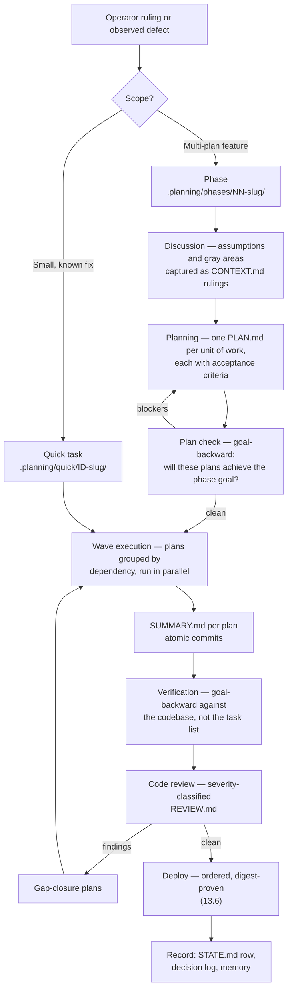

# 22 — How work is done here: the development workflow

| | |
|---|---|
| **Audience** | Anyone about to change this repository, and anyone auditing how a change got in |
| **Type** | Explanation and how-to |
| **Source of truth** | `CLAUDE.md`, `AGENTS.md`, `.planning/config.json`, `.planning/STATE.md`, `.planning/ROADMAP.md`, the 30 directories under `.planning/phases/` and the 32 under `.planning/quick/` |
| **Last verified** | commit `c8b8583`, 2026-09-03 |

## 22.1 In one paragraph

Every change to this repository goes through a planned, artefact-producing workflow before it
touches a file, and the planning record is committed alongside the code. That is not process for its
own sake: this codebase inherited five security flaws from a system that had no tests, and it still
has no automated coverage of its own frontend rendering. The discipline is the substitute for a
safety net that does not exist yet. The rule is stated as a mandate in `CLAUDE.md` — no direct repo
edits outside a workflow unless the operator explicitly asks to bypass it — and the artefacts it
leaves behind (plans, summaries, verifications, reviews, decision rulings) are what chapters 17 and
19 of this handbook are assembled from.

## 22.2 Why the workflow exists

The original system was built quickly on a third-party platform and shipped with broken row-level
security, no server-side tenant enforcement, a disabled auth guard, and zero automated tests. See
[02 — History](02-history-and-timeline.md) § 02.2 for the five inherited flaws.

That history produced three working conclusions, all of which the workflow encodes:

**A change without a written intent cannot be reviewed.** So work starts by producing a plan with
explicit acceptance criteria, and the plan is checked against the phase goal *before* execution
rather than after.

**A green gate is evidence about a gate, not about the system.** [15 — Quality and testing](15-quality-and-testing.md)
§ 15.6 catalogues twelve occasions where a gate passed while the thing it named was broken. So
verification is a separate step with its own artefact, performed against the goal rather than
against the task list.

**A decision that is not written down gets re-litigated or silently reversed.** So rulings get
identifiers, are never renumbered, and are superseded rather than deleted.

## 22.3 The artefact tree

`.planning/` holds the entire record. It is listed in `.gitignore:32` as local-only, and **638 files
under it are nevertheless tracked**, having been force-added. That combination is deliberate and is
also a trap — see 22.9.

The split that matters: **`STATE.md` is the live position and `ROADMAP.md` is the intent.** When they
disagree, `STATE.md` wins — the roadmap table has gone stale before and the plan index collapses
waves, so plan frontmatter is authoritative for wave membership.

## 22.4 The lifecycle of a change

The gates are configured, not implied. `.planning/config.json` sets `plan_check: true`,
`verifier: true`, `code_review: true` with `code_review_depth: "standard"`,
`nyquist_validation: true`, `node_repair: true` with a budget of `2`, `auto_advance: false`, and
`model_profile: "quality"`. Branching is `"none"`: work lands on `master` directly, which is why the
ordered deploy procedure and the digest proof in
[13](13-infrastructure-and-deploy.md) § 13.6 carry the weight a release branch would elsewhere.

Note `commit_docs: false` — the workflow does not auto-commit its own artefacts, which is why
planning files have to be force-added by hand.

## 22.5 Phases versus quick tasks

| | Phase | Quick task |
|---|---|---|
| Lives in | `.planning/phases/NN-slug/` | `.planning/quick/YYMMDD-xxx-slug/` |
| Tracked in | `ROADMAP.md` plus `STATE.md` | the Quick Tasks table in `STATE.md` only |
| Artefacts | plans, summaries, verification, review, deferred items | one plan and one summary |
| Default gates | discussion, research, plan check, verification, review | none, unless asked for |
| Use when | the work is a feature or a milestone slice | the fix is understood before starting |

Thirty phases and thirty-two quick tasks exist at `c8b8583`. The numbering of both is append-only:
**identifiers are never reused and never renumbered**, because the decision log, the verification
reports and this handbook all cite them.

## 22.6 Waves, parallel executors and the stale-base trap

Plans within a phase are grouped into **waves** by dependency, and plans in the same wave execute in
parallel, each in its own git worktree. This is where the workflow's sharpest failure mode lives.

⚠ **The stale-base trap has fired more than thirty times.** A worktree executor can be created from
a stale base commit and run to completion against it, producing correct-looking work on the wrong
foundation — observed up to 882 commits behind, always from the same base. The check that reads
green while stale is `git rev-list --count`, which reports `0`; the check that catches it is
comparing `merge-base` against the intended base. Positive-presence sentinels asserted as an abort
gate before any spend are the standing mitigation.

Two related hazards, both recorded because both have happened:

- **Working-directory drift on merge.** Guard `HEAD` and the branch name before every post-wave
  merge; a worktree's CWD has moved under a merge before.
- **Planning files invisible to executors.** `.planning/` is gitignored, so a planning file that was
  never force-added does not exist inside a worktree. An executor then plans against a file it
  cannot see. Always `git add -f`.

## 22.7 What a gate is worth

The workflow's own conclusion, earned the hard way, is that gates constrain but do not prove. The
current top failure surface is **the plan's own acceptance criteria**: a criterion already satisfied
at `HEAD` is decoration rather than a gate, and a criterion can be satisfied by a substring match on
an unrelated symbol. Phase 23 is the reference case — `tsc` reported zero errors, 123 tests passed
and the i18n audit passed, while a label asserted the opposite of its own figure in all three
languages and a tooltip was clipped away on twelve of eighteen rows.

The full catalogue of twelve distinct ways a gate has lied here is in
[15 — Quality and testing](15-quality-and-testing.md) § 15.6. Read it before writing an acceptance
criterion, not after.

Two habits follow. **Reconcile a plan's greps to purpose before executing it**: six of eight Phase 21
plans carried an unsatisfiable acceptance criterion, and in one case a pre-existing test had pinned
the defect as expected behaviour. And **green gates say nothing about the seams between plans** —
Phase 22 shipped forty-two passing verification checks and 1,283 green tests with two critical
defects living in the joins.

## 22.8 Identifier and honesty discipline

**Identifiers are never renumbered.** Fourteen distinct families are in use, from `D-NN` through
`G-01…G-14`, `D-R1…D-R11`, the `D-W3/W4/W5-*` operator rulings and the `S/B/V/F-*` review series.
[20 — Glossary](20-glossary.md) § 20.4 lists all of them, including the two families this handbook
introduced for decisions the record states without ids.

**Superseded decisions are kept and marked, never deleted.** A reader who finds only the current rule
cannot tell why the earlier one was wrong. `D-R4` and `D-W4-4a` in
[17](17-decision-log.md) § 17.14 are the worked example: the original ruling had an LLM group winners
into at most five groups, and a later ruling made one deterministic group per client question the
primary path. Both are recorded.

**The three honesty markers are a working practice, not decoration.**

| Marker | Obligation it creates |
|---|---|
| ⛔ | The thing has never executed or never been observed. Any figure attached to it is arithmetic or replay and must say so |
| ⚠ | Measured once, fragile, or inconsistent with something adjacent. Do not build on it without re-measuring |
| **SUPERSEDED** | Kept deliberately. Do not tidy it away |

The rule this enforces is the one that most often gets broken under time pressure: **a projection is
never presented as an observation.** Every engine cost and quality figure for the models deployed on
2026-09-01 is arithmetic over replayed prompts, because those models have still never executed a run.

## 22.9 Traps

- **`.planning/` is gitignored but mostly tracked.** 638 files are force-added. A new planning file is
  invisible until `git add -f`, including to worktree executors.
- **The roadmap table goes stale.** Trust `STATE.md` for position and plan frontmatter for wave
  membership; the plan index collapses waves.
- **The decision-coverage gate skips identifiers that are not `D-NN`.** Most of this project's
  rulings are in other families, so coverage numbers from that gate understate what exists.
- **Past roughly fifteen plans, parallel planners are blind to each other.** Budget an orchestrator
  reconciliation pass for a large phase.
- **`builds submit | tail` reports exit 0 on failure.** Gate on the exit code, never on a tail of the
  log. The same class of error is why a deploy is proven by reading `status.imageDigest` off the
  revision rather than by trusting the mutable image tag.
- **Never read or cite anything under `.claude/worktrees/`.** It is an orphaned stale copy of the whole
  repository and has twice made correct deletions read as incomplete.

## 22.10 Standing operator preferences

Recorded because they change how work should be presented, not just how it is done.

- **Explain the mechanism in plain language before offering options.** The operator challenges
  premises and process, not only conclusions, so a choice presented without its mechanism gets sent
  back.
- **Prefer targeted greps over a research agent** when a previous session already did the analysis.
- **Report real numbers or say plainly that something was not run.** A claimed test run that did not
  happen is worse than an admitted gap; the local Python is gcloud's bundled 3.11.9 while the backend
  requires 3.12 or newer, so "the suite passes" is often not a claim this machine can make.
- **Fix the feed before spending on a run.** When an observability defect and an expensive run are
  both pending, the ruling has been to fix first so one paid run validates both.

## 22.11 Where to look

| To find | Open |
|---|---|
| The mandate itself | `CLAUDE.md` (GSD Workflow Enforcement) |
| The live position and next steps | `.planning/STATE.md`, `.planning/CONTINUE-HERE.md` |
| Which gates are on | `.planning/config.json` |
| A phase's plans and outcome | `.planning/phases/NN-slug/` |
| A small task's record | `.planning/quick/ID-slug/` |
| Dated operator input | `.planning/STAKEHOLDER-NOTES.md` |
| Why a rule exists | [17 — Decision log](17-decision-log.md) |
| How a gate lied before | [15 — Quality and testing](15-quality-and-testing.md) § 15.6 |
| The deploy procedure a change ends in | [13 — Infrastructure and deploy](13-infrastructure-and-deploy.md) § 13.6 |
