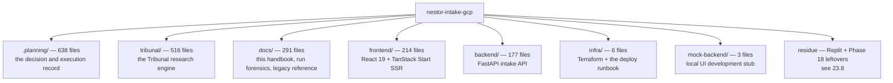

# 23 — Repository map

| | |
|---|---|
| **Audience** | Anyone opening this repository for the first time, or looking for the chapter that owns a path |
| **Type** | Reference |
| **Source of truth** | `git ls-files` at `c8b8583` |
| **Last verified** | commit `c8b8583`, 2026-09-03 |

## 23.1 In one paragraph

Every tracked path in the repository is listed here with what it is and which chapter documents it,
so that no directory in this project is undocumented. The counts are tracked files, not files on
disk — several directories also carry untracked build output and `__pycache__`. Two things are worth
knowing before reading the table: the planning record is the largest thing in the repository, larger
than any single service, and a handful of tracked paths are residue that should be deleted rather
than understood.

## 23.2 The whole repository at a glance

## 23.3 The four services

| Path | Files | What it is | Chapter |
|---|---|---|---|
| `backend/app/` | — | The `nestor-api` FastAPI application | [06](06-backend-intake-api.md) |
| `backend/app/api/` | — | Route modules: `auth_routes`, `admin_routes`, `intake_routes`, `research_routes`, `ai_routes`, `storage_routes`, `me_routes`, plus `errors.py` | [06](06-backend-intake-api.md) § 06.8 |
| `backend/app/ai/` | — | The six pre-research skills, provider clients, output parsing | [07](07-ai-skills.md) |
| `backend/app/research/` | — | The seam client, brief assembly, the poll driver | [08](08-research-seam.md) |
| `backend/app/auth/` | — | Identity Platform token verification and identity resolution | [06](06-backend-intake-api.md) § 06.6 |
| `backend/app/db/` | — | Engine factory, the tenant repository, models | [05](05-data-model.md), [06](06-backend-intake-api.md) § 06.7 |
| `backend/app/core/` | — | Typed settings | [21](21-configuration-reference.md) § 21.3 |
| `backend/app/mail/`, `storage/`, `data/` | — | Resend mail, GCS storage seam, static data | [06](06-backend-intake-api.md) § 06.12–06.13 |
| `backend/app/intake_canonical.py` | 1 | The one canonical intake template (D-CANON) | [06](06-backend-intake-api.md) § 06.15 |
| `backend/scripts/` | — | The four CI guard scripts | [06](06-backend-intake-api.md) § 06.14, [13](13-infrastructure-and-deploy.md) § 13.9 |
| `backend/tests/` | — | The backend suite, including the cross-tenant denial suites | [15](15-quality-and-testing.md) |
| `frontend/src/routes/` | — | File-based routes, dot-nested | [12](12-frontend.md) § 12.4 |
| `frontend/src/lib/api/` | — | The complete frontend↔backend contract | [12](12-frontend.md) § 12.6 |
| `frontend/src/lib/research/` | — | Feed rows, funnel labels, citation index, verification gate, work phase — and where most frontend tests live | [12](12-frontend.md) § 12.12 |
| `frontend/src/lib/i18n/` | — | Three locale catalogues and the schema localiser | [12](12-frontend.md) § 12.15 |
| `frontend/src/components/` | — | `intake/`, `admin/`, `sales/`, and `ui/` (shadcn — not edited directly) | [12](12-frontend.md) |
| `frontend/scripts/` | — | ⛔ Residue. Embeds a real legacy project URL and key; `cleanup.ts` deletes rows in the legacy project | [12](12-frontend.md) § 12.17 |
| `tribunal/nestor_pulse_sdk/` | — | **The engine.** `pipeline/`, `critique/`, `audit/`, `citations/`, `verification/`, `runs/`, `db/`, `auth/`, `orgs/`, `projects/`, `uploads/`, `tools/`, `server.py` | [09](09-tribunal-service.md), [10](10-tribunal-pipeline.md) |
| `tribunal/nestor_pulse_sdk/pipeline/tribunal/` | — | The workshop, grouping, research division, budget, adjudication | [10](10-tribunal-pipeline.md) § 10.3–10.5 |
| `tribunal/nestor_pulse_sdk/alembic/` | — | The engine's own migration lineage, with an isolated version table | [05](05-data-model.md) § 05.4 |
| `tribunal/nestor_pulse_sdk/tests/` | — | The engine suite and the replay fixtures | [15](15-quality-and-testing.md) § 15.5 |
| `tribunal/cloudbuild.*.yaml` | 8 | The build and gate configurations | [13](13-infrastructure-and-deploy.md) § 13.8 |
| `tribunal/infrastructure/` | — | Engine-side deploy scripting | [13](13-infrastructure-and-deploy.md) § 13.5 |
| `infra/` | 6 | `main.tf`, `variables.tf`, `outputs.tf`, `providers.tf`, `README.md`, and `DEPLOY-RUNBOOK.md` | [13](13-infrastructure-and-deploy.md) |

⚠ **`tribunal/nestor_pulse/` is not the engine.** It is a four-file remnant of the rejected ADK-rooted
predecessor, holding only `secrets.py` and a `tools/` directory. The engine is
`tribunal/nestor_pulse_sdk/`. Confusing the two is a documented hazard, because the names differ by a
suffix and the wrong one has no pipeline in it at all.

## 23.4 Documentation

| Path | What it is | Chapter |
|---|---|---|
| `docs/handbook/` | This handbook | [00](00-README.md) |
| `docs/tribunal-run-reports/` | Forensic reports on individual runs: workshop forensics for `d6bb3aae`, diagnostics, citations TSV, open questions and V-01 findings for `7dcf51d5`, the dispatch analysis for `368ff3a0`, and `V-01-COMPARISON.md` | [02](02-history-and-timeline.md) § 02.6, [16](16-operations-runbook.md) |
| `docs/BACKEND-MAP.md` | The legacy system's backend mapped out before migration | [02](02-history-and-timeline.md) § 02.2 |
| `docs/db_functions.sql` | The legacy schema's RPCs and triggers, kept as reference | [05](05-data-model.md) |
| `docs/supabase-functions/` | All 21 original Deno edge functions, kept as the parity reference | [07](07-ai-skills.md) § 07.3 |
| `docs/PROVENANCE.md` | Where the inherited code came from | [02](02-history-and-timeline.md) § 02.2 |
| `docs/design/` | Two HTML mockups of the research-run page (current state and proposed) plus `prototypes/ResearchRunImproved.tsx`. Design exploration, not shipped code | [12](12-frontend.md) § 12.12 |

## 23.5 The planning record

`.planning/` is 638 tracked files and the largest thing in the repository. Its structure, the
lifecycle it encodes and the traps it carries are [22 — Development workflow](22-development-workflow.md).
The two files to open first are `.planning/STATE.md` for the live position and
`.planning/CONTINUE-HERE.md` for the last session handoff.

## 23.6 Root files

| Path | What it is |
|---|---|
| `README.md` | Repository entry point; points at this handbook |
| `CLAUDE.md` | The project mandate: constraints, conventions, and the workflow enforcement rule |
| `AGENTS.md` | The same project brief in the agent-facing format, generated from `PROJECT.md` |
| `cloudbuild.test.yaml` | Root build config. ⚠ Runs only `-m integration`, so the backend's unit tests are run by no Cloud Build configuration ([15](15-quality-and-testing.md) § 15.7) |
| `.gcloudignore` | What is excluded from a `builds submit` upload |
| `.gitattributes` | Line-ending normalisation. Relevant because it makes generated files show as modified with an empty content diff |
| `.gitignore` | Notably lists `.planning/` as local-only, while 638 of its files are force-added |

## 23.7 Local development support

| Path | What it is |
|---|---|
| `mock-backend/` | Three files — `server.js`, `package.json`, `package-lock.json`. A stub API so the UI can run with no GCP credentials. ⚠ Lacks seven research verbs the UI calls (`resume`, `cancel`, `events`, `locate`, `verification`, `audit`, `sources`), so the run page cannot be exercised in mock mode ([19](19-known-gaps-and-roadmap.md)) |
| `replit.md`, `.replit`, `replit view.png` | Configuration and notes for running the frontend on Replit without GCP credentials |
| `CHANGES-FOR-CLAUDE-CODE.md` | The Replit dev-setup deltas, written up as changes to fold into the real app. Explicitly local-dev only |
| `attached_assets/` | Two PNG screenshots attached to a UI discussion |

## 23.8 Tracked residue

Recorded so that a reader does not try to understand these as part of the design. All of them are
tracked, and all of them should be deleted rather than maintained.

| Path | Why it is residue |
|---|---|
| `.claude-phase18-image.tmp` | A Phase 18 scratch file holding one line: the backend image tag `nestor/backend:20260722-184319`. A build artefact that was committed |
| `.claude-phase18-frontend-image.tmp` | The same for `nestor/frontend:20260722-192344` |
| `frontend/scripts/{c,c2,check,cleanup,q,seedDemo}.ts` | ⛔ Embed a real legacy Supabase project URL and publishable key, outside the bundle guard's scope. `cleanup.ts` deletes rows in the legacy project, which must never be touched (D-08) |
| `tribunal/nestor_pulse/` | The rejected ADK-rooted predecessor, four files |
| `replit view.png` | A screenshot of a dev environment |

⛔ **Never read or cite anything under `.claude/worktrees/`.** It is untracked and does not appear in
the table above, but it exists on disk as an orphaned stale copy of the whole repository. It has twice
made correct deletions read as incomplete.

## 23.9 Where to look

| To answer | Open |
|---|---|
| What a service does | the chapter named in 23.3 |
| Where a number comes from | [21 — Configuration reference](21-configuration-reference.md) |
| Why a path is shaped this way | [17 — Decision log](17-decision-log.md) |
| How a change gets in | [22 — Development workflow](22-development-workflow.md) |
| What is still broken | [19 — Known gaps and roadmap](19-known-gaps-and-roadmap.md) |
